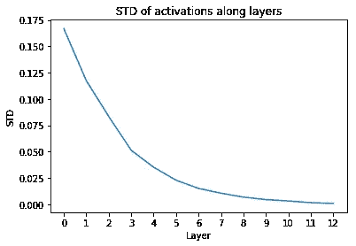
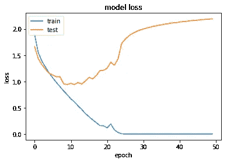

# Keras 中默认 CNN 为什么坏了，如何修复

> 原文：<https://towardsdatascience.com/why-default-cnn-are-broken-in-keras-and-how-to-fix-them-ce295e5e5f2?source=collection_archive---------5----------------------->

## *深入了解 CNN 初始化…*

Photo by [Nino Yang](https://unsplash.com/@ninoliverpool?utm_source=medium&utm_medium=referral) on [Unsplash](https://unsplash.com?utm_source=medium&utm_medium=referral)

上周，我使用在 CIFAR10 数据集上训练的 VGG16 模型进行了一些实验。我需要从头开始训练模型，所以没有在 ImageNet 上使用预训练版本。

所以我开始了 50 个纪元的训练，去喝杯咖啡，然后回到这些学习曲线上:

**模特什么都没学到！**

我已经看到网络收敛非常缓慢，振荡，过度拟合，发散，但这是我第一次看到网络的这种行为什么也没做。因此，我挖了一点，看看发生了什么事。

# 实验

这就是我如何创建我的模型。它遵循原始 VGG16 架构，但大部分全连接层被移除，因此几乎只保留卷积。

现在让我们多理解一点，是什么导致了我在这篇文章开始时向你展示的这种训练曲线。

当模型的学习出现问题时，检查梯度的表现通常是个好主意。我们可以用以下公式得到每一层的平均值和标准差:

通过绘制它们，我们有:

Stats of gradients of VGG16 initialized with Glorot uniform

哇…在我的模型中根本没有渐变，也许我们应该检查激活是如何沿着层发展的。我们可以通过下式得到它们的平均值和标准偏差:

然后，如果我们把它们画出来:

Stats of activations of VGG16 initialized with Glorot uniform

**那里正在发生什么！**

提醒您，每个卷积层的梯度计算如下:

其中，δx 和δy 用于表示梯度，∂L/∂x 和∂L/∂y.梯度是使用反向传播算法和链式法则计算的，这意味着我们从最后一层开始，反向传播到更早的层。但是，如果我们的最后一层激活趋向于 0，会发生什么呢？正如我们在这里所得到的，梯度在任何地方都等于 0，因此不能反向传播，导致网络不能学习任何东西。

因为我的网络非常空(没有批量标准化，没有丢失，没有数据扩充，..)，我猜这个问题应该来自一个糟糕的初始化，所以我读了明凯的论文**【1】**，我将简要描述它说了什么。

# 初始化方法

初始化一直是深度学习的一个重要研究领域，尤其是随着架构和非线性的不断发展。一个好的初始化其实是我们可以训练深度神经网络的原因。

这里是明凯论文的主要观点，它们显示了初始化应该具有的条件，以便具有带有 ReLU 激活功能的正确初始化的 CNN。需要一点数学知识，但是不要担心，你应该能够掌握大纲。

让我们考虑卷积层的输出为:

然后，如果偏差被初始化为 0，并且在权重 *w* 和元素 *x* 都相互独立并且
共享相同分布的假设下，我们有:

用 *n* ，一层的权值个数(*即* *n=k c* )。由下面的*独立*属性的乘积的方差:

它变成了:

然后，如果我们让权重 *w* 的平均值为 0，则得出:

由*柯尼希-惠更斯*财产:

它最终给出:

但是，由于我们使用的是 ReLU 激活函数，我们有:

因此:

这是单个卷积层输出的方差，但如果我们想考虑所有的卷积层，我们必须考虑所有卷积层的乘积，即:

由于我们有一个产品，现在很容易看出，如果每层的方差不接近 1，那么网络可能会迅速退化。事实上，如果它小于 1，它将迅速向 0 消失，如果它大于 1，那么激活值将无限增长，甚至可以成为一个很高的数字，你的计算机不能代表它(NaN)。所以，为了有一个行为良好的 ReLU CNN，必须认真遵守以下条件:

作者比较了当你训练一个深度 CNN 初始化为当时的标准初始化(Xavier/Glorot)**【2】**和用他们的解决方案初始化时会发生什么。

Comparison of the training of a 22-layer ReLU CNN initialized with Glorot (blue) or Kaiming (red). The one initialized with Glorot doesn’t learn anything

这个图表看起来熟悉吗？正是我一开始所见证和展示给你的！用 Xavier/Glorot 初始化训练的网络不学习任何东西。

**现在猜猜 Keras 里默认初始化的是哪一个？**

没错！默认情况下，在 Keras 中，卷积层的初始化遵循 Glorot 均匀分布:

如果我们现在把初始化改为明凯统一的，会发生什么？

## 使用明凯初始化

让我们重新创建我们的 VGG16 模型，但这一次我们改变了初始化为*贺 _ 制服。*

现在，让我们在训练模型之前检查激活和渐变。

现在，随着明凯的初始化，我们的激活平均值约为 0.5，标准差约为 0.8

我们可以看到，现在我们有了一些梯度，如果我们想让我们的网络学习一些东西，这是一件好事。

现在，如果我们训练我们的新模型，我们得到这些曲线:

我们现在可能需要添加一些正则化，但是，嘿，这仍然比以前好，对不对？

# 结论

在这篇文章中，我们展示了初始化可能是你的模型中非常重要的一部分，但却经常被忽视。此外，它还表明，即使是像 Keras 这样优秀的图书馆，也不能认为它们是理所当然的。

## 我希望这篇博文对你有所帮助！您可能再也不会忘记正确初始化您的网络了！如有不清楚的地方，请随时给我反馈或问我问题。

## 参考资料和进一步阅读

[1]: [《明凯》何初始化论文](https://arxiv.org/pdf/1502.01852.pdf)

[2]: [泽维尔·格罗特初始化论文](http://proceedings.mlr.press/v9/glorot10a/glorot10a.pdf)

[3]: [吴恩达初始课](https://www.youtube.com/watch?v=s2coXdufOzE)