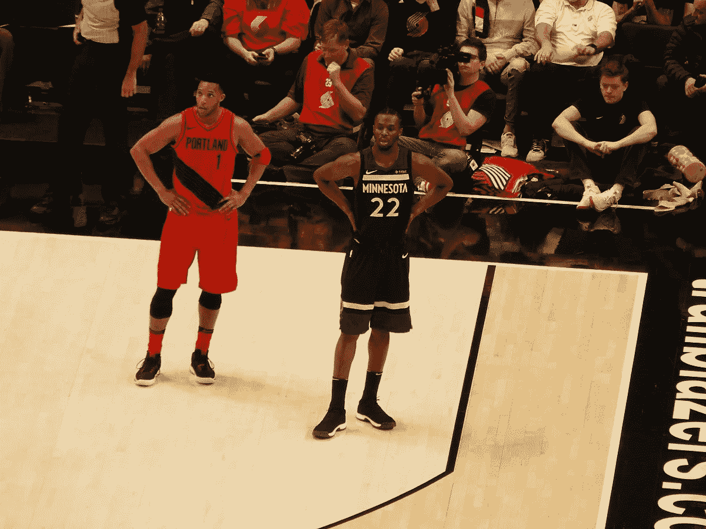
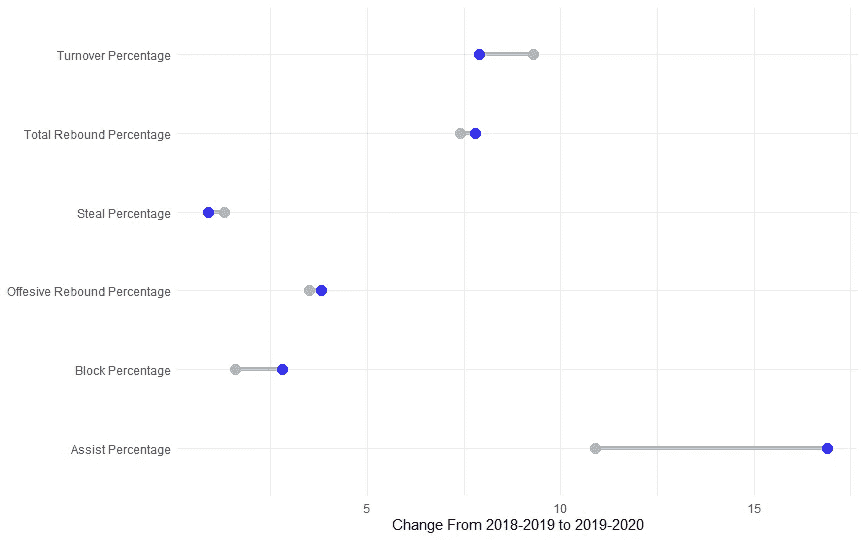
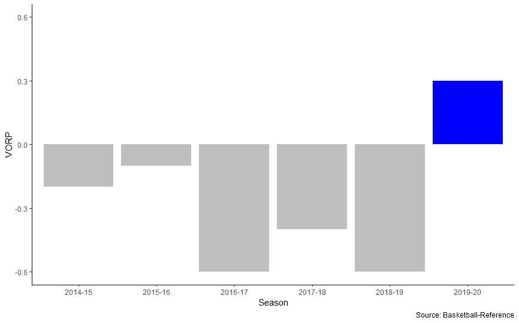
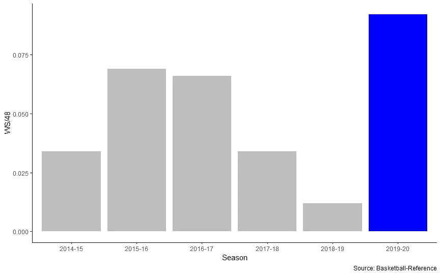
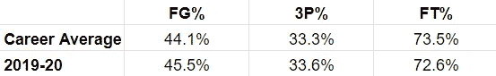
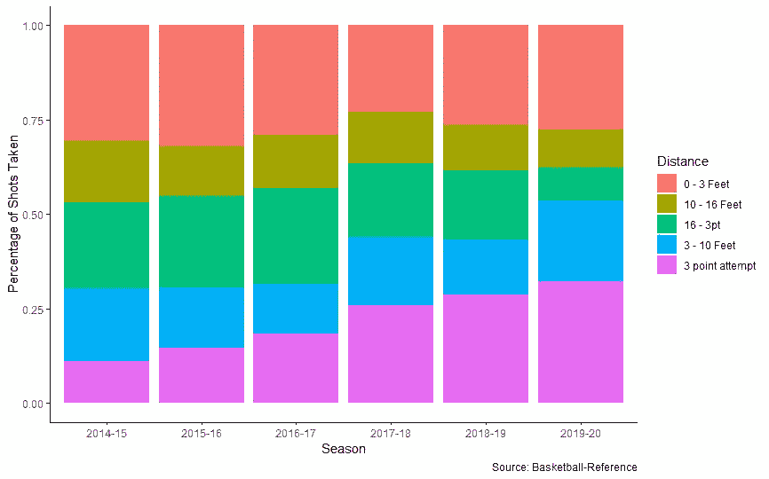
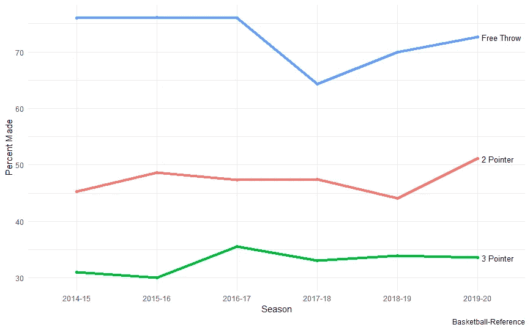

# 为什么安德鲁·威金斯突然变好了？

> 原文：<https://towardsdatascience.com/why-did-andrew-wiggins-suddenly-get-good-dafd93d6fe6a?source=collection_archive---------24----------------------->

## 安德鲁·威金斯正在经历一个职业赛季。他到底改变了什么？



Image by Frenchieinportland on [Wikimedia Commons](https://commons.wikimedia.org/wiki/File:Andrew_Wiggins.jpg)

迄今为止，安德鲁·威金斯的篮球生涯走了一条类似过山车的弧线。进入联盟，威金斯是一个高度赞扬高中和大学的前景。在 NBA 选秀中以第一名的身份被选中后，他在他的第一个 NBA 赛季中获得了年度最佳新秀奖，显示了他成为联盟顶级双向球员之一的潜力。看到这种潜力，明尼苏达森林狼队给了维金斯一份大规模的合同，巩固了他作为他们年轻重建的基石。

然后，事情急转直下。威金斯的进步似乎止步不前，他的戏剧在许多领域明显退步。就在今年夏天，安德鲁·威金斯 5 年 1.48 亿美元的最高合同被认为是不可移动的——一些人开始猜测这是联盟中最差的合同之一。在 NBA 打了 5 个赛季后，维金斯开始看起来像一个巨大的半身像。

当然，几乎所有人都承认维金斯可以得分——他职业生涯场均 19.7 分。然而，这就是他所做的一切。他的得分效率很差(职业生涯平均真实投篮命中率为 52%，而联盟平均水平高于 55%)。他不擅长抢篮板或传球。最糟糕的是，他的防守潜力已经化为乌有——事实上，先进的统计数据显示，他在防守上绝对是一个消极的存在。

更令人担忧的是，进步的希望似乎为零:他的最后两个赛季是他进入联盟以来最糟糕的。赛季开始前，ESPN 排名联盟前一百名球员；[维金斯完全被排除在名单之外](https://bleacherreport.com/articles/2858577-andrew-wiggins-slams-espns-top-100-rankings-not-100-players-better-than-me)(对于一个今年收入约 2750 万美元的人来说，这是一个奇怪的壮举)。

然后，几乎就在他意识转变的时候，安德鲁·威金斯开始擅长篮球。在 2019-2020 赛季的 20 场比赛中，维金斯在得分，篮板，助攻和盖帽方面都创下了职业生涯的新高。几乎所有类别的改善都令人印象深刻(蓝色代表 2019-2020 赛季，灰色代表上一赛季)。

**2018–19 至 2019–20 赛季高级统计**



*这个图表可以用 R 中的以下代码复制:*

```
library(ggplot2)ggplot(df, aes(x=`2018_Season`,xend=`2019_Season`,y=Stat)) +
 geom_segment(aes(x=`2018_Season`, 
 xend=`2019_Season`, 
 y=Stat, 
 yend=Stat), 
 color=”#b2b2b2", size=1.5)+
 geom_dumbbell(color=”light blue”, 
 size_x=3.5, 
 size_xend = 3.5,
 colour_x=”#B8B8B8", 
 colour_xend = “#3433FF”) +
 labs(y = NULL,
 x = “Change From 2018–2019 to 2019–2020”) +
 theme_minimal()
```

维金斯的失误甚至更少，是他职业生涯中失误率最低的。他的转变也延伸到了他的得分效率上。尽管他的投篮量大幅增加，但他 54.1%的命中率也有很大提高(去年他只有 49.3%)。

这种改进也体现在整体影响统计上。在他的职业生涯中，第一次，威金斯的价值超过了替补球员 VORP。



他还公布了职业生涯中每 48 分钟的最佳胜率:



不知从哪里，威金斯似乎找到了他的游戏。

这些图表可以用 R 中的以下代码复制:

```
library(ggplot2)library(dplyr)df <- df %>% mutate( ToHighlight = ifelse( Year == `2019–20`, “yes”, “no” ) ) #Create ggplot
ggplot(df, aes(x = Year, y = VORP, fill = ToHighlight)) +
 geom_bar(stat=”identity”) +
 scale_fill_manual( values = c( “yes”=”blue”, “no”=”gray” ), guide = FALSE ) +
 ylim(-0.6,0.6) +
 theme_classic() +
 labs(x = “Season”,
 y = “VORP”,
 caption = “Source: Basketball-Reference”)
```

我们能从他的改进中获得什么启示？它是可持续的吗？

虽然防守是出了名的难以量化，但我们的指标显示维金斯在这里没有太大的变化。他的防守潜力仍然难以捉摸。

尽管他的整体效率有所提高，但他的基本投篮数据并没有显示出任何巨大的进步。



然而，改变的是他的镜头选择。也就是说变聪明了很多。



*这些图表可以用 R 中的以下代码复制:*

```
library(ggplot2)ggplot(df, aes(fill=Distance, y=Value, x=Year)) + 
 geom_bar(position = “fill”, stat=”identity”) +
 theme_classic() +
 labs(y = “Percentage of Shots Taken”,
 x = “Season”,
 caption = “Source: Basketball-Reference”)
```

“长二”长期以来一直被分析型的人所嘲笑。它几乎承担了三分尝试的所有困难，却没有任何回报。维金斯玩的是一种老派游戏，严重依赖于长二分和中距离投篮。然而，上个赛季他的比赛看起来更现代了。

维金斯已经成功地将他的大部分远投转换为三分尝试或靠近篮筐的投篮。上个赛季，他 18.1%的投篮是长二分(在第三个赛季达到了 25%的峰值)。本赛季，他不到 9%的投篮是长二分，32.2%是三分球——这是他有史以来最高的命中率。因此，他现在每场比赛投 6.6 个三分球，而去年是 4.8 个，职业生涯平均只有 3.4 个。

维金斯仍然是一个平庸的三分射手(本赛季只有 33.6%)，但事实上他在更多的尝试中保持了他的百分比是一个积极的因素。

威金斯效率的提高主要来自投篮选择的改善，这可能是一件好事；他不是骑着会冷却下来的火热的投篮连胜。他已经从根本上改变了他的比赛风格。

那么，这给安德鲁·威金斯带来了什么？

毫无疑问，威金斯正在打他职业生涯中最好的篮球；没有任何强有力的迹象表明这是不可持续的。在过去的几年里，先进的统计数据并没有善待威金斯，经常把他描绘成他的球队的负面整体。这个赛季看起来是他的一个重大转折点；他现在是森林狼季后赛希望的积极力量。

这是否意味着维金斯的合同是合理的？不太可能，即使考虑到他的进步。 [538 仍然认为他的 5 年市值](https://projects.fivethirtyeight.com/2020-nba-player-projections/andrew-wiggins/)略高于 5800 万美元，远低于他的实际工资。然而，还不到 25 岁的他拥有非凡的运动能力，他还有很大的成长空间。威金斯最有可能改进的领域是什么？

## 射击

尽管有所进步，维金斯的整体效率仍然低于联盟平均水平。进一步提高他的进攻效率将会提升他在球场上的价值。幸运的是，威金斯这里有些唾手可得的水果。



这些图表可以用 R 中的以下代码复制:

```
library(ggplot2)library(directlabels)ggplot(Shot, aes(x = Year, y = Percent, group = Shot)) +
 geom_line(aes(color = Shot), size = 1.5) +
 geom_point(aes(color = Shot)) +
 scale_colour_discrete(guide = ‘none’) +
 scale_y_continuous() +
 geom_dl(aes(label = Shot), method = list(dl.trans(x = x + 0.2), “last.points”, cex = 0.8)) +
 theme_minimal() +
 labs(y = “Percent Made”,
 x = “Season”,
 caption = “Basketball-Reference”)
```

很大程度上是因为投篮选择的改善，维金斯的 2 分命中率达到了令人尊敬的 51.1%。然而，他的罚球却是一个谜。

在 NBA 的前三个赛季，维金斯每个赛季的平均命中率几乎达到 76%。在他的第四和第五个赛季，他的平均得分莫名其妙地下降到只有 67%。今年，他的罚球命中率已经恢复到了 72.6%。然而，将这一比例提高到接近 76%可能是提高他整体效率的一个可行途径。

也有希望提高他的三分球命中率。虽然维金斯是一个低于标准的三分射手，但其他球员在后来的职业生涯中表现出了进步。

## 防卫

最后，一个需要改进的地方是他的防守。大多数数据显示防守仍然是维金斯的弱项。希望维金斯成为他曾经展现出希望的锁定防守者可能太多了，但至少提高到一个中立防守者可能会使维金斯成为一个更危险的球员。