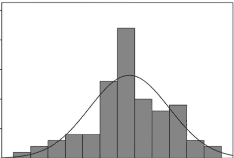
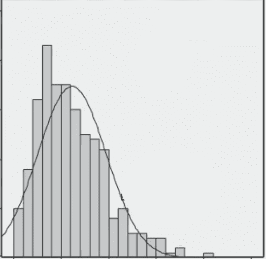
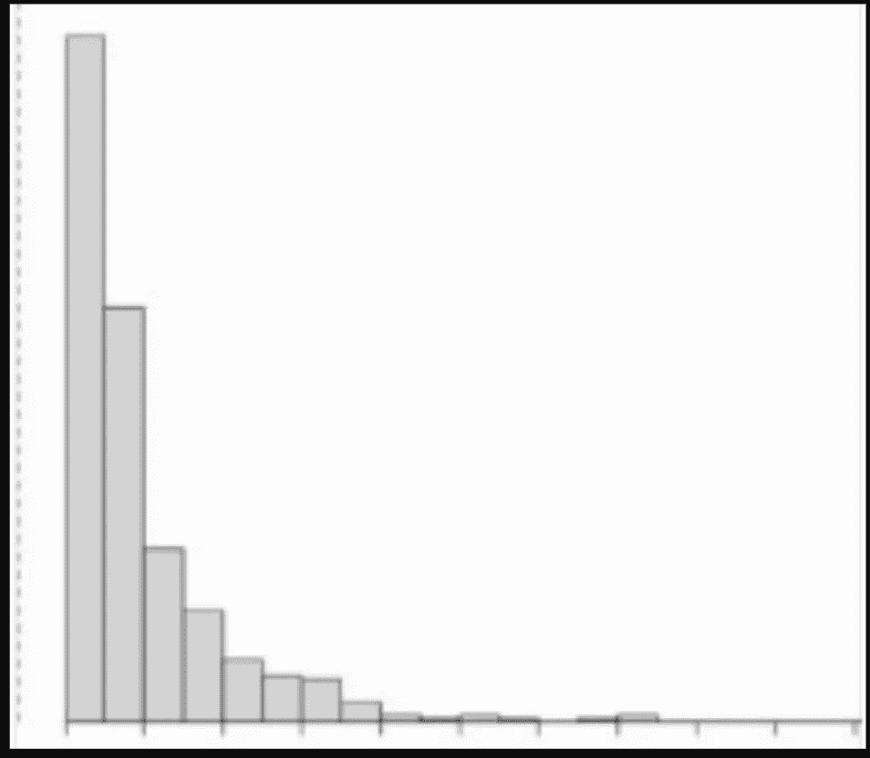

# 为什么数字营销人员需要对统计学有深刻的理解

> 原文：<https://towardsdatascience.com/why-digital-marketers-need-a-solid-understanding-of-statistics-d20a269506ab?source=collection_archive---------17----------------------->

Linkedin.com

大多数公司声称我们是数据驱动的，但我们对可用的统计测试了解多少呢？先从研究数据说起:)。

2012 年， [*营销人员未能通过大数据测试*](https://hbr.org/2012/08/marketers-flunk-the-big-data-test)**哈佛评论*指出，在大数据爆炸时代，绝大多数营销人员仍然基于直觉做出决策，这是基于一项对财富 1000 强公司的近 800 名营销人员进行的调查。*

*数据正变得无处不在。具有讽刺意味的是，拥有太多的数据并不意味着你得到了有用的见解，这可能会完全相反。在 2016 年 12 月，“IBM 由 Econsultancy 开展的一项新的[研究发现，只有 3%的营销人员将他们根据客户数据得出的见解采取行动的能力标为‘优秀’，超过一半(54%)的人将其标为‘差’或‘非常差’。”- *摘自一篇文章:*](https://econsultancy.com/reports/the-new-marketing-reality/) [*营销人员未能“明智地”处理数据*](https://www.marketingweek.com/2016/12/09/marketers-data-intelligent/) 似乎营销人员在收集数据，而不是正确地分析数据。*

***现在呢？**上个月(2018 年 12 月)，沃顿商学院营销教授[罗恩·伯曼](http://knowledge.wharton.upenn.edu/faculty/ronber/)的[新研究](https://papers.ssrn.com/sol3/papers.cfm?abstract_id=3204791)显示，根据 Optimizely(一个非常受欢迎的 A/B 测试工具平台)提供的数据，57%的营销人员错误地处理了数据，并可能得到错误的答案——这可能会让公司损失很多钱*

*虽然 A/B 测试是每个数据驱动公司的核心，但不幸的是，大多数营销人员无法利用他们可用的统计测试。*

**

# *具有统计学意义的常见错误*

*组织声称他们一直在进行测试和学习，而统计意义却经常被他们误解和误用，这是一个悖论。*

*第一个也是最致命的错误是根本没有检查统计显著性。大多数人在这一点上都失败了。考虑营销活动的例子。新活动的 CAC(每获得一个新客户的成本)= 24.51 美元，低于旧活动的 28.69 美元。这 4.17 美元可能看起来是一个巨大的——也许是重要的——差异。但实际上你可能很不走运，抽取的样本并不能代表更大的人群；事实上，也许这两个活动在对顾客购买行为的影响上没有什么不同。这被称为由观察样本而不是整个群体引起的抽样误差，这在任何测试中都必须避免。另一个例子是，人们在两组中都观察到大量的流量(许多点击、转换等),他们说这实现了基于逻辑的统计显著性，即样本规模越大，你越不可能得到反映随机性的结果。人们会在“大样本量”在各种活动中平等的情况下感觉更舒服。然而，这里的问题是多大的样本量是足够的？8k 印象 1k 点击还是 200k 印象 10k 点击？嗯……好吧，那么这个决定很可能是由人们的直觉做出的。*

*第二，一旦达到统计显著性，感觉对测试 100%有信心。想想 p 值的定义是什么:在零假设下观察到更多极端结果的概率。基于该定义，在实验设计期间必须预先定义置信度的比例(也意味着对犯错误的容忍度)。仍然要保持冷静，不要在结果达到统计学意义时变得过于乐观。*

*过早停止测试，而不是等到受控 A/B 测试达到相当显著的水平。其他例子是在测试变体(广告文案、图像等)的性能时不断检查指标的重要性。一旦达到 p 值，测试就会过早停止，这大大增加了假阳性率的可能性。不用说，这使得我们无法客观评估我们所操作的数据的有效性。*

*也有发生在解释 A/B 测试结果的时候用绝对值来说明变化提升了多少，而 A/B 测试只是告诉你哪个更好。*

# *统计能力的常见错误*

*一个动力不足的测试可能发生的第一件事是，一个实际上显著的变化，但是你可能没有检测到它。使用这样的测试，人们会得出结论，测试的变体没有效果，而实际上它有(这被称为假阴性)。这个常见的错误在测试上浪费了大量的预算，这些测试从来没有收到足够的流量，没有适当的机会来展示预期的效果。如果他们没有足够的样本量来检测有意义的改进，那么一次又一次的测试又有什么用呢？*

*但是当跑得过猛时，会增加力量(假阴性率下降)，同时也会增加假阳性率，这会伤害你的信心水平。在 I 型和 II 型误差之间有一个权衡，我们在 A/B 测试期间很少讨论它。但是知道它们背后的数学和统计概念总是好的。*

*简而言之，有两种方法可以得到错误的功率:进行一次[功率不足或功率过大的测试](http://www.ma.utexas.edu/users/mks/statmistakes/UnderOverPower.html)。*

# *错误的后分析*

*即使你正确地设置了一切，你的后分析仍然可能出错。*

*如果你得到的数据分布看起来既不是 *p1* 也不是 *p2。**

**

*P1*

**

*p2*

*但它可能看起来类似于 *p3。**

**

*然后…..您的分析出错了，因为您的参数方法在某些情况下不合适(例如，如果您的分布看起来像 *p3* )。这就是参数测试可能出错的地方。(后续帖子我会详细解释)*

# *最后…*

*统计数据可以帮助营销人员实现这两个目标，也可以评估营销工作的成功与否，并为营销计划的变化提供数据基础。实验是学习和获得可行见解的好方法。因此，有必要对 A/B 测试分析的数学基础有一个直观的感受。*

*虽然 A/B 测试不是完美的方法，但 A/B 测试至少必须正确，因为它仍然是商业世界中最实用的测试。*

*还会有后续的帖子。下一个，我将解释 A/B 测试的缺点。*

## *参考:*

*[*营销人员通不过大数据测试*](https://hbr.org/2012/08/marketers-flunk-the-big-data-test)*——《哈佛商业评论》**

*[*营销人员未能“明智地处理”数据*](https://www.marketingweek.com/2016/12/09/marketers-data-intelligent/)*——“营销周”**

*[*p-Hacking 和 A/B 测试中的错误发现*](https://papers.ssrn.com/sol3/papers.cfm?abstract_id=3204791) *—罗恩·伯曼(宾夕法尼亚大学—沃顿商学院)**

*[*动力不足或过强测试*](https://web.ma.utexas.edu/users/mks/statmistakes/UnderOverPower.html) *—德克萨斯大学**