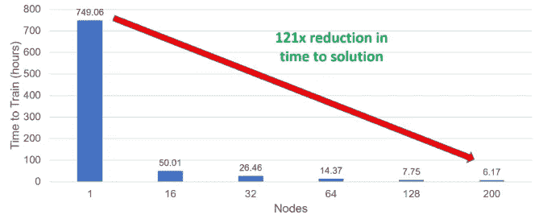

# 为什么分布式深度学习将变得至关重要？为什么要关心深度学习的 HPC？

> 原文：<https://towardsdatascience.com/why-distributed-deep-learning-is-going-to-gain-paramount-importance-bd2d83517483?source=collection_archive---------23----------------------->

This is Downtown Houston.

持续学习的工作量正以前所未有的速度增长。同一组织中的多个团队都在使用深度学习来解决复杂的问题，更不用说不同的组织了。

速度是一个组织中促进深度学习和人工智能工作的巨大因素。某些项目可能会因为疯狂的迭代时间而被放弃，具体来说，是用多种规格进行训练的时间，也就是超参数。

Google NMT: [https://www.oreilly.com/library/view/tensorflow-for-deep/9781491980446/ch01.html](https://www.oreilly.com/library/view/tensorflow-for-deep/9781491980446/ch01.html)

想想这个:让一个大模特训练 25 天会怎么样？

我猜业务需求不会得到满足？模特每周都需要重新训练怎么办？在进行分析和机器学习时，需要处理和解释持续流入的数据，猜猜会发生什么？使用现有的非分布式方法，您甚至不能在接下来的 30 天内改进模型！咄！更别说每周用新数据重新训练了。

让我们不要忘记这样一个事实，工程资源不会那么高兴，因为他们必须让它训练，直到它完成，才会有进展，在这个过程中，他们忘记了发生了什么(可能)。当他们回头看时，他们需要激活大脑中关于提交的工作细节的每一个神经元。

我们都知道机器学习是一个经验过程，对于大模型/大数据，机器学习中的“经验”将通过正常的单节点训练方法来消除，因为它的工作方式(非常慢)。我的意思是，如果我们不注意为大量工作负载增加更多计算能力，人们很可能会失去耐心，直到工作完成，企业的附加值将受到严重打击。

> 想想这个:你有多少次因为网速慢而沮丧？

在深度学习研究领域，研究人员正在探索接近[十亿参数](https://arxiv.org/pdf/1701.06538.pdf)的模型，你认为，单个节点作业会让他们探索更好的模型吗？

显然，答案是响亮的不！

虽然，还有许多其他因素促使您的组织适应分布式深度学习方法，但我将保持这一点。

我想重申和澄清，我并不是说每个公司都应该做分布式深度学习。它取决于各种因素，如工作负载的类型、工程工作和资源、解决给定大问题的解决方案的可容忍时间，以决定公司是否应该采用 HPC 方法。

# 好吧，什么是 HPC？

对于那些不了解高性能计算(HPC)的人来说:简单地说，这是一种利用多台计算机比传统的单台计算机方法更快地解决问题的策略。它使用并行编程范例，而不是顺序编程。记住，深度学习几乎是[令人尴尬的并行](https://web.stanford.edu/~rezab/classes/cme323/S16/projects_reports/hedge_usmani.pdf)！

HPC 是模拟技术进步的基础，在媒体、石油、卫生、科学、数学等行业中非常普遍。

# HPC 能给深度学习世界带来什么？

其核心是，更快的迭代时间，更快的解决时间。我们都知道这对企业/研究人员探索更多、发现更多是至关重要的。从而有效地使工程周期在其工作中更有成效。

有了 HPC，无论花了多少“疯狂”的时间来训练，现在都变成了“这太快了！”该训练了。这有效地帮助工程师不要浪费时间交叉手指希望他们的方法第一次就能正确工作，因为如果不行，他们就需要重做整个事情并等待下一个工作周期！

[https://community.emc.com/community/products/rs_for_ai/blog/2019/04/02/effectiveness-of-large-batch-training-for-neural-machine-translation-nmt](https://community.emc.com/community/products/rs_for_ai/blog/2019/04/02/effectiveness-of-large-batch-training-for-neural-machine-translation-nmt)

上面的示例是一个 HPC 工作负载，解决问题的时间缩短了 121 倍。全程训练从 30 天到 6 小时。

这是吴恩达博士关于高性能计算和深度学习的视频。

# **看起来很有趣，需要什么来开始呢？**

为了处理分布并支持并行执行，我们需要像 [Open MPI](https://www.open-mpi.org/) 或 [MVAPICH](http://mvapich.cse.ohio-state.edu/) 这样的快速通信库来分配工作负载，并利用 GPU、TPU 等加速器有效地在节点间广播和聚合结果。我们还需要支持多节点作业的深度学习库，如 [horovod](https://eng.uber.com/horovod/) 、[分布式 tensorflow](https://www.tensorflow.org/guide/distribute_strategy) 等。

参考资料:

 [## 高性能计算简介:为什么使用高性能计算？

### 在所有这些情况下，所需要的是能够同时使用更多的计算机。幸运的是，大规模…

epcced.github.io](https://epcced.github.io/hpc-intro/00-why-hpc/)