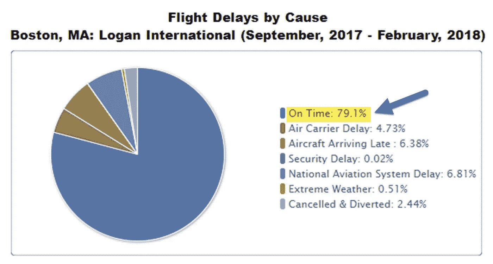
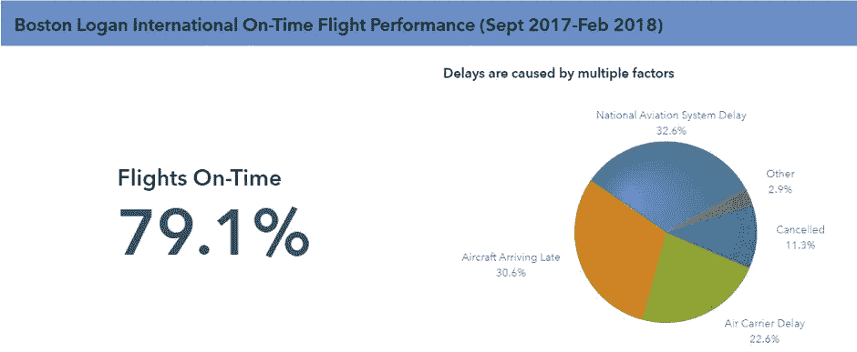
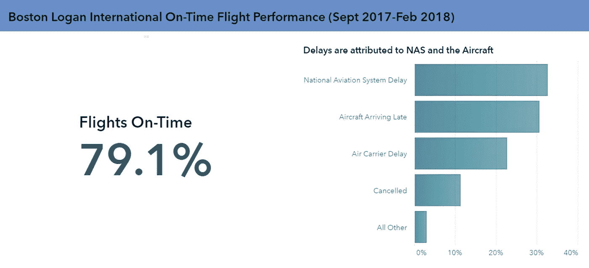

# 为什么数据可视化会失败？

> 原文：<https://towardsdatascience.com/why-do-data-visualizations-fail-39fd29172d7a?source=collection_archive---------10----------------------->

## 简单…伪装成有用见解的图表

Photo by [Braydon Anderson](https://unsplash.com/@braydona?utm_source=medium&utm_medium=referral) on [Unsplash](https://unsplash.com?utm_source=medium&utm_medium=referral)

当数据可视化失败时，可能有多种原因。最常见的原因是作者没有理解信息。因此，数据中的含义是不清楚的，甚至是隐藏的。作者没有考虑观众在问什么问题。

考虑下面这个来自美国运输局的例子。这个饼状图真的让我很烦。标题表明作者想谈论波士顿机场的航班延误。最大的一块是*准时*近 80%。*嗯？*

Source: [Bureau of Transportation](https://www.transtats.bts.gov/OT_Delay/ot_delaycause1.asp?type=1&pn=1)

奇怪的是，这个可视化应该回答的问题实际上包含了作为一个类别的答案的积极主题部分。很明显，准点不是航班延误的理由——把它包括在内是没有意义的。事实上，它只是掩盖了其他数据，使信息不清楚。

# 重拍 1:关注主要信息

如果信息是航班通常是准时的——那可以用一个数字来表达。然后用剩下的数据解释延迟的原因。在这个例子中，我改变了标题，强调了正数。

饼图没有第一个示例中的所有类别。少于 1%的原因被放在“所有其他”类别中，以保持对主要信息的关注。

饼图可能是合适的，因为这是一个部分到整体的讨论。当类别太多时，它不允许真正的原因通过。请注意，切片大小相似，当一个类别占主导地位时，饼图效果最佳。

由于饼图扇区大小相似，此图表需要查看者做更多的工作。我怀疑观众会阅读这些数字，而不是让 dataviz 做它的工作。这导致没有理由有一个饼图。

# 翻拍 2:回答观众的真实问题

如果我们考虑观众而不仅仅是数据。观众关心的不仅仅是“航班多长时间准点”，而是“为什么会晚点？”

分级条形图更好地显示了这些信息。在这个例子中，我把饼图换成了水平条形图。然后对类别进行排序，按价值显示前 4 个原因。可视化使答案变得毫不费力。很容易看到两条消息。

“飞机晚点”的第二个原因更加明显。我希望这只是一个糟糕的数据分类。否则，这似乎只是一个聪明的回答。“晚是因为飞机晚点了”嗯，废话。

**提示:**加上“. 1”的具体百分比并不能真正澄清。很多时候作者添加它是因为他们认为它使值看起来更准确或更有说服力。

# 不要盲目构建图表

原始数据在一个类别中包含了所有的原因，而且作者似乎没有花太多心思来确定数据的格式是否正确。作者也没有考虑到观众想从数据中了解什么。

# 你的外卖

*   知道你的听众想要得到什么信息——不仅仅是你有什么数据
*   考虑一下你的可视化是否向观众清楚地解释了这一点