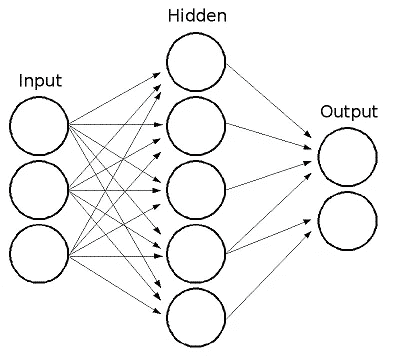
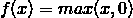
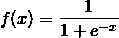
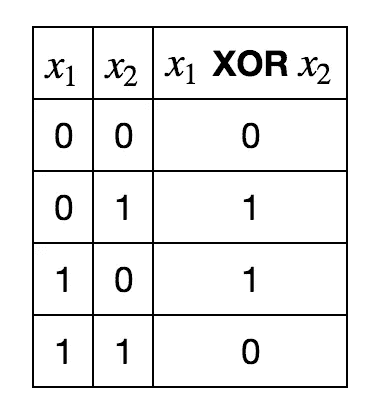
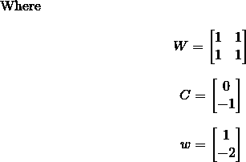

# 为什么神经网络需要激活函数？

> 原文：<https://towardsdatascience.com/why-do-neural-networks-need-an-activation-function-3a5f6a5f00a?source=collection_archive---------19----------------------->

为什么神经网络需要激活函数？每当你第一次看到一个神经网络的架构，你首先会注意到的一件事是它们有许多相互连接的层。

**神经网络中的每一层都有一个激活函数，但为什么它们是必要的呢？为什么它们如此重要？在这里了解答案。**

# 什么是激活功能？

要回答什么是激活函数的问题，我们先退一步，回答一个更大的问题:什么是神经网络？

# 什么是神经网络？

神经网络是一种机器学习模型，在给定某些输入和输出向量的情况下，它会尝试将输出“拟合”到输入。

这意味着，给定一组具有我们希望预测的某些值的观察实例，以及我们关于每个实例的一些数据，它将尝试概括这些数据，以便它可以正确预测问题的新实例的值。

作为一个例子，我们可能正在设计一个图像分类器(通常使用一个[卷积神经网络](http://www.datastuff.tech/machine-learning/convolutional-neural-networks-an-introduction-tensorflow-eager/))。这里，输入是一个像素向量。输出可以是数字类别标签(例如，1 代表狗，0 代表猫)。

这将训练一个神经网络来预测一幅图像是包含一只猫还是一只狗。

但是，给定一组像素，如果它们对应于狗的图像，则返回 1，如果对应于猫的图像，则返回 0，这是什么数学函数呢？

想出一个手动的数学函数是不可能的。**对人类来说**。

所以我们所做的是发明一种机器来为我们找到那个功能。

它看起来像这样:

Single hidden layer Neural Network. [Source](https://docs.opencv.org/2.4/modules/ml/doc/neural_networks.html).

但是你可能已经看过这张图很多次了，认出它是为了一个神经网络，仍然不知道它到底代表了什么。

在这里，每个圆圈代表我们神经网络中的一个神经元，垂直排列的神经元代表每一层。

# 神经网络是如何工作的？

神经元只是一个数学函数，它接受输入(指向它的神经元的输出)，然后**返回输出**。

这些输出作为下一层的输入，以此类推，直到我们到达最终的输出层，这是我们返回的实际值。

有一个输入层，其中每个神经元将简单地返回输入向量中的相应值。

对于每组输入，神经网络的目标是使其每个输出**尽可能接近实际期望值**。

再次回想一下图像分类器的例子。

如果我们将动物的 100x100px 图片作为输入，那么我们的输入层将有 30000 个神经元。所有像素都是 10000，乘以 3，因为一个像素已经是一个三元向量(RGB 值)。

然后，我们将通过每一层运行输入。我们得到一个**新向量作为每层的输出，将其作为输入**提供给下一层，以此类推。

层中的每个神经元将返回单个值，因此层的输出向量将具有与层中的神经元一样多的维度。

那么，给定一些输入，神经元会返回哪个值呢？

# 神经元做什么？

一个神经元接受一个输入向量，并对它做三件事:

*   乘以一个权重向量。
*   给乘积加上一个偏差值。
*   将**激活函数**应用于该值。

我们终于找到了我们业务的核心:这就是激活函数的作用。

我们通常使用**非线性函数作为激活函数**。这是因为线性部分已经由先前应用的乘积和加法处理。

# 最常用的激活功能有哪些？

我说的是非线性函数，这听起来很符合逻辑，但是什么是典型的、常用的激活函数呢？

让我们看一些例子。

# 热卢

ReLU 代表“校正线性单位”。

在所有激活函数中，这是**最类似于线性函数**的一个:

*   对于非负值，它只应用标识。
*   对于负值，它返回 0。

用数学术语来说，

这意味着所有负值都将变为 0，而其余值保持不变。

这是一个受生物启发的功能，因为大脑中的神经元要么“激发”(返回正值)，要么不激发(返回 0)。

注意如何与偏差结合，这实际上**过滤掉低于某个阈值**的任何值。

假设我们的偏差的值为-b。任何低于 b 的输入值，在加上偏差后将变成负值。在对其应用 ReLU 后，它变为 0。

# 乙状结肠的

sigmoid 函数将任意实数作为输入，**返回 0 和 1** 之间的值。由于它是连续的，它有效地" **smushes** "值:

如果你把 sigmoid 应用于 3，你会得到 0.95。将它应用到 10，你得到 0.999…它会一直接近 1，但永远不会达到 1。

同样的情况发生在负方向，除了它收敛到 0。

这是 sigmoid 函数的数学公式。

如你所见，当 x 趋近于无穷大时，它趋近于 1，当 x 趋近于负无穷大时，它趋近于 0。

它也是对称的，当其输入为 0 时，其值为 1/2。

因为它取 0 到 1 之间的值，所以如果您想对概率建模，这个函数作为输出是非常有用的。

如果你希望应用一个“过滤器”来部分保留某个值(就像在一个 [LSTM 的遗忘之门](http://www.datastuff.tech/machine-learning/lstm-how-to-train-neural-networks-to-write-like-lovecraft/)中)，这也是有帮助的。

# 为什么神经网络需要激活函数？

我们已经讨论了一些不同激活函数在不同情况下的应用。

一些让信号通过或阻挡它，另一些过滤它的强度。甚至还有 [tanh](https://en.wikipedia.org/wiki/Hyperbolic_function) 激活函数:它不是过滤，而是将输入变成负值或正值。

但是为什么我们的神经网络需要激活功能呢？**如果我们不用它们会怎么样**？

我在 Yoshua Bengio 的令人敬畏的[深度学习书籍](https://amzn.to/305g2MF)中找到了这个问题的解释，我认为它在那里得到了完美的解释。

我们可以让每个神经元简单地返回它们的结果，而不是用非线性函数组合我们的线性变换(实际上是用同一性组合它们)。

但是，我们所有的层将简单地堆叠一个又一个仿射(乘积加加法)变换。每一层只需在前一层的基础上增加一个矢量积和矢量加法。

可以证明(你甚至可以说服自己，如果你在白板上用一个小向量来计算)，这个仿射变换的组合，等价于一个单独的仿射变换。

实际上，整个“神经网络”中所有的激活函数都被恒等式所取代，这个“神经网络”只不过是一个矢量积和一个偏差加法。

有许多问题是线性变换无法解决的，所以我们实际上是在**减少我们的模型能够估计的函数的数量。**

作为一个非常简单但却惊天动地的例子，考虑 XOR 运算符。

试着找一个二元向量，加上一个可以取 x1 和 x2 的 bias，把它们变成 x1 XOR x2。去吧，我等着。

…

没错，你不能。没人能。然而，考虑一下

如果你计算一下，你会看到对于 1 和 0 的每个可能的组合都有期望的输出。

恭喜你！你刚刚训练了你的第一个神经网络！

它学会了一个线性模型永远学不会的问题。

# 结论

我希望在这个解释之后，你现在能更好地理解为什么神经网络需要一个激活函数。

在以后的文章中，我可能会涉及其他激活函数及其用途，比如 SoftMax 和有争议的 Cos。

你觉得怎么样？你从这篇文章中学到什么了吗？你觉得有趣吗？数学关了吗？

如果你想对我说什么或问什么，请随时在 [Twitter](http://www.twitter.com/strikingloo) 、 [Medium](http://www.medium.com/@strikingloo) 或 [dev.to](http://www.dev.to/strikingloo) 上联系我！

*如果你想成为一名数据科学家，可以看看我的* [*最佳机器学习书籍*](http://www.datastuff.tech/data-science/3-machine-learning-books-that-helped-me-level-up-as-a-data-scientist/) *清单和我的* [*Bash 教程*](http://www.datastuff.tech/programming/terminal-tutorial-more-productive/) *。*

*原载于 2019 年 7 月 1 日*[*http://www . data stuff . tech*](http://www.datastuff.tech/machine-learning/why-do-neural-networks-need-an-activation-function/)*。*