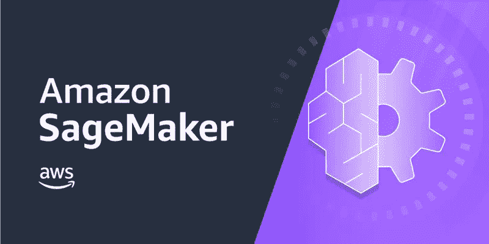
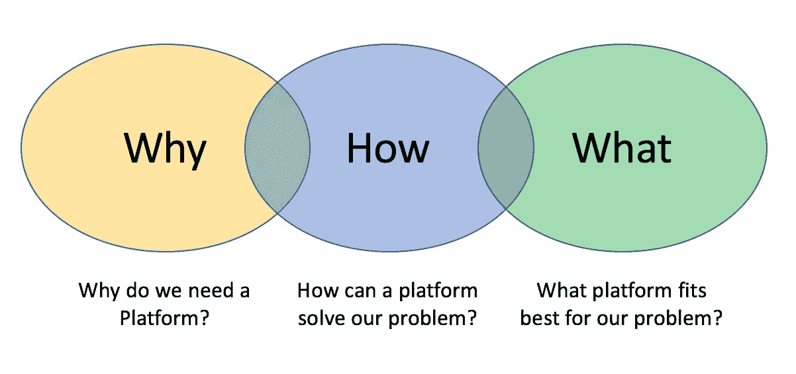
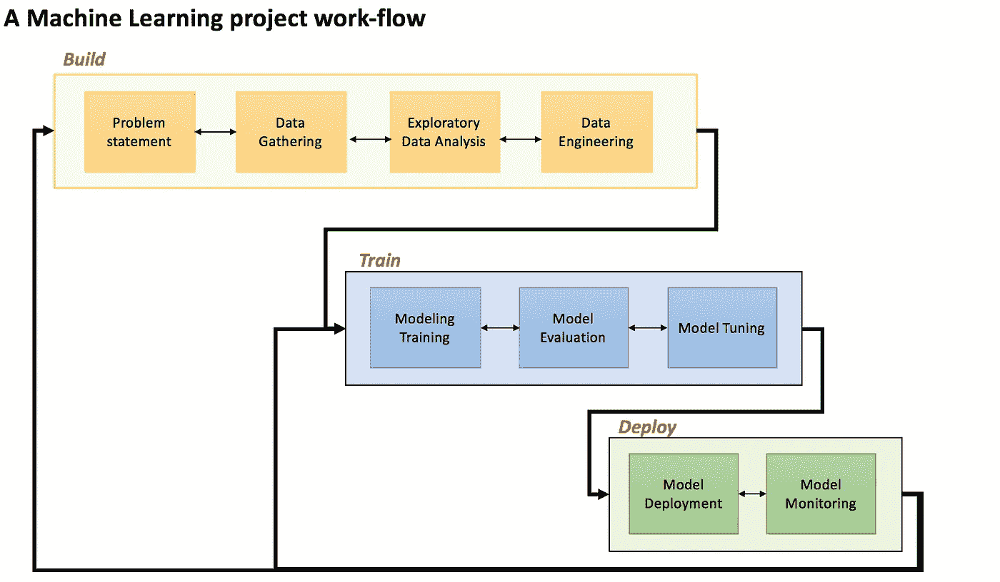
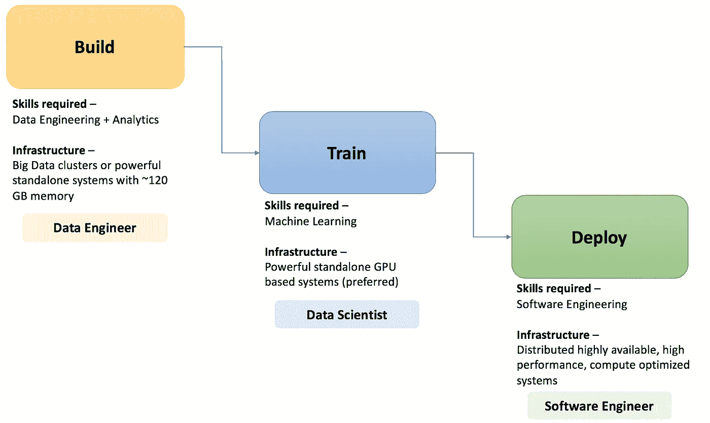

# 我们为什么需要 AWS SageMaker？

> 原文：<https://towardsdatascience.com/why-do-we-need-aws-sagemaker-79bce465f19f?source=collection_archive---------1----------------------->

## 对于开发机器学习产品和解决方案的大型企业来说，这是一个更严肃的思考。

今天，行业中有几个平台可以帮助软件开发人员、数据科学家以及外行人在短时间内开发和部署机器学习模型。一些平台声称要将人工智能和数据科学民主化，达到几乎不需要任何编码技能就可以解决数据科学问题的程度，而其他一些平台则声称这是在云中部署解决方案的最快最简单的方法。所有这些说法，有些非常深奥，会让你想知道一个简单的问题— **什么平台最适合我？**

这个问题的答案肯定不是直截了当的。基于你的优先级、灵活性、规模、成本、首选的 ML 框架、易用性和其他方面，没有一个适合所有选择的尺寸。对于一个有意义的解决方案，我们必须真正从理解我们为什么首先需要一个平台开始。一旦我们理解了“**为什么**”，我们就会理解“**一个给定的平台将如何**为我们解决问题，然后我们就可以最终回答最后通牒“**什么样的**平台最适合我？”

从“为什么”开始总是把我们引向正确的方向。

Inspired by Simon Sinek’s ‘Start with WHY’

在这篇博客中，我的目标是通过回答“为什么”、“如何”和“什么”这一系列问题来启发你，以便为我们目前解决的企业中的大多数机器学习解决方案选择最佳平台。然后，我想将' **AWS Sagemaker** '作为该问题的有效候选项，并强调“我们为什么需要 AWS Sagemaker？”很明显，在企业中还有其他的问题和实验，对于它们来说，这不是最好的选择；我还将尝试强调这不是最佳选择的几个领域。

让我们从“为什么”开始。

**以 1 为例—为什么我们需要一个开发机器学习解决方案的平台？**

随着项目规模的增加，与机器学习项目相关的主要痛点会发生巨大变化。机器学习项目的典型工作流程如下所示。

Fig 1- An illustration for a typical Machine Learning project workflow

我们通常可以将相关任务列表分为 3 大类-

1.  **构建**:在这里，我们定义问题，收集数据，分析数据，然后清理、转换和设计数据，使其成为所需的形式。
2.  **训练**:我们利用一种或多种机器学习算法，训练(拟合)模型，从工程数据中学习模式。基于模型的性能，我们调整超参数，重新训练并重复该过程，直到我们得到相当可接受的结果。
3.  **部署**:我们将模型部署到生产系统中，在那里它为更大的生态系统提供服务。

这整个过程是高度迭代的，并且可以预期变化会将进度循环回整个过程中的任何状态(如图所示)。在我们试验的大多数概念验证(PoC)和互联网上的可用学习资源(博客/教程/书籍/课程)中，整个过程都被高度简化了。这个过程中呈现的最大抽象是在“**尺度**的维度上。随着部署后“数据”、“训练迭代”和“推理”的规模增加，整个工作流变得过于复杂，最终演变成 3 个独立的工作流。

考虑一个我们将在企业中处理的相当复杂的 ML 问题。比方说，您有一个非常大的数据集，有数百万条记录(大约 10GB — 1TB)要处理，一旦部署了服务，至少需要数百次迭代(比如，对于深度神经网络)和每分钟大约 100，000 次 API 调用。然后，我们在实验中开发的普通 PoCs 不再是用例的对比。每个团队(构建、培训、部署)都需要不同类型的计算基础设施、不同的方法来解决问题，以及不同的规程来完成任务。图 2(如下)有助于理解工作流中的每一个组是如何作为一个独立的分支，以不同的技能和基础设施需求来执行的。**构建**阶段需要结合数据工程和数据分析。**培训**阶段需要机器学习技能，最后，**部署**阶段主要需要软件工程技能和一点 ML 技能。每个阶段都需要一个拥有完全不同技能的人。

通常，执行一个大规模的 ML 项目对团队的要求比我们对传统用例的期望要高得多。

为了解决这个问题，大多数组织在一个项目中雇佣多个具有各自技能的人来满足每个阶段的需求。这将是**大数据工程师**的组合——他设计整个数据管道，以所需的形式从一个屋檐下的多个异构来源收集所需的数据。一个**数据科学家**，他分析数据并为用例开发机器学习模型。最后，一名软件工程师将科学家开发的模型应用到生产系统中。

这个等式中的主要问题在于从**构建到训练**再到**部署**的过渡。数据科学家不是软件工程师，同样，软件工程师也不是数据科学家。对于数据科学家来说，将机器学习解决方案(他研究并原型化)部署到全面的 web 服务(可以集成到软件生态系统中的 API)中确实是一项艰巨的任务。数据科学家缺乏将研究原型和离线机器学习模型纳入大型复杂模型(服务)所需的软件技能，该模型可以实时推断数千个 API 调用。

另一方面，软件工程师精通这项工作，可以很容易地为大型软件系统完成这项工作。然而，缺乏对机器学习和数学技能的理解给实现带来了几个障碍。开发一个全面的 ML 服务确实需要开发者对这个过程有更深的理解，这在大多数情况下是非常困难的。

大多数组织遵循相同的做法，雇佣数据科学家来研究、试验、原型化和开发能够验证 ML 业务用例的 PoC。随后，雇佣一个软件开发团队，根据所需的业务标准，将 PoC 开发成成熟的、可扩展的 web 服务或软件产品。然而，软件工程师和数据科学家之间的合作也不是那么容易完成的。对于每个团队来说，理解另一个团队的需求、技术语言和想法实在是太难了。

既然我们已经很好地理解了痛点，我们可以尝试用**为什么**提出一个更简洁的问题。

***取 2 —我们为什么真的需要一个平台？***

解决大型 ML 问题的最有效的方法是帮助数据科学家以简洁、抽象但有效的方式提供必要的软件技能，作为高度可伸缩的 web 服务(API)来交付 ML 解决方案。软件开发团队可以将 API 集成到所需的软件系统中，并将 ML 服务抽象为另一个包装在 API 周围的服务。(软件工程师热爱 API)。因此，我们需要一个平台，能够使数据科学家拥有必要的工具，以真正端到端的方式独立执行机器学习项目。

**平台如何解决这个问题？**

鉴于项目的 3 个阶段极其不同，我们需要设计一个由数据科学家主导的解决方案。如果我们有一个平台，用简洁的抽象来补充每个阶段所需的剩余技能，同时仍然高效、灵活地让数据科学家交付结果，我们就可以解决上面讨论的问题。

因此，我们需要一个平台，在这个平台上，数据科学家将能够利用他现有的技能来设计和研究数据，训练和调整 ML 模型，并最终通过动态地提供所需的硬件来将模型部署为 web 服务，通过简单的抽象来协调整个流程和过渡以供执行，并提供一个可以灵活扩展和满足需求的健壮解决方案。

简洁的问题提出并回答后，我们现在可以进入最后一个问题了。

什么平台最适合我？

source: AWS

在这里，我可以说， **AWS Sagemaker** 最适合我们。它为运行 R/Python 内核的 Jupyter 笔记本提供了一个计算实例，我们可以根据我们的数据工程需求按需选择。我们可以使用我们使用的传统方法(比如 Pandas + Matplotlib 或 R +ggplot2 或其他流行的组合)将数据可视化、处理、清理并转换为我们需要的形式。在数据工程之后，我们可以根据模型的计算需求，使用不同的计算实例来训练模型，比如优化内存或启用 GPU。为各种型号利用智能默认高性能超参数调谐设置。利用丰富的 AWS 库中的性能优化算法，或者通过行业标准容器引入我们自己的算法。此外，将经过训练的模型作为 API 进行部署，同样使用不同的计算实例来满足业务需求和弹性伸缩。配置硬件实例、运行高容量数据作业、用简单的命令协调整个流程，同时抽象出巨大的复杂性并最终实现无服务器弹性部署的整个流程只需几行代码，而且经济高效。Sagemaker 是一个改变游戏规则的企业解决方案。

【Sagemaker 可能不适合的一些场景。

尽管我们上面讨论的问题代表了绝大多数的 ML 项目，但是肯定有一些场景这可能不是一个有效的选择。Sagemaker 希望您能够根据自己的数据工程和分析需求编写代码(使用自己选择的语言)。基础设施的整个编排和从一个阶段到另一个阶段的转换只需要几行代码；绝对需要少量代码。对于专业人士来说，他们更喜欢数据工程和建模阶段的拖放(绝对没有代码)解决方案，Azure ML studio 将是一个更理想的选择。Azure ML Studio 和 AWS Sagemaker 都是开发 ML 解决方案的优秀平台，但是面向完全不同的用户群。由[史蒂夫·迪勒](https://towardsdatascience.com/@steve_85555)撰写的这篇[文章](/how-to-decide-between-amazon-sagemaker-and-microsoft-azure-machine-learning-studio-157a08af839a)很好地启发了我们两者的不同之处。

**总结思路**

对于大多数想要完成真正端到端 ML 解决方案的数据科学家来说，AWS Sagemaker 是一个很好的选择。它负责抽象出完成任务所必需的大量软件开发技能，同时保持高效、灵活和成本效益。最重要的是，它帮助你专注于核心的 ML 实验，并用类似于我们现有工作流程的简单抽象工具来补充剩余的必要技能。