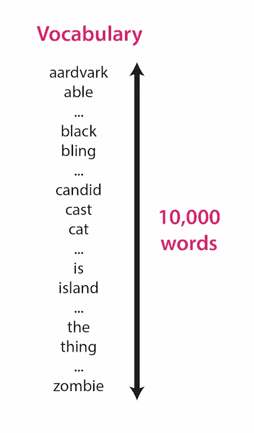
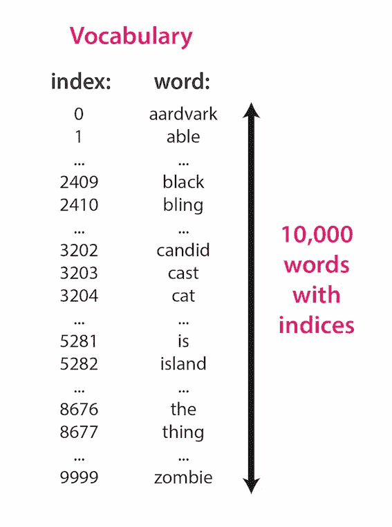
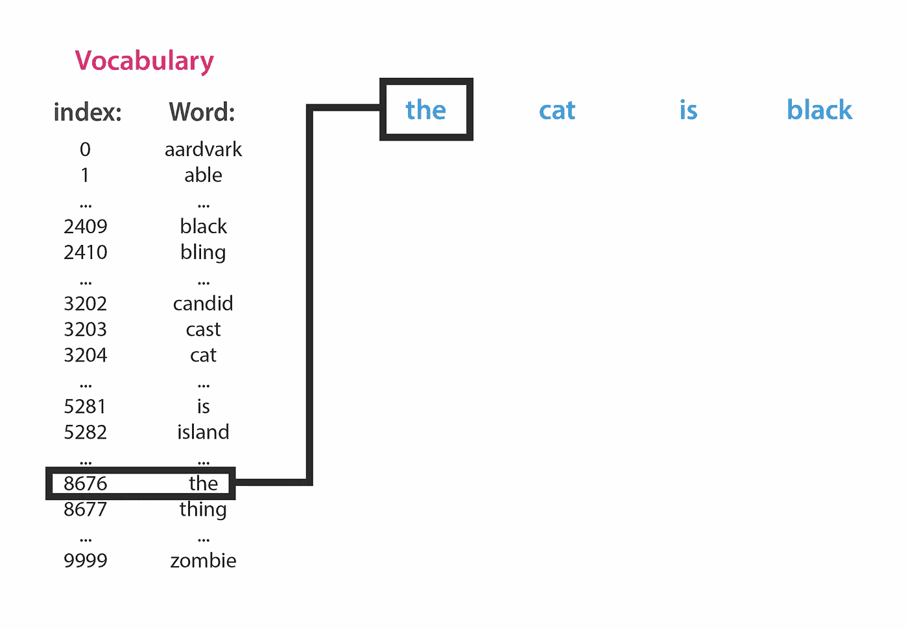
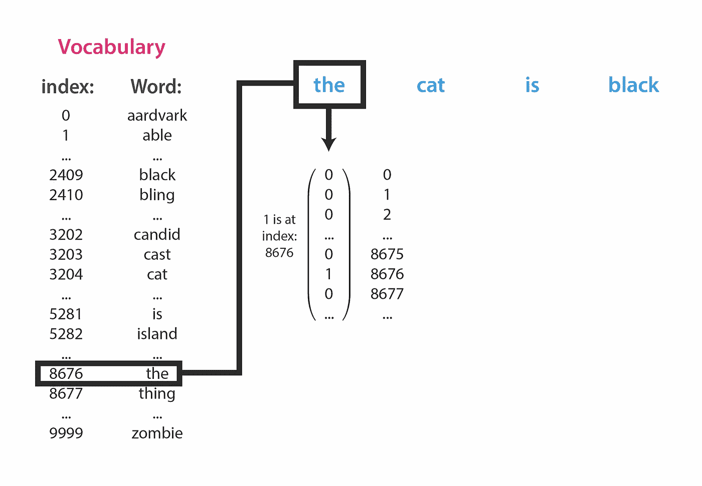
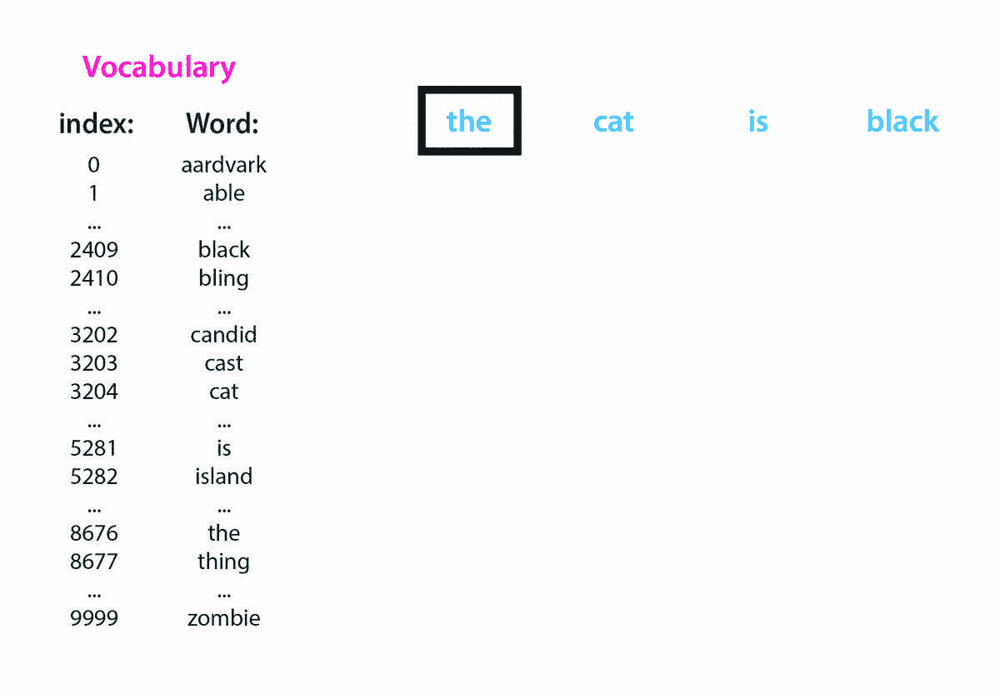
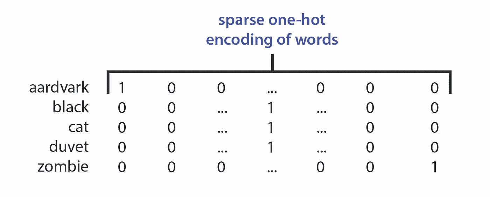
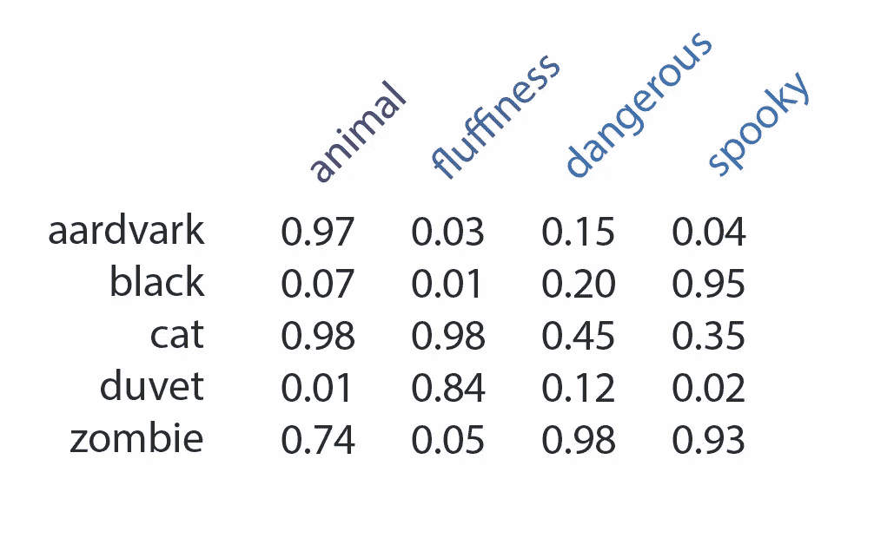
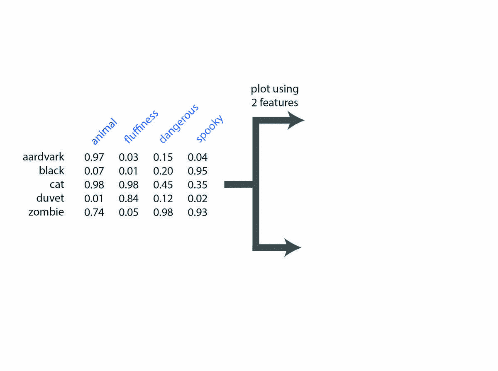

# 为什么我们在 NLP 中使用单词嵌入？

> 原文：<https://towardsdatascience.com/why-do-we-use-embeddings-in-nlp-2f20e1b632d2?source=collection_archive---------1----------------------->

自然语言处理(NLP)是机器学习(ML)的一个子领域，它处理自然语言，通常以文本的形式，文本本身由更小的单元组成，如单词和字符。处理文本数据是有问题的，因为我们的计算机、脚本和机器学习模型无法以任何人类的方式阅读和理解文本。

当我读到“猫”这个词时，许多不同的联想被唤起——它是一种可爱的毛茸茸的小动物，吃鱼，我的房东不允许，等等。但这些语言关联是经过数百万年进化磨砺的相当复杂的神经计算的结果，而我们的 ML 模型必须从零开始，没有预先建立的对词义的理解。

那么，文本输入应该如何发送给我们的模型呢？计算机可以很好地处理数字输入，所以让我们把问题换成:

> 我们怎样才能最好地用数字表示文本输入？

理想情况下，我们提出的任何数字表示方法都应该是语义上有意义的——数字值应该尽可能多地捕捉单词的语言意义。一个精心选择的、信息丰富的输入表示可以对整个模型的性能产生巨大的影响。

**单词嵌入**是解决这个问题的主要方法，并且如此普遍，以至于它们的使用实际上在任何 NLP 项目中都是假定的。无论您是开始一个文本分类、情感分析还是机器翻译的项目，您都有可能从下载预先计算的嵌入(如果您的问题相对标准)或者考虑使用哪种方法从您的数据集中计算您自己的单词嵌入开始。

> 但是我们为什么要在 NLP 中使用嵌入呢？

没有谈论任何计算嵌入的特定算法(假装你从未听说过 word2vec 或 FastText 或 ELMo)，这篇文章回到基础来回答如下问题:

*   为什么我们需要任何复杂的方法来表示单词呢？
*   用数字表示单词的最简单方法是什么，为什么这还不够？
*   我们所说的嵌入“把词映射到高维语义空间”到底是什么意思？
*   如何将单词嵌入可视化并直观地理解？

让我们开始吧。

# 一个没有单词嵌入的世界

给定这 10，000 个单词的词汇表，用数字表示每个单词的最简单方法是什么？

Our vocabulary of 10,000 words.

你可以简单地给每个单词分配一个整数索引:

Our vocabulary of 10,000 words, with each word assigned an index.

给定这种单词到整数的映射，我们可以将单词表示为数字向量，如下所示:

*   每个单词将被表示为一个 *n* 维向量，其中 *n* 是词汇量
*   每个单词的向量表示将主要是“0”，除了在对应于单词在词汇表中的索引的位置将有单个“1”条目。

举几个例子:

*   我们的第一个词汇单词“aardvark”的向量表示将是[1，0，0，0，…，0]，它是第一个位置的“1”，后面是 9，999 个零。
*   我们的第二个词汇单词“ant”的向量表示将是[0，1，0，0，…，0]，即第一个位置是“0”，第二个位置是“1”，之后是 9998。
*   诸如此类。

这个过程叫做**一热矢量编码**。您可能也听说过这种方法在多类分类问题中被用来表示标签。

现在，假设我们的 NLP 项目正在构建一个翻译模型，我们想要将英语输入句子“the cat is black”翻译成另一种语言。我们首先需要用一次性编码来表示每个单词。我们将首先查找第一个单词“the”的索引，并发现它在我们的 10，000 长的词汇表中的索引是 8676。

然后，我们可以使用长度为 10，000 的向量来表示单词“the ”,其中除了位置 8676 处的条目是 1 之外，每个条目都是 0。

我们对输入句子中的每个单词进行索引查找，并创建一个向量来表示每个输入单词。整个过程看起来有点像这个 GIF:

GIF showing the one-hot encoding of the words in the input sentence “the cat is black”.

注意，这个过程为每个输入单词生成了非常**稀疏的**(大部分为零)**特征向量**(这里，术语“特征向量”、“嵌入”和“单词表示”可互换使用)。

这些一键向量是将单词表示为实数值向量的一种快速简单的方法。

**快速旁白:**如果您想生成整个句子的表示，而不仅仅是每个单词，该怎么办？最简单的方法是连接或平均句子的成分词嵌入(或两者的混合)。更高级的方法，如编码器-解码器 RNN 模型，将顺序读取每个单词的嵌入，以便通过多层转换逐步建立句子意思的密集表示(见[这篇文章对 ELMo 句子嵌入的快速概述](/elmo-contextual-language-embedding-335de2268604))。

# 稀疏独热编码的问题

我们已经完成了一次性编码，并成功地将每个单词表示为一个数字向量。许多 NLP 项目已经这样做了，但是最终结果可能很一般，特别是当训练数据集很小时。这是因为一键矢量不是一种很好的输入表示方法。

***为什么单词一键编码次优？***

*   **相似性问题。**理想情况下，我们希望类似的单词，如“猫”和“老虎”，有一些相似的特征。但是有了这些一键向量，“猫”和“老虎”就像字面上的任何其他单词一样相似，这并不好。与此相关的一点是，我们可能想要对单词 embeddings 进行类似类比的向量运算(例如，“cat”-“small”+“large”等于什么？希望是像大猫一样的东西，例如“老虎”或“狮子”)。我们需要足够丰富的单词表示来允许这样的操作。
*   **词汇量问题。**使用这种方法，当你的词汇量增加了 *n* 时，你的特征大小向量的长度也增加了*n。*独热向量的维数与字数相同。您不希望要素尺寸爆炸式增长是有原因的，也就是说，更多的要素意味着要估计更多的参数，您需要指数级的更多数据来充分估计这些参数，以构建合理的概化模型(请参阅:维数灾难)。作为一个粗略的经验法则，您需要比您拥有的特征多几个数量级的训练数据。
*   **计算问题。**每个单词的嵌入/特征向量大多为零，许多机器学习模型在非常高维度和稀疏特征的情况下不会很好地工作。神经网络尤其难以处理这种类型的数据(尽管有变通办法，例如[使用一种类似套索的特征选择](https://arxiv.org/pdf/1711.07592.pdf))。有了这么大的特征空间，你也有陷入内存甚至存储问题的危险，特别是如果你正在处理的模型不能很好地处理稀疏矩阵的压缩版本(例如 SciPy 的稀疏矩阵 CSR 格式，[教程这里](https://machinelearningmastery.com/sparse-matrices-for-machine-learning/))。

这些点是相关的，但是恶意地说:计算和词汇大小问题可以被认为是技术问题，也许相似点更像是一个“好东西”。

密集嵌入解决了一键向量存在的最重要的问题是什么？

> 嵌入解决的核心问题是泛化。

*   **一般化问题。**如果 as 假设像“猫”和“老虎”这样的词确实是相似的，我们想要某种方式将该信息传递给模型。如果其中一个单词是罕见的(例如“liger”)，这就变得特别重要，因为它可以在计算路径上附带一个类似的、更常见的单词通过模型。这是因为，在训练期间，模型学会了以某种方式对待输入“猫”，即通过由权重和偏差参数定义的多层转换来发送它。当网络最终看到“狮虎”时，如果它的嵌入与“猫”相似，那么它将走与“猫”相似的道路，而不是网络必须完全从零开始学习如何处理它。对你从未见过的事物做出预测是非常困难的——如果它与你*见过的*事物有关，那就容易多了。

**这意味着嵌入允许我们建立更一般化的模型——**我们让相似的词“共享”参数和计算路径，而不是让网络去争相学习许多不同的方法来处理断开的输入。

# 稀疏独热编码总是不好的吗？

在少数情况下，使用稀疏独热编码优于嵌入编码。套用 Yoav Goldberg 在他的[NLP 神经网络初级读本](https://arxiv.org/pdf/1510.00726.pdf)中的话，如果:

*   您拥有相对较少的输入要素
*   你不期望输入是有意义的相关(与上面的“猫”和“狮虎”的例子相反)
*   您不希望输入共享模型参数
*   你有相当多的数据可以学习

那么也许使用它们并不是最糟糕的主意。

单独但相关的一点:当然， [one-hot 编码在分类数据预处理的情况下总是相关的](https://machinelearningmastery.com/how-to-one-hot-encode-sequence-data-in-python/)，因为许多 ML 模型不能直接处理分类数据(如文本标签)。您仍然可以使用它们将一个多类标签向量转换成多个二进制类向量，或者将一些分类特征向量转换成它们的二进制版本。

# 走向密集的、语义上有意义的表达

既然我们已经讨论了热点向量及其缺陷，那么让我们讨论使用密集的、语义上有意义的特征向量来表示单词意味着什么。

如果我们从我们的词汇表中选取 5 个示例单词(比如“aardvark”、“black”、“cat”、“duvet”和“zombie”)，并检查它们由上面讨论的一键编码方法创建的嵌入向量，结果将如下所示:

Word vectors using one-hot encoding. Each word is represented by a vector that is mostly zeroes, except there is a single “1” in the position dictated by that word’s index in the vocabulary. Note: it’s not that “black”, “cat”, and “duvet” have the same feature vector, it just looks like it here.

但是，作为说某种语言的人，我们知道单词是这些丰富的实体，具有许多层次的内涵和意义。让我们为这 5 个单词手工制作一些语义特征。具体来说，让我们将每个单词表示为具有介于 0 和 1 之间的某种值的四个语义属性，“动物”、“蓬松”、“危险”和“怪异”:

Hand-crafted semantic features for 5 words in the vocabulary.

所以，来解释几个例子:

*   对于“土豚”这个词，我给了它一个很高的“动物”特征值(因为它实际上是一种动物)，以及相对较低的“蓬松度”(土豚有短鬃毛)、“危险”(它们是小型夜间穴居猪)和“怪异”(它们很迷人)。
*   对于“猫”这个词，我给它的特征“动物”和“蓬松度”(不言自明)，一个中值“危险”(如果你曾经养过宠物猫，也是不言自明的)，一个中值“怪异”(尝试搜索“sphynx 猫”)。

# 基于语义特征值绘制单词

我们已经找到了要点:

每一个语义特征都可以被看作是更广、更高维度的语义空间中的单个维度。

*   在上面虚构的数据集中，有四个语义特征，我们可以一次绘制两个，作为 2D 散点图(见下文)。每个特征是不同的轴/尺寸。
*   每个单词在这个空间中的坐标由它在感兴趣的特征上的特定值给出。例如，单词“aardvark”在蓬松度与动物 2D 图的 2D 图上的坐标是(x=0.97，y=0.03)。

Plotting word feature values on either 2 or 3 axes.

*   类似地，我们可以考虑这三个特征(“动物”、“蓬松”和“危险”)，并在这个 3D 语义空间中绘制单词的位置。例如，单词“duvet”的坐标是(x=0.01，y=0.84，z=0.12)，表明“duvet”与蓬松的概念高度关联，可能有点危险，并且不是动物。

这是一个手工制作的玩具示例，但是实际的嵌入算法当然会为输入语料库中的所有单词自动生成嵌入向量。如果您愿意，您可以将 word2vec 这样的单词嵌入算法视为单词的无监督特征提取器。

> 像 word2vec 这样的单词嵌入算法是无监督的单词特征提取器。

这篇文章不会描述这些算法是如何工作的，但核心思想是，在类似上下文中使用的单词将被赋予类似的表示。也就是说，以类似方式使用的单词将在高维语义空间中紧密放置在一起——这些点将聚集在一起，它们彼此之间的距离将很低。

# 应该用多少个维度来表示单词？

单词嵌入算法通常会要求您设置希望嵌入的维数——这里的正确答案是什么？

直觉上，你可能想要更多的维度，更多类型的输入。因此，如果您要计算单词的嵌入，您可能需要更多的维度，在您的语料库中可能有数万种类型，而如果您要计算词类标签(如“名词”、“动词”、“形容词”)的嵌入，则没有那么多类型。例如，在 NLTK(一个流行的 Python NLP 库)中只有 35 种词性，您可能不需要太多的维度来很好地表示每种词性。

多少嵌入维数是最佳的问题实际上是一个经验问题，最佳数目在理论上还没有解决。这里的权衡是准确性和计算问题之间的权衡:

*   更多的维度意味着计算单词表达越来越精确的潜力
*   但更多的维度也意味着对计算资源的更高需求(处理速度、内存需求)——这在训练阶段更加明显，但也确实会影响推理速度。

在实践中，人们使用大约 50 到 500 维的单词嵌入向量(您经常遇到 300 维)，有时更多地用于竞争非常激烈的系统，在这些系统中，您试图从模型中挤出尽可能多的性能。

# 可视化单词嵌入

与此相关的一点是，鉴于这些语义空间通常是非常高维的，你打算如何可视化其中发生的事情？人们(即使是杰夫·辛顿)也无法真正想象超过 3 维的空间。

> “要处理 14 维空间中的超平面，想象一个 3 维空间，大声对自己说‘14’。大家都这么干。”杰夫·辛顿

您可以随机选择两个或三个要素，并在这两个或三个轴上绘制您的点。然而，由于特性/轴通常是不可解释的，你不知道选择哪一个是特别有见地或有趣的。此外，单词的位置可能会根据您选择的特定坐标轴而有很大的不同，所以如果您随机选择几个坐标轴，您将无法获得单词位置的准确印象。

在实践中，人们会经常使用 t-SNE 或 PCA 等**降维方法**将高维的嵌入点投影到一个更低维的空间中(有一定的信息损失)。重要的是，它允许你只为每个单词提取两个坐标(比如说，从 300 个)，然后你可以很容易地用 2D 散点图来可视化。网上有很多关于这些话题的很好的教程，[就像这个。](/visualising-high-dimensional-datasets-using-pca-and-t-sne-in-python-8ef87e7915b)

# 结论

总而言之，嵌入:

*   将单词表示为语义上有意义的密集实值向量**。**
*   这克服了简单的一键矢量编码的许多问题。
*   **最重要的是，嵌入提高了几乎所有 NLP 问题的泛化能力和性能，**尤其是在你没有大量训练数据的情况下。

我希望你喜欢这篇“回归基础”的帖子，请在下面告诉我你的想法:)

—

*Welocalize 是自然语言处理和翻译技术的行业领导者。要与我们团队中的某个人谈论你的 NLP 项目，请发电子邮件给 david.clark@welocalize.com 的戴夫。*