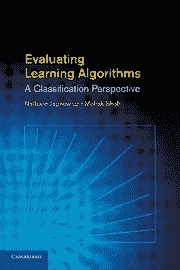
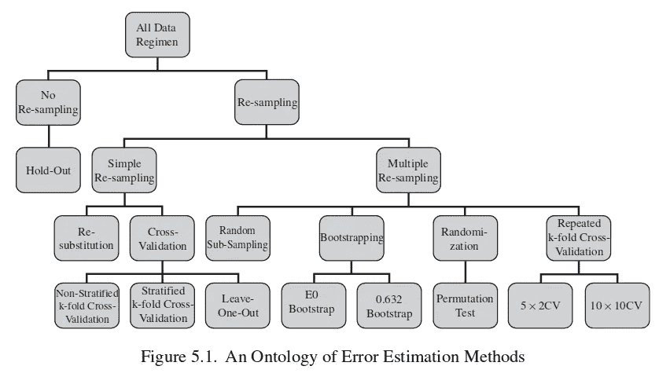

# 你为什么使用交叉验证来评估你的模型？

> 原文：<https://towardsdatascience.com/why-do-you-use-cross-validation-to-evaluate-your-models-c3923636436b?source=collection_archive---------28----------------------->

## 分类器性能评估简介

如果几周前你问我这个问题，我的回答会是“因为我读的每本机器学习书都告诉我这么做”。我决定寻找一个更好的答案，因为̶i̶̶h̶a̶t̶e̶̶t̶a̶k̶i̶n̶g̶̶o̶r̶d̶e̶r̶s̶我觉得有必要真正知道这个决定背后的推理是什么(我不是数据科学的独角兽，统计学不是我的强项)。

寻找关于这个问题的信息很难，因为我不知道去哪里找，但幸运的是，我找到了一本书来回答这个问题:[评估学习算法](https://www.cambridge.org/core/books/evaluating-learning-algorithms/3CB22D16AB609D1770C24CA2CB5A11BF)。

Evaluating Learning Algorithms: A Classification Perspective. Cambridge University Press, 2011

这本书集中在分类算法和他们周围的评估方法。

> [……]至关重要的是，研究人员拥有适当的工具来评估学习方法和理解潜在的问题。这本书检查了评估过程的各个方面，重点是分类算法。——[书籍描述](https://www.cambridge.org/core/books/evaluating-learning-algorithms/3CB22D16AB609D1770C24CA2CB5A11BF#fndtn-information)

在这篇文章中，我们将以这本书为指导，讨论机器学习中性能评估的一些主要观点。

## 我并不孤单:事实上的文化

第一个(令人欣慰的)发现是，我并不孤单:在大多数实际情况下，简单地使用重复交叉验证是机器学习社区中常见的事情。作者在第一章中谈到了对*事实上的*文化的评价:

> 尽管在有限的数据情况下，交叉验证确实似乎是重采样方法中的一个强有力的候选方法，但将其应用于大多数实际情况有点太过分了。**在聚焦于评估策略**(或者甚至是交叉验证等误差估计方法)之前，大多数实际数据情况都需要研究更广泛和更深入的问题。—n . Japkowicz 和 m . Shah，2011 年

也许简单地使用交叉验证对于 Kaggle 竞争来说就足够了。但是在现实生活中，我们需要考虑**评估**的完整背景，这涉及许多标准，例如数据的类别分布和性能指标的选择。事实是评估模型**是困难的**，不幸的是“**没有一个由评估方法组合而成的单一评估策略可以适用于所有场景**。

# 当我们谈论评估机器学习模型时，我们在谈论什么？

要回答这个问题，我们需要后退一步，谈谈机器学习本身。如果我们有一个分类任务，我们训练一个机器学习模型来预测看不见的数据实例，我们就在利用一个**概括归纳论证**:

> 概括(更准确地说，*归纳概括*)从关于样本的前提出发，得出关于总体的结论。— [维基百科](https://en.wikipedia.org/wiki/Inductive_reasoning)

所以我们取一个数据集，并基于它进行归纳。这个数据集就是训练集。评估背后主要有两个概念: ***经验风险*** 和 ***泛化误差*** 。

## 经验风险

给定我们想要预测的标签 *y* ，**风险** 是 *y* 的真实标签和分类器分配的标签之间的不一致程度。损失函数是“当向量 *x* 的标签 *y* 不同于分类器分配的标签时损失的定量测量”。为了估计这一点，我们需要事先知道标签，因此 ***经验风险****是分类器相对于训练数据的风险”。*

## *泛化误差*

*另一方面， ***一般化误差*** 测量*风险*对于**未知数据**(这是我们的最终目标)的偏差。用于训练分类器的数据会对泛化误差产生影响:*

> *[……]应当理解，训练分类器的数据虽然代表真实分布，但**可能不会引导算法以最小的可能风险**学习分类器*f′*。—n . Japkowicz 和 m . Shah，2011 年*

****泛化误差*** 的来源可以用两件事来解释:没有足够的训练数据对完整的底层分布做出推断或者训练数据中有噪声。*

*模型的目标是最小化 ***经验风险*** 和 ***泛化误差*** 。换句话说，我们希望“在训练样本中最小化错误分类的概率，同时保证良好的泛化能力”。这里我们有[偏差-方差权衡](https://en.wikipedia.org/wiki/Bias%E2%80%93variance_tradeoff)，因为优化一个误差测量通常意味着折衷另一个。*

*更糟糕的是，**测量学习算法的偏差和方差分解行为是困难的**。作者指出了两个主要的局限性:*

*   **缺乏实际数据生成分布的知识*和*
*   **数据有限*。*

*为了知道模型是否能够很好地推广，我们需要事先知道数据分布，如果我们知道，我们就不需要首先训练分类器。*

> *因此，在缺乏数据分布知识的情况下，实际上不可能知道偏差和方差的真实值。因此，我们需要**通过使用一些可以从现有数据中获得的经验估计来近似这些值，而不是让它们明确地依赖于真实的基础数据分布**。—n . Japkowicz 和 m . Shah，2011 年*

*为了处理有限的数据可用性，数据重采样技术可以帮助我们:*

> *在模型选择和评估学习算法对测试数据的性能时，有限的数据可用性起着非常重要的作用。然而，这个问题在某种程度上可以通过使用所谓的数据重采样技术来改善。—n . Japkowicz 和 m . Shah，2011 年*

*因此，当我们评估一个模型时，我们需要检查它是否“过拟合”或“欠拟合”一个训练集，并评估这如何影响泛化误差。但是我们如何做到这一点呢？首先，我们决定一个性能指标(本书有两章专门介绍这一点)，然后我们找到一个测试模型的好方法，以获得尽可能无偏的估计**。***

# ***误差估计***

***好的，但是如何选择评估模型的方法呢？这要看**你有多少数据:*****

> ***理想情况下，我们可以访问整个群体，并在其上测试我们的分类器。即使无法获得全部人口，如果可以从该人口中获得大量有代表性的数据，误差估计将会非常简单。这将包括对他们接受训练的数据进行算法测试。—n . Japkowicz 和 m . Shah，2011 年***

***在现实生活中，我们有两个主要选择:***

*   ******维持*** 方法:在大量看不见的数据点上测试算法***
*   ******重采样*** 方法:使用和重用可用数据，以获得足够大数量的样本***

***作者在第五章中讨论了这些方法，并给出了误差估计方法的本体。***

******

***Evaluating Learning Algorithms: A Classification Perspective. Cambridge University Press, 2011***

***正如你所看到的，有很多的误差估计方法。我们不会在这里讨论它们，但是我想你已经明白了:交叉验证并不是所有事情的答案。***

***最后，在选择了适当的误差估计方法之后，下一步是评估模型之间的差异是否具有统计学意义或者仅仅是巧合(这本书也有一章专门讨论这一点)。***

# ***最后***

***机器学习中的性能评估**很难**。我们需要决定度量标准、误差估计方法、评估学习算法的最佳数据集等等。了解评估过程很重要，因为有了这些知识，我们可以做出***明智的决策*** 关于要采用的策略(而不是总是使用交叉验证)。***

***这就是这本书的目标。这是一个伟大的阅读，现在我更有信心决定评估模型的策略。你可以点击查看这本书[的更多细节。](https://www.cambridge.org/core/books/evaluating-learning-algorithms/3CB22D16AB609D1770C24CA2CB5A11BF)***

***感谢阅读！***