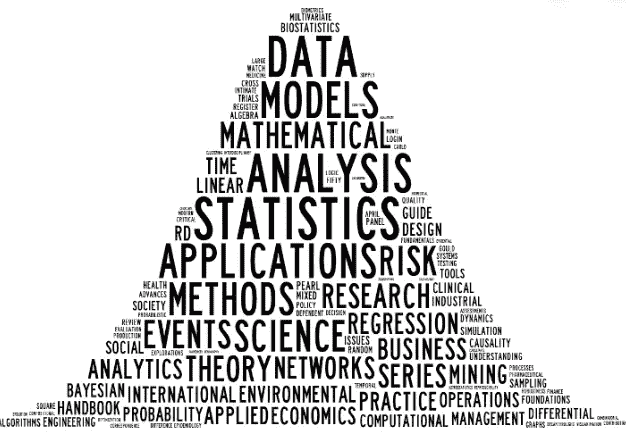
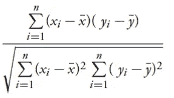
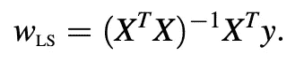
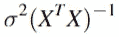
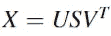
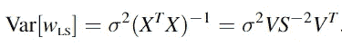

# 为什么在建立回归模型时要排除高度相关的特征？？

> 原文：<https://towardsdatascience.com/why-exclude-highly-correlated-features-when-building-regression-model-34d77a90ea8e?source=collection_archive---------4----------------------->

如果您已经处理数据很长时间了，那么您一定知道一般的做法是在运行线性回归时排除高度相关的特征。本文的目的是解释为什么我们在构建简单的线性回归模型时需要避免高度相关的特性。在继续这篇文章之前，我强烈推荐你参考我关于[回归](/regression-explained-in-simple-terms-dccbcad96f61)的文章。

## 什么是相关性？

相关性仅仅意味着两个或更多事物之间的相互关系。考虑数据集中的数据点(xᵢ，yᵢ)，i = 1，2，…n。相关性的目的是观察大值“x”是否与大值“y”配对，小值“x”是否与小值“y”配对。如果没有，检查小值“x”是否与大值“y”成对出现，反之亦然。

在统计学中，上述现象是用一个叫做相关系数的拟合函数来衡量的。衡量相关性的公式是

Correlation coefficient formula

x̄和̄y 分别代表 x 和 y。当相关系数为< 0, we say that x and y are negatively correlated. If it is > 0 时，两者正相关。相关系数在-1 和 1 之间变化。

需要注意的最重要的一点是，相关性只度量两个变量之间的关联，而不度量因果关系。即，“y”的大值**不是由“x”的大值引起的**，反之亦然，而是恰好这样的数据对只存在于数据集中。

## 为什么排除高度相关的特征？

如果您还记得我上一篇关于[回归](/regression-explained-in-simple-terms-dccbcad96f61)的文章，回归就是从训练数据中学习权重向量，并使用它来进行预测。获得权重向量的公式为

我们有一个回归的概率观点，假设因变量“y”正态分布，方差为σ。在这种假设下，从数学上可以看出，上述权重向量 Wₗₛ的方差为

Variance of Wₗₛ

为了使模型足够稳定，上述方差应该很低。如果权重的方差很高，则意味着模型对数据非常敏感。如果方差很大，则权重与训练数据相差很大。这意味着模型可能无法很好地处理测试数据。所以，自然的问题是，

**wₗₛ的方差什么时候会大？**

现在你应该猜到了，当我们有高度相关的特征时，Wₗₛ的方差会很大。是的，猜对了！！但是让我们看看这在数学上是如何正确的。任何 n×d 矩阵都可以分解为

Singular Value Decomposition

上述分解称为“奇异值分解”。上式中的“S”矩阵是非负对角矩阵。利用这种分解，Wₗₛ的方差可以改写为

当数据集中的要素高度相关时,“S”矩阵中的值会很小。因此,“s”矩阵(上式中的 S^-2)的平方反比将很大，这使得 Wₗₛ的方差很大。

因此，如果两个要素高度相关，建议我们只在数据集中保留一个要素。我希望这篇文章是有帮助的。如果您有任何疑问，请在下面留下。