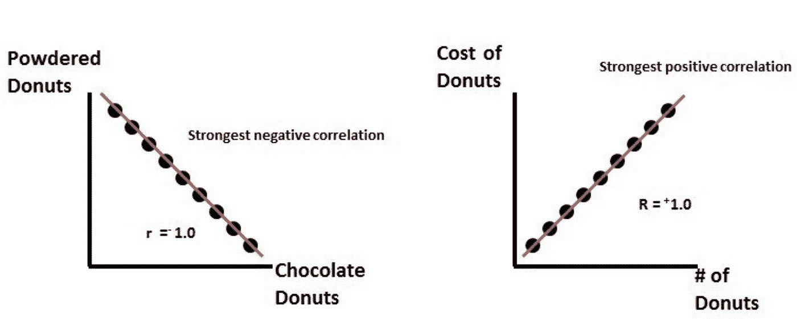
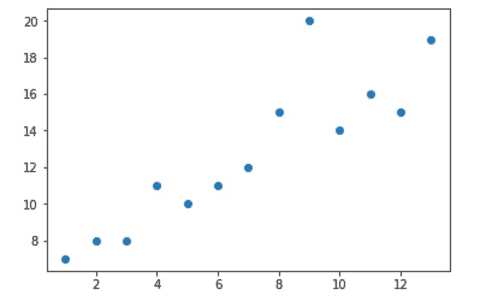
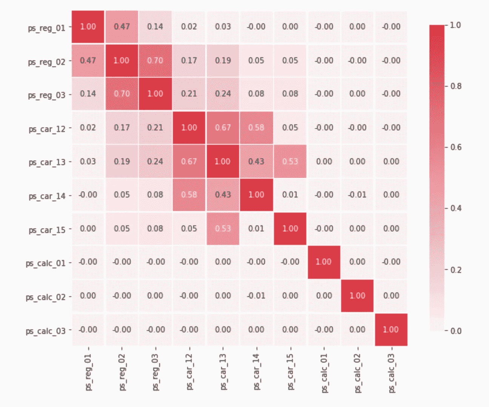
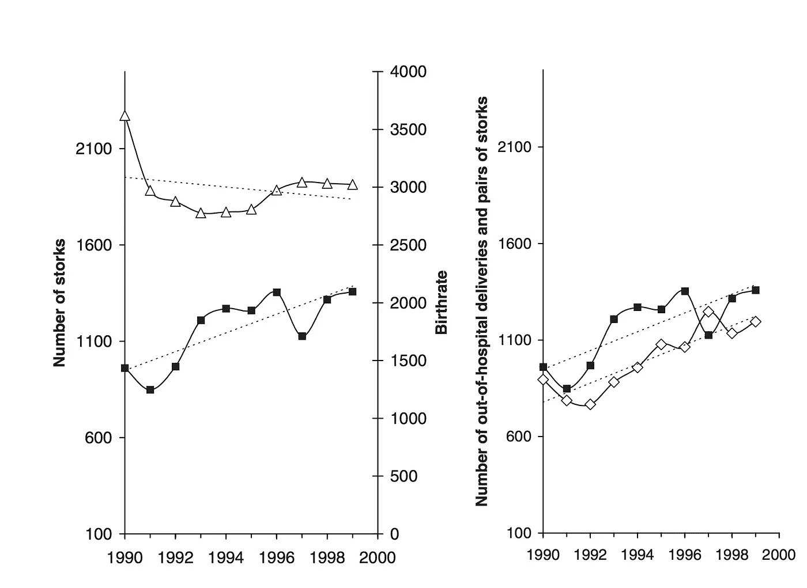

# 为什么特性相关性很重要…很多！

> 原文：<https://towardsdatascience.com/why-feature-correlation-matters-a-lot-847e8ba439c4?source=collection_archive---------0----------------------->

## 鹳会接生婴儿吗？尽管已经在相关性和因果性的上下文中从理论上证明了这一点，但本文探讨的是相关性以及它与因果性的区别。

Photo by [israel palacio](https://unsplash.com/@othentikisra?utm_source=medium&utm_medium=referral) on [Unsplash](https://unsplash.com?utm_source=medium&utm_medium=referral)

机器学习模型的好坏取决于你拥有的数据。这就是为什么数据科学家可以花费数小时来预处理和清理数据。他们只选择对最终模型质量贡献最大的特征。这个过程叫做**“特征选择”。特征选择**是选择能使预测变量更准确的属性或消除那些不相关的、会降低模型精度和质量的属性的过程。

数据和特征相关性被认为是数据预处理的特征选择阶段中的一个重要步骤，尤其是如果特征的数据类型是连续的。那么**什么是数据相关性？**

**数据关联:**是理解数据集中多个变量和属性之间关系的一种方式。使用相关性，您可以获得一些见解，例如:

*   一个或多个属性依赖于另一个属性或另一个属性的原因。
*   一个或多个属性与其他属性相关联。

## 那么，相关性为什么有用呢？

*   相关性有助于从一个属性预测另一个属性(估算缺失值的好方法)。
*   相关性可以(有时)表明因果关系的存在。
*   相关性被用作许多建模技术的基本量

让我们仔细看看这意味着什么，以及相关性是如何有用的。有三种类型的相关性:

**正相关:**表示如果特征 **A** 增加，那么特征 **B** 也增加，或者如果特征 **A** 减少，那么特征 **B** 也减少。这两个特征一前一后地移动，并且它们具有线性关系。

Negative Correlation (Left) and Positive Correlation (Right)

**负相关:**表示如果特征 **A** 增加，那么特征 **B** 减少，反之亦然。

**不相关:**这两个属性之间没有关系。

这些相关类型中的每一种都可以存在于由从 0 到 1 的值表示的谱中，其中轻微或高度正相关特征可以是类似于 0.5 或 0.7 的值。如果存在强的和完美的正相关，那么结果由 0.9 或 1 的相关分值表示。

如果有很强的负相关性，则用值-1 表示。

如果数据集具有完全正或负的属性，那么模型的性能很有可能会受到一个称为“多重共线性”的问题的影响。**多重共线性**当多元回归模型中的一个预测变量可以通过其他预测变量以高精度进行线性预测时，就会发生多重共线性。这可能导致扭曲或误导的结果。幸运的是，决策树和提升树算法天生对多重共线性免疫。当他们决定分割时，树将只选择一个完全相关的特征。但是，其他算法(如逻辑回归或线性回归)也不能避免这个问题，您应该在定型模型之前解决这个问题。

## 我该如何处理这个问题？

处理这个问题有多种方法。最简单的方法是删除或消除一个完全相关的特征。另一种方法是使用降维算法，如[主成分分析(PCA)](https://en.wikipedia.org/wiki/Principal_component_analysis) 。

# Spearman VS Pearson 相关矩阵:

Spearman 和 Pearson 是计算两个变量或属性之间相关性强度的两种统计方法。**皮尔逊相关系数**可用于具有线性关系的连续变量。这里有一个例子:

The output of the above code

要打印皮尔逊系数得分，我只需运行`pearsonr(X,Y)`，结果是:`(0.88763627518577326, 5.1347242986713319e-05)`，其中第一个值是皮尔逊相关系数，第二个值是 P 值。0.8 意味着变量高度正相关。

如果变量有非线性关系，你可以用**斯皮尔曼**相关系数**来衡量相关性。**它也可以和[有序分类变量](https://en.wikipedia.org/wiki/Ordinal_data)一起使用。可以通过跑步得到斯皮尔曼系数分数:`scipy.stats.spearmanr(X,Y)`

现在，这可能听起来很复杂，尤其是对于高维数据集。在这种情况下，更好的方法是用一个矩阵来可视化这种相关性。这里是你如何使用熊猫来做到这一点，我使用的是来自 Kaggle 的 [Porto Seguro 的安全驾驶员预测数据集:](https://www.kaggle.com/c/porto-seguro-safe-driver-prediction/data)

从上面的矩阵中可以看出，ps_reg_03 和 ps_reg_02 变量之间以及 ps_car_12 和 ps_car_13 之间有很高的相关性。

还有另一种流行的方法，称为肯德尔的τ系数，它也是基于可变等级，但与斯皮尔曼的系数不同，它没有考虑等级之间的差异。因为本文的重点是 Pearson 和 Spearman 相关性，所以 Kendall 方法超出了本文的范围。

# 误解(鹳会接生婴儿吗？):

相关性经常被解释为因果关系，这是一个很大的误解。变量之间的相关性并不表示因果关系。任何高度相关的变量都应该仔细检查和考虑。这里有一篇[(幽默)德国论文](http://web.stanford.edu/class/hrp259/2007/regression/storke.pdf)用相关性证明了婴儿是由鹳传播的理论。这项研究表明，城市周围鹳鸟数量的增加与城市医院外分娩数量的增加之间存在显著的相关性

Source: [http://web.stanford.edu/class/hrp259/2007/regression/storke.pdf](http://web.stanford.edu/class/hrp259/2007/regression/storke.pdf)

左边的图表显示了鹳数量的增加(粗黑线)和住院分娩数量的减少。另一方面，右边的图表显示，一些院外分娩(白色正方形标记)遵循鹳数量增加的模式。尽管这项研究并不意味着从科学上证明(幼鹳理论)，但它表明，通过高度的相关性，一种关系可能看起来是因果关系。这可能是由于一些未观察到的变量。例如，人口增长可能是另一个原因变量。

总之:相关性在许多应用中非常有用，尤其是在进行回归分析时。但是，不应该把它和因果关系混在一起，以任何方式曲解。您还应该始终检查数据集中不同变量之间的相关性，并收集一些见解作为探索和分析的一部分。