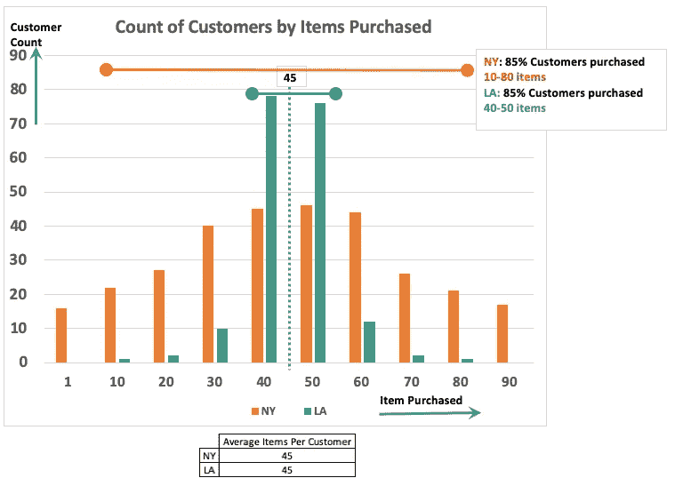
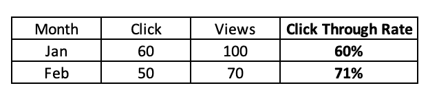
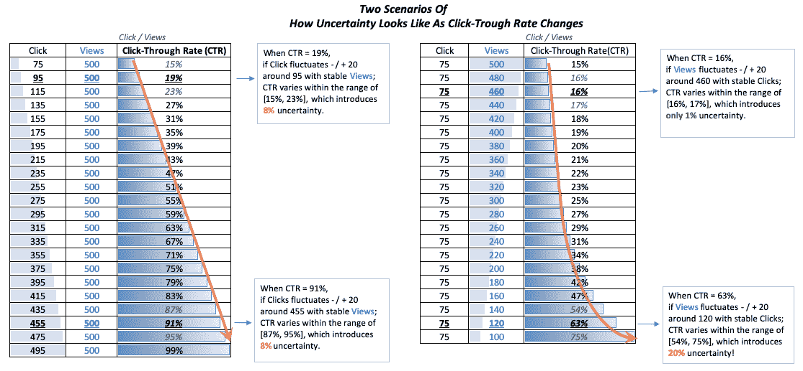

# 你最喜欢的业务指标不能告诉你关于你的客户的什么

> 原文：<https://towardsdatascience.com/why-focusing-on-data-points-can-hurt-your-business-and-what-you-should-do-instead-1583d008b7b9?source=collection_archive---------17----------------------->

您是否仅使用“平均值”或“比率”等指标来制定数据驱动的业务决策？如果是这样，你可能是在做错误的商业分析。

我将使用两个数据分析案例向您展示为什么只关注这些指标可能是危险的，以及您应该做些什么。

# 案例 1:平均值不能代表你的客户

## 为什么？

在分析产品和业务绩效时，我们经常使用平均值，但是单独使用平均值*会产生盲点。因为由于市场的不同细分或纯粹的随机性，总会有变化，而平均值并不会告诉你故事的变化。*

## 示例:我们的客户平均购买多少产品？

一家公司试图了解客户购买的平均商品数量。对于纽约和洛杉矶，他们发现每位顾客平均购买的商品是一样的(45 件)。

现在，根据下面的情节，我们应该对纽约和洛杉矶的客户应用相同的营销策略吗？

没有。

在洛杉矶(绿线)，85%的顾客购买了 40-50 件商品，这意味着平均数量(45)可以代表大多数顾客的行为。你可能只需要一个大的运动来瞄准大多数人。

然而，在纽约，平均值只能代表 50%的顾客行为。大多数顾客，比如说 85%，介于购买 10 件商品和 80 件商品之间，我们可以从橙色“哑铃”形线所示的大量数据中观察到这一点。

这意味着，纽约的顾客比洛杉矶的顾客有更多的变化，当顾客的行为更加多样化时，你可能需要针对纽约的多种营销策略。

## 我们做什么呢

通过计算方差找出平均值附近的**范围**。

通常，数据科学家会报告一个置信区间(CI)来估计平均值所在的概率。(此[链接](https://www.dummies.com/education/math/statistics/how-to-calculate-a-confidence-interval-for-a-population-mean-when-you-know-its-standard-deviation/)可以帮助您构建置信区间，您可以在 Excel 中创建它)

报告的一个例子是:纽约每个顾客购买的物品的平均值是 45，85%的置信区间是 10 到 80。

# 案例二。比率度量可能非常敏感和不可靠

## 为什么？

比率指标由至少两个指标组成；例如，点击率是点击数除以浏览量。随着每个指标的变化，比率指标的变化更加复杂，它不遵循任何常见的分布。

## 例子

我们先看下表。你在测量点击率，从这个表中，看起来点击率从一月到二月有所增加。听起来不错吧？

嗯，实际上点击量和浏览量都下降了，只是因为浏览量下降更多。所以这个涨幅很可能不是你想要的。

现在，让我们再看 4 个场景，看看当我们控制一个变量并改变另一个变量时，点击率是如何变化的。在每种情况下，我们能以相同的确定性信任该比率吗？

*左表*显示，如果分母(视图)稳定，比率度量随着分子(点击)的移动而成比例移动，数据的不确定性很容易估计，不确定性的尺度变化不大。

在*右表*中，当分母(视图)足够大时，如前几行所示，比率(CTR)非常稳定，只有 1–2%的不确定性。然而，如果你看下面的行，当*分母*很小时，该比率对变化非常敏感并且不稳定！在这种情况下，更好的方法是监控浏览量和点击量，并在决策时考虑各种情况。

## 我们做什么呢

1.  为 ***分母*** 设置最小可接受值的阈值。因为当分母很小时，比率可以有很大的方差，所以我们只信任分母足够大时的比率。如果你不得不在分母很小的时候使用比率指标来做决定，确保你报告了一个包含波动的范围。
2.  监控我们用于比率计算的实际值(分子、分母)。通过模拟分子和分母的不同情景，理解比率的范围。

# 您的业务分析战略要点:

> 数据分析不仅仅是计算，也是对不确定性的测量

虽然平均值或某些比率指标等汇总统计数据有助于我们' ***缩小*** '并看到数据和我们业务的全貌，但我们还需要' ***放大*** '数据的范围和形状，以确保我们理解与指标相关的不确定性。

*   一个数据点是不够的！在其周围创建**范围**，并使用方差来估计数据的不确定性或不同分段。
*   如果你的指标是比率，比如点击率，分析不同的场景，看看当分母和分子改变时，指标是如何变化的。如果您的分母很小，请小心，这意味着该比率对数据的变化更敏感，可能不可靠！
*   将它可视化，以确保我们不会遗漏数据中的任何模式或异常值。

想为你的创业公司获得更多关于数据分析的免费教程吗？点击下面的链接或图片获取我的时事通讯！

No spam, I’ll be mindful of your time and attention