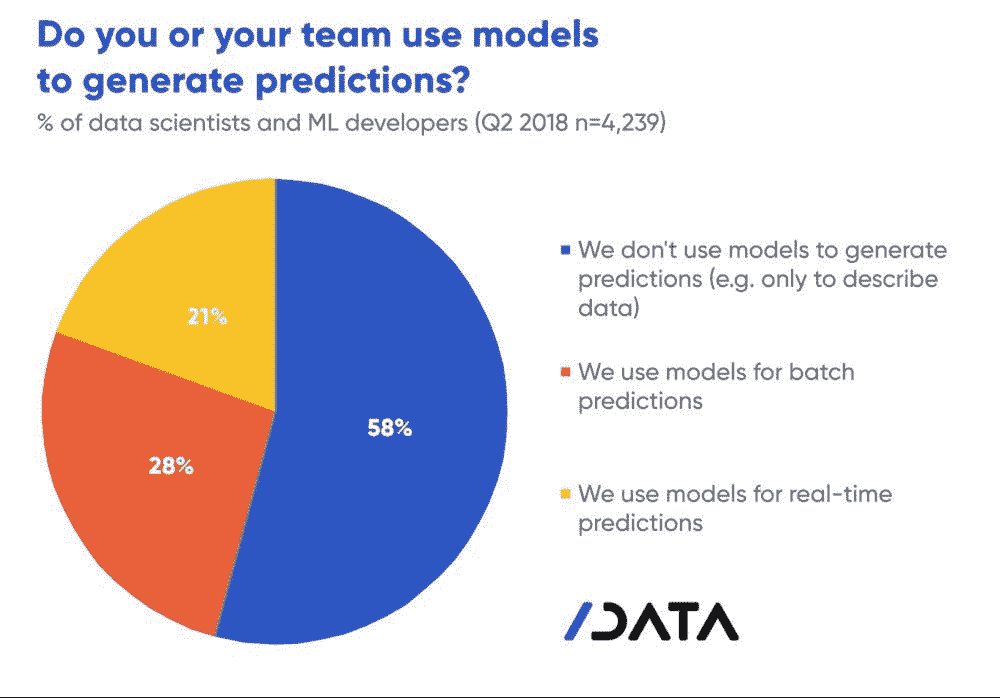
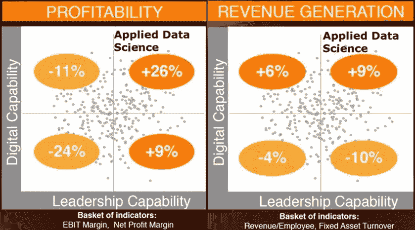

# 为什么要找一个数据主管？

> 原文：<https://towardsdatascience.com/why-get-a-data-executive-85099530e2d6?source=collection_archive---------32----------------------->

本文是一个保持、保留和释放数据团队价值的案例。企业需要数据科学家提供有价值的见解，但却达不到预期的结果。借助数字领导者的帮助，调整您的战略、人员和业务，创造可衡量、可操作的结果。

# 问题:专攻次要的事情

我在福布斯上找到一篇文章，解释了下面的一个数据科学职位描述:

> *职责:*
> 
> *将业务需求转化为机器学习产品。*
> 
> *为我们的核心业务设计和构建机器学习软件产品。*
> 
> *与业务负责人沟通战略和基本原理，定义并执行项目计划*
> 
> *领导 ML 自动化的所有方面，包括模型训练和开发、特征选择和模型调整。*
> 
> *开发生产 ML 和数据管道。开发生产代码并交付给生产环境[1]。*

对于数据科学领域的人来说，他们知道这是一个非常尖锐的问题。以下是工作经验或职位的翻译，按其各自的顺序排列:

*已转换的职责(平均。工资摘自 PayScale.com):*

*   *业务分析师(68，000 美元/年)*
*   *解决方案架构师(117，000 美元/年)*
*   *项目经理(87，000 美元/年)*
*   *数据科学家(9.5 万美元/年)*
*   *数据工程师(92，000 美元/年)*

当然，如果能以五分之一的价格雇佣一个至少能扮演五种商业角色的人，那就太好了。从商业或金融的角度来看，这是一项伟大的投资。问题是，许多第一次涉足数据科学的企业往往抱有很高的期望。巨大的期望没有错，但大多数数据科学家在没有适当支持的情况下进入角色，以提供有利可图的见解。

# 证据:没有一致的愿景

根据我在咨询许多公司时的个人经验，IT 部门的任何人都可以证明，大多数公司都有脏数据(非结构化、缺少值、某些领域中的错误数据等。).这是一个普遍的大问题。它如此普遍，以至于有了一个名字——GIGO(垃圾进，垃圾出)。对于数据科学家来说，从数据中创建预测是一项非常具有挑战性的任务。大多数模型需要在各种条件下有足够的样本，以便捕捉潜在趋势，做出准确而有见地的预测。事实上，这些数据问题正在影响数据团队的结果，正如在大多数失败的预测中看到的[2]:

你知道有一个问题，当你雇佣某人做 X，他们给你 y，在这种情况下，做预测，但相反只告诉你正在发生什么。那么，到底是怎么回事呢？作为一名来自 Oracle states 的数据科学贡献者，公司抱有错误的期望:

> *“做数据科学和管理数据科学不是一回事[3]。”*

基本上，数据科学家需要支持团队来确保高质量的数据流入他们的模型，以创造有价值的业务洞察力。然而，高层领导未能利用他们的数据科学家取得成功[4]。问题在于缺少一个领导席位。为了让数据产生推动收益的收入，需要有一个数据主管。

# 解决方案:数据领先

数据执行官、首席数据官(CDO)或首席信息官(CIO)需要被安排在企业中，以便执行以数据为动力的业务战略。我知道有些人会说首席数据官更适合这个职位，但首席信息官也不错。首席信息官也可以执行这项任务，因为众所周知，首席信息官向企业领导人提供数据驱动的见解。为什么不把提高数据质量的需求加入到列表中呢？毕竟，数据质量会反馈到相同的报告中，但是我离题了。数据领导者的主要原因是业务成果[5]:

如上所述，与行业竞争对手相比，数据主管可以释放公司内数据资源和团队的价值，使盈利能力提高 26%，收入提高 9%。

# 数据主管的行动步骤

从一个数据领导者那里，你可以期待至少三件主要的事情发生在你的业务中:数据愿景、组织对数据的认同和数据治理[5]。有了这三项改进，数据科学团队将能够按预期运行，做出有价值的预测。

**用数据创造愿景**

用数据增强的愿景解释了为什么进行数据转换以及最终结果是什么。例如，出租车的商业模式是收费用车运送乘客。同一个出租车视觉的数据增强视觉现在被称为优步。一家利用移动应用技术收费用汽车运送人员的企业。data executive 使企业能够利用直到最近才出现的数据驱动的应用程序和模型。

**重整公司**

以我的经验来看，组织变革从来都不容易，但那些进展较好的组织拥有公开透明的领导。同样从精益项目管理来看，倾听员工和他们的瓶颈是可能的改进，也是运营改进的来源。数据主管将成为数字化转型的焦点，并使公司的各个部门能够凝聚成一个数据驱动的愿景。

**形成数据治理**

正如许多类型的管理者所知道的那样，人们被给予了前进的命令，但有时会偏离正途。这就是数据治理的用武之地。在数据主管的领导下，数据治理引导所有数据来支持业务，并帮助确保高数据质量。通常情况下，首席数据官会领导治理委员会和联络人。

# 结论

如前所述，58%的数据科学家甚至不使用他们的模型*【2】*进行预测。假设这些都是优秀的数据科学家，有一个潜在的问题——没有数据领导。数据主管需要为数据团队提供支持和愿景，以增加业务价值。这需要整个组织从企业收集的数据中释放价值，并需要一个合适的数据领导者将这些见解转化为利润。有了数据执行官，企业可以有一个适当的数据驱动愿景，将公司凝聚到数据愿景，并建立数据治理，以实现+9%的收入增长和+26%的盈利能力*【5】*。

*免责声明:本文陈述的所有内容均为我个人观点，不代表任何雇主。*

[1] N. Talagala，《雇佣数据科学家:好的、坏的和丑陋的》(2019)，[https://www . Forbes . com/sites/cognitive world/2019/04/30/Hiring-A-Data-Scientist-The-Good-The-Bad-And-The-Ugly/# 6 e 36d 20 b 49 c 0](https://www.forbes.com/sites/cognitiveworld/2019/04/30/hiring-a-data-scientist-the-good-the-bad-and-the-ugly/#6e36d20b49c0)

[2] N. Gift，为什么到 2029 年将没有数据科学职位头衔(2019 年)，[https://www . Forbes . com/sites/Forbes tech Council/2019/02/04/Why-they-Will-they-Be-No-Data-Science-Job-Titles-By-2029/# 1856 b 62 d3a 8 f](https://www.forbes.com/sites/forbestechcouncil/2019/02/04/why-there-will-be-no-data-science-job-titles-by-2029/#1856b62d3a8f)

[3] E. Chenard，为什么数据科学领域的领导者要退出？(2018)，[https://www . data science . com/blog/why-data-science-leaders-fail](https://www.datascience.com/blog/why-data-science-leaders-fail)

[4] T .莱德曼，你在让你的数据科学家们失败吗？(2018)，[https://HBR . org/2018/01/are-you-setting-your-data-scientists-up-to-fail](https://hbr.org/2018/01/are-you-setting-your-data-scientists-up-to-fail)

[5] Capegemini，领导者转型，甲骨文全球大会 2014。