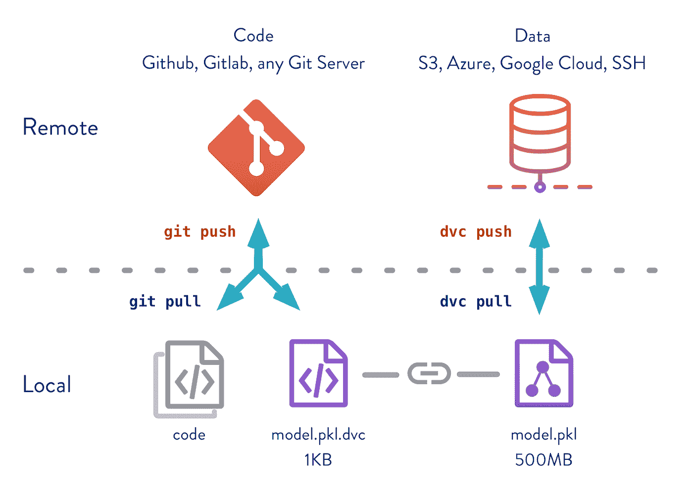
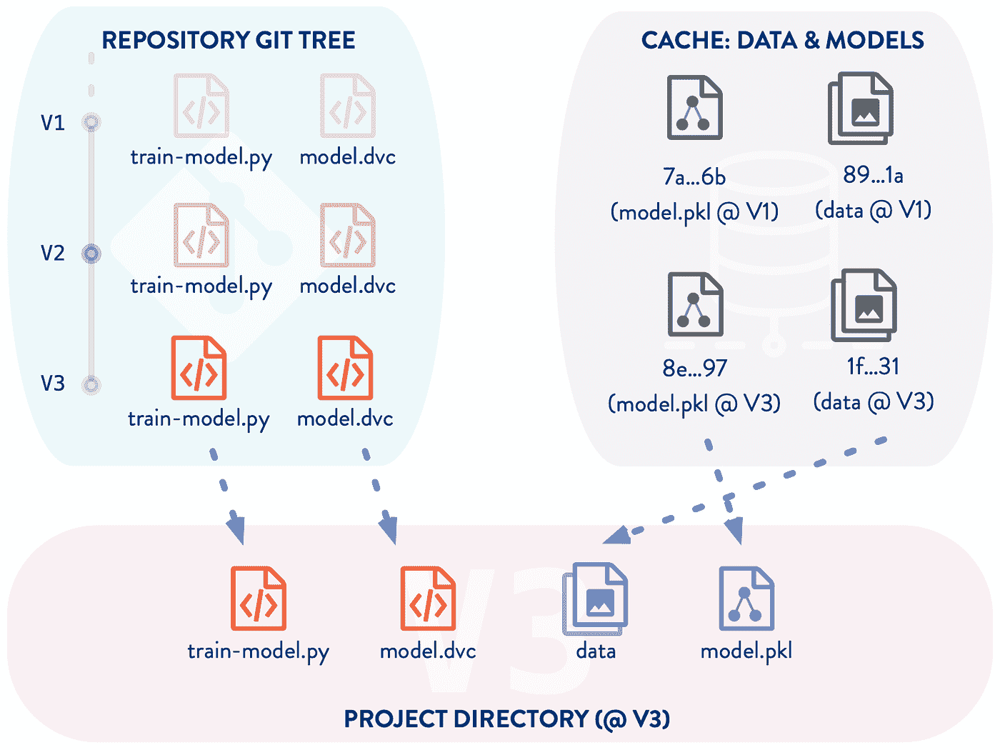
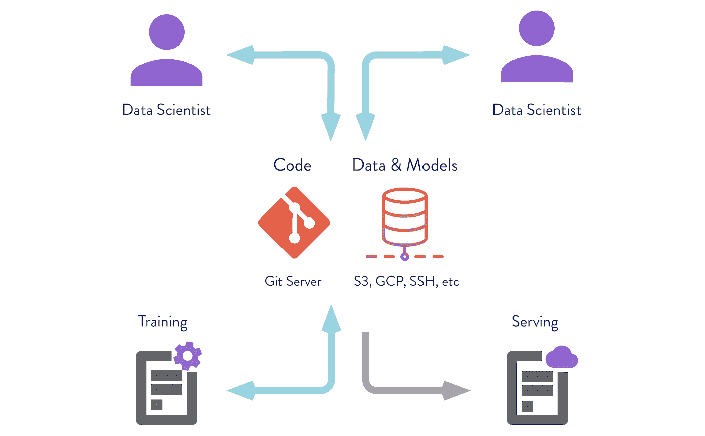
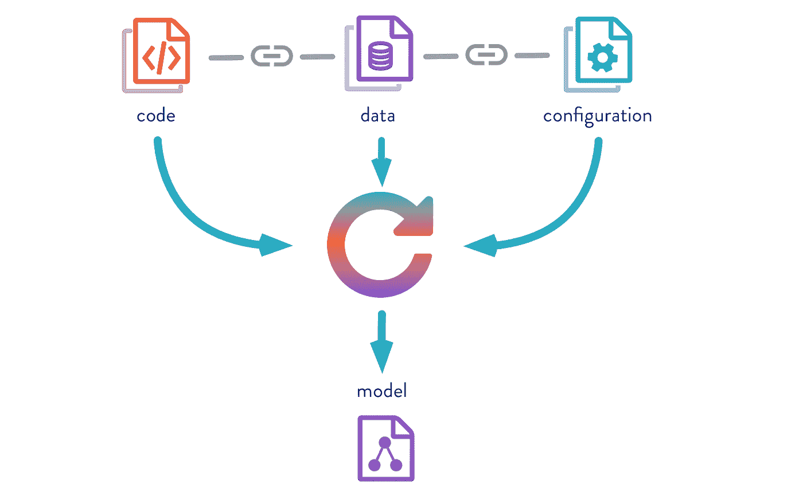

# 为什么 Git 和 Git-LFS 不足以解决机器学习再现性危机

> 原文：<https://towardsdatascience.com/why-git-and-git-lfs-is-not-enough-to-solve-the-machine-learning-reproducibility-crisis-f733b49e96e8?source=collection_archive---------2----------------------->


一些人声称，由于软件工具不足以确保可重复的过程，机器学习领域正处于危机之中。这场危机是关于复制机器学习模型等结果的困难。这场危机可以通过为机器学习从业者提供更好的软件工具来解决。

再现性问题如此重要，以至于年度 NeurIPS 会议计划将此作为 NeurIPS 2019 的主要讨论主题。“征文”公告有更多信息[https://medium . com/@ NeurIPSConf/Call-for-Papers-689294418 f43](https://medium.com/@NeurIPSConf/call-for-papers-689294418f43)

**所谓的危机是因为很难复制同事或科学家同事的工作**，威胁到他们在彼此工作的基础上发展、与客户分享或部署生产服务的能力。由于机器学习和其他形式的人工智能软件在学术和企业研究中被广泛使用，可复制性或再现性是一个关键问题。

我们可能认为这可以用典型的软件工程工具来解决，因为机器学习开发类似于常规的软件工程。在这两种情况下，我们生成某种编译的软件资产，在计算机硬件上执行，希望得到准确的结果。为什么我们不能利用软件工具的丰富传统和软件质量的最佳实践来为机器学习团队构建可重复的过程呢？

**不幸的是，传统的软件工程工具并不能很好地满足机器学习研究人员的需求。**

**一个关键问题是训练数据**。通常，这是大量的数据，如图像、视频或文本，这些数据被输入到机器学习工具中以训练 ML 模型。通常，训练数据不在任何种类的源代码控制机制下，仅仅是因为像 Git 这样的系统不能很好地处理大型数据文件，并且被设计来为文本文件生成增量的源代码控制管理系统不能很好地处理大型二进制文件的改变。任何有经验的软件工程师都会告诉你，一个没有源代码控制的团队将会处于一种难以管理的混乱状态。更改不会总是被记录下来，团队成员可能会忘记做了什么。

**最终，这意味着根据训练数据训练的模型无法复制，因为训练数据集将以未知的方式发生变化**。如果没有软件系统来记住任何一天数据集的状态，那么有什么机制来记住什么时候发生了什么呢？

# Git-LFS 是你的解决方案，对吗？

第一个反应可能是简单地使用 Git-LFS (Git 大文件存储),因为顾名思义，它在 Git 的基础上处理大文件。其卖点是 Git-LFS " *在 Git 内部用文本指针替换大文件，如音频样本、视频、数据集和图形，同时将文件内容存储在远程服务器上，如 GitHub.com 或 GitHub Enterprise。人们可以想象一个忙碌的机器学习团队说“听起来很棒，让我们去做吧”。它可以处理数千兆字节的文件，加快从远程存储库签出的速度，并使用同样舒适的工作流程。那确实符合很多条件，不是吗？*

**没那么快**，难道你的经理没有指示你在全力以赴之前要仔细评估吗？另一个要记住的人生教训是，过马路前要朝两边看。

您的评估应该出现的第一件事是 Git-LFS 需要一个 LFS 服务器，而这个服务器并不是每个 Git 托管服务都提供的。三巨头(Github、Gitlab 和 Atlassian)都支持 Git-LFS，但也许你身体里有一块 DIY 的骨头。与其使用第三方 Git 托管服务，您可能更喜欢托管自己的 Git 服务。例如，Gogs 是一个可以在自己的硬件上轻松运行的合格的 Git 服务，但是它没有对 Git-LFS 的内置支持。

根据你的数据需求，下一个可能是杀手锏: *Git LFS 可以让你存储高达 2 GB 的文件*。这是 Github 的限制，而不是 Git-LFS 的限制，然而所有的 Git-LFS 实现似乎都有各种各样的限制。Gitlab 和 Atlassian 都有自己的 Git-LFS 限制列表。考虑一下 Github 的 2GB 限制:Git-LFS 项目中的一个用例是存储视频文件，但是视频的大小远远超过 2GB 不是很常见吗？因此 Github 上的 GIt-LFS 可能不适合机器学习数据集。

不仅仅是 2GB 的文件大小限制，Github 对 Git-LFS 使用的免费层设置了如此严格的限制，以至于人们必须购买涵盖数据和带宽使用的数据计划。

与带宽相关的一个问题是，当使用托管的 Git-LFS 解决方案时，你的训练数据存储在远程服务器上，必须通过互联网下载。下载训练数据的时间是一个严重的用户体验问题。

另一个问题是将数据文件放在云存储系统(AWS，GCP 等)上的容易程度，这是运行基于云的人工智能软件时经常需要的。这是不支持的，因为来自三大 Git 服务的主要 Git-LFS 产品将你的 LFS 文件存储在他们的服务器上。有一个 DIY 的 Git-LFS 服务器可以在 https://github.com/meltingice/git-lfs-s3 的 AWS S3 上存储文件，但是设置一个定制的 Git-LFS 服务器当然需要额外的工作。另外，如果您需要文件位于 GCP 而不是 AWS 基础设施上，该怎么办呢？有没有 Git-LFS 服务器在你选择的云存储平台上存储数据？有没有利用简单 SSH 服务器的 Git-LFS 服务器？换句话说，GIt-LFS 限制了您对数据存储位置的选择。

# 使用 Git-LFS 是否解决了所谓的机器学习再现性危机？

有了 Git-LFS，你的团队可以更好地控制数据，因为它现在是受版本控制的。这意味着问题解决了吗？

之前我们说过“*的关键问题是训练数据*，但那是谎言。算是吧。是的，将数据置于版本控制之下是一个很大的改进。但是缺乏对数据文件的版本控制是全部问题吗？号码

是什么决定了训练一个模型或其他活动的结果？决定性因素包括以下内容，甚至更多:

*   训练数据-图像数据库或任何用于训练模型的数据源
*   用于训练模型的脚本
*   训练脚本使用的库
*   用于处理数据的脚本
*   用于处理数据的库或其他工具
*   操作系统和 CPU/GPU 硬件
*   生产系统代码
*   生产系统代码使用的库

显然，训练模型的结果取决于各种条件。因为有太多的变量，所以很难精确，但是普遍的问题是缺少现在所谓的配置管理。软件工程师已经认识到能够指定部署系统时使用的精确系统配置的重要性。

# 机器学习再现性的解决方案

人类是一个有创造力的群体，对于这场“危机”有许多可能的解决方案。

像 R Studio 或 Jupyter Notebook 这样的环境提供了一种交互式的 Markdown 文档，可以配置它来执行数据科学或机器学习工作流。这对于记录机器学习工作以及指定使用哪些脚本和库非常有用。但是这些系统没有提供管理数据集的解决方案。

同样，Makefiles 和类似的工作流脚本工具提供了重复执行一系列命令的方法。执行的命令是通过文件系统时间戳确定的。这些工具没有为数据管理提供解决方案。

在天平的另一端是像 Domino 数据实验室或 C3 物联网这样的公司，它们为数据科学和机器学习提供托管平台。两者都打包了一个基于大量数据科学工具的产品。在某些情况下，如 C3 物联网，用户使用专有语言编码，并将他们的数据存储在专有数据存储中。使用一站式购物服务可能很诱人，但它能提供所需的灵活性吗？

在本文的其余部分，我们将讨论 DVC。它旨在紧密匹配 Git 功能，利用我们大多数人对 Git 的熟悉程度，但其功能使其在机器学习环境中的工作流和数据管理方面都很好。

与 Git-LFS 或其他几个潜在的解决方案相比，DVC([https://dvc.org](https://dvc.org))承担并解决了更大一部分的机器学习可重复性问题。它通过管理代码(脚本和程序)以及大型数据文件来做到这一点，这是 DVC 和 Git 这样的源代码管理(SCM)系统的混合体。此外，DVC 还管理处理机器学习实验中使用的文件所需的工作流程。数据文件和要执行的命令在 DVC 文件中描述，我们将在下面的章节中了解这些文件。最后，使用 DVC 可以很容易地在许多存储系统上存储数据，从本地磁盘到 SSH 服务器，或者到云系统(S3、GCP 等)。DVC 管理的数据可以很容易地与使用该存储系统的其他人共享。



Image courtesy dvc.org

DVC 使用与 Git 相似的命令结构。正如我们在这里看到的，就像`git push`和`git pull`用于与合作者共享代码和配置一样，`dvc push`和`dvc pull`用于共享数据。所有这些都将在接下来的章节中详细介绍，或者如果你想直接了解 DVC，可以在 https://dvc.org/doc/tutorial[看教程。](https://dvc.org/doc/tutorial)

# DVC 准确地记得哪些文件在什么时间点被使用过

DVC 的核心是一个数据存储(DVC 缓存)，它为存储和版本控制大型文件而优化。团队选择哪些文件存储在 SCM 中(比如 Git ),哪些存储在 DVC 中。由 DVC 管理的文件是这样存储的，DVC 可以维护每个文件的多个版本，并使用文件系统链接来快速更改每个文件正在使用的版本。

从概念上讲，SCM(像 Git)和 DVC 都有保存每个文件多个版本的存储库。一个人可以签出“版本 N ”,相应的文件将出现在工作目录中，然后再签出“版本 N+1 ”,文件将会改变以匹配。



Image courtesy dvc.org

在 DVC 端，这在 DVC 缓存中处理。存储在缓存中的文件通过内容的校验和(MD5 哈希)进行索引。当由 DVC 管理的单个文件改变时，它们的校验和当然会改变，并且会创建相应的缓存条目。缓存保存每个文件的所有实例。

为了提高效率，DVC 使用多种链接方法(取决于文件系统支持)将文件插入工作区，而无需复制。这样，DVC 可以在需要时快速更新工作目录。

DVC 使用所谓的“DVC 文件”来描述数据文件和工作流程步骤。每个工作空间将有多个 DVC 文件，每个文件描述一个或多个带有相应校验和的数据文件，每个文件描述一个要在工作流中执行的命令。

```
cmd: python src/prepare.py data/data.xml
deps:
- md5: b4801c88a83f3bf5024c19a942993a48
  path: src/prepare.py
- md5: a304afb96060aad90176268345e10355
  path: data/data.xml
md5: c3a73109be6c186b9d72e714bcedaddb
outs:
- cache: true
  md5: 6836f797f3924fb46fcfd6b9f6aa6416.dir
  metric: false
  path: data/prepared
wdir: .
```

这个示例 DVC 文件来自《DVC 入门》示例(【https://github.com/iterative/example-get-started】)并显示了工作流的初始步骤。我们将在下一节详细讨论工作流。现在，注意这个命令有两个依赖项，`src/prepare.py`和`data/data.xml`，以及一个名为`data/prepared`的输出数据目录。所有内容都有一个 MD5 哈希，随着这些文件的更改，MD5 哈希也将更改，更改数据文件的新实例将存储在 DVC 缓存中。

DVC 文件被登记到 SCM 管理的(Git)存储库中。当提交到 SCM 库时，每个 DVC 文件都用每个文件的新校验和更新(如果合适的话)。因此，使用 DVC，人们可以准确地重新创建每个提交的数据集，团队可以准确地重新创建项目的每个开发步骤。

DVC 文件大致类似于 Git-LFS 中使用的“指针”文件。

DVC 团队建议每个实验使用不同的 SCM 标签或分支。因此，访问适合该实验的数据文件、代码和配置就像切换分支一样简单。SCM 将自动更新代码和配置文件，DVC 将自动更新数据文件。

这意味着不再需要绞尽脑汁去回忆哪些数据文件被用于什么实验。DVC 为你追踪这一切。

# DVC 记得在什么时间点使用的命令的确切顺序

DVC 文件不仅记住在特定执行阶段使用的文件，而且记住在该阶段执行的命令。

再现机器学习结果不仅需要使用完全相同的数据文件，还需要相同的处理步骤和相同的代码/配置。考虑创建模型的一个典型步骤，即准备样本数据以便在后面的步骤中使用。您可能有一个 Python 脚本 prepare.py 来执行这种分割，并且您可能有一个名为`data/data.xml`的 XML 文件中的输入数据。

```
$ dvc run -d data/data.xml -d code/prepare.py \
            -o data/prepared \
            python code/prepare.py
```

这就是我们如何使用 DVC 记录处理步骤。DVC 的“运行”命令根据命令行选项创建 DVC 文件。

`-d`选项定义了*依赖关系*，在本例中，我们看到一个 XML 格式的输入文件和一个 Python 脚本。`-o`选项记录输出文件，这里列出了一个输出数据目录。最后，执行的命令是一个 Python 脚本。因此，我们有输入数据、代码和配置，以及输出数据，所有这些都忠实地记录在生成的 DVC 文件中，该文件对应于上一节中显示的 DVC 文件。

如果`prepare.py`从一个提交更改到下一个提交，SCM 将自动跟踪该更改。同样，对`data.xml`的任何更改都会在 DVC 缓存中产生一个新实例，DVC 会自动跟踪这个新实例。如果结果数据目录发生变化，DVC 也会对其进行跟踪。

DVC 文件也可以简单地指一个文件，就像这样:

```
md5: 99775a801a1553aae41358eafc2759a9
outs:
- cache: true
  md5: ce68b98d82545628782c66192c96f2d2
  metric: false
  path: data/Posts.xml.zip
  persist: false
wdir: ..
```

这是由“`dvc add *file*`”命令产生的，当你只有一个数据文件时使用，它不是另一个命令的结果。例如，在[https://dvc.org/doc/tutorial/define-ml-pipeline](https://dvc.org/doc/tutorial/define-ml-pipeline)中显示了这一点，这导致了紧接在前面的 DVC 文件:

```
$ wget -P data https://dvc.org/s3/so/100K/Posts.xml.zip
$ dvc add data/Posts.xml.zip
```

然后，文件`Posts.xml.zip`是教程中显示的一系列步骤的数据源，这些步骤从这些数据中获取信息。

退后一步，认识到这些是一个更大的工作流程中的单个步骤，或者 DVC 所说的流水线。使用“`dvc add`”和“`dvc run`”可以将几个阶段串在一起，每个阶段都是使用“`dvc run`”命令创建的，并且每个阶段都由一个 DVC 文件描述。完整的工作示例见[https://github.com/iterative/example-get-started](https://github.com/iterative/example-get-started)和[https://dvc.org/doc/tutorial](https://dvc.org/doc/tutorial)

这意味着每个工作目录将有几个 DVC 文件，每个文件对应于项目中使用的管道中的每个阶段。DVC 扫描 DVC 文件以建立再现流水线输出所需的命令的有向无环图(DAG)。每个阶段都像一个小型 Makefile，只有当依赖关系发生变化时，DVC 才会执行命令。它之所以不同，还因为 DVC 不像 Make 那样只考虑文件系统的时间戳，而是考虑文件内容是否已更改，这是由 DVC 文件中的校验和与文件的当前状态决定的。

最重要的是，这意味着不再需要绞尽脑汁去回忆每个实验使用的是哪个版本的脚本。DVC 为你追踪这一切。



Image courtesy dvc.org

# DVC 使得团队成员之间共享数据和代码变得容易

一个机器学习研究人员可能正在与同事一起工作，需要共享数据、代码和配置。或者研究人员可能需要将数据部署到远程系统，例如在云计算系统(AWS、GCP 等)上运行软件，这通常意味着将数据上传到相应的云存储服务(S3、GCP 等)。

DVC 工作区的代码和配置存储在 SCM 中(像 Git 一样)。使用普通的 SCM 命令(如“`git clone`”)可以很容易地与同事分享。但是如何与同事分享数据呢？

DVC 有*远程*存储的概念。DVC 工作区可以向远程存储推送数据，也可以从远程存储中提取数据。远程存储池可以存在于任何云存储平台(S3、GCP 等)以及 SSH 服务器上。

因此，为了与同事共享代码、配置和数据，您首先要定义一个远程存储池。SCM 跟踪保存远程存储定义的配置文件。接下来，您将配置管理库推送到一个共享服务器上，这个服务器带有 DVC 配置文件。当您的同事克隆存储库时，他们可以立即从远程缓存中提取数据。

这意味着你的同事不再需要绞尽脑汁想如何运行你的代码。他们可以轻松地复制用于产生结果的精确步骤和精确数据。



Image courtesy dvc.org

# 结论

可重复结果的关键是使用良好的实践，不仅保持数据的正确版本化，而且保持代码和配置文件的正确版本化，并自动化处理步骤。成功的项目有时需要与同事合作，这通过云存储系统变得更加容易。有些工作需要 AI 软件在云计算平台上运行，需要将数据文件存储在云存储平台上。

有了 DVC，机器学习研究团队可以确保他们的数据、配置和代码彼此同步。这是一个易于使用的系统，它可以有效地管理共享的数据仓库，以及存储配置和代码的 SCM 系统(如 Git)。

# 资源

早在 2014 年，杰森·布朗利写了一份清单，他声称默认情况下会鼓励可重复的机器学习结果:[https://machinelingmastery . com/reproducible-machine-learning-results-by-default/](https://machinelearningmastery.com/reproducible-machine-learning-results-by-default/)

机器学习研究再现性的实用分类法 Kaggle 和华盛顿大学工作人员的研究论文[http://www . RCT atman . com/files/2018-7-14-ml Reproducibility . pdf](http://www.rctatman.com/files/2018-7-14-MLReproducability.pdf)

麦吉尔大学的研究人员 Joelle Pineau 有另一个机器学习可重复性的清单[https://www . cs . McGill . ca/~ jpineau/reproducibilitychecklist . pdf](https://www.cs.mcgill.ca/~jpineau/ReproducibilityChecklist.pdf)

她在 NeurIPS 2018 大会上做了一个演讲:【https://videoken.com/embed/jH0AgVcwIBc (大约 6 分钟开始)

12 因素应用程序是对 web 服务的可再现性或可靠性的一种测试[https://12factor.net/](https://12factor.net/)

《自然》杂志对科学家进行的一项调查显示，超过 50%的科学家认为复制结果存在危机