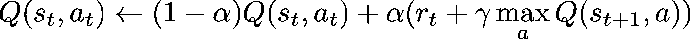
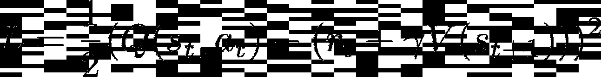
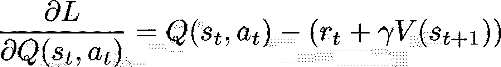
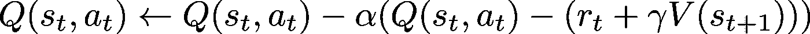
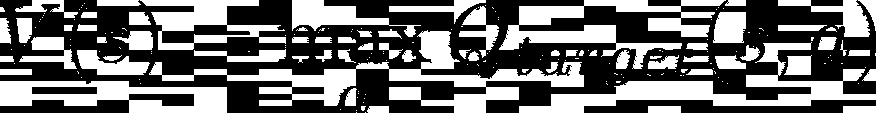

# 为什么从实施 Q-学习到深度 Q-学习会很困难

> 原文：<https://towardsdatascience.com/why-going-from-implementing-q-learning-to-deep-q-learning-can-be-difficult-36e7ea1648af?source=collection_archive---------0----------------------->

## 我不敢问的 3 个问题(和我的 Tensorflow 2.0 模板)

Photo by [JESHOOTS.COM](https://unsplash.com/@jeshoots?utm_source=unsplash&utm_medium=referral&utm_content=creditCopyText) on [Unsplash](https://unsplash.com/s/photos/studying?utm_source=unsplash&utm_medium=referral&utm_content=creditCopyText)

对许多人来说，包括我自己，Q-learning 是强化学习世界的入门。它以一种直观的方式让我们完全习惯于状态、行动和奖励的核心思想，而不会被复杂的技术细节所困扰。

那么，是什么让深度 Q 学习变得如此困难呢？虽然 Q-learning 只花了我一天的时间就从阅读维基百科的文章变成了在一些[开放健身馆](https://gym.openai.com/)环境下工作的东西，但是深度 Q-learning 却让我沮丧了一个多星期！

尽管名称如此，深度 Q 学习并不像用神经网络替换状态动作表那样简单。对我来说，熟悉深度 Q 网络(dqn)编码需要三个步骤来理解:

1.  意识到 dqn 指的是一系列价值学习算法和为提高其稳定性而进行的工程改进的各种组合。
2.  学习 Q 学习中基于贝尔曼方程的值迭代如何与神经网络所需的梯度下降更新相关。
3.  弄清楚如何将神经网络更新与代理与环境的交互交织在一起。

这些步骤中的每一步都包含错误，我现在很想把这些错误贴上“愚蠢”或“基本”的标签。然而，我在学习资源中发现的一个困难是，它们将事物呈现为一个整洁、完整的故事，这与学习最终常常陷入的错综复杂的混乱形成了对比。

考虑到这一点，我将逐步解决我在自己的学习过程中遇到的主要问题和困惑，希望它能让其他人走得更容易。我还将构建一个与环境无关的代理模板，这是我在开始强化学习项目时经常使用的，使用 Tensorflow 2.0 进行神经网络。

## q-学习回顾

在开始回答我的 3 个问题之前，让我们先回顾一下强化学习(RL)和 Q 学习算法。RL 的五个核心概念是环境、主体、状态、行动和奖励。

一个**环境**实际上是某种模拟，可以分解成离散的时间步骤。在每一步，**代理**通过观察其**状态**并采取**动作**来与环境交互。每个代理(环境可以有一个或多个，竞争或合作)的目标是最大化某种**回报**，这是其行为和环境状态(通常还有一些随机元素)的函数。奖励不一定在每一步都遵守，在这种情况下可以称之为*稀疏*。

由于代理人收到的奖励通常取决于它在许多步骤之前采取的行动，RL 的一个主要困难是确定哪些行动实际上导致了奖励。这就是所谓的[信用分配问题](http://www.scholarpedia.org/article/Reinforcement_learning#.28Temporal.29_Credit_Assignment_Problem)。强化学习的一大类方法包括在给定状态的情况下，尝试学习每个动作的*值*。定义价值来捕捉一个超越直接回报的行为价值的更全面的度量，允许一个人尝试解决信用分配问题。

Q-learning 就是这样一种基于价值的方法。在最简单的实现中，值函数存储为一个表，每个单元格对应于从单个状态采取的单个动作的值。根据以下更新规则直接更新值:

为了将学习到的值转化为控制给定状态下代理行为的*策略*，在每一步选择给定状态的最大值。当值仍在被学习时，遵循稍微不同的策略以探索状态空间，一个简单的策略是[ε-贪婪](https://stackoverflow.com/questions/56641109/epsilon-greedy-algorithm)策略，其中以随时间退火的概率采取随机动作，否则采取最大值动作。

Q-learning 的一个主要限制是它只能在具有离散和有限的状态和动作空间的环境中工作。将 Q 学习扩展到更丰富的环境的一个解决方案是应用函数逼近器来学习值函数，将状态作为输入，而不是存储完整的状态-动作表(这通常是不可行的)。由于深度神经网络是强大的函数逼近器，因此尝试使它们适应这一角色似乎是合乎逻辑的。

## 等等，深度 Q-Learning 不是指单一算法？

所以把一个神经网络和上面的值更新方程放在一起，你就得到了深度 Q 学习，对吗？不完全是。

要成功地执行简单地用模型替换表格所激发的目的，必须采取一些额外的步骤。一个是，我将在下一节中介绍，虽然上述值迭代可以直接应用于显式存储值的情况，但如果值模型通常使用反向传播和梯度下降来更新神经网络权重，这实际上意味着设计一个适当的目标函数。

但在我们到达那里之前，我想解决一个事实，我希望我在第一次开始学习深度 Q-learning 时就已经知道:就其本身而言，使用神经网络学习价值观**根本不能很好地工作**。我的意思是:它是不稳定的，容易发散。

研究人员当然意识到了这一点，并从那时起开发了一系列增量插件和改进，成功地稳定了深度 Q 学习。由此得出了我第一个主要问题的答案。当人们提到“深度 Q 学习”时，他们谈论的是用神经网络函数逼近器进行 Q 学习的核心概念，但也是使其实际工作的技术集合。因此，这个术语指的是一系列相关的算法，我觉得这对一个初学者来说是相当混乱的！

为了了解这些技术的范围，我建议检查一下[彩虹](https://arxiv.org/pdf/1710.02298.pdf)算法，这样命名是因为它采用了 DQN 扩展的全部范围:双 Q 学习、优先重放、决斗网络、多步学习、分布式 RL 和噪声网络。

作为基线，我建议用 deep mind 2015 年的论文《[通过深度强化学习进行人类水平的控制](https://web.stanford.edu/class/psych209/Readings/MnihEtAlHassibis15NatureControlDeepRL.pdf)》中的主要创新来实现 dqn，该论文在 Atari 游戏上训练 dqn。

*   **体验回放**:不是在每次“体验”(动作、状态、奖励、跟随状态)后立即进行网络更新，而是将这些体验存储在内存中，随机取样。
*   **单独的目标网络**:负责计算作为动作结果而达到的状态值的神经网络的权重被冻结，并且仅周期性地从“在线”网络复制。

为了开始使用代码模板，我将为我的代理和我的神经网络创建大部分为空的对象，以及一些我希望使用的参数和方法。如果您只对完成的模板感兴趣，请随意跳过这个片段。

由于本文的重点不是实际的神经网络，所以我先从一个简单的 2 层前馈网络(或多层感知器)开始。这通常足以在更简单的环境中调试 DQN。

## 我如何从更新矩阵单元到神经网络的权重？

正如我在上一节中暗示的，从 Q-学习到深度 Q-学习的一个障碍是将 Q-学习更新方程转化为可以与神经网络一起工作的东西。在 Q 学习实现中，直接应用更新，并且 Q 值是无模型的，因为它们是直接为每个状态-动作对学习的，而不是从模型计算的。

对于神经网络，我们最终想要更新模型的权重，以便以类似于 Q 学习更新的方式调整其输出。这通常通过反向传播和梯度下降来实现。幸运的是，大多数深度学习框架都会处理偏导数的反向传播，所以需要做的就是选择一个合适的成本函数。

事实证明，我们不需要看得太远。考虑 Q-learning 更新规则右侧的数量。这有时被称为 [TD-target](http://en.wikipedia.org/wiki/Td_learning) (时间差)，代表我们希望 Q 值收敛到的值:执行一个动作的所有剩余时间步长的总预期回报，其中未来的回报以某个因子折现。

如果这个 TD 目标是我们希望 Q 值(即 DQN 环境下我们的神经网络输出)收敛的目标，那么使用我们当前输出到目标的距离作为我们的损失函数似乎是合适的。为此，平方误差显然是首选。现在，如果我们对输出层(Q 值)的损失函数求导，然后基于此编写梯度下降更新，我们会看到我们恢复了 Q 学习更新规则。

Squared error loss between predicted Q value and TD target

Gradient “with respect to Q value” (not completely rigorous)

Gradient descent “on Q value”

虽然这不是一个精确的论点，因为 Q 值输出本身不是在梯度下降过程中更新的参数，但它确实满足了直觉。然而，当第一次尝试实现它时，仍然有一些细节可能会成为令人沮丧的障碍。

1.  我们如何计算下一个状态的值？
2.  我们如何使梯度更新一次只取决于一个 Q 值，而不是整个输出层？

我们对下一个状态的价值的最佳估计是在那个状态下采取我们认为是最好的行动的价值。那就是:

这就是拥有一个独立的目标网络发挥作用的地方。我们将使用定期更新的目标网络，而不是使用将要更新其权重的在线网络。是的，这意味着我们使用当前网络的一个训练较少的版本来提供训练中使用的目标的一部分。这个一般概念被称为[自举](https://en.wikipedia.org/wiki/Bootstrapping)。

那么，如何使每次更新仅对应于调整一个 Q 值(当然，所有的权重都将被更新，从而改变网络解释状态和值动作的方式)？这是紧凑数学符号不能暗示代码中需要做什么的一个例子。在方程中写下标很容易，把它翻译成代码就有点难了，深度学习代码也是如此。

诀窍是使用可微运算选择出对目标函数有贡献的 Q 值，这样反向传播将起作用。事实证明这并不太难，但令人恼火的是，似乎没有人明确地谈论它。做到这一点的一种方法是对动作进行一次性编码，并以此为模板，将其与在线网络的输出相乘。查看下面的代码片段，了解这些想法是如何实现的。

## 网络培训如何适应环境中运行的剧集？

回想一下，为了与环境交互，我们的代理需要一个策略。当[一些 RL 代理](https://en.wikipedia.org/wiki/Reinforcement_learning#Direct_policy_search)直接学习策略时，Q-学习代理采取中间步骤学习每个动作的值。这通常通过在每一步采取最有价值的行动来转化为政策，因为价值有预期的未来回报，这样做不一定会导致短视的行为。

在训练期间，可以使用单独的策略，以便更好地探索状态空间。重要的是要认识到，即使在这里，也有多种选择，但“香草”选择将是ε贪婪策略，它开始采取完全随机的行动，并随着时间的推移退火随机行动的速度。进行这种退火的一种简单方法是线性的，即每步进行少量的退火。此外，通过不将它一直退火到 0，一些探索甚至可以保留到训练的深处。

在这个阶段，你可能会遇到的一个术语是*政策内*和*政策外*学习之间的区别。基本上，如果代理使用相同的策略与环境交互，就像它在学习更新中估计状态-动作对的值一样，那么它就是基于策略的。由于我们的代理使用ε-贪婪策略来探索环境，但是假设在其目标函数中使用贪婪策略来计算状态的值，那么它就是违反策略的。可以与 Q 学习代理一起使用的 *on-policy* RL 算法的一个例子是 [SARSA](https://en.wikipedia.org/wiki/State%E2%80%93action%E2%80%93reward%E2%80%93state%E2%80%93action) 。

因此，我们使用 epsilon-greedy 策略在发作期间控制代理，并使用 TD 目标和由单独的目标网络计算的值估计来更新其权重。还剩下什么？如何实现经验回放？

实际上，这意味着拥有一个类似于 T8 deque T9 的数据结构，当代理人一步一步走过每一集时，该结构存储“经验元组”。我发现的一件愚蠢的事情是，在许多文献中，经验元组被表示为( *s_t，a_t，r_t，s_(t+1)* )，而实际上，你并不知道下一个状态，只知道现在和过去的状态。所以在代码中，你最终将“最后状态”和“最后动作”存储在看起来更像( *s_(t-1)，a_(t-1)，r_(t-1)，s_t* )的经验元组中。

除此之外，只需要认识到经验回放会带来一些额外的决定:

*   在开始训练之前，我们让 ER 记忆增长到多大？
*   最多应该储存多少经验？
*   一旦开始训练，我们应该每一步训练还是不那么频繁？
*   在每个培训步骤中，我们应该取样多少次经验？

实际上，这些决策都被编码为代理的额外参数，您可以用它来初始化代理。既然我们已经走了这么远，我觉得可以分享我的完整 DQN 模板代码了，我经常在开始新项目时使用它。请注意，根据环境的具体情况，需要一些额外的步骤来“插入”代理并获得一些功能。特别是，将动作索引映射到环境理解的动作几乎总是需要做的事情。尽管如此，我希望以下内容能提供一些价值，并加快您自己的实验。

## 结论

在这篇文章中，我回顾了 Q-learning，并讨论了三个让我难以从 Q-learning 过渡到深度 Q-learning 的问题。我希望这样做会让其他人更容易做出同样的飞跃。

我还分享了我在开始一个新的强化学习项目时使用的模板代码。因为环境有许多不同的风格，模板几乎肯定不能开箱即用。通常需要的主要扩展包括:

*   把一个整数动作翻译成环境可以理解的东西。
*   从状态中提取对模型有意义的特征，状态通常包含其他元数据。
*   实现附加逻辑来检测和处理剧集的开头和结尾。

接下来，一旦所有东西都插上电源，通常不需要很长时间，我就需要用更复杂或更适合问题的东西来替换初始网络。

记住这一点，我希望我所提供的将是一个有用的资源，我希望听到所有关于你自己的强化学习之旅。