# 为什么梯度下降是不够的:神经网络优化算法综合介绍

> 原文：<https://towardsdatascience.com/why-gradient-descent-isnt-enough-a-comprehensive-introduction-to-optimization-algorithms-in-59670fd5c096?source=collection_archive---------10----------------------->

神经网络的目标是最小化 ***、*** 的损失，以产生更好更准确的结果 ***。*** 为了尽量减少损失，我们需要更新内部学习参数(特别是****偏差*** )。这些参数根据某个*更新规则/功能*进行更新。通常，我们认为 ***渐变下降*** 是一种更新规则。现在出现了两种类型的问题。*

*   ***更新应该使用多少/哪些数据？***
*   *应该使用什么更新规则？*

*本帖在更好优化的背景下，以最简单的方式围绕这两个问题和答案展开。在这篇文章中，我将展示优化算法的直观形象，它们的不同类型和变体。*

> ***补充说明***
> 
> *本文假设读者对神经网络的概念、前向和后向传播、权重初始化、激活函数等有基本的了解。如果你不熟悉，我建议你关注我的其他关于这些话题的文章。*
> 
> *[神经网络中的前向传播——简化的数学和代码版本](/forward-propagation-in-neural-networks-simplified-math-and-code-version-bbcfef6f9250)*
> 
> *[为什么更好的权重初始化在神经网络中很重要？](/why-better-weight-initialization-is-important-in-neural-networks-ff9acf01026d)*
> 
> *[分析神经网络中不同类型的激活函数——选择哪一种？](/analyzing-different-types-of-activation-functions-in-neural-networks-which-one-to-prefer-e11649256209)*

# *优化算法*

***优化算法**试图通过遵循某种更新规则来最小化**损失(成本)**。损失是一个*数学*函数，表示*预测值*和*实际值*之间的差异。损耗取决于实际值，该值是借助于 ***学习参数(权重*** 和 ***偏差)*** 和*输入*得出的。因此，学习*参数*对于更好的训练和产生准确的结果非常重要。为了找出这些参数的最佳值，我们需要不断地*更新*它们。为此，应该有一些更新规则。所以我们使用各种 ***优化算法*** 遵循一定的更新规则，每个*优化算法*都有不同的方法来计算、更新和找出模型参数的最优值。*

# *优化算法的类型*

*基于我们的第一个问题**“一次更新应该使用多少数据”**优化算法可以分为****小批量梯度下降*** 和 ***随机梯度下降。*****

**其实基本算法就是*梯度下降。小批量梯度下降*和*随机梯度下降* 是基于所取数据量的两种不同策略。这两个也被称为*梯度下降的变种。***

# ***梯度下降***

*****梯度下降*** 是最常用和流行的 ***迭代*** 机器学习算法。它也是其他优化算法的基础。*梯度下降*有以下*更新规则*用于*重量*参数**

**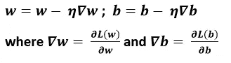**

**由于在用于更新参数的*反向传播*期间，计算损耗 w.r.t. a 参数的*导数。该*导数*可以依赖于多个变量，因此使用 ***乘法链规则*** 进行计算。为此，需要一个 ***梯度*** 。 ***梯度*** 是表示增加方向的向量。***

***对于梯度计算，我们需要计算损耗对*参数*的*导数，并在*梯度的反方向更新*参数*。*****

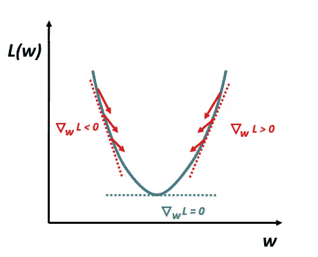

上面的理想凸曲线图像显示了与*梯度*方向相反的*权重更新*。因为我们可以注意到*权重*的值太大和太小，所以*损失*最大，我们的目标是*最小化*损失*T21，所以*权重*被更新。如果*坡度*为负，则 ***向正侧下降*** (下潜)，如果*坡度*为正，则向负侧下降，直到找到*坡度*的最小值。*

Python 中使用具有 *sigmoid* 激活函数的单个神经元进行 ***梯度下降*** 的算法

```
def sigmoid(w,b,x):
    return 1.0 / (1.0 + np.exp(-w*x + b))def grad_w(w,b,x,y):
    fx = sigmoid(w,b,x)
    return (fx — y) * fx * (1-fx) * xdef grad_b(w,b,x,y):
    fx = sigmoid(w,b,x)
    return (fx — y) * fx * (1-fx)def do_gradient_descent():
    w,b,eta = -2, -2, 1.0
    max_epochs = 1000
    for i in range(max_epochs):
        dw,db = 0,0
        for x,y in zip(X,Y):
            dw += grad_w(w,b,x,y)
            db += grad_b(w,b,x,y)
        w = w — eta * dw
        b = b — eta * db
```

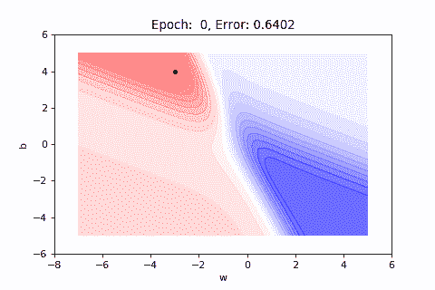

上面的*动画*表现了算法在 1000 个*纪元*后如何收敛。该*动画*中使用的误差面与输入一致。这个误差表面在 2D 空间中是动画的。对于 2D，使用*等高线图*，其中等高线表示第三维，即 ***误差*** 。红色区域代表高误差值，红色区域的强度越大，误差越大。类似地，蓝色区域表示误差的低值，蓝色区域的强度越小，误差越小。

***标准梯度下降*** 仅在每个历元后更新*参数*，即在计算所有观测值的*导数*后，它更新*参数*。这种现象可能会导致下面的 ***注意事项*** 。

*   对于非常大的数据集来说，这可能非常慢，因为每个*时期*只有一次*更新*，所以大量的 ***时期*** 需要有大量的*更新*。
*   对于大型数据集，数据的矢量化不适合 ***内存*** 。
*   对于*非凸*曲面，可能只找到 ***局部最小值。***

现在让我们看看 ***不同的渐变下降*** 如何应对这些挑战。

# 随机梯度下降

***随机梯度下降*** 为*每次观测*更新*参数*，这导致更多的更新次数*。因此，这是一种更快的方法，有助于更快地做出决策。*

Python 中使用具有 *sigmoid* 激活函数的单个神经元的*随机* *梯度下降*算法

```
def do_stochastic_gradient_descent():
    w,b,eta = -2, -2, 1.0
    max_epochs = 1000
    for i in range(max_epochs):
        dw,db = 0,0
        for x,y in zip(X,Y):
            dw += grad_w(w,b,x,y)
            db += grad_b(w,b,x,y)
            w = w — eta * dw
            b = b — eta * db
```


***在这个动画中可以注意到不同方向的*** 更快的更新。这里，大量振荡发生，导致*用 ***更高的方差*** 更新*，即****更新*** 。这些嘈杂的更新帮助寻找 ***新的*** 和 ***更好的局部最小值*** 。*

***新币的缺点***

*   *因为 ***贪婪接近*** ，它只近似*的渐变。**
*   **由于 ***的频繁波动*** ，它会将*保持在期望的 ***精确最小值*** 附近。***

**现在让我们看看梯度下降的另一种 ***变体*** 如何应对这些挑战。**

# **小批量梯度下降**

*****GD*** 的另一个变体解决了*SGD 的问题，它位于 ***GD*** 和 ***SGD 之间。*** ***小批量梯度下降*** 为有限数量的观察值更新参数。这些观察结果一起被称为具有固定大小的**批次**。**批量大小**选择为 64 的倍数，例如 64、128、256 等。通过*小批量 GD* ，一个时期内会发生更多更新。***

**Python 中使用具有 *sigmoid* 激活函数的单个神经元的*小批量* *梯度下降*算法**

```
**def do_mini_batch_gradient_descent():
    w,b,eta = -2, -2, 1.0
    max_epochs = 1000
    mini_batch_size = 3
    num_of_points_seen = 0
    for i in range(max_epochs):
        dw,db = 0,0
        for x,y in zip(X,Y):
            dw += grad_w(w,b,x,y)
            db += grad_b(w,b,x,y)
            num_of_points_seen += 1
        if num_of_points_seen % mini_batch_size == 0:
            w = w — eta * dw
            b = b — eta * db**
```

****

**我们可以看到，与 ***SGD*** 相比， ***小批量*** 中的振荡更少。**

****基本符号****

****1 个时期** =整个数据的一次通过**

****1 步** =一次参数更新**

****N** =数据点数**

**B =小批量**

**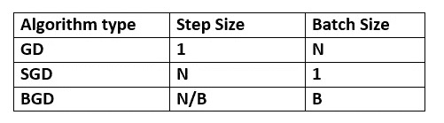**

****小批量 GD 的优势****

*   **与 SGD 相比，更新的噪音更小，从而导致更好的收敛。**
*   **与 GD 相比，单个历元中的更新次数较多，因此大型数据集所需的历元数量较少。**
*   **非常适合处理器内存，使计算速度更快。**

# **更好的优化 w.r.t .梯度下降**

*****误差面*** 包含*较不严谨*以及*较不严谨*的区域。在*反向传播*期间，斜率*较大的区域*的参数更新较多，而斜率*较小的区域*的参数更新较少。参数变化越大，损耗变化越大，同样，参数变化越小，损耗变化越小。**

**如果参数初始化位于*缓坡*区域，则需要大量的*时期*来浏览这些区域。这是因为*坡度*在*缓坡*区域非常小。于是它随着 ***小婴儿的脚步*** 在*平缓的*区域移动。**

**考虑在如下所示的平坦表面中初始化的情况，其中使用了*并且当*在 ***平坦表面*** 中时 ***误差*** 不减小。****

****

**即使在大量的*历元*之后，例如 10000，算法也不会收敛*。***

***由于这个问题，*收敛*不容易实现，学习需要太多时间。***

**为了克服这个问题 ***使用了基于动量的梯度下降*** 。**

# *****基于动量的梯度下降*****

**考虑这样一种情况，为了到达你想要的目的地，你不断地被要求沿着同一个方向前进，一旦你确信你正在沿着正确的方向前进，那么你就开始迈出 ***更大的步伐*** 并且你在同一个方向上不断获得*的动力。***

***与此类似，如果 ***坡度*** 长期处于 ***平面*** 中，那么与其采取恒定的步数，不如采取更大的步数 并保持 ***动量*** 继续。这种方法被称为 ***基于动量的梯度下降*** 。***

****权重参数基于动量的梯度下降更新规则****

**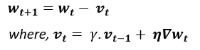**

*****伽马参数(* γ)** 是动量项，表示你想要多大的加速度。这里随着 ***电流梯度(* η∇w(t)，**移动也根据历史**(γv(t1))**进行，因此*更新变大，这导致更快的移动和更快的*。****

*****v(t)** 是 ***指数衰减加权和*** ，随着 **t** 的增加**γV(t1)**变得越来越小，即该等式包含小幅度的更远更新和大幅度的最近更新。***

****基于动量的梯度下降**在 Python 中用于 sigmoid 神经元**

```
**def do_momentum_based_gradient_descent():
    w,b,eta,max_epochs = -2, -2, 1.0, 1000
    v_w, v_b = 0, 0
    for i in range(max_epochs):
        dw,db = 0,0
        for x,y in zip(X,Y):
            dw += grad_w(w,b,x,y)
            db += grad_b(w,b,x,y)
        v_w = gamma * v_w + eta * dw
        v_b = gamma * v_b + eta * db
        w = w — v_w
        b = b — v_b**
```

****

**此算法 ***在 ***一致渐变*** 方向添加动量*** ，如果*在 ***不同方向*** 则 ***取消动量*** 。***

****基于动量的梯度下降问题****

**在导致精确的 ***期望最小值*** 的 ***谷*** 中，有大量的*振荡*使用*基于动量的 GD* 。因为它 ***越过了******的最小值与*** 的较大步长，并且需要一个 ***的掉头*** 但是又一次越过，所以这个过程重复进行。这意味着用更大的步伐移动并不总是好的。**

**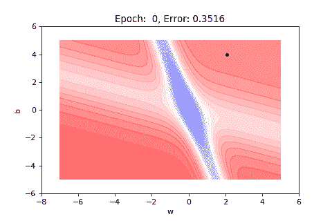**

*   *****以动量为基础的 GD*** *振荡*为一个 ***大次数*** 进出 ***小次数*** 。**

**为了克服这个问题 ***内斯特罗夫加速梯度下降*** 被使用。**

# **内斯特罗夫加速梯度下降**

**在*的动量基础上*的 GD 随着*的梯度*向山谷(极小区域)进发，这使得很多 ***【振荡】*** 在它之前*汇聚。这个问题最初是由一位名叫尤里·内斯特罗夫的研究者发现并回应的。***

**他建议，先通过 ***【先前动量】*** 使*运动*，然后计算此时的**更新**参数*。换句话说，在直接进行*更新*之前，它首先通过用*先前的动量*移动来向前看，然后它发现*梯度*应该是什么。***

**这种*向前看的*帮助 ***唠叨*** 比 ***基于动力的 GD 更快地完成它的工作(寻找最小值)。*** 因此 ***振荡*** 与基于 ***动量的【GD】***相比*更少，并且错过 ***最小值的机会也更少。******

****用于*重量*参数的 NAG 更新规则****

**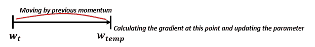****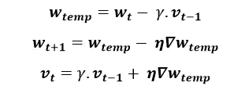**

****Python 中针对 sigmoid 神经元的 NAG** 算法**

```
**def do_nag_gradient_descent():
    w,b,eta,max_epochs = -2, -2, 1.0, 1000
    v_w, v_b, gamma = 0, 0, 0.9
    for i in range(max_epochs):
        dw,db = 0,0
        #compute the look ahead value
        w = w — gamma * v_w
        b = b — gamma * v_b

       for x,y in zip(X,Y):
           #compute the derivatives using look ahead value
           dw += grad_w(w,b,x,y)
           db += grad_b(w,b,x,y)
       #Now move further in the opposite direction of that gradient
       w = w — eta * dw
       b = b — eta * db

      #Now update the previous momentum
      v_w = gamma * v_w + eta * dw
      v_b = gamma * v_b + eta * db**
```

**这里 v_w 和 v_b 分别指 **v(t)** 和 **v(b)** 。**

****

# **适应性学习率的概念**

**根据更新规则**

**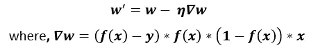**

***更新*正比于 ***渐变*** ( **∇w).**变小*渐变*变小*更新* 而*渐变*与 ***输入*** 成正比。因此*更新*也依赖于*输入*。**

****对自适应学习率的需求****

**对于实时数据集，大多数特征是 ***稀疏*** 的，即具有零值。因此，在大多数情况下，相应的*梯度*为零，因此参数*更新*也为零。为了引起这个问题的共鸣，这些更新应该被提升也就是一个 ***高学习率*** 对于**的特性。因此*的学习率*应该是*对于相当*稀疏* 的数据。*****

**换句话说，如果我们处理的是 ***稀疏特征*** 那么*的学习率*应该是*高*反之对于***密集特征*** *学习率*应该是*低*。**

*****Adagrad、RMSProp、Adam*** 算法都是基于*自适应学习率*的概念。**

# **阿达格拉德**

**它采用了基于特征的 ***【稀疏度】*** 的*学习率(* **η)** 。因此具有**小*更新(稀疏特征)*** 的参数具有高*学习率*，而具有**大*更新(密集特征)*** 的参数具有低*学习率*。因此 **adagrad** 对每个*参数使用不同的*学习率*。***

***Adagrad** 对*重量*参数的更新规则*

*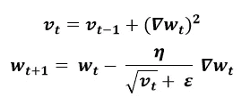*

***v(t)** 累加梯度的平方和。 **∇w(t)** 的平方忽略了梯度的符号。 **v(t)** 表示到时间 **t** 的累计坡度。***ε***中的分母避免了 ***被零除的几率*** 。*

*因此，如果对于一个*参数*来说 **v(t)** 为**低**(由于更少的*更新*到时间 **t** ，那么有效的*学习率*将为**高**，并且如果对于一个*参数**来说**为高**

*用于 sigmoid 神经元的 Python 中的 Adagrad 算法*

```
*def do_adagrad():
    w,b,eta,max_epochs = -2, -2, 1.0, 1000
    v_w, v_b = 0, 0
    for i in range(max_epochs):
        dw,db = 0,0
        for x,y in zip(X,Y):
            dw += grad_w(w,b,x,y)
            db += grad_b(w,b,x,y)
        v_w += dw**2
        v_b += db**2
        self.w -= (eta / np.sqrt(v_w) + eps) * dw
        self.b -= (eta / np.sqrt(v_b) + eps) * db*
```

*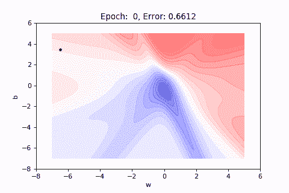*

***Adagrad 的缺点***

*   *学习率急剧下降*

*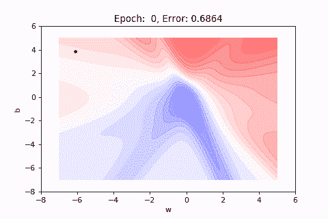*

*对于*密集特征*对应的*参数*(尤其是*偏差*)，经过几次*更新*后，由于*平方梯度*的累积，分母快速增长，导致*学习速率* ***快速衰减*** 。因此，在有限数量的*更新*之后，算法拒绝学习，并且*收敛缓慢*，即使我们运行它大量的*时期*。*梯度*达到不良最小值(接近期望的*最小值)*，但不在精确的*最小值*。因此 **adagrad** 导致*偏差*参数的学习率下降。*

# *RMSProp*

****RMSProp*** 克服了*的 ***衰减学习率*** 问题，防止了**【v(t)*中的快速增长。*****

*它不是从一开始就累积*平方梯度*，而是在某个部分(权重)累积*先前梯度*，这阻止了 **v(t)** 的快速增长，并且由于这个原因，算法保持学习并试图*收敛*。*

***RMSProp** 更新*重量*参数的规则*

*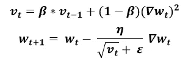*

*这里的 **v(t)** 是前面所有平方梯度的 ***指数衰减平均值*** 。***β***参数值被设置为与动量项相似的值。直到时间 t 的移动平均值 **v(t)** 取决于 ***加权的先前平均梯度*** 和 ***当前梯度*** 。 **v(t)** 保持(**)**一个固定的窗口时间。*

***用于 sigmoid 神经元的 Python 中的 Adagrad** 算法*

```
*def do_RMSProp():
    w,b,eta,max_epochs = -2, -2, 1.0, 1000
    v_w, v_b = 0, 0
    for i in range(max_epochs):
        dw,db = 0,0
        for x,y in zip(X,Y):
            dw += grad_w(w,b,x,y)
            db += grad_b(w,b,x,y)
        v_w = beta * v_w + (1 — beta) * dw**2
        v_b = beta * v_b + (1 — beta) * db**2
        self.w -= (eta / np.sqrt(v_w) + eps) * dw
        self.b -= (eta / np.sqrt(v_b) + eps) * db*
```

*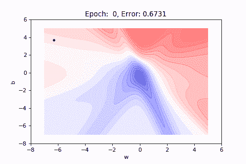*

*【RMSProp 的问题*

*   *具有高学习率或大梯度的大量振荡*

**

*到目前为止在 ***Adagrad，RMSProp*** 中我们在计算不同的 ***学习速率*** 对于不同的参数，我们可以有不同的 ***动量*** 对于不同的参数。 ***亚当*** 算法引入了 ***自适应动量*** 连同 ***自适应学习率*** 。*

# *圣经》和《古兰经》传统中）亚当（人类第一人的名字*

***自适应矩估计(Adam)** 计算*****先前梯度的指数衰减平均值 m* ***(t)*** 以及一个 ***自适应学习率。亚当*** 是基于 ***动量的 GD*** 和 ***RMSProp 的组合形式。********

*****在 ***基于动量的 GD 中，*** *先前梯度(历史)*用于计算当前梯度，而在 RMSProp *先前梯度(历史)*用于根据特征*调整*学习率*。因此* ***亚当*** 处理*自适应学习速率*和*自适应动量*其中 ***RMSProp*** 确保 **v(t)** 不会快速增长以避免学习速率和 **m(t)** 从 ***动量衰减的机会********

********亚当*** 权重参数更新规则*****

*****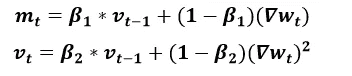*****

*****这里的 ***m(t)*** 和***【v(t)***都是从第一时刻得到的 ***的值。********

*******Adam** 使用**偏差修正值(*无中心方差)*** 梯度用于*更新规则*，这些值是通过二阶矩 ***获得的。********

*****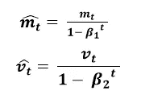*****

*****最终的*更新规则*如下所示*****

*****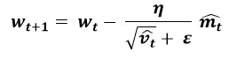*****

*******Python 中针对 sigmoid 神经元的 Adam** 算法*****

```
*****def do_Adam():
    w,b,eta,max_epochs = -2, -2, 1.0, 1000
    v_w, v_b = 0, 0
    m_w, m_b = 0, 0
    num_updates = 0
    for i in range(epochs):
        dw, db = 0, 0
        for x, y in zip(X, Y):
            dw = self.grad_w(x, y)
            db = self.grad_b(x, y)
        num_updates += 1
        m_w = beta1 * m_w + (1-beta1) * dw
        m_b = beta1 * m_b + (1-beta1) * db
        v_w = beta2 * v_w + (1-beta2) * dw**2
        v_b = beta2 * v_b + (1-beta2) * db**2
        #m_w_c, m_b_c, v_w_c and v_b_c for bias correction   
        m_w_c = m_w / (1 — np.power(beta1, num_updates))
        m_b_c = m_b / (1 — np.power(beta1, num_updates))
        v_w_c = v_w / (1 — np.power(beta2, num_updates))
        v_b_c = v_b / (1 — np.power(beta2, num_updates))
        self.w -= (eta / np.sqrt(v_w_c) + eps) * m_w_c
        self.b -= (eta / np.sqrt(v_b_c) + eps) * m_b_c*****
```

*****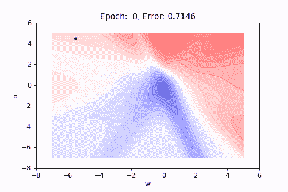*****

*****所以在 ***中亚当*** 不同于 ***RMSProp*** 振荡*更少*并且它更确定地向正确的方向移动，这导致 ***更快*** ***收敛*** 和 ***更好的优化*** 。*****

## *****结束注释*****

*****在本文中，我讨论了不同类型的优化算法以及使用每种算法时可能遇到的常见问题。一般来说， **Adam** 带**小批量**是深度神经网络训练的首选。*****