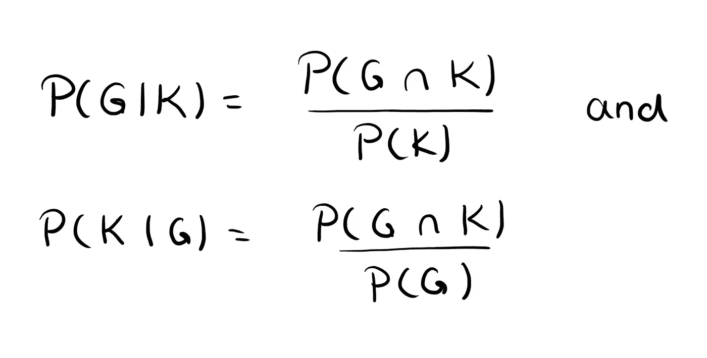
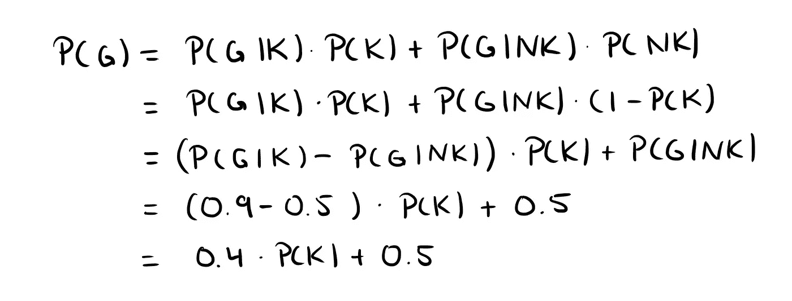
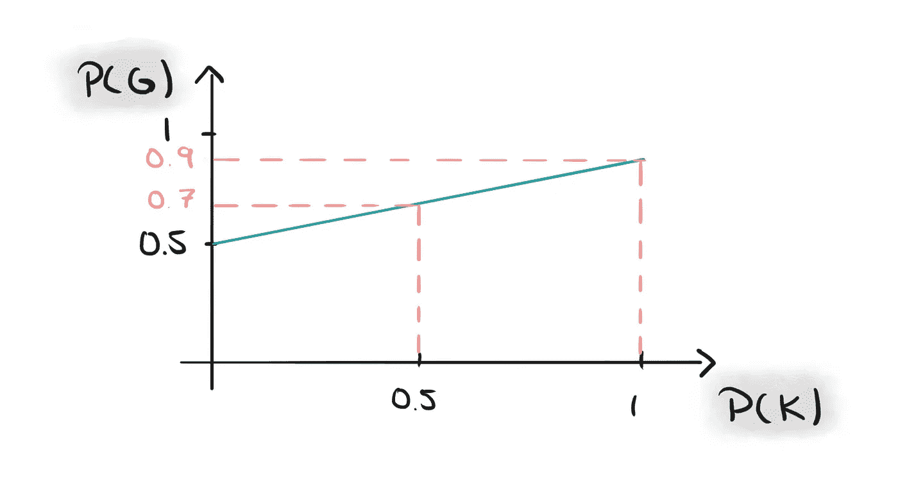

# 为什么我相信因果报应。

> 原文：<https://towardsdatascience.com/why-i-believe-in-karma-edf307b806f4?source=collection_archive---------13----------------------->

## 为什么你也应该！一个数学家的视角。

我相信因果报应。你也应该这样。为什么？不是因为我有灵性或者类似的东西。我认为你应该相信因果报应，因为因果报应是一个数字游戏。这是一个简单的概率现象。

Photo by [Holger Link](https://unsplash.com/@photoholgic?utm_source=medium&utm_medium=referral) on [Unsplash](https://unsplash.com?utm_source=medium&utm_medium=referral)

让我们采用概率方法，并使其在数学上更加严格。

一个随机的人可能相信因果报应( *K* )，也可能不相信因果报应( *NK* )。同样，一个随机的人可能会做好事( *G* )，也可能会做坏事( *NG* )。

既然一个人要么相信因果报应，要么不相信因果报应，那么事件 *K* 和 *NK* 的概率加起来就是 1 *。因为我们把行为分为好的或坏的(我知道，那些数学家，…)，事件的概率也加起来是 1。*

如果有人相信因果报应，我认为可以有把握地假设，平均来说，他们做好事的次数比做坏事的次数多。我们用 *P(G|K)* 表示相信因果报应的人做好事的概率，用*P(G | K)*表示不相信因果报应的人做好事的概率。

因此，我们有以下相关概率的事件:

*   一个人相信因果报应的概率: *P(K)*
*   一个人不相信因果报应的概率: *P(NK) = 1-P(K)*
*   好行为的概率: *P(G)* 和
*   不良行为的概率: *P(NG) = 1-P(G)*
*   相信因果报应的人做好事的概率: *P(G|K)*
*   一个不相信因果报应的人做好事的概率: *P(G|NK)*

按我们的假设，相信因果报应的人平均表现更好， *P(G|NK) < P(G|K)* 。

# 我身上发生好事的概率有多大？

给定以上所有的概率(不要担心，我们很快会输入数字使其更清晰)，我们如何计算*P(G)*——一个随机的人做一件好事的概率？

我们可以用“全概率法则”从条件概率中确定这个概率，这个法则直接来自条件概率的定义。

Definition of conditional probabilities.

那么总概率的*定律由下式给出*

Law of Total Probabilities for G and K. It follows from a direct calculation using the definition of conditional probabilities!

现在我们来修正一下 *P(G|K)=0.9* 和 *P(G|NK)=0.5* 。因此，我们可以根据给定的条件概率确定 *P(G)* 和 *P(K)* 如下

我们甚至可以画出最后一个公式的图表，在这里我们可以直接看到 *P(G)* 如何随着 *P(K)* 的变化而变化。在我们的线性方程中， *P( G|NK)* 是 y 轴交点，差 *P(G|K)-P( G|NK)* 是斜率。

# 对此我们该如何解读？

我们来解读一下这个。

想象一下汤姆，一个非常普通的人。他周围都是冷静的人，他们都相信好事会回到他们身边，他们中的大多数人都相信因果报应，即我们为 *K* 选择高概率，例如 *P(K)=0.8* 。

然后还有保罗。保罗的环境和汤姆的有点不同。保罗周围的人更喜欢自私，他们中很少有人相信因果报应，即我们为 *K* 选择低概率，例如 *P(K)=0.2。*

如果我们输入数字会发生什么？

**在汤姆的案例中:**

*P(G) = 0.4*0.8 + 0.5 = 0.82*

汤姆遇到好事的概率是 0.82 或者 82%。

在保罗的例子中:

*P(G) = 0.4*0.2 + 0.5 = 0.58*

保罗遇到好事的概率是 0.58%或 58%。

**一般情况:**

一般来说， *P(K)* 是一个概率，因此它总是取 0 到 1 之间的值。正如我们上面看到的，概率 *P(G)* 是一个线性依赖于 P(K)的函数。所以对于给定的概率*P(G | K)**P(G | NK)】来说， *P(G)* 总是取 0.4 (if *P(K)=0* )到 0.9 (if *P(K)=1* )之间的值。*我们在上图中也能看到这一点。

看到了吗？有区别。让你周围的人相信好的行为会——至少平均而言——带来更多好的行为并回到你身边是有意义的。因果报应是一个数字游戏，我选择相信它。

你甚至不需要数学来理解这一点。你也可以运用常识。

但是有了数学的支持，这个猜想变得更加美好，你不觉得吗？