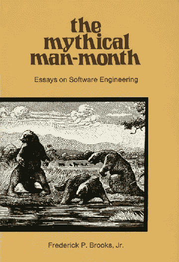

# 为什么我选择 C 进行回溯测试

> 原文：<https://towardsdatascience.com/why-i-chose-c-for-backtesting-a44ab2815cb5?source=collection_archive---------12----------------------->

## 构建日内回溯测试引擎之旅的教训

# 寻找最佳回溯测试方法的旅程

在过去的一年里，我一直在准备一个回溯测试引擎/框架来模拟衍生品市场的日内策略。

这个旅程包括不同的语言，几次迭代，小错误，大错误，大选择，“*合资”*和孤独的行走。从别人那里，我接受了伟大和可怕的建议。

虽然事后看来结果似乎显而易见，但事实是找到正确的方法是一个迭代过程。只是在尝试了很多东西和多次反复*用真实的例子*围绕这个问题之后，事情才变得明朗。

回测/模拟市场量化策略的需求和要求在某种程度上是不同的，而且，以我的拙见，它们与传统上在研究中心和大学进行的科学模拟方法有许多共同的根源。这是真的，至少对于我一直在研究的一系列问题来说是真的(量化交易行业真的很大，我绝对没有资格谈论所有的方法、策略和需求)。

我已经在几篇文章中介绍了这一旅程。从文章来看，最相关的应该是[关于如何存储市场数据的文章](/how-to-store-financial-market-data-for-backtesting-84b95fc016fc)和[关于不同评估语言的文章](/best-language-for-quantitative-finance-here-are-my-findings-f1f458be48b7)。如果你觉得这篇文章有趣，你可能也会觉得那两篇文章有趣。

# c 作为回溯测试语言

评估的语言包括 Python、Fortran、Julia 和 c。Julia 是最后一个评估的语言，我对它的潜力感到非常兴奋，但只要项目向前推进(回溯测试引擎的整个最新版本都是用 Julia 实现的)，我就开始意识到这种语言有一些实际的局限性。

> 朱莉娅是一个有希望的发现。用 Python/Numpy/Pandas 的简单性提供 C 性能的信息非常吸引人。然而，随着我在这个项目上工作的时间越来越长，我很快意识到这种语言的某些方面并不那么直观，对于一个新手程序员来说，匹配 C 语言的性能并不容易。毫无疑问，它是一种杰出的编程语言，但是在深入研究了我正在处理的这类问题之后，我的结论是古老的 C 仍然是最好的选择。

Julia 提供了比 Python 更好的性能，但是开箱即用的速度很难与 C 或 Fortran 相媲美。速度是由编译语言提供的，但也需要某些领域的特定代码风格，这在语言的使用方式上造成了一些奇怪。这不是设计缺陷，而是试图将低级语言性能与高级语言相匹配的局限性，但这给人留下了这样的印象:虽然它不是一种复杂的语言，但需要一些经验才能掌握。可用的调试工具也没有您在更成熟的语言中发现的那些工具那么先进。

# 良好的 IDE 和简单的方法:成功的秘诀

我还发现，在回溯测试/模拟中真正重要的是一组例程/方法/函数和一个公共的数据仓库，以及适当的调试工具。

我再怎么强调拥有简单的方法和足够的调试工具作为在这种项目中取得成功的关键要素的重要性也不为过。这两个因素比实际的语言选择更重要。之所以需要一个合适的 IDE，是因为这些例程往往很小但很密集，而且有很深的算法性，所以很容易出错。如果没有合适的调试工具，项目很容易停滞。

A proper IDE is a key element while developing a backtesting/simulation engine. Methods tend to be concise but dense and highly algorithmic so proper debugging tools are more a need than a nice to have.

对一个合适的 IDE 的需求是我退回到 C 语言的主要原因之一——讽刺的是这是旅程的起点——但是这次是使用微软的工具。

> 有了更好的工具，我的背包里有了更多的经验，对问题和解决方案有了更简单的看法，C 被证明是一个更好的同事。使用 C 的要点是你需要恰当地处理项目的复杂性。如果项目太复杂，用 C 处理起来会很困难，很可能会停滞不前，但是如果你能从一个简化的角度处理问题和解决方案，C 是一个很好的伙伴。

另一个重要的教训是，我们*总是*倾向于把事情复杂化。几天前，一位一直在业内工作的同事在看到我正在进行的回溯测试的一些指标的截图后，与我分享了这一想法，他对引擎的速度和简单性感到惊讶。我意识到最后一次迭代的成功依赖于能够简化整个项目。

复杂性始终是一个问题。一些语言(高级语言)更能承受复杂性。他们只会让项目更加坎坷和漫长。但是在其他语言中——比如 C——复杂性肯定会扼杀任何成功的机会，因为语言的本质使得处理复杂的程序变得不可能。

On complexity of software, a great historical example is the IBM release of their OS/360 trying to work on all the IBM machines series for all kind of problems. The search for an all-purpose OS derived in millions of lines of assembly code and tens of thousands of bugs, requiring constant updates. The experiences of the project are incisively described by Frederick Brooks in his classic book “The mythical man-month”.

在旅程开始时，我们考虑为引擎提供无限的螺栓和按钮，能够处理许多配置。但是，这有意义吗？最后一次迭代非常简单，假设一个有见识的用户将在参数上设置合理的值，并且经常尝试默认值。按照这种方式，一个引擎的基本版本将只有 1000 或 2000 行代码——包括空白和注释——并且向他人解释和扩展将非常容易。如果你需要一些特定的东西，你总是有时间编写一个特定的例程来处理*和*。

使用简单库的方法(我在上一篇文章中已经提到并测试过)仍然是我发现的解决这个问题的最好方法。该库可以是动态链接库(DLL ),这意味着上层语言可以是更高级的语言(更适合于处理模拟的整个工作流程/图形输出)。如果你仍然想在这一层使用 C++，你可以很容易地做到这一点，但如果你觉得使用 Python、Java、C#或 Visual Basic 更好，DLL 将允许你这样做，同时让 C 来做困难的工作。

经过这几个月，我看到了一个模拟引擎，就像我看到了一个操作系统内核暴露的调用方法一样，因为量化交易中的回溯测试引擎与其他任何东西都更相似。

# 外卖

这种观点是主观的，但我真诚地认为这仍然是一种明智的意见。这段经历包括良好的编程背景、三年的交易策略研究和一整年的编码和测试解决方案。虽然一个经验丰富的行业专家肯定会有更多的经验，但至少要达到一些有效的点仍然需要一定量的有价值的努力。

我也总是试图在为数不多的机会中，与在这个行业有经验的人交谈，以收集尽可能多的知识。在我看来，这极大地推动了问题的解决。我认为，如果没有这些小的投入，我仍然会从错误的角度处理问题。

还值得一提的是，方法在很大程度上取决于需求。处理日常数据和为 HFT 制定三级市场数据是不一样的，需求和解决方案是不同的。

既然已经做出了适当的免责声明，我们可以回顾一下要点:

1.  不干涉具有回溯测试功能的图表解决方案(Metatrader/Pro Real Time/…)。正如一位负责量化基金的同事曾经告诉我的那样:*业内没人用*。现在我清楚地明白了为什么。
2.  专用的回溯测试/模拟软件包(如 Amibroker)可能会加快您处理问题的速度，但它们执行模拟的方式过于狭窄，并且中等复杂性策略的学习曲线很陡。它们只是比绘制解决方案更好的工具。站在他们这边，我也会说，量化领域也有认真的人在用，但据我所知，他们一般都是用日常数据做的。我个人的观点是:也不要碰这些，尤其是如果你想测试更奇特的策略或者当天交易。
3.  开发定制的大型通用平台/框架。这是行不通的，它很耗时，而且你最终会做一个不太理想的工具，因为它试图太多才多艺。我们一直在做的一个任务是一个通用的 Java 回溯测试平台，9 个月后我意识到这个项目进展得不够快，没有很好地解决特定的需求；而更加有限和简陋的 C/Python 辅助项目已经展示了有希望的结果和研究道路。我们从那个项目中挑选出可重用的概念和代码块，将它们用作辅助工具。较小的项目容易向前推进。
4.  使用 Jupyter 笔记本开发定制的全 Python 解决方案。这是可行的，但是它将与您正在测试的特定策略相关联。您得到了结果，但是重用组件很难，调试体验很差，并且随着仿真变得越来越复杂，处理笔记本变得很困难。无论我多么喜欢 Python 的简单性和多功能性，我不知何故开始认为 Python 生态系统可能有点被高估了。
5.  使用模拟中常用的构建模块开发一个小型库/引擎。在我看来，这是正确的做法。您将最终得到一组通用的可重用组件。虽然只要您测试更多的策略，您可能就需要用更多的方法来扩展，但是这是一种获得快速成功的方式，同时在未来工作的时间方面也是一种合理的投资。在开发这个的时候，记得缩小库的范围，避免通用的目标。这意味着，如果你正在测试日内策略，集中精力。如果你的数据是 1 分钟，甚至不要考虑当你必须模拟分笔成交点数据时会发生什么，或者开始想你可能也想看周趋势。如果你需要，做另一个引擎并合并结果。
6.  语言很重要。C/C++是我最终选择的模拟核心。我喜欢所有其他语言的各个方面，但我无法获得与 C 语言相同的性能。Julia 很有前途，如果正确编码，它可能可以与 C 语言的性能相媲美，但对于一般的编码人员来说——我是一个相当一般的编码人员——编写快速的 C 代码要容易得多。c 语言学习起来也更快，因为它是一种低级语言，有好得多的 IDE 和调试工具。在这一点上要明确:Fortran、Julia 和 Python 都是杰出的语言。Python 可以是日内数据的一个很好的选择，但是在我看来，它在日内的表现并不好。Fortran 真的很快，它比 C 语言更容易学习和阅读，但据我所知，这种语言没有很好的免费编译器/IDE，它在业界的使用也不像 C 语言那样广泛。Julia 在开始时光芒四射，但当我推进这个项目时，我并不太喜欢。调试再次变得困难，语言的某些方面也不是那么直观。
7.  IDE 和调试甚至比语言更重要。不考虑低级调试(gdb 等。)或没有合适 IDE 的语言。我花了很多时间在 BSD 工作站上工作，最后我把所有的开发都转移到了 Windows 上，因为用 Visual Studio 开发 C/C++比其他任何东西都要容易得多。一旦完成，您可以随时将代码移植到您想要的任何平台上。
8.  使用两种语言:一种在工作流/表示层，另一种用于模拟(通常是 C 语言，因为它作为动态或静态库编译起来既快又容易)是一个不错的选择。这使两层之间的数据事务有点复杂，但您可以两全其美，实现简单而有效的封装(将整个引擎封装在上层使用的单个实体中)。在我看来，进一步封装不会带来任何实际的好处。
9.  如果你使用 c，就不需要数据库了。我从一开始就致力于拥有一个数据库，但目前我没有使用任何数据库。我的下一个项目涉及处理分笔成交点数据，我肯定也不会考虑它(即使存储和处理分笔成交点数据要复杂得多)。尽管它们可能很有吸引力，但我对 KDB+或任何其他技术都不感兴趣，除非有人向我探究使用它们的真正好处(我指的是实际的项目好处，而不是技术优点或计算机科学抽象)。我用得越多，就越喜欢使用旧的大型机批处理方法:在模拟开始之前加载数据，用内存中的数据进行模拟，然后得到结果。如今，一台廉价的二手台式电脑的计算能力超过了几台 80 年代克雷超级计算机的总和:你只需要有效地利用上帝赋予你的巨大计算能力。
10.  不要拘泥于数据科学的趋势。笔记本电脑、分布式并行框架、云 API 和所有这些晦涩难懂的东西，它们都是一流的，我确信它们在行业中有着当之无愧的地位，但它们的学习曲线和计算开销往往是一种负担，而不是帮助。需要明确的是:一个简单的日内引擎可以完美地用 ANSI C89 编写，而且会尽可能快。它将易于编写、理解和扩展，并且不需要了解十种不同 API 和技术的资源。行业和媒体充斥着各种框架、层和中间件，虽然有时*你真的需要它们*，但很多时候它们的使用更多地是由趋势而不是实际需求驱动的，它们最终只会带来额外的开销、陡峭的学习曲线和痛苦。
11.  分而治之。需要图表解决方案来验证策略吗？为该任务编写一个小型辅助工具。需要加载自定义数据？编写一个侧程序来转换特定数据。这种编写链接在一起的小程序的概念肯定不是新的，它在 UNIX 世界中一直被强调，但是它有时被遗忘。你的任务/计划越小，你就越有机会有效地完成它们。编写小型的合作程序比构建一个单一的应用程序要容易得多。使用 DLL 作为引擎的概念简化了这项任务。

最后，反复出现的概念“*少即是多“*”和“*保持简单”*仍然有效。只要想一想最简单的可重复使用的解决方案，一旦你把它变得简单了，再想想如何让它变得更简单。如果某个东西不是明确可重用的，不要想如何抽象它以使其可重用，只需编写一个辅助工具或方法来处理特定的需求。这种范式适用于技术领域的大多数情况:永远不要害怕做得那么简单。