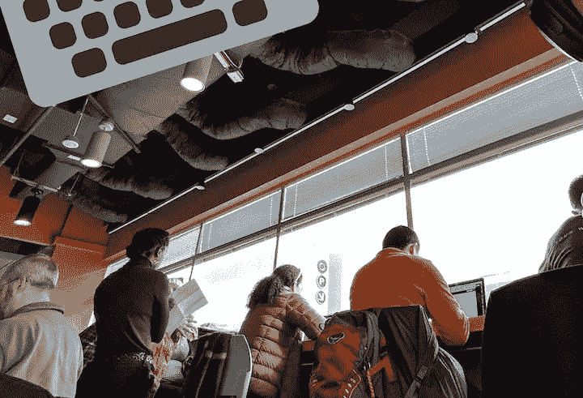

# 我为什么编码&咖啡

> 原文：<https://towardsdatascience.com/why-i-code-coffee-e2237ec709bc?source=collection_archive---------26----------------------->

## [入门](https://towardsdatascience.com/tagged/getting-started)

## 关于 code & coffee 事件价值的几点思考？

我与 tech meetup 活动的历史始于威斯康星州麦迪逊，当时我正在攻读博士学位(于 2017 年 5 月完成)。当时，麦迪逊没有一个让技术人员为单个项目工作的聚会。相反，它们的结构更像是午餐学习活动。一个(或两个)演示者将就一个主题发言 20-40 分钟。主题和演讲者都提前做了广告。还有时间进行问答。总的来说，我从这些小规模的教育会议中学到了很多，我很怀念那些会议。

然后，我搬到了 DC 的华盛顿州(2018 年 7 月搬家)。在这个地区，每周至少有三次代码和咖啡聚会。[北弗吉尼亚(NOVA)有一个](https://www.meetup.com/NoVA-Code-Coffee/)， [DC 有一个](https://www.meetup.com/dc-code-coffee/)，[亚历山大有一个](https://www.meetup.com/Alexandria-Code-Coffee/)。这些社区在全球并不罕见。

这个周末[我去了 NOVA 的](https://twitter.com/AdamRossNelson/status/1084111017100103680)，那是在 CustomInk.com[非常酷的办公室举办的。我也去了 DC，但是到了那里发现因为下雪取消了。我发了很多关于参加这些代码&咖啡聚会的微博。一位技术人员 Liz Gross 博士问我是不是整个周末都在编程？我回答道:](https://www.customink.com/)

# 以下是我认为代码和咖啡活动有价值的更多原因

Folks working away at NOVACode & Coffee. Image Credit: “Author’s Photo” — [More on attributions](https://adamrossnelson.medium.com/image-credit-attributions-a24efcc730ad).

## 非常适合网络

为了最大限度地利用 Code & Coffee，建立关系网很重要。每个人做这件事的方式不同，没有对错之分。对我来说，我尽最大努力通过 LinkedIn 或 Twitter 与我遇到和聊天的人联系。

## 让你的工作不那么孤独

回想读研时，我们有这些“写作小组”最好的写作小组是每周一次的，并且包括一个每周都在那里的核心小组。最好的写作小组以一个简短的讨论开始，每个人分享他们当天想要做的事情和他们的目标。然后每个人都开始工作。同样，Code & Coffee 活动以介绍开始，每个人都分享他们的谋生之道，他们当天的工作，他们可能需要帮助的事情(如果有的话)，以及他们可以帮助别人的事情(如果有的话)。

## 寻求帮助的地方

每次去一个码&咖，我都不求也不需要帮助。但是，当我需要帮助的时候，我知道我可以在那里找到它。我从未对这种帮助的质量失望过。

## 一个练习帮助他人的地方

自从去了 Code & Coffee 之后，我已经被要求过几次帮助了。有时候我觉得我有什么可以贡献的，有时候我却被难住了。但是，有机会分享别人的奋斗通常是一种受欢迎的从我自己的奋斗中转移注意力的方式。它提醒我们每个人都有起点。我不确定我还能想出另一个既令人谦卑又鼓舞人心的经历。

## 非常有助于提高生产力

我心虚的秘密是，有时我不从事涉及编码的项目。或者，也许我会从事一个曾经涉及到编码，或者最终会涉及到编码，但在那个时候不需要编码的项目。这意味着我可能正在研读方法，可能正在勾画概念框架，或者可能正在参加 Udemy/Lynda/Udacity(或类似的)课程。我甚至可能只是利用这段时间来收发电子邮件。总之，这是一个受保护的时间窗口，我可以用它来提高效率。

Heading into Saturday’s NOVA Code & Coffee hosted by CustomInk.com. Image Credit: “Author’s Photo” — [More on attributions](https://adamrossnelson.medium.com/image-credit-attributions-a24efcc730ad).

# 结论

我推荐《代码与咖啡》,给那些有兴趣结识其他技术人员的人，在技术项目上获得帮助的人，在技术项目上帮助其他人的人，或者有保护时间在你脑海中酝酿的任何个人项目上取得进展的人。

 [## 加入我的介绍链接媒体-亚当罗斯纳尔逊

### 作为一个媒体会员，你的会员费的一部分会给你阅读的作家，你可以完全接触到每一个故事…

adamrossnelson.medium.com](https://adamrossnelson.medium.com/membership) 

# 感谢阅读

把你的想法和主意发给我。你可以写信只是为了说声嗨。如果你真的需要告诉我是怎么错的，我期待着尽快和你聊天。推特:[@ adamrossnelson](https://twitter.com/adamrossnelson)LinkedIn:[亚当·罗斯·尼尔森在推特](https://www.linkedin.com/in/arnelson)和脸书:[亚当·罗斯·尼尔森在脸书](https://www.facebook.com/adamrossnelson)。