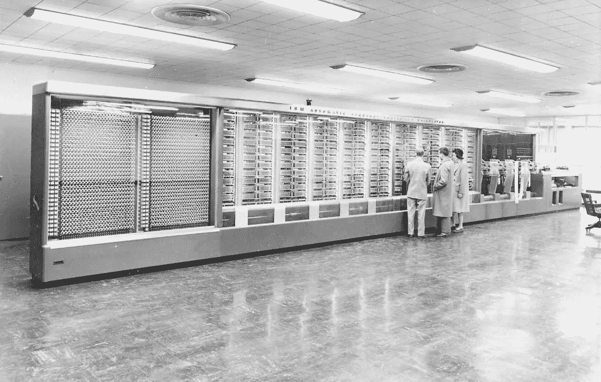
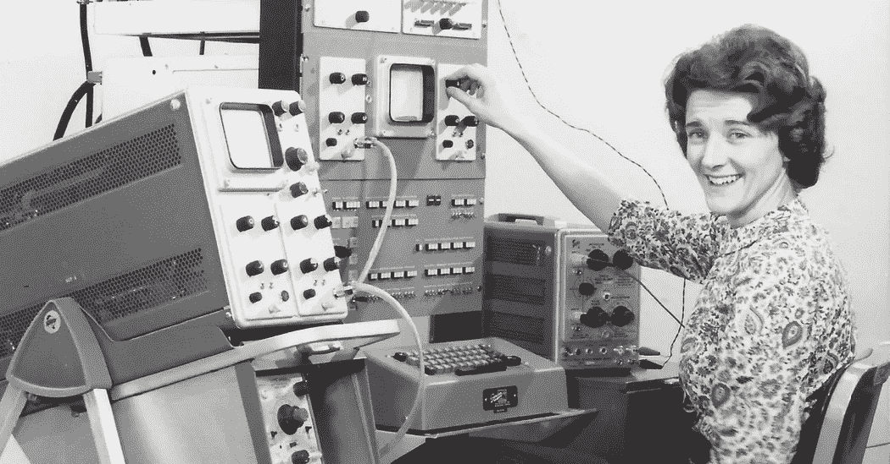

# 为什么我把我书的所有收入都捐给了编程女孩

> 原文：<https://towardsdatascience.com/why-i-donate-all-of-my-books-proceeds-to-girls-who-code-b9654e4379bd?source=collection_archive---------41----------------------->

Grace Hopper, Ph.D. ([Vassar Archives](https://stories.vassar.edu/2017/170706-legacy-of-grace-hopper.html))

## 为缩小科技领域的性别差距尽绵薄之力

我的同学中有几个(如果有的话)分享了我对展示在我们大学科学中心的 Mark I 计算机的迷恋。很难责怪他们。Mark I 高达 8 英尺，充满了旋转开关、晶体二极管和缠绕的电线，看起来像是科幻电影中的道具，而不是美国海军曾经使用的计算机。在 20 世纪 40 年代的全盛时期，Mark I 是地球上最强大的超级计算机之一；今天，我们放在口袋里的智能手机会让它相形见绌。然而，如果没有早期的大型机，如 Mark I 或操作它们的计算机科学先驱，智能手机和支持智能手机的操作系统都是不可能的。这些先驱中有许多是女性。

在成为电脑呆子之前，我是个历史迷。早期的计算机，如 Mark I，令我着迷，因为它们赋予了求知者超乎想象的能力。他们处理了帮助制造原子弹和将人类推向月球的复杂计算。虽然事后看来显而易见，但可编程机器的无限潜力必须由有事业心的个人来认识和利用，他们超越高耸的机器，看到比计算器更伟大的东西。这些技术先驱的才华、毅力和成就将通用计算的承诺变成了现实。这些人是我追求计算机科学的灵感来源。

历史上第一位编码员阿达·洛芙莱斯是一位女性。在与英国数学家查尔斯·巴贝奇的通信中，洛夫莱斯认识到了他发明的可编程机器——分析引擎的巨大潜力，并设计了被认为是第一个计算机算法。可悲的是，巴贝奇的发明从未完成，世界不得不等了将近一个世纪才出现类似他和洛夫莱斯设想的机器。其中有世界上第一台通用计算机 Mark I。

The Harvard Mark I, 1943 ([Encyclopædia Britannica/*IBM Archives*](https://www.britannica.com/technology/Harvard-Mark-I#/media/1/44895/19205))

受巴贝奇分析引擎的启发，Mark I 结合了机械和电子元件。它的建造花了五年多的时间，当它在 1944 年被交付给哈佛大学时，这台计算机被投入了战争服务。格蕾丝·赫柏是一名数学博士，曾加入美国海军，被任命为马克一世的首批编码员之一。霍普博士和她的团队使用 Mark I 来帮助广泛的军事项目，从鱼雷设计到内爆计算，这些都有助于原子弹的开发。Mark I——人类最具变革性的创造之一，也是当今数字文艺复兴的先驱——的目的是协助毁灭，这是一个时代的悲剧性象征。幸运的是，没过多久，战争就结束了，可编程机器开始进入民用领域。霍普博士帮助引领了这一转变。

战后，霍普博士继续在计算机领域发挥核心作用。在 20 世纪 50 年代，她创造了软件工程中最重要的创新之一:编译器。编译器是一种将人类编写的代码转换成机器指令的中间程序，它使得用简单的英语而不是机器代码编写软件成为可能。Hopper 博士还参与开发了一种最受欢迎的早期编程语言，COBOL,⁴，这种语言至今仍在生产系统中使用。

计算机的历史上充满了开拓性的女性，她们的辛勤工作和才华帮助推动人类进入数字时代。世界上第一台全数字通用计算机 ENIAC 的编程任务是由一个全女性团队完成的:凯瑟琳·麦纽提、让·詹宁斯、贝蒂·斯奈德、玛琳·韦斯科夫、弗朗西斯·比拉斯和露丝·利奇特曼。⁵与 Mark I 等机电前身不同，ENIAC 是全电子的。这使得它达到了以前无法想象的计算速度。Mark I 每秒只能执行三条命令；ENIAC 可以在这段时间内完成五千多项任务。⁶这对于美国战争机器日益增长的计算需求来说是完美的，但也意味着旧的编码方式已经过时。必须发明新的范例来驾驭新硬件的能力和复杂性。面对挑战，McNulty 和她的同事们开发了子程序和嵌套等技术，并将 ENIAC 变成了存储程序计算机(一种存储、修改和执行来自电子 memory),⁷的指令的计算机，为现代软件工程铺平了道路。

Mary Allen Wilkes ([New York Times](https://www.nytimes.com/2019/02/13/magazine/women-coding-computer-programming.html)/Joseph C. Towler, Jr.)

随着计算机不再是破坏的工具并进入我们的家庭，女性程序员仍然站在软件的前沿。20 世纪 60 年代，Mary Allen Wilkes 负责为 LINC 开发操作系统，由于其相对较小的尺寸，许多人认为这是第一台个人电脑。不像它那巨大的、数吨重的前身，LINC 可以装进一个实验室或办公室。威尔克斯被允许把这台机器带回家，使她成为第一个使用个人电脑的人。⁸林肯的革命性不仅仅在于它的尺寸。配备了屏幕和键盘，它可以直接和交互地编程——消除了对穿孔卡和打印输出的需要，而穿孔卡和打印输出是以前计算机的支柱。⁹同样具有革命性的是威尔克斯在为 LINC 设计软件时开发的编程创新，这为今天从 Windows 到 iOS 的所有操作系统奠定了基础。

女性程序员在美国宇航局的太空计划中也发挥了重要作用。自学成才的 FORTRAN 程序员多萝西·沃恩(Dorothy Vaughan)和她的女同事们完成了许多计算，帮助第一个美国人进入地球轨道，并确保他安全返回。⁰另一位女性计算机科学家 Margaret Hamilton 领导了一个工程团队，他们的软件为阿波罗 11 号登月任务提供了动力。事实上，尼尔·阿姆斯特朗的“一个人的一小步，人类的一大步”在很大程度上是由一位女性的聪明才智促成的。这些先驱女性的贡献很少被庆祝，甚至被遗忘。

女性在软件工程早期发挥的突出作用与今天计算机科学教室和工作场所的构成形成了鲜明的对比。形势似乎在恶化。根据《纽约时报》引用的美国政府统计数据，1984 年超过 37%的计算机科学毕业生是女性；到 2010 年，这一比例降至 18%以下。

> 女性计算机科学家的突破性成就足以证明，计算机领域的成功是不分性别的。

性别失衡显然不是因为缺乏天生的能力。女性计算机科学家的突破性成就足以证明，计算机领域的成功是不分性别的。

为了表彰上面讨论的编程先驱们所取得的成就，我很荣幸能够支持非营利组织“编程女孩”。作为一个对技术着迷的年轻历史爱好者，我崇拜女性编程先驱；是他们激励我去攻读计算机科学学位。这是一种特权，可以将它传递给未来的女性技术领导者。

# 参考

*   [1] C. Thompson，[编码中的女性秘史](https://www.nytimes.com/2019/02/13/magazine/women-coding-computer-programming.html) (2019)，*《纽约时报》*
*   [2]未知，[马克 I 型计算机:它是做什么用的？](http://sites.harvard.edu/~chsi/markone/use.html)(未注明)，历史科学仪器集
*   [3]未知，[马克 I 电脑:船员](http://sites.harvard.edu/~chsi/markone/crew.html)(未注明)，历史科学仪器的集合
*   [4]同上。
*   [5] C .汤普森，[编码中的女性秘史](https://www.nytimes.com/2019/02/13/magazine/women-coding-computer-programming.html) (2019)，*《纽约时报》*
*   [6]沃尔特·伊萨克森，[格蕾丝·赫柏，计算先锋](https://news.harvard.edu/gazette/story/2014/12/grace-hopper-computing-pioneer/) (2014)，*哈佛公报*
*   [7] J. Lightfoot，[介绍 ENIAC Six](https://spin.atomicobject.com/2016/07/31/eniac-programmers/) (2016)，原子对象博客
*   [8] C. Thompson，[编码中的女性秘史](https://www.nytimes.com/2019/02/13/magazine/women-coding-computer-programming.html) (2019)，*纽约时报*
*   9 同上。
*   [10] E. Howell，[NASA 真实“隐藏人物”的故事](https://www.scientificamerican.com/article/the-story-of-nasas-real-ldquo-hidden-figures-rdquo/) (2017)，*科学美国人*
*   [11] A .乔治，[玛格丽特·哈米尔顿带领美国宇航局软件团队将宇航员送上月球](https://www.smithsonianmag.com/smithsonian-institution/margaret-hamilton-led-nasa-software-team-landed-astronauts-moon-180971575/) (2019)，史密森尼
*   [12] C .汤普森，[编码中的女性秘史](https://www.nytimes.com/2019/02/13/magazine/women-coding-computer-programming.html) (2019)，*《纽约时报》*