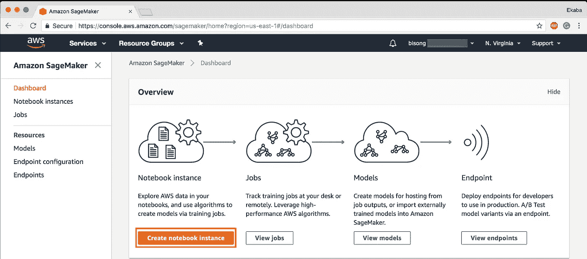
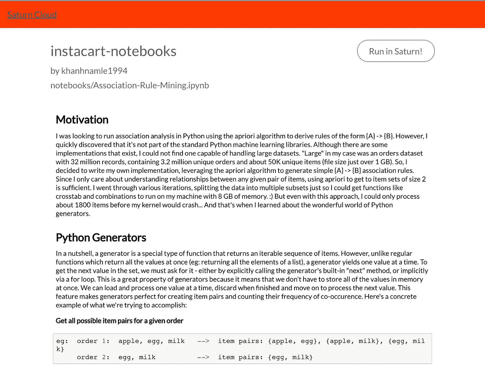

# 为什么我从 Google Colab 和 Amazon SageMaker 迁移到 Saturn Cloud

> 原文：<https://towardsdatascience.com/why-i-moved-from-google-colab-and-amazon-sagemaker-to-saturn-cloud-675f0a51ece1?source=collection_archive---------1----------------------->

当谈到科学实验和合作时，人们往往需要同样的东西:一个易于使用的界面来破解和优化他们的算法，一个数据输入输出系统，以及对他们首选的编程语言的支持。随着 2011 年 [Jupyter](http://jupyter.org/) 的发布，这些问题的自然解决方案出现了，这是一个极其通用的 web 应用程序，允许您创建一个笔记本文件，用作交互式代码界面、数据可视化工具和 markdown 编辑器。

## **Jupyter 云解决方案**

与他人分享**静态 Jupyter 笔记本**的方式有很多，比如把它发布在 [GitHub](http://github.com) 上或者分享[一个 nbviewer 链接](http://nbviewer.jupyter.org)。但是，如果收件人已经安装了 Jupyter 笔记本环境，则只能与笔记本文件进行交互。但是如果你想分享一个不需要任何安装的**全交互 Jupyter 笔记本**呢？或者，您想创建自己的 Jupyter 笔记本，而不在本地计算机上安装任何东西？

Jupyter 笔记本已经成为数据科学家之间机器学习建模和分析的标准门户，这一认识推动了软件产品的激增，这些产品被称为“云上的 Jupyter 笔记本(加上新东西！)".仅凭记忆，这里有几个公司产品和创业产品完全或部分符合这一描述:[Kaggle kernel](https://www.kaggle.com/kernels)， [Google Colab](https://colab.research.google.com/) ， [AWS SageMaker](https://aws.amazon.com/sagemaker/) ， [Google Cloud Datalab](https://cloud.google.com/datalab/) ， [Domino Data Lab](https://www.dominodatalab.com/platform/) ， [DataBrick Notebooks](https://docs.databricks.com/user-guide/notebooks/notebook-manage.html) ，[Azure Notebooks](https://notebooks.azure.com/)…名单还在继续。根据我与数据科学新手的交谈，两个最受欢迎的 Jypyter 云平台似乎是 Google Colab 和 Amazon SageMaker。

## **谷歌 Colab**

[Google Colab](https://research.google.com/colaboratory) 是从提高你的 Python 编码技能到使用深度学习库的理想选择，比如 **PyTorch** 、 **Keras** 、 **TensorFlow** 和 **OpenCV** 。你可以在 Colab 中创建笔记本，上传笔记本，存储笔记本，共享笔记本，安装你的 Google Drive 并使用你存储在那里的任何东西，导入你最喜欢的目录，上传你的个人 Jupyter 笔记本，直接从 GitHub 上传笔记本，上传 Kaggle 文件，下载你的笔记本，以及做你想做的任何事情。

从视觉上看，Colab 界面与 Jupyter 界面非常相似。然而，在 Colab 中工作实际上与在 Jupyter 笔记本中工作感觉非常不同:

*   大多数菜单项是不同的。
*   Colab 改变了一些标准术语(“运行时”代替了“内核”，“文本单元”代替了“标记单元”，等等。)
*   Colab 发明了一些你必须理解的新概念，比如“游乐场模式”。
*   Colab 中的命令模式和编辑模式与 Jupyter 中的不同。

已经有很多关于 Google Colab 故障诊断的文章，所以在不深入这个兔子洞的情况下，这里有一些不太理想的东西。因为 Colab 菜单栏缺少一些项目，而工具栏保持得非常简单，所以有些动作只能使用键盘快捷键来完成。您不能将笔记本下载为其他有用的格式，如 HTML 网页或 Markdown 文件(尽管您可以将其下载为 Python 脚本)。您可以上传数据集以在 Colab 笔记本中使用，但一旦您结束会话，该数据集将被自动删除。

就公开共享的能力而言，如果您选择将您的笔记本公开，并且您共享了链接，任何人都可以在不创建 Google 帐户的情况下访问它，并且任何拥有 Google 帐户的人都可以将其复制到自己的帐户中。此外，您可以授权 Colab 将您的笔记本保存到 GitHub 或 Gist，然后从那里共享它。

在协作能力方面，你可以保持笔记本的私密性，但邀请特定的人查看或编辑它(使用谷歌熟悉的共享界面)。您和您的合作者可以编辑笔记本，查看彼此的更改，以及为彼此添加评论(类似于 Google Docs)。但是，您的协作者无法实时看到您的编辑内容(最多会有 30 秒的延迟)，如果多人同时编辑笔记本，您的编辑内容可能会丢失。此外，您实际上并没有与您的合作者共享您的环境(意味着没有同步已经运行的代码)，这极大地限制了合作功能的有用性。

Colab 确实可以让你访问一个 [**GPU**](https://colab.research.google.com/notebooks/gpu.ipynb) 或者一个 [**TPU**](https://colab.research.google.com/notebooks/tpu.ipynb) 。否则，Google 不会为他们的环境提供任何规范。如果你将 Colab 连接到 Google Drive，那将为你提供高达 15 GB 的磁盘空间来存储你的数据集。会话将在 60 分钟不活动后关闭，尽管它们最多可以运行 12 个小时。

Colab 的最大优势在于它很容易上手，因为大多数人已经有了一个谷歌帐户，而且它很容易共享笔记本，因为共享功能与谷歌文档一样。然而，繁琐的键盘快捷键和处理数据集的困难是显著的缺点。在同一笔记本上协作的能力是有用的；但是没那么有用，因为你们没有共享一个环境，也不能实时协作。

## **亚马逊 SageMaker**

[Amazon SageMaker](https://aws.amazon.com/sagemaker/) 是一种完全托管的机器学习服务，可以帮助数据科学家和开发人员快速轻松地构建&训练模型，然后直接将其部署到生产就绪的托管环境中。它提供了一个集成的 Jupyter 创作笔记本实例，可以方便地访问您的数据集进行探索/分析，因此您不必管理服务器。它还提供了常见的 ML 算法，这些算法经过优化，可以在分布式环境中针对非常大的数据高效运行。凭借对自带算法和框架的本机支持，Amazon SageMaker 提供了灵活的分布式培训选项，可根据您的特定工作流程进行调整。

首先，您启动一个所谓的“*笔记本实例*，它将托管 Jupyter 笔记本应用程序本身、所有笔记本、辅助脚本和其他文件。不需要连接到那个实例(实际上您不能，即使想要)或者以任何方式设置它。一切都已经准备好了，你可以创建一个新的笔记本，并使用它来收集和准备一些数据，定义一个模型，并开始学习过程。所有配置、计算实例供应、数据移动等。会被一个函数调用触发。这个漂亮的过程决定了定义模型和组织数据的某种方法。

SageMaker 是建立在其他 AWS 服务之上的。笔记本、培训和部署机器只是运行特定 Amazon 机器映像(AMI)的普通 EC2 实例。和数据(还有结果、检查点、日志等。)存储在 S3 对象存储器中。如果您正在处理图像、视频或任何大型数据集，这可能会带来麻烦。事实是，你必须把你所有的数据上传到 S3。当您配置培训时，您告诉 SageMaker 在哪里可以找到您的数据。然后，在开始训练之前，SageMaker 自动将数据从 S3 下载到每个训练实例中。每次都是。作为参考，下载 100Gb 的图像大约需要 20 分钟。这意味着在训练开始前你至少要等 25 分钟。祝你调试模型好运！另一方面，当所有的前期试验都在别处完成，你的模型已经打磨好的时候，培训体验就非常顺利了。只需将您的数据上传到 S3，并从那里获得中期结果。

另一个需要考虑的方面是定价。笔记本实例可能非常便宜，尤其是在不需要预处理数据的时候。另一方面，训练实例可能很容易在你的口袋里烧一个洞。点击此处查看所有价格，以及 SageMaker 已经推出的地区列表。

## **介绍土星云**

[土星云](http://saturncloud.io/?source=jl-4)是一个新的平台，为那些对建立基础设施不感兴趣，但更关心如何轻松进行数据科学的数据科学家提供服务。更具体地说，该平台帮助管理云中的 Python 环境。

注册帐户后，您可以开始使用免费层。在仪表板中，您可以通过选择磁盘空间和机器大小来为项目创建 Jupyter 笔记本。这些配置涵盖了许多实际数据科学项目的需求。此外，您可以为您的项目定义自动关闭持续时间，这将使您的项目不会因为不活动而关闭。

通过土星云共享笔记本极其容易。我之前做了一个探索 Instacart 市场篮子分析挑战的项目，你可以在这里查看公共笔记本:[https://www . Saturn cloud . io/your pub/khanhnamle 1994/insta cart-notebooks/notebooks/Association-Rule-mining . ipynb](https://www.saturncloud.io/yourpub/khanhnamle1994/instacart-notebooks/notebooks/Association-Rule-Mining.ipynb)。我特别喜欢代码块和可视化的渲染，没有任何混乱，就像我们在 Google Colab 笔记本上看到的那样。它看起来就像一份报告，正如它的本意。我还喜欢提供的**“在土星中运行”**选项，用户只需点击就可以自己运行这段代码，不需要任何明确的登录。

总的来说，使用[土星云](http://saturncloud.io/?source=jl-4)可以很容易地与其他队友分享你的笔记本，而不必处理确保他们安装了所有正确的库的麻烦。与 Google Colab 相比，这种共享能力更胜一筹。

此外，对于那些在本地运行笔记本电脑并耗尽内存的人来说，它还允许您使用所需的内存和 RAM 来启动虚拟机，并且只需为您所使用的内容付费。与亚马逊 SageMaker 相比，这种成本关联是一个巨大的优势。

还有一些其他的附加功能，可以真正减轻通常从 DevOps 角度完成的工作的复杂性。这就是像这样的工具的伟大之处。在许多方面，直到你在一个连共享一个基本的 Excel 文档都变得繁琐的公司环境中工作，你几乎很难向年轻的数据科学家解释为什么这是如此之好。

## **结论**

土星云离生产就绪还很远，但它是一个非常有前途的解决方案。我个人认为，这是目前为止唯一一个接近本地 Jupyter 服务器易用性的解决方案，并增加了云托管的好处(CVS、扩展、共享等)。).

概念证明确实存在，只是缺少一些细节(更多的语言支持、更好的版本控制和更简单的点击式界面)。我很高兴看到土星平台的未来版本！

## 参考

*   [*在云端运行你的 Jupyter 笔记本的六种简单方法*](https://www.dataschool.io/cloud-services-for-jupyter-notebook/) *。数据学校。凯文马卡姆，2019 年 3 月。*