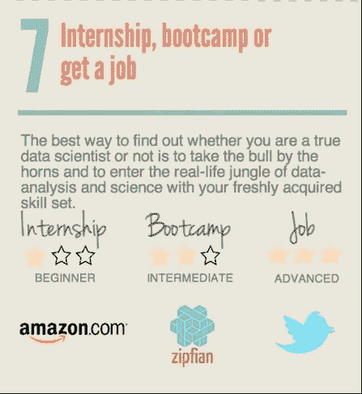

# 为什么我辞去了数据科学方面的工作，去参加数据科学训练营

> 原文：<https://towardsdatascience.com/why-i-quit-my-job-in-data-science-to-enroll-in-a-bootcamp-for-data-science-4721ee0e480e?source=collection_archive---------4----------------------->

# 少有人走的路

2018 年 11 月，我辞去了在一家全球研究公司担任数据科学家的工作，参加了大会的全职数据科学训练营。这是一条非正统的道路。以下面来自数据营信息图的关于如何“通过 8 个简单步骤成为数据科学家”的截图为例( *简单步骤是一个有趣的词汇选择)*。

Data Camp advice on how to prove you’re a ‘true’ Data Scientist

步骤 7 给参加训练营打 2 星，给找到工作打 3 星。作者似乎在暗示，在该领域寻求职业生涯的人获得经验的方式有一定的顺序层次。

虽然我很欣赏 Data Camp 列出了一些可供自学者应用新发现技能的替代实体的例子，但我发现信息图中 bootcamp 的位置具有误导性。训练营可以更恰当地重新定义为以下三种教育途径中的一种选择:在线课程(例如 Coursera)、认证硕士课程或编码训练营。自从“数据科学”作为一个跨学科领域出现以来，这种类型的项目激增，坦率地说，现在的教育前景是狂野的西部。由于这些选择的价格/课程各不相同，很难比较一种继续教育模式与另一种模式的价值。

既然我们已经正确地将训练营重新定义为一个教育项目，问题仍然存在…为什么我选择参加这种类型的项目而不是其他途径？硕士不是更好吗？此外，我为什么不继续做数据科学家的工作呢？这不就是训练营的最终目标吗？

为了理解我的决策，我将分享我的背景，我现在在哪里，以及我对自己未来的展望。我希望与你分享**我的**经验，而不是指定一条对每个人都最好的道路。谈论成为数据科学家的方法的文章的饱和创造了一种权威的语气，不管它们是否与该领域的其他 10 位“专家”相矛盾。

# 获得第一份工作

我职业生涯的前三年在私人健康保险咨询公司工作，主要处理索赔和登记数据，帮助雇主对他们的健康计划做出决策。我开始习惯使用数据仓库，并且喜欢我们如何从健康保险公司获得数据的细节。更重要的是，我学会了如何为我们的客户回答关键问题，包括:“从[健康储蓄账户转变为健康报销账户](http://www.aetna.com/producer/aetnalink/2009-4q/natlink_hra_4q09.html)会如何影响我的底线？”，以及“如果我们合并这两家公司并选择此福利计划，我会节省多少钱？”。除了我能回答的问题之外，我还喜欢玩弄信息的表达方式。在我工作的最后一段时间，我开始在 excel 中构建仪表板，允许用户像点击应用程序一样点击工作簿(我当时不熟悉商业智能软件，如果你在想“…Excel 中的仪表板？”[看看这个](https://www.youtube.com/watch?v=20zDV9MNE0s)。

所有这些经历让我进入了一个我不知道存在的领域，直到大约 5 个月后，我于 2015 年 11 月离职，接受了一个数据科学家的职位。我毫无经验，但在与他们的面试中，我清楚地表明我有分析的头脑，愿意学习，有面对客户的经验(我也做过客户管理)。这足以得到这份工作，但在我看来，我想也是他们的想法，我还有很长的路要走。4 年前，数据科学的定义更加模糊不清(很难相信，但确实如此)，公司似乎列出了初级职位的所有技能。每个人都想要一只独角兽，我当然不是。我知道我必须改进建模(自从我在学校学了计量经济学课程后，我就生疏了)和脚本。

# 做工作

一旦我有了工作，第一年真的很难。我们在一个更大的机构中有效地作为一个初创公司运作，因此没有什么真正被定义。在最初的几个月里，我被要求开始独立训练。自从大学毕业后，我就没有再编程过，我尝试过 R. R 的学习曲线相当陡峭，尤其是当我的团队中没有人用它编程的时候。我尝试了自学路线，在网上学习课程。记得我尝试的第一门课程是 [Roger Peng 通过约翰霍普金斯](https://www.coursera.org/learn/r-programming)的 R 课程数据科学。第一周，我感觉很舒服，并受到鼓舞，我将能够实现飞跃。在花了几年时间学习并通过保险认证后，我习惯了在工作之外学习密集、复杂的材料，并在日常生活中平衡它们。课程的第二周有所不同。材料复合的方式很快，而且它是一个虚拟课程，我没有一个指南来弹出材料。

当我努力在工作之外点击这些概念时，在工作之内，我终于得到了我的第一个项目，在[艾滋病毒/艾滋病局](https://hab.hrsa.gov/)数据集上工作，在[场景](https://www.tableau.com/)中建立仪表板。公司里有几个了解 Tableau 的开发人员，即使只有一两个人对我来说也有很大的不同。我起初并不出色，事实上，如果我今天回顾我的工作，这是彻头彻尾的补救，但这是项目报告中的一个增量改进，它给了我一个学习的机会。由于整个公司对这类项目的巨大需求，我逐渐适应了越来越多的商业智能角色，参与了各种各样的项目，如疗养院的监管执法和一个国际医疗融资项目。我成为了商业智能/数据专家，并在很大程度上放弃了成为大数据大师或机器学习工程师的追求。我很享受这种混合性质的工作，既要面对客户，又要深入研究后端数据的技术方面。

虽然我真的掌握了 Tableau 的诀窍，并找出了它的局限性，但在试图实现我在工作之外学习编程的目标时，我仍然与不一致性作斗争。我决定转向 Python，并在 DataCamp 中完成了[几门课程，但我仍然在 excel 中进行大部分数据清理，因为这对不熟悉 Python 的其他人来说更透明。随着时间的推移，我意识到在某种程度上，自学课程对我来说是一种挑战。我可能会连续两三周擅长编程，然后连续几周工作到很晚，或者一个月内连续三场婚礼会让我偏离轨道。等我回来的时候，概念已经模糊了，我不得不从头开始复习。](https://www.datacamp.com/courses/intro-to-python-for-data-science)

# 向上拉平

在把在线课程作为唯一的解决方案从我的清单上划掉后，真的有两个选项留给我选择，训练营或硕士课程。当比较这两者时，有许多相似之处和不同之处。这两种选择都比对方早得多开始他们的项目。数据科学作为一门学科在 5-10 年前才真正崭露头角，所以许多项目仍然很年轻，变化很大。钱对我来说当然是一个很大的因素。训练营的价格从[7K 美元到 16K 美元](https://www.coursereport.com/blog/learn-data-science-at-these-13-bootcamps-and-programs)(不包括生活费)，而[数据科学硕士项目的费用与传统硕士项目](https://sps.northwestern.edu/masters/data-science/tuition-costs.php)一样高，需要我至少失业 15 个月，或者晚上去学校上学。另一个恼人但现实的因素是项目的可信度/声望。训练营体现了硅谷的技术精英精神，任何人只要有一台笔记本电脑和对学习的热爱，都可以通过黑客攻击获得能力，而硕士项目仍然具有结构化学术学徒制的僵化和严谨。在现实世界中，我看到一些来自学术界的人对数据科学运动抱有非常真实的敌意，并抗议说:“他们从 19 _ _(19 _ _)起就一直是数据科学家”，“机器学习只是不同名称下的回归”，等等。他们的许多陈述是真实的，但也傲慢地抛弃了整个跨学科领域，该领域将一个学科和应用网络汇集在一个语言保护伞下。

经过考虑，我决定走 bootcamp 路线。从我参加工作的最初几年，我了解到与成功最相关的不是你在哪里上学，而是坚持、毅力和好奇心。我想效仿那些渴望通过聚会、自己尝试、自己阅读来自学的人。在与几个在大会上参加过训练营的人交谈后，我知道那里有一种激烈挑战的文化，人们经常离开完全不同领域的舒适工作，投入深水区，看看他们是否会游泳。为了让我成长，我想沉浸在那种文化中，和那些勇敢的人在一起。至于雇主会怎么看……如果他们对训练营有偏见，愿意放弃整个人才库(需要整个研究生数学课程),那当然是他们的特权，我可以做两件事之一来回应 1。尝试说服他们，我可以做任何一个拥有数据科学硕士学位的人可以做的事情，或者 2。别理那家公司。如果从训练营招聘对德勤、亚马逊、巴克莱、IBM、苹果和波音(仅举几例)这样的公司来说足够好，逻辑表明它应该被视为等同于硕士水平的项目。

# 成功之望

这是我做过的最好的决定。在前两周，作业真正测试了我们使用控制流和逻辑来回答所有不同数据类型的问题的能力。我很惊讶我能如此快地学会我已经逃避了这么久的技能。我有信心编写自己的脚本并构建 ETL 流，我可以构建这些流来在现实世界中自动化流程。我们与 Spark 和 SQL 合作，让我们体验大数据平台和典型的关系数据库。

更重要的是，我们能够应用我们新发现的编程技能来进行推理统计，构建机器学习管道，以及构建数据收集器来执行分类算法(想想垃圾邮件分类器)。总的来说，它给了我技术技能和信心，让我能够从第一份工作中积累经验，处理更大、更少结构化的数据，并以自动化的方式回答问题。对于我们没有深入探讨的概念，该课程也给了我们使用堆栈溢出和谷歌的关联，以了解正确的问题。

正如我在文章前面提到的，我的旅程可以被看作是非正统的。坦率地说，我质疑这个领域的“正统”是什么。你与软件开发人员类型的数据科学家交谈，他们希望你拥有软件开发技能，或者大数据工程师希望你能够启动 Hadoop 集群。我确信，在本质上，数据科学就像环境科学。你永远不会听到一个地质学家对一个水文学家说他们不是环境科学家。数据科学家将会走各种不同的路线，他们需要知道什么取决于他们的领域。没有人可以成为所有人的一切，我对人们的最好建议是选择对你来说最好的路线，这样你就可以为你最终的利益相关者提供最大的价值。我相信我做到了。