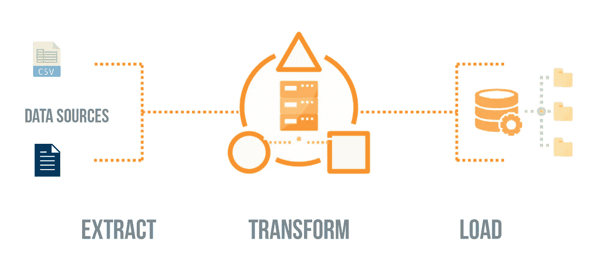
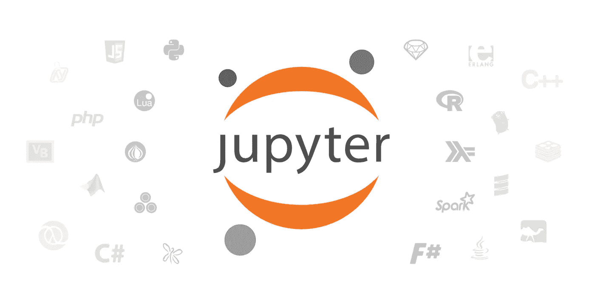

# 为什么我为我的 B2B 应用程序使用嵌入式 ETL 工具

> 原文：<https://towardsdatascience.com/why-i-used-an-embedded-etl-tool-for-my-b2b-app-56d0b3d8ac6?source=collection_archive---------28----------------------->

## 为 B2B SaaS 公司提供更好的 ETL 解决方案

## **TL；博士**

*   **企业 ETL 工具使得集成过于昂贵**对于小公司来说不可行，需要不同的 ETL 方法
*   **嵌入式 ETL** **工具不是将[数据集成](https://en.wikipedia.org/wiki/Data_integration)的任务完全留给客户，而是让软件供应商**负责提供 ETL，同时让客户控制整个过程——使集成成本更低，并更快地接纳新客户。

获取数据是我们最大的挑战。

我在一家名为 RevLock 的 B2B 初创公司担任软件开发人员，该公司提供会计软件。像大多数 B2B SaaS 公司一样，要开始使用我们的软件，客户必须以我们应用程序的标准格式输入数据。

问题是我们不能使用一个标准集成，因为每个客户在 Salesforce 的自定义对象中都有数据。此外，使用像 Informatica 这样成熟的 ETL 工具会使集成过于昂贵。

因此，我们被迫提供更好的解决方案，否则就有可能失去我们的客户。



Source: [Diyotta](https://www.diyotta.com/what-is-etl)

我们需要提供的高级 ETL 流程如下:

1.  客户将 CSV 文件从 Salesforce 上传到我们的 S3 存储桶
2.  我们将其转换成应用程序的标准格式
3.  对数据进行一些基本的推理

# 最初的解决方案

由于来自 Salesforce 的文件通常较小且易于管理，我们认为为每个客户转换产品内部的文件是可行的。

我们决定用 JavaScript 为每个客户编写单独的转换脚本，并在短短 6 周内成功地接纳了我们的第一个客户。万岁！我们用自己的内部解决方案解决了将数据输入系统的问题。

然而，我们很快遇到了问题——客户在输入数据中发现了 10 多个没有讨论的场景，要求我们的开发团队修改我们编写的 ETL 代码，作为他们初始集成的一部分。

我们意识到，在我们的应用程序中转换 Salesforce 数据变得越来越复杂，耗费了我们团队本应用于开发新功能的时间。是采取新方法的时候了。

# 嵌入式解决方案

很明显，我们需要使用 ETL 工具，将流程向上游移动，在我们的产品之外。

然而，仅仅将流程从产品中移除并不能解决我们的主要问题——我们需要将管理实际转换的任务交给客户，这样他们就可以在不咨询我们的情况下处理任何问题。

因此 ETL 工具必须嵌入到我们的产品中，为客户提供一种修改*转换脚本*的方法，同时允许我们的产品管理*运行*ETL*。*

我们在网上寻找这样一个“嵌入式 ETL”工具，其要求如下:

1.  **简约**。我们需要脚本易于理解，并具有良好的支持范式，因此客户可以通过使用自己的资源或外包来维护它们。
2.  **承受能力**。作为一家初创公司，我们不想超过每月 50 美元的运营成本。
3.  **轻松集成**到我们的应用程序中。我们不想花费数周时间来集成 ETL 工具——我们需要轻量级的东西。


为了保证简单，我研究了流行的数据转换框架，并决定使用 Python，因为所有的数据转换工具都可用。

使用这个标准，我们找到了一个基于云的工具，叫做[**hot glue**](https://hotglue.xyz/)**，它运行在 AWS 上。**

**我们使用 Pandas 编写转换脚本来处理 CSV 文件的转换，并将一般功能放入我们自己的 Python 模块中，使最终的脚本对我们的客户来说直观且易于阅读。**

**为了让你有个概念，这是我们为一个客户写的:**

**如您所见，编辑脚本非常容易——满足我们的简单性需求。**

**要为客户实际运行 ETL，我们只需使用下面的 REST 调用:**

```
curl -X POST
-H "X-Api-Key: ..."
-H "Content-Type: application/json"
-d '{
 "user_id": "...",
 "remote_input_dir": "...",
 "remote_output_dir": "..."
}'
https://api-endpoint.com/etl/invoke
```

**当 ETL 完成时，一个`status.txt`和`errors.txt`被上传到我们的 S3 桶中的`remote_output_dir`，指示 ETL 是否失败以及发生了什么错误(如果有的话)。**

**在我们自己的 AWS 环境中运行 ETL 的好处是，我们只为我们使用的东西付费，使我们的成本非常小——满足我们的**可负担性**要求。**

****

**Source: [Jupyter](https://jupyter.org/)**

**为了允许我们的客户编辑转换，hotglue 提供了一个小部件，它启动一个安全的 Jupyter 实例，其中加载了客户的 Python 脚本和数据。在 Jupyter 中，客户可以轻松地测试他们的修改，并将他们的脚本重新部署到生产中。**

**将小部件嵌入到我们的 webapp 中非常简单，只需将以下内容添加到我们的`index.html`中:**

```
<script src="http://cdn.example.com/widget.js"></script>
<script>
  HotGlue.mount(...);
</script>
```

**切换我们称之为:**

```
HotGlue.show()
```

**这就勾掉了最后一个方框，**易集成**。**

**下面是一个小部件运行时的快速视频:**

# **结论**

**我们非常满意为我们的应用程序使用嵌入式 ETL 工具。我们的集成成本降低了，我们可以更快地接纳客户，我们的开发团队也不会因为集成问题而停滞不前。**

**显然，嵌入式 ETL 解决方案是昂贵的企业 ETL 工具和内部构建定制 ETL 解决方案的绝佳替代方案。**

**感谢阅读！**