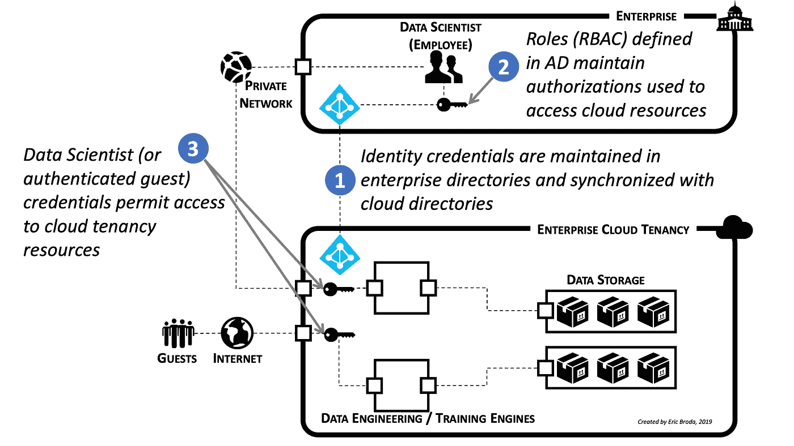

# 为什么身份管理是云上企业 AI-ML 的先决条件

> 原文：<https://towardsdatascience.com/why-identity-management-is-a-prerequisite-for-enterprise-ai-ml-on-the-cloud-408919055596?source=collection_archive---------26----------------------->

## 安全问题阻碍了云上的企业 AI/ML。基于身份的安全解决了许多这样的问题。以下是你需要知道的。

Image by [Gerd Altmann](https://pixabay.com/users/geralt-9301/?utm_source=link-attribution&utm_medium=referral&utm_campaign=image&utm_content=163426) from [Pixabay](https://pixabay.com/?utm_source=link-attribution&utm_medium=referral&utm_campaign=image&utm_content=163426)

# 迈向更安全的企业云租赁

为什么云上的企业 AI/ML 停滞了？主要是出于正当的安全考虑。AI/ML 对数据的贪婪胃口——其中许多是敏感数据——已经与企业的安全态势产生了严重冲突。

但人工智能/机器学习向云进军似乎是不可避免的。企业如何将这种需求与相关的安全问题协调起来？

一些企业向过去看齐。但是，不幸的是，旧的安全方法似乎不能很好地工作。最近来自 Capital One(和其他公司)数据泄露的头条新闻似乎强化了这一点。

*在这篇文章中，我将描述基于身份的安全性的关键考虑因素，这些考虑因素为支持云上的企业 AI/机器学习提供了必要的安全基础。通过解决这些问题，阻碍 AI/ML 采用的安全障碍可以得到缓解，企业可以再次加快 AI/ML 的采用。*

# 企业需求推动了 AI/ML 云的采用

今天，AI/ML 正在推动对全新企业数据方法的需求——这种方法支持比旧的遗留事务系统大几个数量级的数据量。

此外，分析和训练如此大量的数据所需的可扩展性要求迫使企业走出相对安全的数据中心的舒适限制。现在，只有主要的云平台才能真正提供现代 AI/ML 所需的经济高效、按需、可扩展的 GPU 基础。

因此，毫无疑问，向基于云的人工智能/人工智能进军正在进行中。

Photo by [David von Diemar](https://unsplash.com/@davidvondiemar?utm_source=unsplash&utm_medium=referral&utm_content=creditCopyText) on [Unsplash](https://unsplash.com/search/photos/police-tape?utm_source=unsplash&utm_medium=referral&utm_content=creditCopyText)

# 但是旧技术不适用于云计算

过去，主要的企业安全基于保护网络边界。它的目标是在企业数据中心周围建立一个不可渗透的网络屏障，前提是有了安全的网络边界，数据中心内的所有系统、数据和资源都是安全的、可信的。

在当时，这是有意义的，因为大多数应用程序和资产几乎只存在于数据中心内或在数据中心内协作，从而使应用程序开发、操作和安全管理更容易。

时代确实已经发生了变化，现在，不幸的是，用于保护传统数据中心的旧技术被发现是基于一个有根本缺陷的假设，即网络边界实际上是安全的。但是，由于多种原因，这被证明是一个有缺陷的合理假设。

首先，今天的敌人更加聪明，并且获得了更好的工具，导致网络边界看起来变得更加漏洞百出。优步最近在云上的数据泄露无疑证明了这一点。

第二，当企业保护他们的云租用时，会出现错误。不幸的是，只需一个终端配置就能被攻破，从而让敌人能够在整个网络的很大范围内迅速扩大立足点。

我认为仅仅是熵——安全配置不可避免地会随时间漂移——就足以成为不信任基于网络的安全边界的理由。也许首都一号最近在云上的[体验](https://www.nytimes.com/2019/07/29/business/capital-one-data-breach-hacked.html)是这种情况最令人心酸的例子。

最后，云的本质也产生了一个安全问题:默认情况下，许多资源在创建时就被设计成可以通过互联网访问。这创造了一个新的复杂性级别—为所有云组件提供安全性—这是大多数企业都没有准备好的。一个错误就可能导致灾难性的数据泄露。

企业安全团队的担心是正确的。显然，这些问题很重要！

事实上，如此之大，以至于我认为现在应该在网络边界可能被突破的明确假设下设计现代云安全方法是公平的。

然而，AI/ML 从业者——数据科学家——需要大量敏感数据，这加剧了这个问题。显然，允许大量敏感数据在云上持久存储会带来非常现实的安全风险，必须加以缓解。

毫不奇怪，这导致了一种新的安全模式。

Photo by [Kelly Sikkema](https://unsplash.com/@kellysikkema?utm_source=unsplash&utm_medium=referral&utm_content=creditCopyText) on [Unsplash](https://unsplash.com/search/photos/passport?utm_source=unsplash&utm_medium=referral&utm_content=creditCopyText)

# 身份是新的安全边界

今天，身份已经成为新的安全边界。简而言之，基于身份的安全性确保您是您所说的那个人，并且只允许您做您被允许做的事情—无论您位于何处，也无论您的访问方法如何。

基于身份的安全声明您的身份(或与您的身份相关联的凭证)包含身份验证方法(您是谁)和与您的授权相关的信息(您能做什么)。更具体地说，如果没有您的身份提供的适当凭证，就无法访问应用程序、服务、资源或数据。

Figure 1

# 集成身份管理至关重要

那么，随着身份成为云租赁安全的焦点，应该如何管理身份呢？以下是与企业云租赁相关的一些关键考虑事项。

首先，本地和云目录(例如:微软的 Active Directory 或 LDAP)应该同步(图 1 中的“1”)。这使得无论身份在哪里创建或使用，都可以一致地管理身份和关联的凭据。

从数据科学家的角度来看，这成为基于身份的方法保护敏感 AI/ML 数据的基础，同时还为访问云和内部资源提供了便捷的单点登录(SSO)体验(解决了管理多个 id 和密码的常见问题)。

其次，本地实例是提供单一权威身份源的主实例。这将简化身份管理流程，同时降低因人为错误和配置复杂性导致的安全风险。

# 基于角色的访问控制(RBAC)是访问/授权管理的基础

RBAC 或基于角色的访问控制是一种管理授权的方法。角色通常在企业的身份目录中维护(例如，Active Directory)。这些角色用于控制对资源的访问。

RBAC 是这样工作的(尽管这是一种简化):角色(图 1 中的“2”)通常被创建来表示工作职能；权限被分配给角色，以允许执行各种操作。然后，用户/员工通常被分配到组，这些组又被分配到角色。瞧，已经在身份、组、角色和访问资源所需的许可之间建立了联系。

这创建了一个有帮助的间接层:用户没有被分配权限，而是通过成为一个角色的成员来获得权限(图 1 中的“3”)。现在，用户权限的管理得到了简化，因为它只需要为用户/员工的帐户分配适当的角色。

也许最重要的是，这种方法不仅提供了定义组织中数据科学家(和其他人)角色的规范方法，还简化了授权管理，从而有助于避免可能导致安全风险的错误。

结合身份管理的 RBAC 通常被称为 IAM，即身份和访问管理。

# 将所有这些放在一起(一个非常简单的场景)

让我们假设敏感数据一直保存在企业的云租户上。该数据在企业目录中被分配了一个资源名(假设为“数据资源”)。安全小组规定，访问“数据资源”需要“数据读取”权限。这种关系也在企业目录中维护。

继续我们的场景，在企业目录中已经建立了一个“数据科学家”角色(图 1 中的“2”)，表明被分配了这个角色的员工被期望执行 AI/ML 功能。读取资源(“数据读取”)的权限现在添加到角色中，表明该角色能够对资源(“数据资源”)执行适当的操作。

现在，让我们假设一位新的数据科学家加入了企业。如何向他们提供对先前定义的资源的访问？

首先，他们的身份是在企业目录(例如，活动目录)中创建的，由于企业目录与云目录是同步的(图 1 中的“1”)，因此这位数据科学家在整个企业中只有一个身份。

新聘用的数据科学家的身份被分配到“数据科学项目”组，这当然反映了他们参与新的数据科学项目。最后，为了完成该场景，将“数据科学家”角色添加到“数据科学项目”组中。

这就在企业目录中建立了关系，提供了凭证(图 1 中的“3”)，允许数据科学家访问必要的资源。

首先，一个身份(对于新数据科学家)链接到一个组(新数据科学家组，“数据科学家项目”)，该组链接到一个角色(“数据科学家”)。该角色与允许访问资源(“数据资源”)的权限(“数据读取”)相关联。

瞧，数据科学家可以访问必要的资源。

这种情况下需要注意的最后几件事:

*   由于企业和云目录是同步的，因此这些关系中的每一个都可以在企业和云中使用—单点登录(SSO)可以在企业及其云租户中使用
*   借助身份管理，只有获得适当授权的经过身份验证的用户才能访问资源，即使黑客获得了云租户的访问权限，他们也无法访问受基于身份的安全方法保护的任何敏感数据
*   简化了身份管理，尤其是敏感安全配置的传播

请再次注意，这是一个有些琐碎的示例，仅用于说明各种组件和关系如何互操作。

Photo by [Yoal Desurmont](https://unsplash.com/@yoal_des?utm_source=unsplash&utm_medium=referral&utm_content=creditCopyText) on [Unsplash](https://unsplash.com/search/photos/new?utm_source=unsplash&utm_medium=referral&utm_content=creditCopyText)

# AI/ML 是重新思考云安全的催化剂

向云上的企业 AI/ML 进军已经开始。似乎很明显，旧的安全方法已经跟不上 AI/ML 对数据的需求。这阻碍了企业对云原生 AI/ML 的采用，迫使企业转向基于身份的现代安全方法。

新的基于身份的安全方法肯定比旧的方法更复杂。管理身份、角色，并在企业及其云租户之间同步它们，确实需要新的规范水平。尽管如此，企业对 AI/ML 的需求正在一个又一个行业加速增长。企业现在开始重新思考他们的云安全实践。

*看来，基于身份的安全不仅是一个先决条件，而且可能是改变企业传统上谨慎的安全姿态的催化剂，使企业在云上采用 AI/ML 的速度再次加快。*