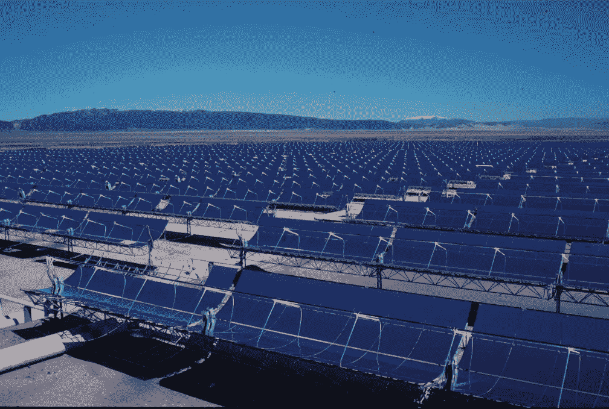
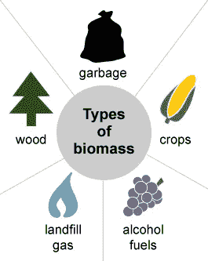

# 为什么要将能源领域的多样性与人工智能及其他技术相结合？

> 原文：<https://towardsdatascience.com/why-integrate-diversity-in-energy-with-ai-and-more-468517e09b76?source=collection_archive---------23----------------------->

## 技术的集成和数据源的多样性可以成为能源转型的催化剂，但这说起来容易做起来难

Photo by [Scott Umstattd](https://unsplash.com/@scott_umstattd?utm_source=unsplash&utm_medium=referral&utm_content=creditCopyText) on [Unsplash](https://unsplash.com/search/photos/diversity?utm_source=unsplash&utm_medium=referral&utm_content=creditCopyText)

**什么是“融合多样性”？**

它始于理解和认识到每个人以及每项技术都是独一无二的，都有不同的优势、能力和经验。整合多样性首先要认识到这一点，然后创造一个环境，让你可以发挥出最好的一面，这样当他们一起工作时，总和要比部分大得多。

在这篇文章中，我想把重点放在电力行业，在这个行业中，技术的集成和数据源的多样性可以作为能源转型的催化剂，而技术的限制和“*对抗*”(或简单的竞争)将打破整个过程。

为了想出前沿的解决方案，你真的需要有不同的视角和技能。我们都知道，在一个团队中，如果你有相同类型的人在做某件事(都是男性，都是老人，都来自城市，等等)。)，您只能创建自己的解决方案类型。通过整合差异，它实际上允许你扩展你的视野，推动边界。人工智能有助于整合不同的解决方案，拓宽可能性的范围。

书籍和电影中的人工智能已经以不同的形式存在了很长时间。他们被描绘成有时友好，有时险恶。但在现实生活中，我们喜欢将 AI 视为增强智能。多年来，人工智能已经在许多不同的领域证明了自己的用处。在人工智能出现之前，计算机仅根据例子识别照片中的人的想法是闻所未闻的。今天，我们甚至使用人工智能来检查医学图像，以快速识别异常，挽救患者的生命。

[吴恩达](https://www.andrewng.org/)，Coursera 的联合创始人、[百度人工智能集团的前负责人](https://www.forbes.com/sites/aarontilley/2017/09/13/adam-coates-baidu-ai-departure/#2bda080b67e2) / [谷歌大脑](https://ai.google/research/teams/brain/)、[将人工智能的变革性影响比作 100 年前的电力变革性影响](https://medium.com/@dpereirapaz/andrew-ngs-the-state-of-artificial-intelligence-reviewed-7007d95a72a1)，我当然同意他的观点。

Professor Andrew Ng is the former chief scientist at Baidu, where he led the company’s Artificial Intelligence Group. He is an adjunct professor at Stanford University. In 2011 he led the development of Stanford University’s main MOOC (Massive Open Online Courses) platform and also taught an online Machine Learning class that was offered to over 100,000 students, leading to the founding of Coursera.

事实上，AI 对不同的人意味着不同的东西。对于视频游戏设计师来说，人工智能意味着编写影响机器人如何游戏或环境如何对玩家做出反应的代码。对于我们大多数人来说，我们看到的人工智能更有可能是你手机上的一个应用程序，而不是智能机器人(或 Android！).它被用于幕后管理财务，建议你的下一部网飞电影，识别信用卡欺诈，阅读医学成像，并为病人找到合适的临床试验。人工智能参与了我们每天的决策。

预计 2019 年全球人工智能(AI)系统的支出将达到 358 亿美元，比 2018 年的支出增长 44.0%。随着各行业积极投资利用人工智能软件功能的项目，[国际数据公司(IDC)](https://www.idc.com/getdoc.jsp?containerId=prUS44911419) 全球半年度人工智能系统支出指南预计，2022 年人工智能系统支出将增加一倍以上，达到 792 亿美元，2018 年至 2022 年预测期的复合年增长率(CAGR)为 38.0%。

 [## 2019 年，全球人工智能系统支出将增长至近 358 亿美元…

### IDC 通过设备、应用、网络和服务来研究消费市场，为以下领域提供完整的解决方案

www.idc.com](https://www.idc.com/getdoc.jsp?containerId=prUS44911419) 

但在能源领域，它仍有很长的路要走。与许多其他行业相比，在电力行业，我们可以利用增强智能来扩展人类的能力，并完成人类或机器无法独自完成的事情。我们今天面临的一些挑战来自于过量的信息。更快的通信、分布式计算和物联网(IoT)导致了海量数据的产生(呈指数级增长)，而物联网本身和社交网络鼓励了大部分数据的非结构化。数据太多，人类专家无法跟上所有的变化和进步。

Photo by [Jose Fontano](https://unsplash.com/@josenothose?utm_source=unsplash&utm_medium=referral&utm_content=creditCopyText) on [Unsplash](https://unsplash.com/collections/3405362/lost?utm_source=unsplash&utm_medium=referral&utm_content=creditCopyText)

# 开启智慧

借助增强智能，我们可以“解开”数据中更多的实质和相互关系，同时将所需的信息放在我们的指尖，并用证据支持这些信息，以便利益相关者可以做出更明智的决策。这将允许专家和决策者扩展他们的能力，以便更好地服务他们的客户。机器做耗时的工作，这样我们才能做重要的事情。

在传统编程中，一切都是确定的，if-then-else 循环决定了软件如何响应变化的条件。当你比较已知值时，比如温度、文本字符串或电子表格中的数字时，这种方法非常有效。但是当你想把对象/决定/变化分类时，简单的 if-then 语句是行不通的。这个世界太复杂了，有灰色阴影和多个正确答案，概率答案成为一种要求。在电力行业，几乎一切都是概率性的(天气、消费者行为、高峰管理、风力涡轮机或太阳能光伏输出等)。).确定性系统可以告诉你，“答案是 X，因为比较成功”，例如恒温器上的温度，而在负载均衡或可再生发电中则需要概率性系统，因为你需要一个系统告诉你，“我非常有信心这是正确的答案，但我也有证据支持这些替代方案”(例如，储存能量以备后用，减慢风力涡轮机，因为风力可能超过限制，等等)。).

因此，即使对好莱坞来说，人工智能通常意味着一个行为像人的角色，混合了一些比喻的计算机功能。对于数据科学家来说，尤其是在能源领域，人工智能是一种探索和分类数据以满足特定目标的方式。但不管是谁在定义 AI，关键的一点是，AI 就是智能。我们如何定义智力？人工智能有许多方面，每个方面都受到科学和哲学进步的影响。计算机科学和电气工程决定了 AI 如何在软件和硬件中实现。数学和统计学决定了可行的模型并测量了性能。因为人工智能是以我们认为大脑如何工作为模型的，心理学和语言学在理解人工智能可能如何工作方面发挥了重要作用。哲学提供了关于什么是智力和伦理考虑等主题的指导。正是所有这些研究领域的融合，才使我们有可能建造出具有智能行为的系统。电网，尤其是可再生能源电网，需要这种智能。

Photo by [Arthur Poulin](https://unsplash.com/@barchpou?utm_source=unsplash&utm_medium=referral&utm_content=creditCopyText) on [Unsplash](https://unsplash.com/search/photos/integration?utm_source=unsplash&utm_medium=referral&utm_content=creditCopyText)

# 数据学习在电力行业的应用

AI 擅长什么，不擅长什么？答案往往归结于数据。人工智能技术就像任何技术一样会改进，所以今天的限制可能是明天的突破，但当前的人工智能技术非常擅长分类和翻译(解释)。

不管你说的是自然智能还是人工智能，没有什么是不能学习的智能。人类生来就有某种程度的先天智能，我们可以通过学习来建立这种智能。先天智能机器唯一拥有的是我们给予它们的东西，而常识目前不在那张很短的清单上。不过，我们提供的是检查示例的能力，以及基于输入和期望输出创建机器学习模型的能力。对于监督学习，我们为人工智能提供了例子。无监督学习是你提供输入，而不是标签，让机器推断质量。这种类型的学习对于聚类数据是有用的，其中数据根据其与邻居的相似程度以及与其他事物的不同程度进行分组。

一旦数据被聚类，您就可以使用不同的技术来研究这些数据并寻找模式。强化学习是机器做出决定，并根据决定是否正确给予奖励或回报。你可以使用强化学习来教机器下棋或导航障碍课程，如需求侧管理或发电计划。深度学习是应用于神经网络的机器学习的子集。深度学习网络指的是节点的排列，这肯定会是下一代与能源相关的人工智能应用

当选择用于训练机器模型的数据源时，重要的是对在生产中会遇到的数据的代表性数据进行采样。可能出现的一个挑战是训练数据无法预测未来的输入数据。这个问题必须在这个过程中尽快解决。不一定你需要所有的答案，而是你确定了一个处理这种情况的过程。因为垃圾输入等于垃圾输出，没有任何人工智能解决方案可以从坏数据中给出好的结果。然而，如果您的一些数据是坏的，您可以做的是识别并保留您的可用数据，并收集(或构建)可以在您的解决方案中使用的新数据。您应该考虑您必须处理的数据的数量、质量和敏感性。

# 可再生能源的整合，说起来容易做起来难

这对于电网运营商来说变得越来越复杂，对于较小的设施或社区来说也是如此。它现在涉及将可再生能源生产资产纳入自我消费(太阳热能和/或光电、从生物量或沼气生产热量、地热能……)，以使制造商或社区能够减少其碳足迹，使其能源组合多样化，并减少其对化石燃料的依赖，这将有助于更好地控制与能源相关的长期预算。

在任何情况下，它都是优先激活的杠杆:“未用完的能源没有成本，也不会造成污染”。另一方面，即使有一些很好的成功或更有吸引力的行业，可再生能源和回收技术的部署在行业中仍然太落后。有许多障碍需要克服:巨大的投资成本、当前与化石燃料和廉价电力的竞争、对与这些创新技术相关的运营风险的恐惧、缺乏技术知识或运营能力等。这就是人工智能和数据科学可以提供很大帮助的地方。可以分析许多积极的经验，并将其视为“学习”阶段的范例。这将旨在通过回收技术和可再生能源向该行业提供短期内的可能性，重点是主要部门和一套技术。

例如，我们可以考虑使用智能储能系统优化分散式发电(太阳能光伏或风力涡轮机)。在这种情况下，如果将第二天的天气预报传送给 AI，则可以根据网络的预期状态来准备存储容量。AI 可以决定整夜卸载存储单元(例如[混合能量存储](/novacab.us))，以便第二天可以在那里存储最大电流。由于这种控制功能，还可能知道较高电压电网水平的状态。然后，配电侧(低压电网)可以帮助维持较高电网水平上的电压(甚至在涉及足够容量的传输水平上)。除此之外，所产生的电力要么直接消耗(优先级 1)，要么注入电网，或者根据电网的状态临时储存。在当地电压问题的情况下，当地储存的电力(电池)可以馈入电网。在更广泛的情况下，能源供应商可以根据某些信号(天气预报、平衡组等)主动控制智能模块。).通过这种方式，IES 对本地电网电压的维持产生积极影响，更一般地说，对供电安全(本地和分散系统服务)产生积极影响。就客户忠诚度和新产品开发(服务、合同转让等)而言，它也是能源供应商的理想平台。).

Photo by [Stephen Dawson](https://unsplash.com/@srd844?utm_source=unsplash&utm_medium=referral&utm_content=creditCopyText) on [Unsplash](https://unsplash.com/search/photos/dashboard?utm_source=unsplash&utm_medium=referral&utm_content=creditCopyText)

# 游戏状态:创新技术的智能仪表板，根据需求进行集成和定制

首先，除了传统的解决方案，还有许多相对成熟的创新技术来生产和自我消耗能源，无论是热能(在与大多数用途相适应的温度水平)、冷却还是电力。而且，“相对于”每一个单一的需求，甚至有几个可供选择的解决方案。

在第一种方法中，这些技术可以分为三个互补的类别:

提供所谓低温热的技术，如[地热能](https://www.renewableenergyworld.com/geothermal-energy/tech.html)(极低能量)、干燥蒸汽回收或太阳能热，适用于家庭热水生产、空间加热或低温工业过程，如食品工业中的巴氏杀菌。提醒一下，[集中太阳能](https://en.wikipedia.org/wiki/Concentrated_solar_power)，高热地热(阴影部分)，以及中低能量地热能在地图中有所显示，但不在本次研究范围内。

Solar Energy Generating Systems (SEGS) solar complex in northern [San Bernardino County, California](http://www.sbcounty.gov/main/default.aspx). The first commercial parabolic trough power plants with a total of 354 megawatts went online in California. By [USA.Gov](http://www.USA.Gov) — BLM — BUREAU OF LAND MANAGEMENT — [http://www.ca.blm.gov/cdd/alternative_energy.html](http://www.ca.blm.gov/cdd/alternative_energy.html), Public Domain [https://commons.wikimedia.org/w/index.php?curid=15957890](https://commons.wikimedia.org/w/index.php?curid=15957890)

2)提供所谓高温热量的技术，如[生物质](https://www.eia.gov/energyexplained/?page=biomass_home)，沼气或某些熔炉的烟气回收，这使得满足需求成为可能，特别是冶金、玻璃或化学领域的需求。

3)发电技术，对所有研究的过程都有用。这些可以由例如太阳能光伏、风能或生物质或沼气热电联产单元覆盖。

Source: Adapted from [The National Energy Education Project](https://www.need.org/) (public domain)

# 与技术整合相关的问题:碳足迹、竞争力、条件整合和开发

2018 年在欧洲许多制造商中进行的一项调查(ref:[www.ademe.fr/mediatheque](http://www.ademe.fr/mediatheque))显示，尽管遇到了困难，但这些技术已经在地面上部署，通常都很成功。受访的工业企业唤起了第一系列的利害关系:减少二氧化碳排放，发展负责任的企业形象，这可以带来营销优势，同时符合他们的环境和社会承诺。

作者补充道:

> 这些技术的发展水平是一种进步，特别是在能源公约和拉加经委会各自竞争的历史时期，EnR 和拉加经委会提出了一个解决方案(取决于化石能源价格的波动)。或者，用莎士比亚的话来说:*这些技术的部署水平相当不均衡，特别是因为它们与传统能源相比的历史竞争力水平，尽管带来可再生能源或能源回收解决方案的生产成本是可见的(独立于化石燃料价格的波动)。*

然而，即使受访的工业企业提到环境和品牌问题，他们也同意竞争力问题是头等大事:换句话说，可再生能源或能源回收技术的部署只有在有助于提高竞争力的情况下才会进行。

Photo by [paolo candelo](https://unsplash.com/@paolocandelo?utm_source=unsplash&utm_medium=referral&utm_content=creditCopyText) on [Unsplash](https://unsplash.com/collections/4735712/competitive-advantage?utm_source=unsplash&utm_medium=referral&utm_content=creditCopyText)

# 在通往竞争力的路上

对于可再生能源来说，被认为是竞争力的附加因素总是一个挑战。特别是在没有补贴的情况下，在当前的市场条件下，天然气价格非常低，除了少数特殊情况，它们在全球的竞争力低于传统的参考解决方案(电力和天然气)。可以注意到，受益于更好的供应合同，这些常规能源对于大用户来说往往可以以更低的成本获得。在这种情况下，公共政策和与之相关的支持机制，以及人工智能和储能( [IES](/artificial-intelligence-in-a-no-choice-but-to-get-it-smart-energy-industry-1bd1396a87f8) )成果的最大化发挥着重要作用。在补贴和技术整合的推动下，许多解决方案可以给工业带来竞争力。但 RE 与 ie 的结合应该被视为更大竞争中的团队成员。

此外，投资一项能源资产往往是一个中期或长期的选择，折旧期较长。今天的选择将对未来 5 年、10 年、15 年或更长时间产生影响。今天选择投资一种或多种可再生或回收资产可能是一个长期的回报选择，因为它允许能源组合多样化，并减少对价格可能特别不稳定的传统能源的依赖。此外，这种策略还允许至少部分地克服燃料、电力价格的上涨，或者甚至在较小程度上克服 CO2 信用市场的上涨。

技术的整合必须是对一个场所的需求和可能性的整体思考的一部分。在工业场地上整合太阳能装置、风力涡轮机、生物质锅炉或甲烷化工厂、空间需求和适应的基础设施，甚至更好地评估(如果不是很好的预测)未来的结果。清洁技术资产的整合可能还需要对与之相关的分销进行重大改革。根据相关站点的拓扑结构、集成约束、需求位置，变化可能不是无关紧要的。在许多情况下，甚至可能需要部署新的电网或安装存储容量(因为在实现热量回收和使用回收的能量之间存在时间差，或者因为某些能源的可变性)。人工“增强”智能需要有效地完成这一切。以下事实强调了这一点:一般来说，由于可再生能源相对缺乏灵活性，因此与传统竞争对手(电网、常规发电、天然气产热)相比，可再生能源需要更具体的操作知识。

Credit: Optimizing power generation with Hybrid Energy Storage and AI (CC BY-NC-SA 2.0), © Smart Phases Inc. (DBA [Novacab](http://www.novacab.us))

# 一方的长处抵消了另一方的短处

事实上，传统技术的优势在于(几乎)始终可用、反应灵敏且灵活。它们很容易适应负载和活动的快速波动，因此能够提供具有大量响应性的负载曲线。大多数可再生技术并非如此。另一方面，太阳能和风能技术通常是可变的，在有太阳和/或风的情况下只产生电和/或热。生物气或生物质的全球生产和燃烧过程也是如此，这可能取决于当地资源的可用性(液体流出物或各种废物)。然而，可以通过[智能地将能源技术](https://medium.com/me/stats/post/bf7dd7a507a0)与热回收技术和可再生能源相结合来克服这些困难，以提供场地的不同用途。例如，我们可以考虑将区域供热与储能解决方案相结合，以应对某些可再生能源资产或异步热回收解决方案生产的可变性。为了促进可再生能源的整合，实业家必须依靠所有生态系统的贡献:技术提供商、服务提供商、通过创新商业模式融资的行为者，以便分担风险和克服上述困难。

对于我们人类来说，这样的项目可能看起来很复杂，但在人工智能的帮助下，它们可以从经济和环境的角度带来高性能水平。为了提供最大的价值，重要的是专注于改善我们的人工智能的训练时间，并从少量数据中获取最大的洞察力。最终结果是，解决方案需要更少的数据来构建，更快地培训和部署，并保护您的知识产权。

简而言之，混合[能量储存](https://medium.com/me/stats/post/72cfbd3c096b)(电力、热能、混合动力、机械等。)和 AI 共同能够解决 re 的这个缺点。传统技术和可再生能源与智能储能技术的结合促进了这些技术的整合和利用。事实上，虽然所有这些技术看起来可能相互竞争，但这些技术必须首先被视为相互补充，就像它们可以补充传统能源(特别是电力和天然气)一样。整个挑战在于构建一个能源系统，在该系统中，各种资产相互补充，使一种技术的优势与其他技术的劣势相互抵消(每种技术都有其优点和缺点，需要在每个工业场所逐一评估和考虑这些优点和缺点)，从而能够从操作和经济角度部署高效的能源解决方案。并且在每个工业现场对应一个特定的解决方案。在这里，多个数据源是优化解决方案的关键，人工智能是处理这些海量信息的必要手段。

正如[埃德蒙·希拉里](https://en.wikipedia.org/wiki/Edmund_Hillary)曾经说过的:当你去山上，你看到它们，你会钦佩它们。在某种意义上，它们给你一个挑战，你试图通过攀爬它们来表达这种挑战。能量转换是前方的山脉。它向我们挑战，我们需要更好地结合我们的优势和“增强智能”，以尽可能最好的方式攀登它！

Photo by [Hu Chen](https://unsplash.com/@huchenme?utm_source=unsplash&utm_medium=referral&utm_content=creditCopyText) on [Unsplash](https://unsplash.com/search/photos/climbing?utm_source=unsplash&utm_medium=referral&utm_content=creditCopyText)

___________________________________________________________________

本文是荷兰国际集团[夏羽·比洛多](https://www.linkedin.com/in/stephane-bilodeau/?locale=en_US)关于**人工智能和能量储存**系列文章的一部分。工程博士，对外经济合作中心。Smart Phases 首席技术官( [Novacab](http://www.novacab.us) )、加拿大[工程师协会会员](https://engineerscanada.ca/about/committees/operational/public-affairs-advisory)和[能源中心](https://www.energycentral.com/member/profile/217621/activity)专家撰稿人。

您可以在此找到其他文章:

 [## 人工智能在一个“别无选择，只能让它聪明”的能源行业！

### 可再生能源的繁荣对电力部门来说是一个很好的机会&用聪明的方式对抗气候变化…

towardsdatascience.com](/artificial-intelligence-in-a-no-choice-but-to-get-it-smart-energy-industry-1bd1396a87f8)  [## 组合效应对抗蝴蝶效应

### 人工智能促进储能，为可再生能源提供弹性和效率…

towardsdatascience.com](/the-combo-effect-against-the-butterfly-effect-bf7dd7a507a0)  [## 没有智能储能，就没有快速(足够)的能量转换！

### 人工智能和储能 fast 需要强耦合，以便与可再生能源实现高效过渡，从而对抗狂暴的…

towardsdatascience.com](/no-fast-enough-energy-transition-without-intelligent-energy-storage-72cfbd3c096b)