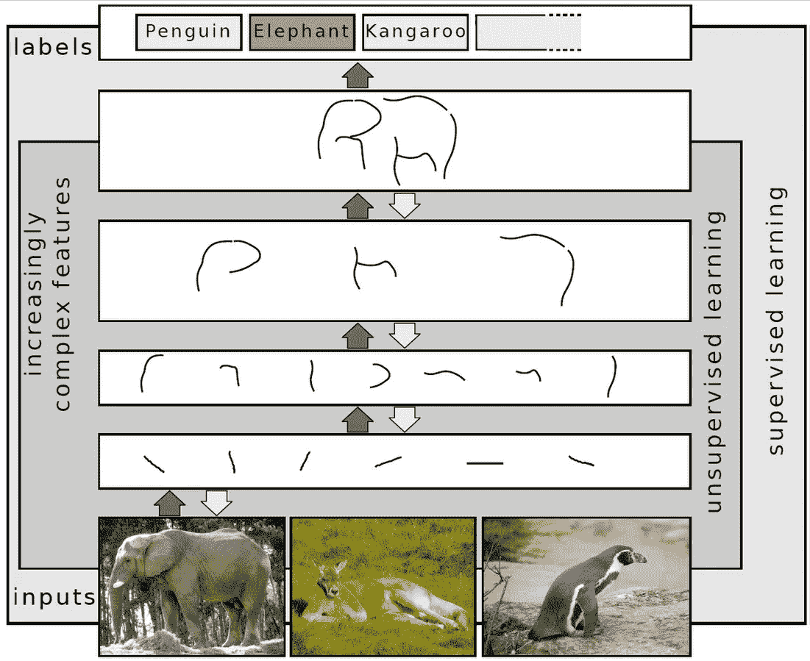
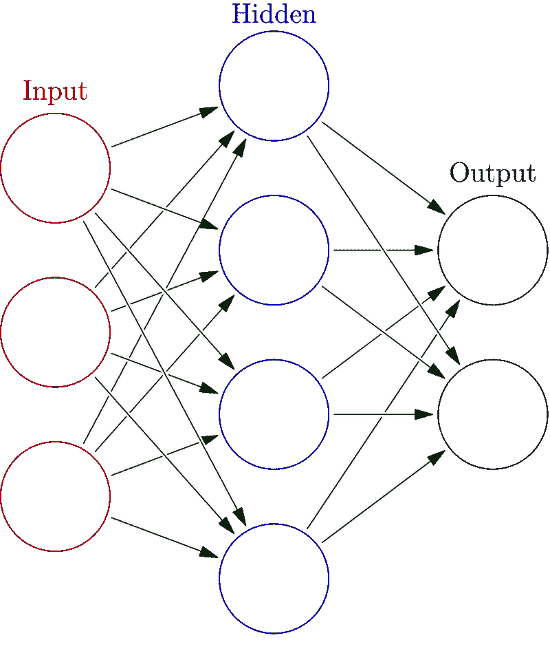

# 为什么智力可能比我们想象的要简单

> 原文：<https://towardsdatascience.com/why-intelligence-might-be-simpler-than-we-think-1d3d7feb5d34?source=collection_archive---------6----------------------->

## 来自大脑皮层的教训

Photo by [Paweł Czerwiński](https://unsplash.com/@pawel_czerwinski?utm_source=medium&utm_medium=referral) on [Unsplash](https://unsplash.com?utm_source=medium&utm_medium=referral)

建造一个人，更确切地说，一个人脑，需要多少信息？

毕竟，我们是地球上最复杂的物种。更进一步说，我们的一些大脑认为我们的大脑是宇宙中最复杂的结构！

然而，[一个番茄比一个人有更多的基因](https://www.nature.com/articles/nature11119?utm_source=commission_junction&utm_medium=affiliate)。准确的说是 7000 多。

Arguably not the most complex structure in the observable universe. Photo by [Immo Wegmann](https://unsplash.com/@macroman?utm_source=medium&utm_medium=referral) on [Unsplash](https://unsplash.com?utm_source=medium&utm_medium=referral)

看着我们的基因，我们很难弄清楚我们所有的复杂性是由哪里编码的。

一开始只有大约 20000 个基因，其中大约一半与其他事情有关，如建造手脚和重要器官。

从数学上来说(考虑到我们的基因组可以被视为一种携带信息的代码，由类似于图灵机的东西进行处理，正如我[在这里](https://medium.com/discourse/a-non-technical-guide-to-turing-machines-f8c6da9596e5)更详细地解释的那样)，我们的基因组在无损压缩后只携带 2500 万字节的大脑设计信息。

将它与 10 个⁵连接进行比较(一万亿次！)据估计，成年人在新大脑皮层中拥有这种结构，新大脑皮层是我们大脑的最新部分，只存在于灵长类动物中，在智人中已经变得非常大。你会看到，如果我们对基因的理解没有完全错误，假设我们的大部分知识和能力直接编码在基因中是不合理的。

唯一的选择是，需要一种更简单、更有效的方式来定义我们大脑和新皮层的蓝图。

***并以此来构建一个智能系统的原型。***

## 大脑功能的统一理论

杰夫·霍金斯在他关于智力的书****中抱怨说，大脑的普遍图像是由高度专业化的区域组成的。****

*他将这种情况与 19 世纪的生物学家进行了比较，这些生物学家对种类繁多的物种进行了越来越详细的研究，却没有注意到生命背后的统一原则。直到达尔文提出他的 ***进化论*** 之前，没有人知道如何用一种总括性的叙述来描述自然界的多样性。*

*同样，大脑可能看起来像是由许多不同的、高度专业化的大脑区域组成的，但它们明显的专业化不应该让我们得出结论，它们可能不会都基于相同的解剖学和算法原理工作。*

*事实上，我们观察到新大脑皮层的解剖结构具有惊人的同质性。 ***神经可塑性*** 表示大部分脑区可以轻松承担以前由其他脑区执行的任务，显示出其设计原理背后的某种普遍性。*

*在他的畅销书**T5【自我改变的大脑】T6、*Norman Doidge*中，讲述了病人将整个感觉系统重新映射到大脑新部分的令人印象深刻的故事，就像人们通过将相机记录的视觉刺激映射到直接进入嘴里的感觉刺激来学习用舌头看东西。***

*对中风患者的研究同样表明，中风导致的能力丧失通常会被新的大脑区域重新学习，天生耳聋的人可以重新映射他们的 ***布洛卡区*** (负责语言处理)来控制他们的手部运动，他们通过手语交流，而不是通过嘴巴的运动来表达讲话。*

*大脑发挥出 ***不可思议的能力和灵活性*** 来学习新事物。大多数人可以学习他们成长过程中使用的任何一种语言，或者在以后的生活中选择学习一种新的语言，可以学习他们选择的任何一种乐器(不可否认有不同的成功)等等。*

*可塑性和灵活学习的事实可以解释为，根据我们基因中信息的稀疏性，指向一个普遍的结构，这种结构隐藏在新大脑皮层的 ***生物设置和学习算法*** 中。*

## *思维的结构*

*很难将思维本身概念化(正如我在最近一篇关于[思维几何学](/the-geometry-of-thought-700047775956)的文章中更深入地探究的那样)，但是有一些特定的结构和模式深深地贯穿于我们认知的几乎每一个方面。*

*正如 ***雷·库兹韦尔*** 在他的《如何创造心灵*一书中解释的一样，我们以一种分层的方式感知世界，由复杂程度不断增加的简单模式组成。根据他的观点，模式识别形成了所有思想的基础，从最原始的模式到高度抽象和复杂的概念。**

**以语言文字为例。小线条组成了我们可以识别为字母的图案。字母的组合形成单词，然后是句子。句子构成段落，整篇文章。最后，从以高度特定的方式排列的少量最小模式的分类中，叙事和意义出现了。**

## **模式识别的生物学**

**现代神经成像数据表明，新大脑皮层由一种统一的结构组成，称为[皮层柱](https://en.wikipedia.org/wiki/Cortical_column)。每一个都是由大约 100 个神经元组成的。**

**库兹韦尔提出，这些列构成了他所谓的最小模式识别器。通过将模式识别器的一层又一层相互连接来创建概念层次，每个模式识别器都专门从许多不同的可能感觉形态(如眼睛、耳朵、鼻子)的输入中识别单个模式。**

**基于基本的特征提取(如检测视觉刺激的边缘或识别音调)，这些模式堆积起来形成越来越复杂的模式。**

****

**Layers detecting patterns of increasing sophistication in visual data, leading to abstract labels like “elephant” or “penguin”. Credit to Sven Behnke [CC BY-SA 4.0]**

**模式识别器并不局限于处理视觉或听觉刺激。它可以将各种信号作为输入进行处理，根据输入中包含的结构生成输出。学习意味着连接模式识别器，并学习它们的权重结构(基本上是它们对彼此输入的响应有多强，以及它们之间的互联程度)，类似于学习神经网络时所做的事情。**

**但是大脑是如何在如此擅长解决许多不同任务的同时又如此同质的呢？答案可能在神经科学和计算机科学的交叉点上。**

## **信息的作用**

**视觉、听觉和感官信息有什么共同点？显而易见的答案是，这都是某种信息。**

**坦白地说，在*信息时代，信息的定义有点棘手，而且被扔得太多，但在大脑信息处理的背景下，它有一个技术含义。理解这种架构如何为我们工作得如此之好的一步在于认识到大脑可以被认为是一个信息处理设备。***

***神经元的输入有很多一致性，这是神经计算的基础。无论大脑在处理什么信号，它总是由神经元的空间和时间放电模式组成。我们在外部世界观察到的每一种模式都在我们的感觉器官中编码成神经放电模式，然后，根据库兹韦尔的说法，这些模式在模式识别器的层次结构中上下流动，直到成功提取出意义。***

***神经科学证据得到了计算机科学观点的支持。在他的书 ***中，主算法*** ， ***佩德罗·多明戈斯*** 提出，我们可能会找到一种通用算法，给定 ***正确的数据*** ，允许我们学习几乎所有我们能想到的东西 ***。******

**该通用学习算法甚至可以由现有学习算法的混合组成(如贝叶斯网络、连接主义或符号主义方法、进化算法、支持向量机等。).**

**大脑也可能使用类似于这种通用算法的东西，尽管我们还不太确定大脑如何从算法的角度学习。作为最基本的例子，当然，有 [Hebbian 学习](https://en.wikipedia.org/wiki/Hebbian_theory)，它已经被证明在某种程度上发生在大脑中。对于更复杂的算法，研究人员一直在试图寻找在大脑中实现反向传播的生物学合理机制。**

**但是很明显，大脑非常善于学习，并且需要以一种我们原则上可以理解并且很可能在我们的计算机上模拟的方式来学习。**

## **神经网络中的信息丢失**

**识别一个模式的诀窍是解码它，解析出隐藏在信号中的相关信息。了解大脑如何做到这一点可能是理解智力如何工作的关键步骤之一。**

*****《论智能的*的作者杰夫·霍金斯抱怨说，在研究信息在大脑中的作用时，我们缺乏工具，但在理解计算架构中的信息流方面已经取得了越来越多的进展。******

**今年夏天，我有幸参加了以色列神经科学家 ***纳夫塔利·蒂什比*** 关于他的[信息瓶颈法](https://arxiv.org/pdf/physics/0004057.pdf)的两场讲座。他目光炯炯，热情洋溢，让整个人群欢欣鼓舞，他解释了当深度神经网络从输入数据中提取相关特征时，信息是如何过滤的(观看他在斯坦福大学的演讲以了解介绍)。**

**该理论阐明了 ***信息如何在深度神经网络*** 中流动(并给出了深度网络比浅层网络工作得更好的一个很好的原因)。**

**当你学习从 300x300 像素的图片中识别一张脸时，你有 90000 像素包含信息，但是如果你知道通常组成一张脸的是什么，一张脸可以由更少的信息来表征(例如 ***相关特征*** 像眼睛的距离、嘴的宽度、鼻子的位置等等)。).**

**例如，这种想法被用在一些深度生成模型中，如[自动编码器](https://arxiv.org/abs/1312.6114)(正如我在关于[如何让计算机做梦](https://medium.com/@haxelschnurtz/how-to-make-computers-dream-3b4b10e4463a)的文章中更详细地写的那样)，其中数据的潜在、低维表示被学习，然后用于生成高维、看起来逼真的输出。**

****

**The basic setup of a neural network. Credit to Glosser.ca [CC BY-SA 3.0 ([https://creativecommons.org/licenses/by-sa/3.0](https://creativecommons.org/licenses/by-sa/3.0))]**

**像随机梯度下降这样的网络训练方法，通过有效地从输入中抛出所有不相关的信息，让网络过滤掉相关的模式(就像在对照片中的物体进行分类时忽略照片的背景，就像***Ian******good fellow***在他的书 ***深度学习*** 中描述的那样)。**

**Tishby 把它比作从瓶子底部流到顶部的水:瓶颈越来越紧，越来越少的信息可以流过。但是如果瓶颈设置得好，到达顶部的水最终会携带所有必要的信息。**

****

**Photo by [Jadon Barnes](https://unsplash.com/@xjadonx?utm_source=medium&utm_medium=referral) on [Unsplash](https://unsplash.com?utm_source=medium&utm_medium=referral)**

**我提出这一点是因为我认为这种信息理论的观点可以帮助我们理解新大脑皮层由模式识别器组成的想法。**

**模式识别器从数据中提取模式。这些模式只形成输入的一小部分，所以本质上，大脑的模式识别器被设置为从我们的感官数据中提取与我们生存相关的信息，并将这些提取的数据分类到知识的层次中(我在我关于[思维几何](/the-geometry-of-thought-700047775956)的文章中更详细地讨论了如何将这些数据构建到概念空间中)。然后，我们可以用这些来给这个混乱的世界带来秩序，增加我们生存的机会。**

**这是大脑的工作。其核心是一个信息过滤和排序设备，不断从数据中学习有用的模式。**

**Jürgen Schmidthuber [将科学的进步](https://www.youtube.com/watch?v=3FIo6evmweo)比作寻找更高效的压缩算法:牛顿和爱因斯坦出色地设法没有提出庞大而难以理解的公式，而是用可以写成一行的方程表达了一系列令人难以置信的现象。Schmidthuber 认为，这种超压缩可能在某一点上也适用于一般的学习者。**

**压缩和信息过滤很可能是我们所认为的智能的核心，所以我们在构建自己的智能系统时，不妨从中学习一些东西(就像我们已经做的那样)。**

## **为什么智力可能比我们想象的要简单**

**谈到人工智能的未来，我不是预言家，我希望你被教导不要太相信互联网上陌生人的意见，所以要有所保留。**

**我承认，信息处理和智能不仅仅是简单的模式分类(参见我关于[蚂蚁和神经网络问题](/ants-and-the-problems-with-neural-networks-778caa73f77b)的文章)。**

**在我们“解决”智能之前，有许多问题需要解决。正如 Yann LeCun 在[这里](https://www.youtube.com/watch?v=SGSOCuByo24&t)指出的，推断因果关系或一般常识知识结构是一个大问题，在算法中建立世界预测模型(正如我在关于[贝叶斯大脑假设](/the-bayesian-brain-hypothesis-35b98847d331)的文章中详细阐述的那样)很可能是许多必要步骤中的一个必要步骤。**

**当训练机器人智能地执行任务时，在[强化学习](https://www.youtube.com/watch?v=JgvyzIkgxF0)中会遇到与更好的目标函数的需求相关的其他未决问题。聪明意味着解决问题，其中一个重要方面是找出定义目标的最佳方式，然后实现这些目标(在大脑中，这一角色在一定程度上被认为是由基底神经节*扮演的)。***

***因此，仅仅堆积模式识别器不会突然带来像人类一样四处推理的机器人。***

******

***Photo by [Franck V.](https://unsplash.com/@franckinjapan?utm_source=medium&utm_medium=referral) on [Unsplash](https://unsplash.com?utm_source=medium&utm_medium=referral)***

***我仍然认为，新大脑皮层及其学习算法背后的简单性和普遍性的新证据所支持的遗传代码中所包含的信息的稀疏性应该让我们暂停一下，并更认真地抓住在不久的将来建造高度智能机器的机会(Kurzweil 预测机器将在 2029 年通过图灵测试，在 2045 年通过人类水平的人工智能)。***

***正如 P.W. Anderson 在他关于科学等级的著名论文中所说的那样， ***更多的是不同的*** ，如果我们想出正确的方法来扩大简单事物的使用，可能会产生更多的结果。其中一些已经在深度学习最近的成功中显而易见，深度学习与扩大可用数据和计算能力密切相关。***

**对我来说，理解和建立我们自己的智能绝对是一个激动人心的前景。**

**但是正如许多人强调的那样(这次 Ted 演讲给出了一个总结)，人工智能的崛起可能会对整个人类产生重大影响，应该作为一个问题认真对待。而且即使我们高估了这个问题(因为我们坦白地爱[思考世界末日有点太多](https://blogs.scientificamerican.com/observations/psychology-reveals-the-comforts-of-the-apocalypse/))，我们也应该安全胜于遗憾。**

**因为毕竟大自然是通过对进化 ***的盲目幻想而产生智慧的。看起来我们也可能很快会想到它。*****