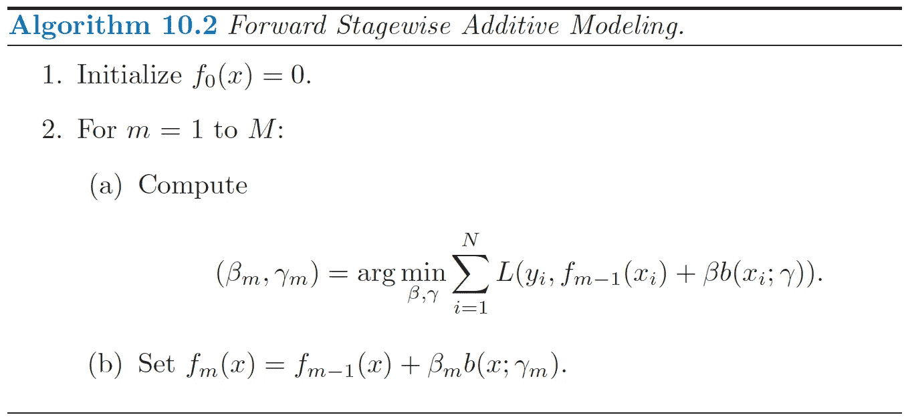
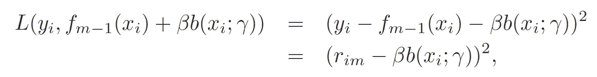
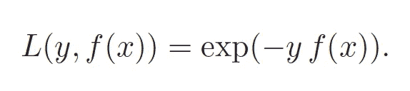

# 为什么升压拟合有残差

> 原文：<https://towardsdatascience.com/why-is-boosting-fitting-residual-9ac6f4e77550?source=collection_archive---------25----------------------->

## Boosting 算法的一般解释

Gardens By The Bay Singapore

> Boosting 算法在每次迭代中搜索最优的弱学习器函数，该函数在训练数据上**最小化损失函数。每个新的学习者都会试图“纠正”以前的学习者所犯的错误。**

# 动机

不用多介绍，大部分数据科学家应该都有使用各种 boosting 模型的经验，比如 XGBoost，用于项目或者 Kaggle 竞赛。许多文章将 boosting 算法描述为“递归地添加弱学习器以拟合先前学习器产生的残差”。嗯，是真的，但是为什么呢？本文旨在从更广泛的意义上解释助推的概念。

# 增压解释

**Boosting** 或**Forward Stagewise Additive Modeling**是一种集成学习方法，它将许多弱学习者组合起来，形成一个行为类似于强学习者的集合。它一般可以描述如下。

Boosting algorithm (Source: [ESLII](https://web.stanford.edu/~hastie/ElemStatLearn/printings/ESLII_print12.pdf))

在详细解释每个步骤之前，让我们澄清一下这些符号。

*   *x，y* :训练数据和实际值
*   *f* ᵢ *(x)* :在 *i* 迭代中收集弱学习者
*   *M* :要添加的树数
*   *N* :训练数据点数
*   *β* :扩展系数或集合中后续弱学习者的“权重”
*   *b(x；γ)* :由一组参数 *γ* 表征的弱学习函数
*   *L(y，ŷ)* :损失函数

现在让我们来看看每一步。

1.  初始化基本集合以预测所有定型数据的 0
2.  对于添加到集合中的每个后续弱学习者:

*   a)在训练数据上找到最小化损失函数的最佳展开系数[*β*和参数组[*γ*。注意，损失函数接受实际值和来自先前集合[*fₘ₋₁(x]*和当前弱学习器函数[*b(x；γ)* ]
*   b)找到最优的 *β* 和 *γ* 后，将学习能力弱的系数添加到集合中

最重要的步骤是 2a，它搜索最佳弱学习器函数以添加到集合中。当选择平方误差作为损失函数时，2a 中的公式可改写为:

Square Error Loss Function (Source: [ESLII](https://web.stanford.edu/~hastie/ElemStatLearn/printings/ESLII_print12.pdf))

在这个表达式中， *fₘ₋₁* 代表来自先前树的预测值。 *yᵢ* 代表实际值。 *yᵢ - fₘ₋₁* 将输出前一个学习器的残差， *rᵢₘ* 。因此，为了最小化平方损失，每个新的弱学习器将拟合残差。

对于回归问题的其他常见损失函数，例如绝对误差和 Huber 损失，这种说法仍然成立，因为残差总是被计算的。

那么，分类问题呢？

对于 2 类分类问题，AdaBoost 是由 Freund 和 [Schapire](https://en.wikipedia.org/wiki/Robert_Schapire) 在 1997 年推出的一种著名的 boosting 算法，它使用指数损失。在每次迭代中，训练样本将根据先前树的预测误差进行重新加权。错误分类的样本将被赋予更高的权重。后续树将适合重新加权的训练样本。尽管新树不直接与预测误差或偏差相匹配，但预测误差在匹配新树时起着重要作用。

Exponential Loss (Source: [ESLII](https://web.stanford.edu/~hastie/ElemStatLearn/printings/ESLII_print12.pdf))

感谢阅读！