# 为什么大家都去冰岛？

> 原文：<https://towardsdatascience.com/why-is-everyone-going-to-iceland-1f99083bee1a?source=collection_archive---------20----------------------->


Photo Credit: Thampitakkull Jakkree/Shutterstock

我试着用公开的数据来源来理解冰岛旅游业的崛起。

你好！(冰岛语再次问好)。在空闲时间，我喜欢在 YouTube 上看视频，主题包括摄影、电影、足球、喜剧等。我最近开始关注约翰尼·哈里斯的频道，是在看了他关于建立一个梦想工作室的视频后，无意中发现了他对冰岛旅游业为何大幅增长的分析(链接如下)。我一直想和我的摄影师朋友 Pablo 一起去冰岛，因为这个国家风景优美。

在这篇文章中，我决定利用公共数据来解释为什么冰岛的旅游业如此迅猛发展。视频本身很好地解释了旅游业的突然激增，并给出了一些很好的理由。我在这里的观点不是要反驳他的论点，而是用数据来看看我从中学到了什么。我找到公共数据源，清理数据，将数据可视化，并使用脸书先知进行预测。

# 数据源

对于我的调查，我就像在大学写研究论文时一样开始:谷歌搜索。我在查询相关的公共数据集，以便下载和分析。我选定了三个主要数据集，并在此附上了链接:

1.  **通过凯夫拉维克机场前往冰岛的游客**:这是国际交通的主要枢纽。我没有找到所有交通枢纽的所有游客的统计数据，但我认为这将是一个很好的整体样本。

```
airport = pd.read_excel(“/Users/stephenhyungilkim/Desktop/Iceland/hola.xlsx”, parse_dates=[“year”], index_col=”year”, freq=’Y’)
airport.head(5)
```

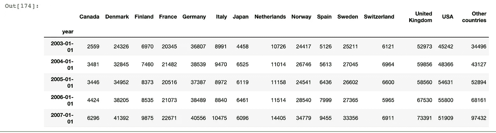

**2。事实列表冰岛**:这是从世界银行找到的，我把它简化为最相关的 20 个因素。有超过 150 个不同的类别，我把它减少到我最感兴趣的类别。

[https://data.worldbank.org/country/iceland](https://data.worldbank.org/country/iceland)

```
facts = pd.read_csv(“/Users/stephenhyungilkim/Desktop/Iceland/chau.csv”, parse_dates=[“Date”], index_col=”Date”)
facts.head(5)
```

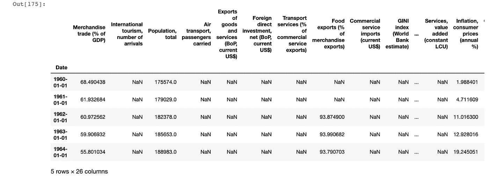

以下是所有缩减列的列表:

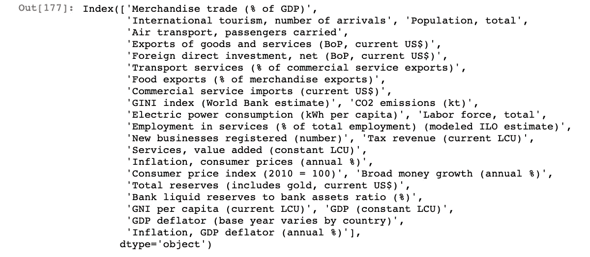

**3。每年的航空乘客数量**:1949 年至 2017 年期间，通过航空和海路抵达冰岛的外国游客。

```
visitor = pd.read_excel(“/Users/stephenhyungilkim/Desktop/Iceland/foreign-visitors-to-iceland-1949–2017.xls”,parse_dates=[“Date”])
#Foreign visitor arrivals by air and sea to Iceland 1949–2017
visitor.head(5)
```

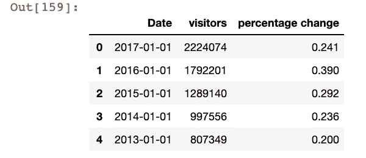

# 数据预处理

脸书预言家要求数据采用特定的格式，以便符合模型并做出预测。我使用数据集 3 进行脸书预言家预测，因为它包含了我正在寻找的变量，访问者数量。然而，其他两个数据集(1 和 2)也很有趣，可以看到相关性、模式等。

```
visitor[‘Date’] = pd.DatetimeIndex(visitor[‘Date’])
visitor.dtypes
```

确保数据集是时间序列:

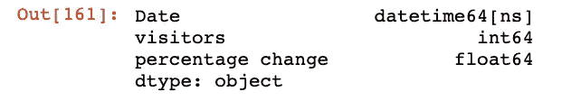

```
visitor = visitor.drop([‘percentage change’], axis=1)
```

我放弃了百分比变化，只留下了日期和访客人数。我们将对未来几天的访客数量进行预测，具体日期我们将在后面说明。

```
visitor = visitor.rename(columns={‘Date’: ‘ds’,
 ‘visitors’: ‘y’})
visitor.head(5)
```

这些列必须重命名为“ds”，即日期，以及“y”，即我们要预测其值的变量。

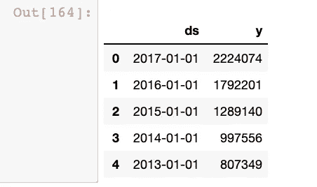

我们准备使用脸书先知，但在此之前，让我们来看看这个和其他两个数据集。

# 数据可视化

让我们从可视化第一个数据集开始。美国显然有很多感兴趣的游客…不知道为什么，也许口碑和更便宜的航班促成了这一点(机票价格是我想分析的一个问题，但找不到公开数据…)。

```
airport.plot(figsize=(15,10))
plt.title(‘Visitors to Iceland Through Keflavik Airport’)
plt.ylabel(‘Visitors’)
plt.xlabel(‘Date’)
```

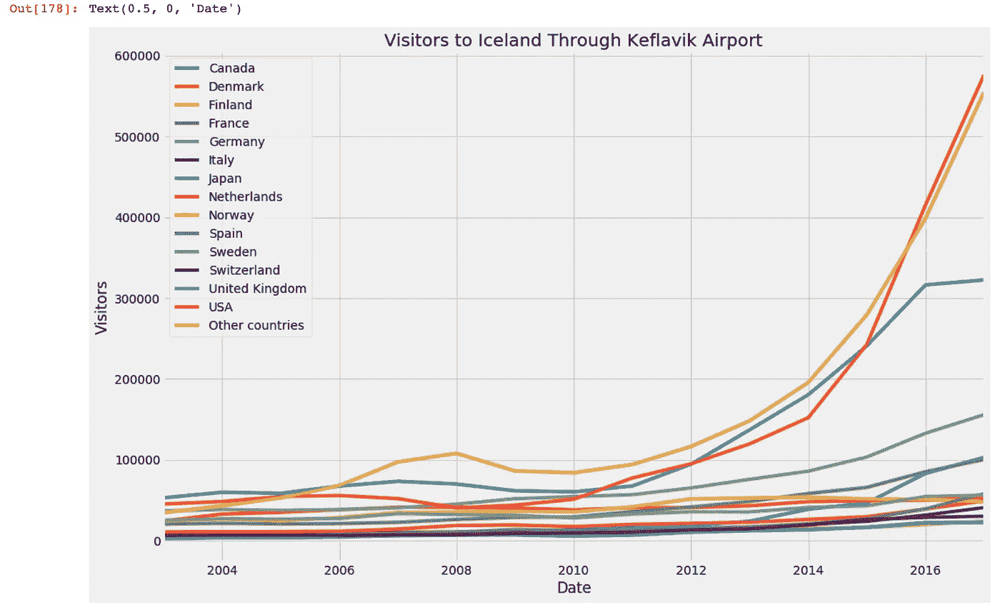

现在让我们来看看数据集#2。由于我们有这么多不同的变量，我从降序的 correlation_matrix 开始。很明显，像“航空运输、载客”和“国际旅游、抵达人数”是高度相关的，因为更多的乘客=更多的抵达人数，但其他像“银行流动储备与银行资产的比率(%)”和“人均国民总收入(当前 LCU)”更令人惊讶和具有争议性。

```
corr_matrix = facts.corr()
corr_matrix[“International tourism, number of arrivals”].sort_values(ascending=False)
```

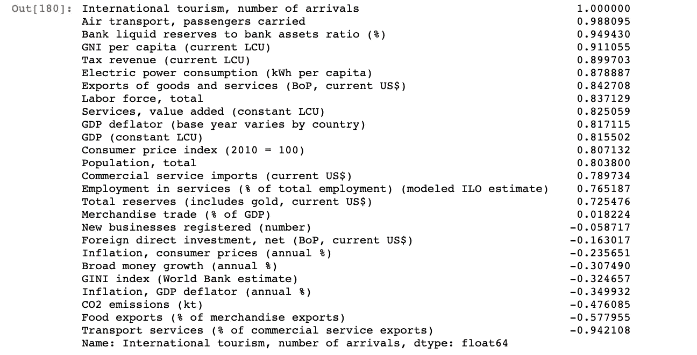

我也试着使用直方图，但是它没有我想象的那么有用，所以我把它去掉了。

**现在让我们看看第三组数据。**

```
ax = visitor.set_index(‘ds’).plot(figsize=(15,10))
ax.set_ylabel(‘Monthly Number of Airline Passengers’)
ax.set_xlabel(‘Date’)
#ax.set_yscale(‘log’)plt.show()
```

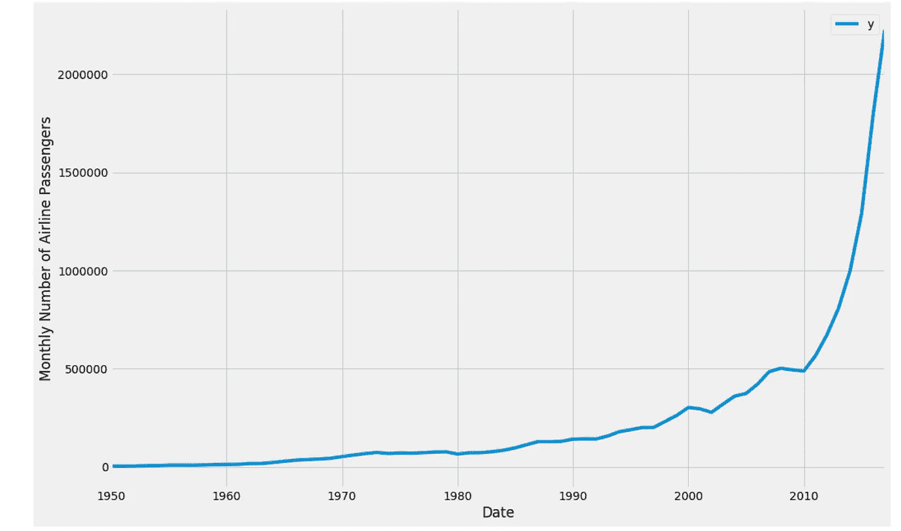

正如约翰尼·哈里斯在视频中所说，你可以看到乘客数量的飞速增长。由于比例太大，我把图表做成对数比例。除了多了一行以外，代码相同:

```
ax = visitor.set_index(‘ds’).plot(figsize=(15,10))
ax.set_ylabel(‘Monthly Number of Airline Passengers’)
ax.set_xlabel(‘Date’)
ax.set_yscale(‘log’)plt.show()
```

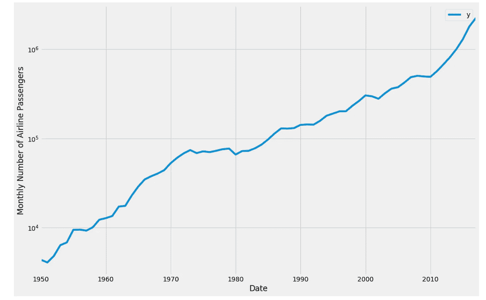

# 使用脸书先知的预测

虽然我主要应用 scikitlearn 库中的机器学习模型，因为这很容易，但我想尝试用脸书预言家预测时间序列。我读了一篇由 [Susan Li](https://medium.com/u/731d8566944a?source=post_page-----1f99083bee1a--------------------------------) 写的文章，并按照下面文章中的步骤进行了操作:

[https://www . digital ocean . com/community/tutorials/a-guide-to-time-series-forecasting-with-prophet-in-python-3](https://www.digitalocean.com/community/tutorials/a-guide-to-time-series-forecasting-with-prophet-in-python-3)

让我们将模型设定为 95%的不确定性。以下是关于先知的更多信息:[https://facebook.github.io/prophet/](https://facebook.github.io/prophet/)

```
# set the uncertainty interval to 95% (the Prophet default is 80%)
my_model = Prophet(interval_width=0.95)
```

正在拟合模型…

```
my_model.fit(visitor)
```

设定未来日期。请注意，我在频率中用“A”表示年度。

```
future_dates = my_model.make_future_dataframe(periods=10, freq=’A’)
future_dates.tail()
```

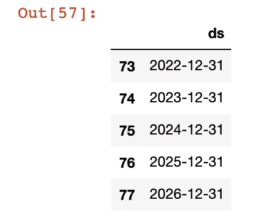

上面，为 2022、2023、2024、2025、2026 年创建了数据帧。

```
forecast = my_model.predict(future_dates)
forecast[[‘ds’, ‘yhat’, ‘yhat_lower’, ‘yhat_upper’]].tail()
```

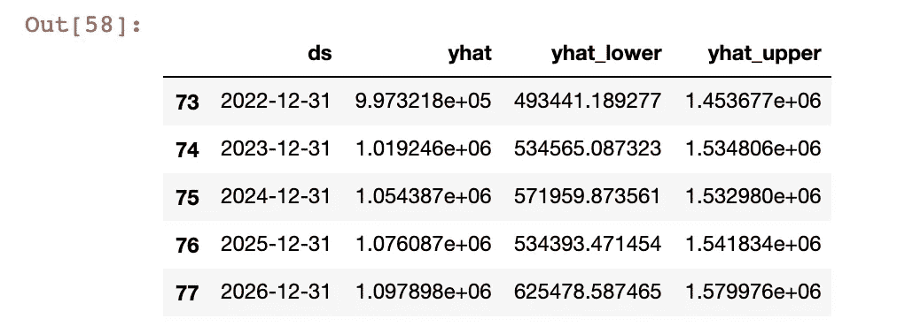

我们得到了自变量的值。“yhat_lower”是下限,“yhat_upper”是上限。

```
my_model.plot(forecast, uncertainty=True)
```

下面，我们有一个预测图:

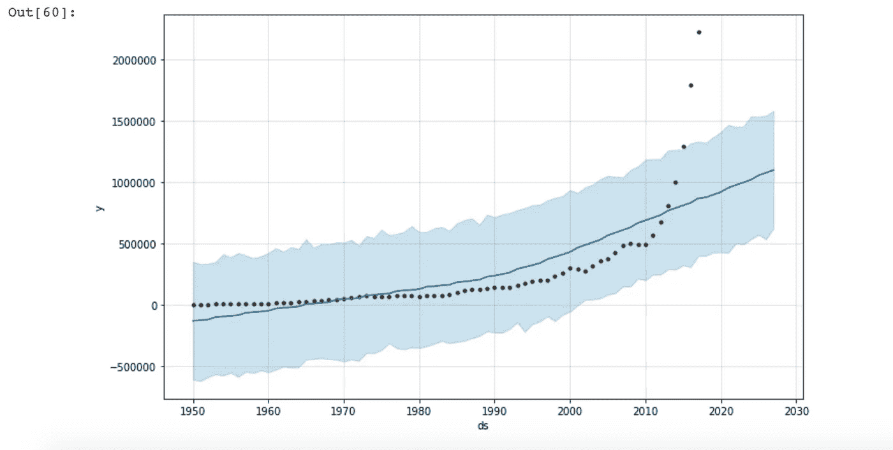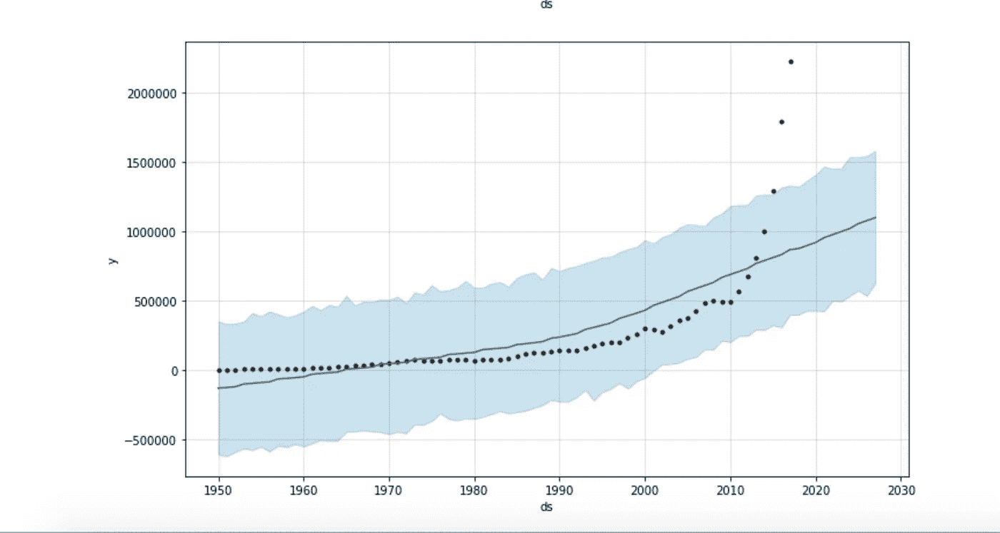

```
Above, we have a forecast plot.
```

Prophet 还允许我们将其分解为我们预测的组成部分:

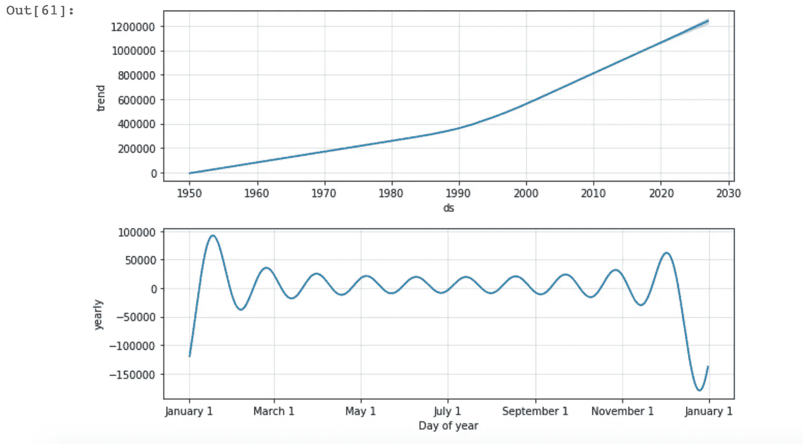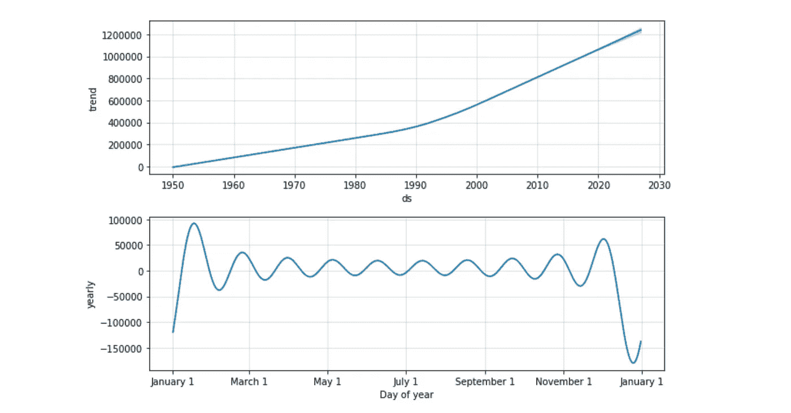

# 最后的话

虽然去冰岛旅行可能仍然是一个幻想，因为我今年早些时候已经用完了我的假期计数，但使用公共数据源来了解冰岛为什么最近成为如此受欢迎的旅游目的地是一件有趣的事情。我喜欢交叉引用#3 数据集和历史天气数据集。我尝试使用 OpenWeatherMap 的 API，它很容易使用，但必须为其全部功能付费。冰岛绝对在我的遗愿清单里！