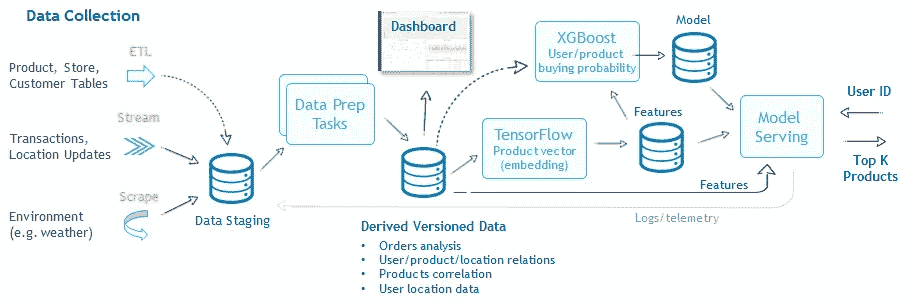
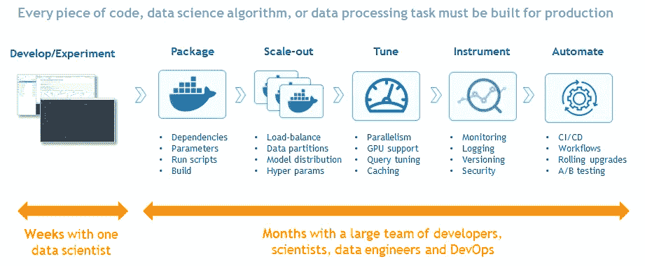

# 为什么将机器学习整合到真实的商业应用中如此困难？

> 原文：<https://towardsdatascience.com/why-is-it-so-hard-to-integrate-machine-learning-into-real-business-applications-69603402116a?source=collection_archive---------27----------------------->

你已经玩了机器学习，了解了神经网络的奥秘，几乎赢得了一场 [Kaggle](https://www.kaggle.com/) 比赛，现在你觉得已经准备好将这一切带到现实世界中。是时候构建一些真正的基于人工智能的应用程序了。

但是一次又一次，你面临挫折，你并不孤单。从一个像样的机器学习模型转移到下一个将其融入实际商业应用的水平需要时间和努力。为什么？

拥有一个训练有素的机器学习模型只是一个起点。对于一个正常运行的应用程序，还有许多其他需要考虑的事项和组件需要构建、测试和部署。

在下面的帖子中，我将展示一个真实的基于人工智能的应用程序(基于一个真实的客户用例)，解释挑战并提出简化开发和部署的方法。

# 用例:在线产品推荐

有针对性的产品推荐是增加收入的最常见方法之一，计算机会根据用户的历史偏好、产品与产品的相关性以及其他因素(如位置(如离商店的远近)、天气等)提出建议。

构建这样的解决方案需要分析历史交易并创建模型。然后，当将其应用于生产时，您会希望纳入新的数据，如客户的最后一次交易，并重新训练模型以获得准确的结果。

机器学习模型很少在原始数据上训练。需要进行数据准备以形成特征向量，这些特征向量将各种数据源聚合和组合成更有意义的数据集，并确定一个清晰的模式。一旦准备好数据，我们就使用一种或多种机器学习算法，进行训练，并创建模型或新的数据集，其中包含学习内容。

对于推荐引擎，最好结合深度学习(例如 [TensorFlow](https://www.tensorflow.org/) )来识别哪些产品是“一起”购买的，以及机器学习(例如 [XGboost](https://xgboost.readthedocs.io/en/latest/) )来基于用户和产品的历史行为识别用户和产品之间的关系。然后，将两个模型的结果合并到一个模型服务应用程序中。

Example pipeline: Real-time product recommendations

服务应用程序接受用户的 ID，从特性和用户表中获取额外的上下文，将其输入到模型中，并返回一组产品推荐。

请注意，服务必须在用户仍在应用程序中浏览时实时完成，因此缓存数据和模型总是更好。另一方面，最近的产品购买或位置可能会对未来的客户产品选择产生重大影响，您需要不断监控活动并更新功能表和模型。

在线业务需要自动化和应用到机器学习操作中的 CI/CD 流程，从而实现连续应用。支持自动扩展、满足需求波动、承受故障和提供数据安全性非常重要，更不用说考虑监管约束了。

# 机器学习操作流程

在典型的开发流程中，开发代码或模型只是第一步。最大的努力是使每个元素，包括数据收集、准备、培训和服务生产就绪，使它们能够在最少的用户干预下重复运行。

What it takes to turn code or algorithms into real application

数据科学和工程团队需要打包代码、解决可伸缩性、调整性能、工具化和自动化。这些任务现在需要几个月的时间。正如我在之前的文章《无服务器:[可以简化数据科学项目吗？](https://www.iguazio.com/serverless-can-it-simplify-data-science-projects/)。其他需要记住的重要工具是 [Kubernetes](https://kubernetes.io/) 和 [KubeFlow](https://www.kubeflow.org/) ，它们为机器学习世界带来了 CI/CD 和开放性。在我的帖子[Kubernetes:ML 管道的开放和可伸缩方法](https://www.iguazio.com/kubernetes-the-open-scalable-approach-to-ml-pipelines/)中阅读更多关于它们的内容。

# 机器学习代码的可移植性和可再现性

一个关键的挑战是，相同的代码可能在不同的环境中运行，包括用于实验的笔记本、ide(例如 [PyCharm](https://www.jetbrains.com/pycharm/) )和用于在集群上运行或作为自动化 ML 工作流引擎的一部分的容器。在每个环境中，您可能有不同的配置并使用不同的参数、输入或输出数据集。很多工作花费在移动和更改代码上，有时是由不同的人完成的。

运行工作后，您希望能够快速可视化结果，将它们与过去的结果进行比较，并了解哪些数据用于生成每个模型。针对这些需求有特定于供应商的解决方案，但是如果您想要实现跨环境的可移植性，就不能使用它们。

[Iguazio](https://www.iguazio.com/kubernetes-the-open-scalable-approach-to-ml-pipelines/) 与领先公司合作，为机器学习环境、元数据和工件形成跨平台标准和开放实现。这允许更大的简单性、自动化和可移植性。

观看此视频，了解如何在不到一分钟的时间内从本地 IDE 中运行/测试代码转移到生产级自动化机器学习管道(基于 KubeFlow)。

Automated ML pipeline and artifact management using KubeFlow