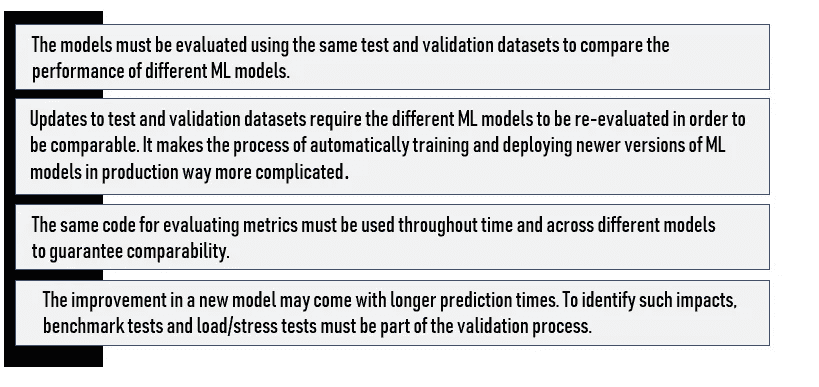
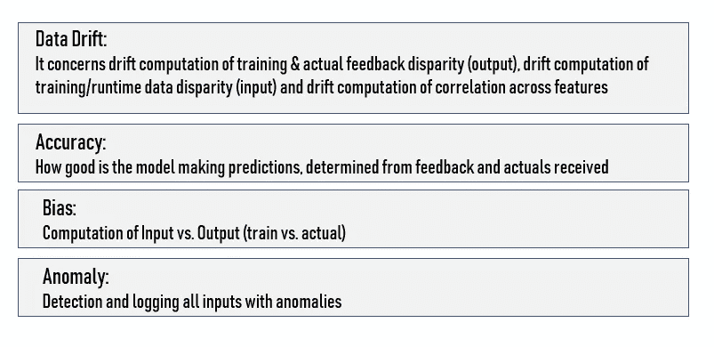

# 为什么机器学习部署很难？

> 原文：<https://towardsdatascience.com/why-is-machine-learning-deployment-hard-443af67493cd?source=collection_archive---------3----------------------->

[Source](https://cognism.com/revenue-ai)

在几个人工智能项目之后，我意识到，对于那些愿意通过人工智能创造价值的公司来说，大规模部署机器学习(ML)模型是最重要的挑战之一，随着模型变得更加复杂，这只会变得更加困难。

根据我作为顾问的经验，只有很小比例的 ML 项目能够进入生产阶段。人工智能项目失败的原因有很多，其中包括部署。对于每个决策者来说，充分理解部署是如何工作的，以及在达到这一关键步骤时如何降低失败风险是至关重要的。

> 部署的模型可以定义为无缝集成到生产环境中的任何代码单元，可以接收输入并返回输出。

我看到，为了将他们的工作投入生产，数据科学家通常必须将他或她的数据模型交给工程来实现。正是在这一步，一些最常见的数据科学问题出现了。

# 挑战

机器学习有一些独特的功能，这使得它更难大规模部署。这是我们正在处理的一些问题(**其他问题也存在**):

**管理数据科学语言 **

如你所知，ML 应用程序通常由用不同的**编程语言编写的元素组成..**。并不总是能很好地相互交流。我见过很多次，ML 管道以 R 开始，以 Python 继续，以另一种语言结束。

总的来说，Python 和 R 是 ML 应用程序最流行的语言，但是我注意到由于各种原因，包括速度，生产模型很少使用这些语言。将 Python 或 R 模型移植到 C++或 Java 之类的生产语言中是很复杂的，并且经常导致性能(速度、准确性等)下降。)的原始模型。

r 包可以在软件新版本出来的时候破)。此外，R 很慢，不会高效地处理大数据。

它是一种很好的原型语言，因为它允许简单的交互和问题解决，但是它需要被翻译成 Python 或 C++或 Java 来生产。

容器化技术，比如 Docker，可以解决大量工具带来的不兼容性和可移植性问题。然而，自动依赖检查、错误检查、测试和构建工具将不能跨越语言障碍解决问题。

再现性也是一个挑战。事实上，数据科学家可能会构建模型的许多版本，每个版本都使用不同的编程语言、库或同一库的不同版本。很难手动跟踪这些依赖关系。为了解决这些挑战，需要一个 ML 生命周期工具，它可以在培训阶段自动跟踪和记录这些依赖关系，将其作为代码进行配置，然后将它们与经过培训的模型捆绑在一个随时可以部署的工件中。

我建议您依赖一种工具或平台，它可以立即将代码从一种语言翻译成另一种语言，或者允许您的数据科学团队在 API 背后部署模型，以便它们可以在任何地方集成。

***计算能力和 GPU 的***

神经网络通常非常深入，这意味着训练和使用它们进行推理会占用大量计算能力。通常，我们希望我们的算法运行得很快，对于很多用户来说，这可能是一个障碍。

而且，现在很多制作 ML 都依赖 GPU。然而，它们是稀缺和昂贵的，这容易给扩展 ML 的任务增加另一层复杂性。

**便携性。**

模型部署的另一个有趣的挑战是缺乏可移植性。我注意到这通常是遗留分析系统的问题。由于缺乏将软件组件轻松迁移到另一个主机环境并在那里运行的能力，组织可能会受限于特定的平台。这可能会在数据科学家创建和部署模型时造成障碍。

**可扩展性。**

对于许多人工智能项目来说，可扩展性是一个真正的问题。事实上，您需要确保您的模型能够扩展并满足生产中性能和应用程序需求的增长。在项目开始时，我们通常在可管理的范围内依赖相对静态的数据。随着模型进入生产阶段，它通常会暴露于更大量的数据和数据传输模式。您的团队将需要几个工具来监控和解决性能和可伸缩性挑战，这些挑战将随着时间的推移而出现。

**我**认为可扩展性问题可以通过采用一致的、基于微服务的生产分析方法来解决。团队应该能够通过简单的配置更改，快速地将模型从批量迁移到按需迁移到流。同样，团队应该可以选择扩展计算和内存空间，以支持更复杂的工作负载。

***机器学习计算在尖峰中工作***

一旦你的算法被训练，它们并不总是被使用——你的用户只会在他们需要的时候调用它们。

这意味着您在上午 8:00 只支持 100 个 API 调用，但是在上午 8:30 支持 10.000 个 API 调用。

根据经验，我可以告诉你，在确保不为你不需要的服务器买单的同时，扩大和缩小规模是一个挑战。

出于所有这些原因，只有少数数据科学项目最终真正进入生产系统。

# 强有力的运作

我们总是花很多时间来准备我们的模型。健壮模型包括获取一个原型并对其进行准备，以使其能够实际服务于所讨论的用户数量，这通常需要大量的工作。

在许多情况下，整个模型需要用一种适合现有架构的语言重新编码。仅这一点就经常导致大量痛苦的工作，导致部署延迟数月。一旦完成，就必须将它集成到公司的 it 架构中，包括前面讨论过的所有库问题。除此之外，在生产环境中访问数据通常也是一项困难的任务，经常会受到技术和/或组织数据孤岛的困扰。

# 更多挑战

在我的项目中，我还注意到以下问题:

*   如果我们改变了某个输入特征，那么其余特征的重要性、权重或用途可能都会改变，也可能不会改变。ML 系统的设计必须便于跟踪特征工程和选择的变化。
*   当模型不断迭代和微妙变化时，跟踪配置更新同时保持配置的清晰性和灵活性成为额外的负担。
*   一些数据输入会随着时间而改变。我们需要一种方法来理解和跟踪这些变化，以便能够完全理解我们的系统。
*   ML 应用程序中可能会出现一些问题，传统的单元/集成测试无法识别这些问题。部署模型的错误版本，忘记一个特性，以及在一个过时的数据集上进行训练，只是其中的几个例子。

# 测试和验证问题

正如您可能已经知道的，由于数据变化、新方法等，模型在不断发展。因此，每次这样的变化发生时，我们都必须重新验证模型的性能。这些验证步骤带来了几个挑战:

除了在离线测试中验证模型，评估模型在生产中的性能也是非常重要的。**通常，我们在部署策略和监控部分对此进行规划。**

> ML 模型需要比常规软件应用更频繁地更新。

## 自动化 ML 平台

你们中的一些人可能听说过自动化机器学习平台。这可能是一个更快生产模型的好办法。此外，该平台可以支持多种模型的开发和比较，因此企业可以选择最符合其预测准确性、延迟和计算资源要求的模型。

> 多达 90%的企业 ML 模型可以自动开发。数据科学家可以参与到业务人员的工作中来，开发目前自动化无法实现的小部分模型。

许多型号会出现漂移(随着时间的推移性能下降)。因此，需要对部署的模型进行监控。每个部署的模型都应该记录所有的输入、输出和异常。模型部署平台需要提供日志存储和模型性能可视化。密切关注模型性能是有效管理机器学习模型生命周期的关键。

Key elements that must be monitored through a deployment platform

# 发布策略

探索部署软件的许多不同方式([这是一篇关于这个主题的很长的阅读文章](https://medium.com/@copyconstruct/monitoring-in-the-time-of-cloud-native-c87c7a5bfa3e))，其中“影子模式”和“金丝雀”部署对 ML 应用程序特别有用。在“影子模式”中，您捕获生产中新模型的输入和预测，而不实际服务于这些预测。相反，您可以自由地分析结果，如果检测到一个 bug，也不会有重大的后果。

随着您的体系结构的成熟，希望能够实现渐进或“金丝雀”版本。这样的实践是当你可以向一小部分客户发布时，而不是“全部或没有”。这需要更成熟的工具，但是当错误发生时，它可以最小化错误。

# 结论

机器学习仍处于早期阶段。事实上，软件和硬件组件都在不断发展，以满足 ML 的当前需求。

Docker/Kubernetes 和微服务架构可以用来解决异构性和基础设施挑战。现有的工具可以很大程度上单独解决一些问题。我认为，将所有这些工具结合起来实施 ML 是当今最大的挑战。

部署机器学习现在是而且将继续是困难的，这只是组织需要处理的现实。不过值得庆幸的是，一些新的架构和产品正在帮助数据科学家。此外，随着越来越多的公司扩大数据科学运营，他们也在实施使模型部署更容易的工具。

**更多信息，推荐 Christoper Samiullah 的这篇优秀文章:**
-[https://Christopher GS . github . io/machine % 20 learning/2019/03/17/how-to-deploy-machine-learning-models/](https://christophergs.github.io/machine%20learning/2019/03/17/how-to-deploy-machine-learning-models/)