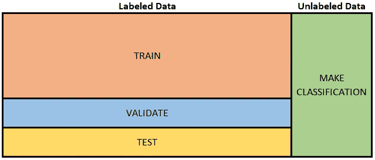
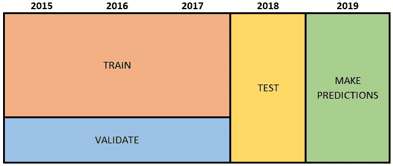
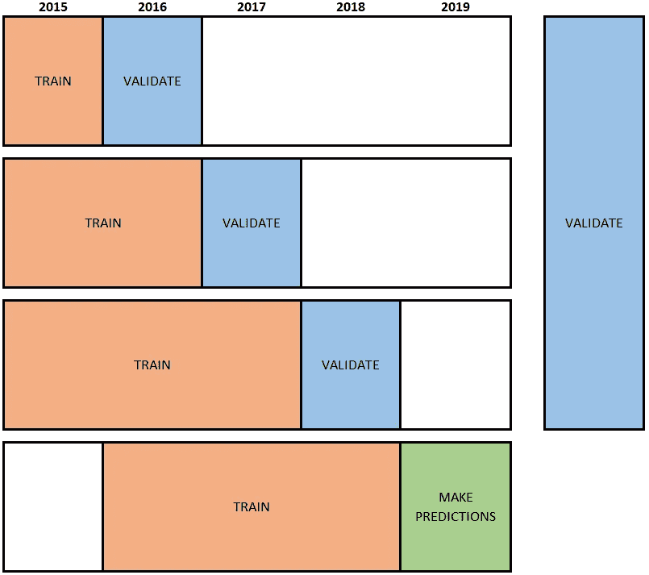
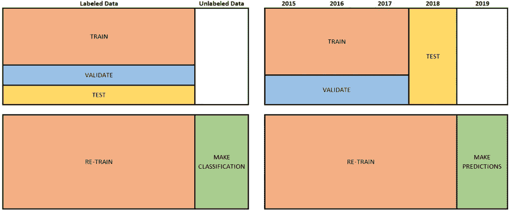

# 为什么超时验证不是更普遍？

> 原文：<https://towardsdatascience.com/why-isnt-out-of-time-validation-more-ubiquitous-7397098c4ab6?source=collection_archive---------9----------------------->

## 训练、验证和测试分区的超时性能需要计划和思考

监督机器学习的目的是对未标记的数据进行分类。我们希望算法能告诉我们一个借款人是否会违约，一个客户是否会购买，一张图片是否包含一只猫、一只狗、恶性肿瘤或良性息肉。这些算法“学习”如何使用带标签的数据进行分类，即我们知道借款人是否实际违约、客户是否购买以及一团像素实际显示的数据。通常情况下，研究人员获取标记的数据，并将其分为三种方式:培训、验证和测试/保留(术语[有时会有所不同](https://machinelearningmastery.com/difference-test-validation-datasets/))。他们根据训练数据训练数百个模型，并选择一个在验证数据上表现良好的模型。仅使用标记数据的子集来训练算法的原因是为了确保算法在任何*数据上表现良好——而不仅仅是用于训练算法的数据。研究人员经常多次重复这一步骤，选择不同的分割进行训练和验证，确保模型性能不是特定于特定的验证数据(k 倍交叉验证)。最后一步，研究人员评估模型在未知数据(测试集)上的性能。这提供了对模型在未标记数据上表现如何的度量。下图说明了这种经典设置:*

Figure 1: Classic train, validate and test split. Select model that performs well on ‘validate’. Evaluate its performance on ‘test’

在大量应用中，数据具有时间维度，使得标记的数据是过去，而未标记的数据是未来。例如，我们已经知道哪些借款人或客户在过去违约或购买了产品。我们想知道未来哪些会这样做。在这种情况下，算法的目的是*提前预测*标签。这意味着它不仅需要处理昨天的数据，还需要处理明天的数据。我问时间维度应该如何整合到经典的培训/验证/测试设置中。如果过程随着时间的推移而改变，这肯定会很重要。原来有一整个[子字段](http://users.rowan.edu/~polikar/RESEARCH/PUBLICATIONS/tnn11.pdf)在处理这个问题。这些方法从在训练数据上设置滑动窗口，到主动测试底层关系的变化。在这篇文章中，我回顾了设置训练、验证和测试数据的几个选项。

# 选项 1:及时验证，及时测试

让我们考虑一下，如果我们忽略数据的时间维度，并拆分所有带标签的数据，而不考虑其时间维度，会发生什么。我们使用来自同一时间段的*的数据来训练、验证和测试该模型。我们使用一个模型对新数据(比如 2019 年)进行预测，该模型是在标记的 2015-2018 年数据上训练、验证和测试的。下图说明了这种设置。优点是我们使用最新的数据来训练模型。缺点是，它假设过去存在的关系在将来也是一样的。如果这种关系随着时间的推移而改变，我们估计的性能指标(我们使用*实时*测试数据计算的)将*夸大*模型的真实性能，即一旦部署，模型的性能将比我们预期的更差。*

Figure 2: In-time validate and in-time test
Pro: trains using latest data
Con: no idea how model performs out-of-time

# 选项 2:及时验证，超时测试

另一种可能性是，我们坚持 2018 年，使用 2015-2017 年的数据训练模型，并在 2018 年的数据上进行测试。这种方法的优势在于，我们可以明确评估模型预测超时的能力。缺点是在构建模型时没有考虑预测超时的能力。这是因为我们选择在*及时*验证数据上表现良好的模型。此外，除非我们使用完整的 2015-2018 年数据重新训练模型，否则我们不会使用最新数据进行预测。

Figure 3: In-time validate, out-of-time test
Pro: measures how the model performs out-of-time
Con: performance out-of-time not taken into account during model building

# 备选方案 3:“向前走”

[Roger Stein](http://www.rogermstein.com/wp-content/uploads/BenchmarkingDefaultPredictionModels_TR030124.pdf) 建议在连续的(潜在的滑动)数据窗口上训练模型，并对下一个时间段进行预测。每次我们都使用特定时间点的所有观察值来重新训练模型，并对下一个时间段进行预测。来自每个窗口的预测被组合成一组预测。我们对许多不同的模型都这样做，并选择一个创建最佳组合预测的模型。这种方法的优势在于模型构建(即尝试哪些模型效果最好)明确考虑了模型做出超时预测的能力。由于模型针对每个窗口进行了重新调整，因此这种方法模拟了在实践中发生(或应该发生)的模型的周期性重新训练。这种方法的缺点是我们总是在同一组数据上验证预测，而不是随机选择的数据。(也许公布一部分测试数据可以消除这种担忧。)

Figure 4: “walk-forward” approach, out-of-time validate
Pro: model building takes into account ability to predict out-of-time
Con: validation set not random

# 再培训还是不培训

当我们对未来进行预测时，尽可能使用最近的数据可能是个好主意，这样我们就能捕捉到最近的现象。但是，如果我们像选项 2 中那样提供最新的数据(以评估超时性能)，我们可能应该在进行预测之前使用所有标记的数据重新训练模型。再培训如下图所示:

Figure 5: Once hyper-parameters are set, re-train the model using **all** labeled data

对于是否在部署之前使用所有训练和测试数据重新训练模型，网上存在一些[分歧。](https://forums.fast.ai/t/should-the-final-model-be-retrained-on-full-available-data-set-train-validation-not-test-after-validation/11748) [Kuhn 和 Johnson](https://www.springer.com/us/book/9781461468486) 在关于过拟合、数据分割和模型调整的章节中，他们说“然后我们使用选定的调整参数，用所有的训练数据建立一个最终的模型。”(第 65 页)。同样，吴恩达在他的一篇[讲稿](http://cs229.stanford.edu/notes/cs229-notes5.pdf)中说，从交叉验证程序中选择一个模型后，我们可以“有选择地”在“整个训练集”上重新训练这个模型

在模型参数和超参数(又名调整参数)之间画出[的区别是很有帮助的。超参数决定了模型的*结构*，一般无法从数据中估计。它们包括诸如树的复杂性、KNN 算法中的 k、特征集、函数形式(例如，线性与二次)等。相反，模型参数包括回归系数、树规则、支持向量。这些可以用数据来估计。模型构建阶段就是寻找超参数。一旦超参数(即模型的结构)得到验证，似乎没有理由不使用尽可能多的数据来获得模型参数的最准确估计。这些参数应该用于部署模型和进行分类或预测。](https://machinelearningmastery.com/difference-between-a-parameter-and-a-hyperparameter/)

# 结论

总之，如果我们按照经典的设置，忽略选项 1 中数据的时间维度，我们不知道该模型将如何处理过时的数据。在选项 2 中，我们至少有一个模型超时性能的度量。然而，只有当我们做了类似选项 3 的事情时，我们才是在建立模型来预测未来。不管我们做什么，在进行预测之前使用所有标记的数据重新训练模型似乎是一个好主意。

我很难找到没有时间维度的应用程序的例子。我想一堆 MRI 图像中只有一些被标记了，这是一个例子，但是我的感觉是这些一次性的项目很少。此外，虽然一些过程随着时间的推移是稳定的(例如天气或图像分类——今天的狗明天看起来会和狗一样)，但客户行为等过程必然会随着时间的推移而变化。因此，令人惊讶的是，超时测试和验证的讨论(和实现)并不普遍。不合时的性能可能比及时的性能更差，特别是如果您有许多及时标记的数据，不是很长的时间序列，并且是一个非平稳过程。然而，不做一些过时的评估可能会困扰开发人员，因为随后的数据将显示该模型的性能比指定的及时性能度量更差。