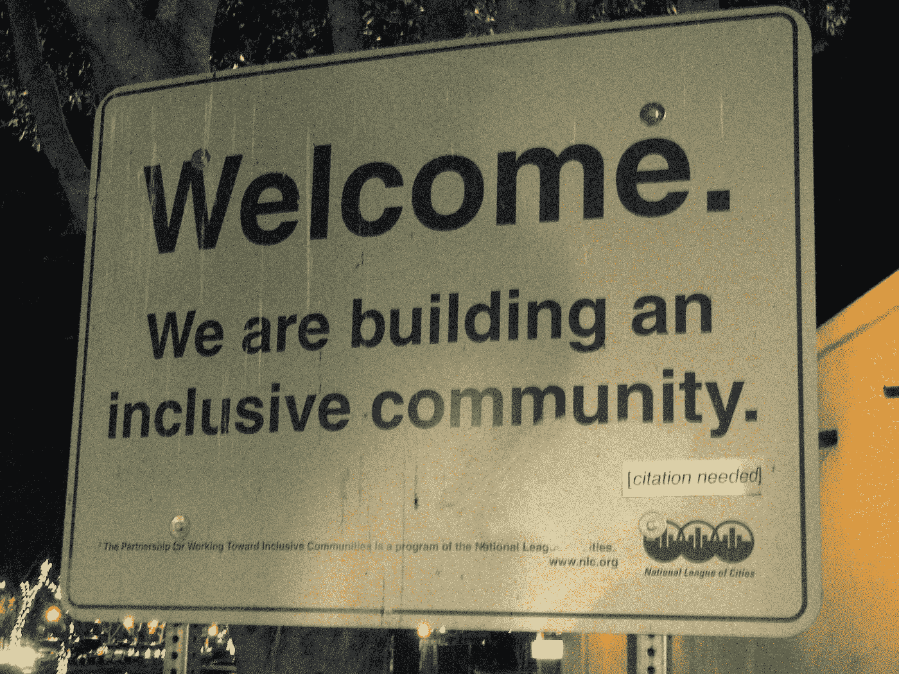

# Kaggle 为什么不包容，如何搭建更包容的数据科学平台

> 原文：<https://towardsdatascience.com/why-kaggle-is-not-inclusive-and-how-to-improve-it-6e2013c82b63?source=collection_archive---------14----------------------->

> 如果你想擅长在游泳池游泳，那很好，去游泳吧。“如果你想在公海上表现出色，那就去奥姆德纳吧”——莱昂德罗·桑切斯，来自巴西的奥姆德纳挑战合作者。
> 
> *“在过去的几个月里，我在 Omdena 的人工智能挑战赛中学到的东西比我在所有比赛中学到的东西加起来还要多。”——Murli Sivashanmugam，来自印度的 Omdena 挑战赛合作者。*

不要误会我的意思，我认为 Kaggle 是一个很好的平台，让数据科学家磨练他们的技能，并在理论上应用学到的知识。

但这就是为什么它走得还不够远。

如果你是一名数据科学家，要想在 Kaggle 中名列前茅，你必须为 0.1%的分数而奋斗。**这样做的努力在现实生活中很多时候是不值得的。**添加数据泄漏探测、堆叠、提升、集成以实现 0.1%是必须的。当然，对于排行榜来说，这是非常有价值的，但对于现实生活来说，它根本没有价值，因为它降低了可解释性。

其次，**大多数解决方案在生产环境中是不可复制的。**记住，在一个游戏中，你在排行榜上寻找结果，而在另一个游戏中，你在构建完整的解决方案。

但更重要的是，**不是每个人都有机会与数据科学家同事一起工作并向他们学习。例如，像南非的单身母亲扎希达或肯尼亚的索马里难民穆尼拉这样的人，位于世界的偏远地区，可能没有其他人可以合作。不是每个人都有机会上大学或者来自大城市，在那里他们可以遇到其他数据科学家。**

 [## 让互联网成为你的人工智能大学，成为变革者。

### 穆尼拉离开索马里是因为暴力，但她没有失去希望，而是有着远大的理想。

medium.com](https://medium.com/omdena/make-the-internet-your-ai-university-and-be-a-changemaker-f75d9c441f78) 

想要挑战 Kaggle **的组织必须公开数据集**，这并不适合所有的商业模式。此外，许多现实世界的问题需要**公司与开发人员密切合作和迭代，**这在 Kaggle 中是不可能的。

# 如何改进 Kaggle，使其更具包容性

我们认为，让世界各地的人们在一个学习环境中相互联系，共同解决一个有趣的现实世界问题，这将是一件非常棒的事情。

> “过去，我在‘ka ggle’中尝试过一些比赛，尽管它帮助我提高了对人工智能领域的理解，但我觉得由于比赛的背景，学习的机会是有限的。“我相信，当我们作为一个团队为一个共同的目标而努力时，最好的学习就会发生。”——Murli Sivashanmugam，来自印度的 Omdena 挑战赛合作者。

# (有抱负的)数据科学家的优势

1.  **通过真实世界的经验来弄脏你的手。来自印度的 Rohith Paul】说，虽然***我参加了一些 Kaggle 比赛，其中的数据已经被清除，但 Omdena 在现实世界中的曝光对我来说是一种新的体验，我喜欢它。*****
2.  ****与领域专家密切合作。**大多数现实世界的问题不仅限于数据科学问题，而是涉及领域专家来创造价值。我们已经看到，在与领域专家合作时，来自不同背景的数据科学家帮助公司细化问题，并为问题提供新的视角。**

**用来自以色列的亚历山大·拉斯科伦斯基的话说**

> ***“Omdena 可以通过在简历中提及真实工作经历的机会给人们提供如此丰厚的奖金，这是现在任何公司都要求的”。***

# **组织的优势**

1.  **由 30-40 名具有不同技能和经验水平的从业者组成的**精选团队**。**
2.  ****数据内部共享。****
3.  **解决问题的社区包括公司(通常是数据科学家)通过**直接接触项目**以及必要时的额外参与。**
4.  **社区成员有内在的动力，并且经常自己面对这个问题。他们不仅建立一个模型，还帮助公司提炼问题，并把问题放到一个更大的背景中。这是我们在所有挑战中反复看到的事情。**

> **我完全同意对社区和有目的的合适的人的强调。这实际上是创造一个协作和知识共享环境的关键，看到它是如何工作的令人惊讶。**
> 
> ***丹尼尔·米卡，时尚人工智能初创公司创始人***

**用联合国世界粮食计划署驻尼泊尔代表绍拉夫·苏曼的话说，**

> **Omdena 的协作方法将创新带到了一个全新的水平，其理念是利用技术让不同能力的人一起解决问题。这种方法背后的驱动力是通过协作精神、指导和现场指导加速学习。**

**在过去的六个月里，我们的社区建立了深度学习模型，以 99%的准确率检测树木和预防森林火灾，预测模型，以确定安全区域和路线来阻止性骚扰，以及应对气候变化和暴力冲突的模型。**

**更多的用例可以在我们的[博客](https://medium.com/omdena)上找到。**