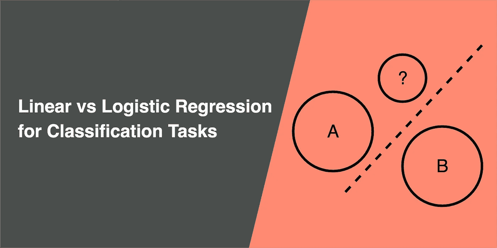
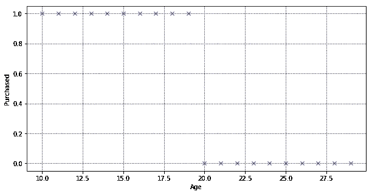
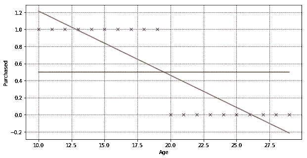
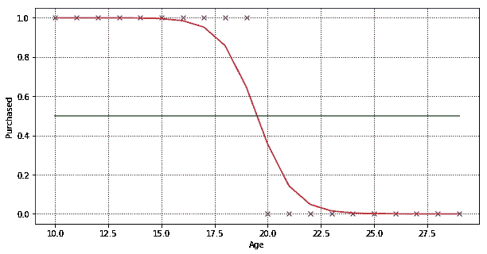
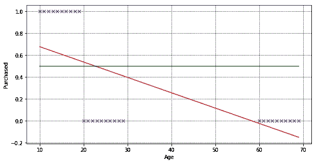
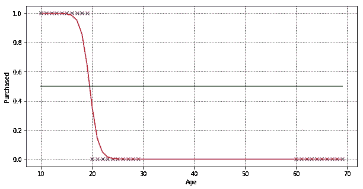
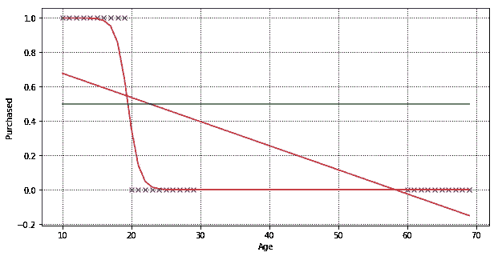

# 为什么线性回归不适合分类

> 原文：<https://towardsdatascience.com/why-linear-regression-is-not-suitable-for-binary-classification-c64457be8e28?source=collection_archive---------7----------------------->

## 分类任务的线性回归与逻辑回归



本文解释了为什么在分类问题上逻辑回归比线性回归表现得更好，以及线性回归不适合的两个原因:

*   预测值是连续的，而不是概率性的
*   使用线性回归进行分类时，对不平衡数据敏感

[监督学习](https://en.wikipedia.org/wiki/Supervised_learning)是机器学习必不可少的一部分。这是通过将输入变量映射到结果标签，从训练数据集中的示例中学习的任务，然后结果标签可用于预测新观察的结果。监督学习分类任务的示例有:

1.  给出泰坦尼克号沉没时幸存和未幸存的乘客名单，预测是否有人能在灾难中幸存
2.  给定一组猫和狗的图像，识别下一个图像是否包含一只狗或一只猫
3.  给定一组带有情感标签的电影评论，确定一个新评论的情感( [from Kaggle](https://www.kaggle.com/c/movie-review-sentiment-analysis-kernels-only/overview) )
4.  给定从 0 到 9 的手绘数字图像，识别手绘数字图像上的数字

示例 1 和 2 是[二元分类](https://en.wikipedia.org/wiki/Binary_classification)问题的示例，其中只有两种可能的结果(或类)。例 3 和例 4 是有两个以上结果的[多类分类](https://en.wikipedia.org/wiki/Multiclass_classification)问题的例子。

# 使用线性回归可以解决分类问题吗？

假设我们创建了一个完美平衡的数据集(所有事情都应该如此)，其中包含一个客户列表和一个标签，以确定客户是否购买了产品。在数据集中，有 20 个客户。10 名年龄在 10 至 19 岁之间的顾客购买了产品，10 名年龄在 20 至 29 岁之间的顾客没有购买产品。“已购买”是由 0 和 1 表示二进制标签，其中 0 表示“客户没有购买”，1 表示“客户购买”。



Our sample training dataset of 20 customers and their purchase label

[线性回归](https://en.wikipedia.org/wiki/Linear_regression)模型的目的是找到输入变量和目标变量之间的关系。下面是我们使用上述数据集训练的线性回归模型。**红线**是训练数据集的最佳拟合线，旨在最小化预测值和实际值之间的距离。



Linear regression model, showing best fit line for the training dataset

使用这个模型进行预测是非常简单的。给定任何年龄，我们都能够预测 Y 轴上的值。如果 Y 大于 0.5(高于绿线)，则预测该客户会购买，否则不会购买。

```
+-----+-------------------+
| Age | Predicted Y Value |
+-----+-------------------+
|  10 |        1.21428571 |
|  15 |        0.83834586 |
|  19 |        0.53759398 |
|  20 |        0.46240602 |
|  25 |        0.08646617 |
|  30 |       -0.28947368 |
+-----+-------------------+
```

# 问题#1:预测值是连续的，不是概率性的

在二元分类问题中，我们感兴趣的是结果发生的概率。概率的范围在 0 到 1 之间，其中某件事情一定会发生的概率是 1，0 是某件事情不太可能发生。但是在线性回归中，我们预测的是一个绝对数字，其范围可以在 0 和 1 之外。

使用我们的线性回归模型，任何 30 岁以上的人都有一个负“购买”价值的预测，这实际上没有意义。当然，我们可以将任何大于 1 的值限定为 1，将小于 0 的值限定为 0。线性回归还是可以的吧？

是的，这可能行得通，但是[逻辑回归](https://en.wikipedia.org/wiki/Logistic_regression)更适合分类任务，我们想证明逻辑回归比线性回归产生更好的结果。让我们看看逻辑回归是如何对数据集进行分类的。



Logistic regression model, a sigmoid curve that fit the training dataset

现在，我们在同一个数据集上训练了两个模型，一个通过线性回归，另一个通过逻辑回归。我们可以通过使用均方根误差(RMSE)和决定系数(R 得分)来比较这两种模型的性能。

```
+---------------------+--------------------+----------------------+
|                     | R2 (higher better) | RMSE (lower better)  |
+---------------------+--------------------+----------------------+
| Linear regression   | 0.7518796992481203 | 0.062030075187969935 |
| Logistic regression | 0.9404089597242656 | 0.014897760068933596 |
+---------------------+--------------------+----------------------+
```

r 是观察数据点与拟合回归线接近程度的量度，通常越高越好。但是仅有 R 是不够的，所以我们也要看看 RMSE。RMSE 衡量观察数据点与模型预测值的距离，越低越好。

从度量标准来看，在分类任务中，逻辑回归比线性回归表现得好得多。就像[凯西·科兹尔科夫](https://medium.com/u/2fccb851bb5e?source=post_page-----c64457be8e28--------------------------------) [引用它](https://hackernoon.com/machine-learning-is-the-emperor-wearing-clothes-59933d12a3cc):

> 神经网络也可以被称为“瑜伽网络”——它们的特殊能力给了你一个非常灵活的边界。

# 问题#2:对不平衡数据敏感

让我们再添加 10 个年龄在 60 到 70 岁之间的客户，并训练我们的线性回归模型，找到最佳拟合线。



Linear regression model on 30 customers

我们的线性回归模型成功地拟合了一条新的线，但是如果你仔细观察，一些客户(年龄 20 到 22 岁)的结果被错误地预测了。

```
+-----+-------------------+
| Age | Predicted Y Value |
+-----+-------------------+
|  18 |        0.56495292 |
|  19 |        0.55091537 |
|  20 |        0.53687781 |
|  21 |        0.52284026 |
|  22 |        0.50880271 |
|  23 |        0.49476516 |
|  24 |        0.48072761 |
|  25 |        0.46669006 |
+-----+-------------------+
```

线性回归试图通过最小化预测误差来拟合回归线，以便最小化年龄在 60 至 70 岁之间的客户的预测值和实际值之间的距离。让我们用相同的数据集训练一个逻辑回归模型。



Logistic regression model on the same training dataset

是啊！在这个非常简单的数据集中，逻辑回归成功地对所有数据点进行了完美的分类。

```
+-----+-------------------+
| Age | Predicted Y Value |
+-----+-------------------+
|  18 |        0.85713668 |
|  19 |        0.64502441 |
|  20 |        0.35497751 |
|  21 |        0.14286435 |
|  22 |        0.04805457 |
+-----+-------------------+
```

让我们再次比较两个模型的 R 和 RMSE，你会发现逻辑回归比线性回归做得更好。

```
+---------------------+---------------------+----------------------+
|                     | R2 (higher better)  | RMSE (lower better)  |
+---------------------+---------------------+----------------------+
| Linear regression   |  0.4211265134234073 |  0.12863855257257611 |
| Logistic regression |  0.9553066567250715 |  0.00993185406109522 |
+---------------------+---------------------+----------------------+
```

# 结论



Both the linear and the logistic regression line

线性回归适用于预测连续值的输出，例如预测房地产价格。其预测输出可以是任何实数，范围从负无穷大到无穷大。回归线是一条直线。

而逻辑回归用于分类问题，预测概率范围在 0 到 1 之间。例如，预测客户是否会购买。回归线是一条 s 形曲线。

# 笔记本

在这个[笔记本](https://gist.github.com/jinglescode/c0a3065dfb0fdc03287938cc600489a3)中查看本文中使用的代码。

[](/data-scientist-the-dirtiest-job-of-the-21st-century-7f0c8215e845) [## 数据科学家:21 世纪最肮脏的工作

### 40%的吸尘器，40%的看门人，20%的算命师。

towardsdatascience.com](/data-scientist-the-dirtiest-job-of-the-21st-century-7f0c8215e845) [](https://www.linkedin.com/in/jingles/)[](https://towardsdatascience.com/@jinglesnote)[](https://jingles.substack.com/subscribe)