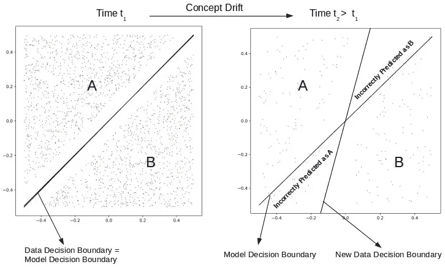
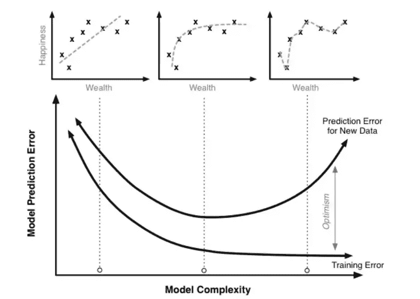
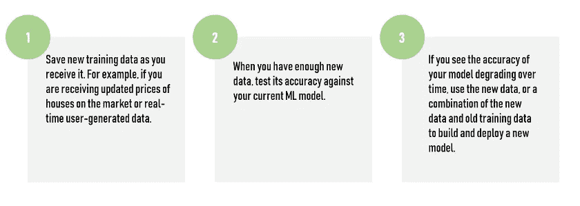
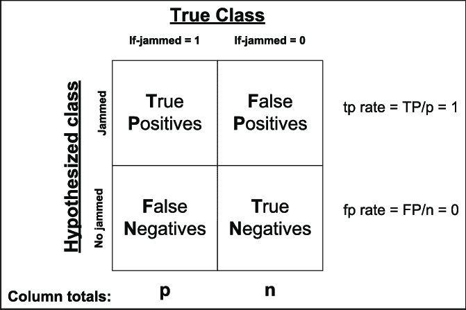

# 为什么机器学习模型在生产中会退化

> 原文：<https://towardsdatascience.com/why-machine-learning-models-degrade-in-production-d0f2108e9214?source=collection_archive---------3----------------------->

在几次由于意外的 ML 退化而导致 ML 项目失败之后，我想分享一下我在 ML 模型退化方面的经验。事实上，相对于模型维护，有很多关于模型创建和开发阶段的宣传。

假设机器学习解决方案在投入生产后无需维护就能完美工作是一个错误的假设，也是公司将第一批人工智能(AI)产品推向市场时最常见的错误。

> *一旦你把一个模型投入生产，它就开始退化。*

# 为什么 ML 模型会随着时间退化？

正如你可能已经知道的，数据是一个成功的 ML 系统的最重要的组成部分。拥有一个为你提供准确预测的相关数据集是一个很好的开始，**但是这些数据能持续提供准确预测多久呢？**

在所有 ML 项目中，预测您的数据将如何随时间变化是关键。在一些项目中，我们低估了这一步，很难实现高精度。在我看来，一旦你在 PoC 阶段后对你的项目感到有信心，就应该制定一个计划来保持你的模型更新。

事实上，在你开始使用它之前，你的模型的准确性将处于最佳状态。这种现象被称为概念漂移，虽然在过去的二十年里学术界对它进行了大量的研究，但在行业最佳实践中它仍然经常被忽略。

> ***概念漂移:*** *是指模型试图预测的目标变量的统计属性，以不可预见的方式随时间发生变化。这就产生了问题，因为预测变得不那么准确了，久而久之。*

[Source](http://xplordat.com/2019/04/25/concept-drift-and-model-decay-in-machine-learning/?source=post_page---------------------------)

关键是，与计算器相比，你的 ML 系统确实与现实世界互动。如果你使用 ML 来预测你的商店的需求和价格，你最好考虑一下本周的天气、日历和你的竞争对手在做什么。

在概念漂移的情况下，我们对数据的解释随着时间而变化，即使数据的一般分布没有变化。这导致终端用户将模型预测解释为对于相同/相似的数据已经随着时间而恶化。数据和概念也可能同时漂移，使问题变得更加复杂…

我注意到，依赖于人类行为的模型可能特别容易退化。**显然，可以根据项目的性质来预测风险。在大多数情况下，必须制定定期的模型审查和再培训计划。**

此外，大多数模型只能捕捉反映他们看到的训练数据的模式。一个好的模型捕捉到了这些数据中重要的部分，忽略了不重要的部分。这创造了**一般化**性能，但是任何模型对此的准备程度都是有限的。

> ***泛化:*** *指的是你的模型能够恰当地适应新的、以前未见过的数据，这些数据来自与用来创建模型的分布相同的分布。它与过度拟合的概念密切相关。如果你的模型过度拟合，那么它将不能很好地概括。*

[Source](https://qph.fs.quoracdn.net/main-qimg-17ec84ff3f63f77f6b368f0eb6ef1890.webp?source=post_page---------------------------)

泛化性能的最佳测试是查看模型在长时间内如何处理真实世界的数据。这个过程至少有两个主要因素。

# 如何防止模型退化？

这听起来可能很明显，但在部署后监控您的 ML 性能是至关重要的。如果监视所有特性听起来像是一项耗时的任务，我们可以监视一些关键特性，它们在数据分布上的变化可能会严重扭曲模型结果。我强烈建议你在生产之前为这个过程创建一个策略(通过识别正确的元素)。

> *模型监控是一个持续的过程。*

如果您观察到模型性能下降，那么是时候重新构建模型设计了。棘手的部分不是刷新模型和创建一个重新训练的模型，而是**考虑可能提高模型性能并使其更加可靠和准确的附加功能。**

完成上述步骤后，就可以使用新的或修改后的特征和模型参数集来重新创建模型了。在这一点上，我们的目标是确定一个能够提供最佳精度的最佳模型，该模型可以很好地适用于某些数据漂移。

我注意到，在某些情况下，重新创建模型并不能提高模型的性能。在这些情况下，分析模型出错的例子并寻找当前特性集之外的趋势有助于识别新特性。**基于该知识的新特征的创建可以给予模型新的经验来学习。**

## 人工学习

我们经常使用的用新数据维护模型的一个解决方案是使用我们最初用来构建模型的相同过程来训练和部署我们的模型。**我们称之为手动学习。**你可以想象这个过程会很耗时。我们多久重新培训一次我们的模型？周刊？日常？答案取决于你的 ML 申请。

当我们手动重新训练模型时，我们可能会发现一种新的算法或一组不同的功能，从而提高准确性。事实上，定期回顾你的过程可能是个好主意。正如我前面提到的，你可能会发现一种不同的算法或一组新的功能来改善你的预测，而这不一定是持续学习系统擅长的事情。

> *也许你可以用前期收集的数据每月或每年更新模型。*

这也可能涉及回测模型，以便在重新拟合静态模型时选择适当数量的历史数据来包括。

## 重量数据

另一个解决方案是加权数据。的确，一些算法允许你衡量输入数据的重要性。

使用与数据的年龄成反比的加权系统可能是有意思的，使得更多的注意力放在最近的数据上(较高的权重)，而较少的注意力放在最近的数据上(较小的权重)。

# 持续学习

我最喜欢的方法是拥有一个可以持续评估和重新训练模型的自动化系统。持续学习系统的好处是它可以完全自动化。

总的来说，合理的模型监督与精心设计的模型检查计划相结合，对于保持生产模型的准确性至关重要。优先检查关键变量，并在发生变化时设置警告，这将确保您永远不会因环境变化而措手不及，从而使您的模型失去效力。

在数据点具有高度独立性的输入变量的情况下，在**统计过程控制**中使用的控制图可用于检测过程的变化。

# 处理模型漂移

我坚持这一点，但是你的 ML 的成功也取决于你计划维护你训练过的模型的方式。在几个项目中，我意识到对模型工作方式缺乏经验的商业领袖可能没有预见到这种需求。

> *生产模型包括监控和维护。*

应该定期评估新数据集上的模型性能。应该定期可视化和比较这些性能跟踪，以便您可以确定何时需要干预。有几种评估 ML 性能的标准。

Confusion Matrix

**模型退化的原因可以被发现并被显式建模。可以研究、理解和利用周期性的时间效应。一旦模型收集了足够的性能指标，这可能是数据科学团队要解决的项目。假设你一直在追踪他们。**

定期考虑性能指标并触发模型的重新训练或重建的程序也是必要的，因为没有它，您将能够看到性能的损失，但没有解决它的系统。

# 投资和团队

除了技术方面，我强烈建议您在项目投入生产后，将最好的数据科学家和工程师留在项目中。在经典的软件项目中，部署完成后，你的运营团队会处理它，工程师们会继续开发下一个大项目，与之相比，ML 和 AI 系统中的许多技术挑战是保持它们的准确性。

你需要投资来保持你的客户使用的机器学习产品和服务的准确性。这意味着与传统软件相比，运营 ML 产品的边际成本更高。

# 维修费用

为了保持高质量的模型，理想情况下，算法应该在每次数据交付时重新训练。另一方面，为了优化成本，应该尽量少做。

显然，某些机器学习开发实践招致更多的技术债务，因此比其他的需要更多的未来维护。机器学习专用开发债务风险因素多种多样。它们包括无数的概率变量、数据依赖性、递归反馈循环、流水线过程、配置设置以及加剧机器学习算法性能的不可预测性的其他因素。

这些复杂性越多，进行有效维护所需的根本原因分析就越困难。

您将无法完全自动化地摆脱维护负担。在任何情况下，倾向于机器学习模型都需要仔细审查、批判性思维和人工努力，只有受过高级培训的数据科学家才能提供这些。