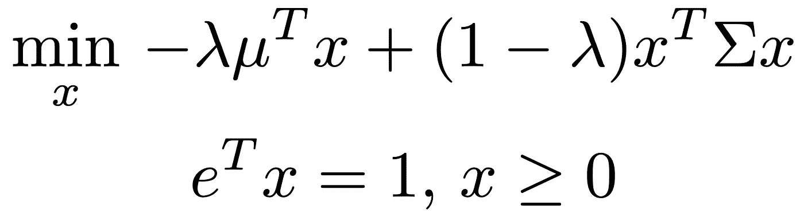
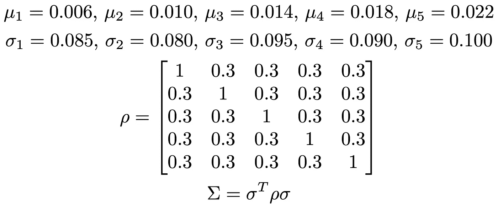
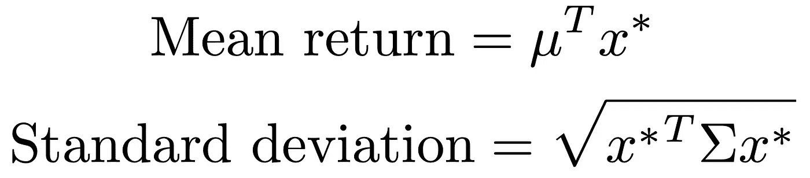
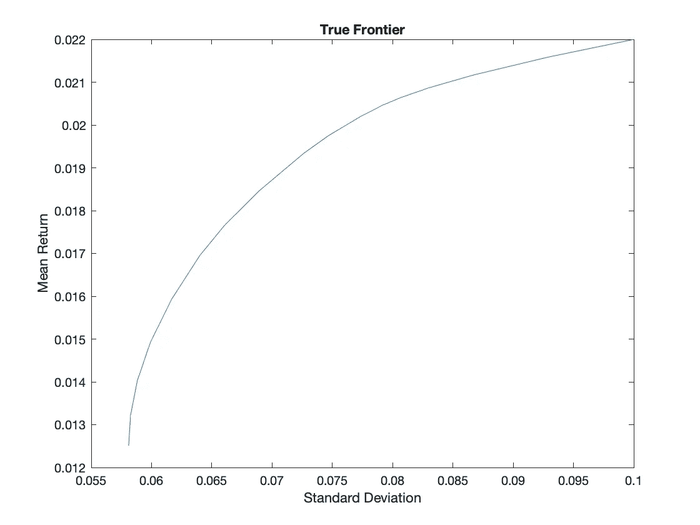
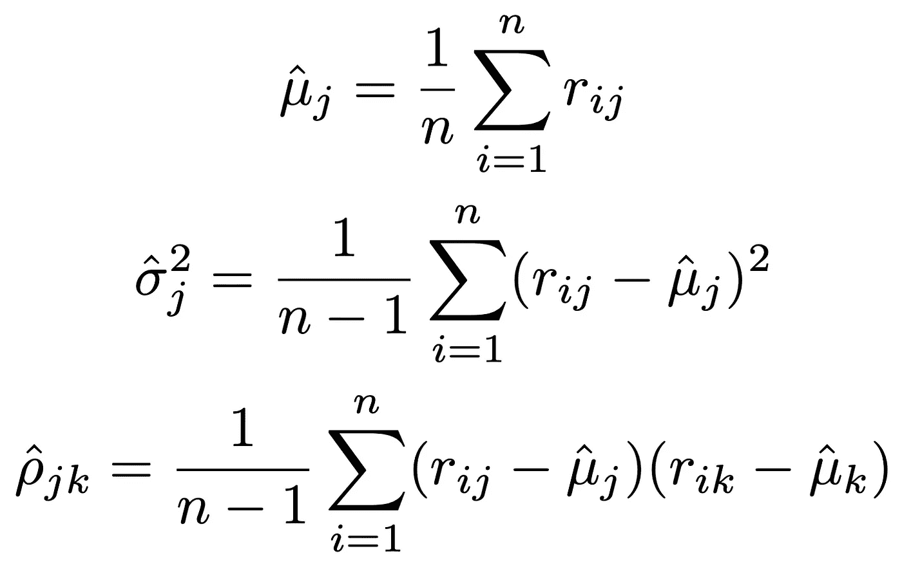
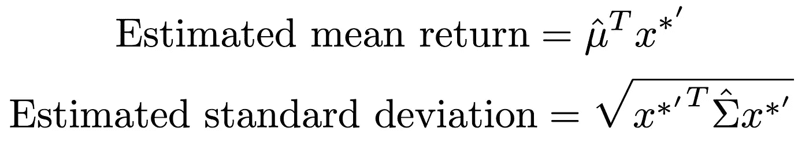
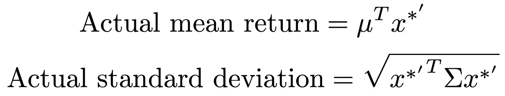
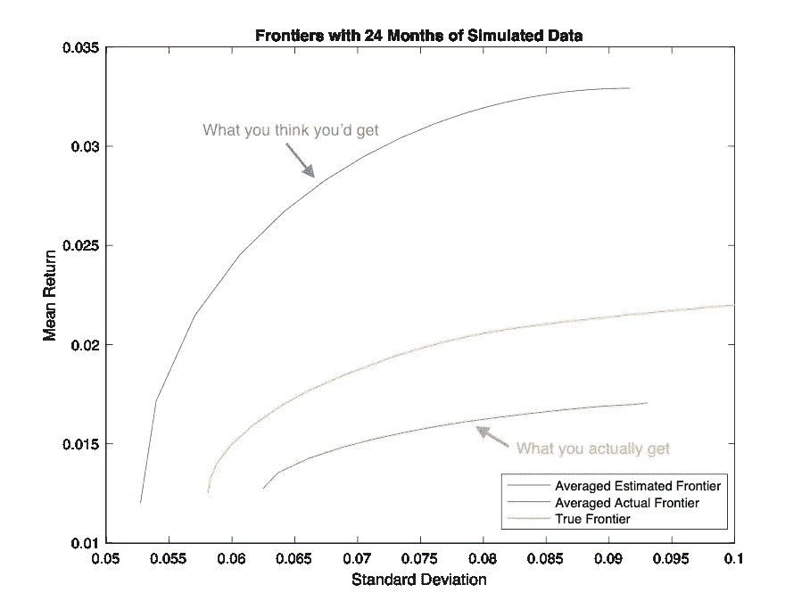
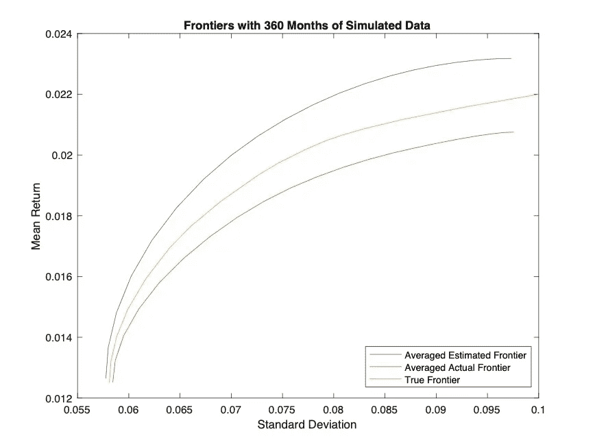
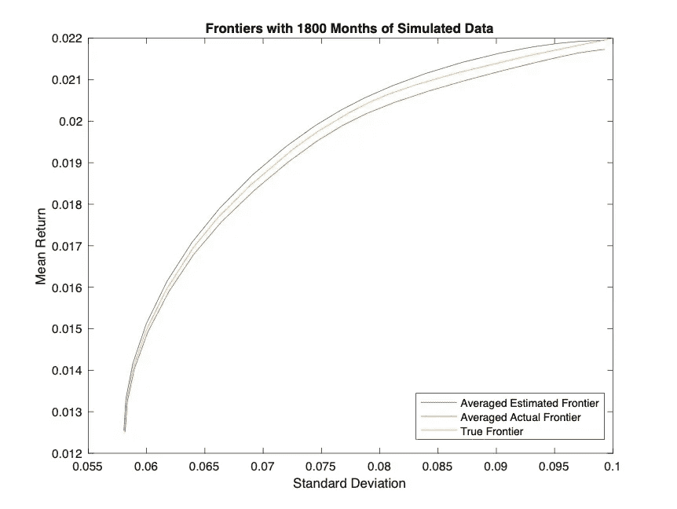

# 为什么资产组合管理中期望收益最大化在实践中失败了

> 原文：<https://towardsdatascience.com/why-maximising-expected-return-in-asset-portfolio-management-fails-in-practice-with-imperfect-978ba964b0c?source=collection_archive---------26----------------------->

## 使用模拟快速解释为什么在使用估计数据建模时，优先考虑低风险在现实中更有效

High return or low risk: which should we choose? (Photo: Clipartkey / Baekhyun)

在投资组合管理中，给定各种各样的资产，每种资产都有自己的预期回报率和方差，我们想要决定我们应该在每种资产上投资多少(从而决定*一个决策组合*)，以便实现某个结果。这个结果通常包括优化(最大化或最小化)某个值。

直觉和几乎自然地，我们希望最大化我们投资回报的预期价值。同样，如果回报不如我们预期的那样丰厚，我们也希望将我们在回报差异方面承担的风险最小化。

但是，这两个选项哪个更好呢？你应该最大化你的预期收益还是最小化它的可变性？

*和*如果你只有***不精确值或估计值*** 来模拟资产回报行为，这两个选项哪个更好？

现在，在试图回答这个问题之前，我们首先需要了解如何选择和识别给定不同风险回报偏好的最佳投资组合。

***来自《走向数据科学》编辑的提示:*** *虽然我们允许独立作者根据我们的* [*规则和指导方针*](/questions-96667b06af5) *发表文章，但我们并不认可每个作者的贡献。你不应该在没有寻求专业建议的情况下依赖一个作者的作品。详见我们的* [*读者术语*](/readers-terms-b5d780a700a4) *。*

# 马科维茨模型

Harry Markowitz | Fun fact: The Nobel Memorial Prize in Economic Sciences was not established by Alfred Nobel. (Photo: ORTEC)

经济学家哈里·马科维兹(Harry Markowitz)开发的马科维兹模型(他因此获得了诺贝尔经济学奖)的原理是，理性投资者会:

1.  给定两个风险相等的投资组合，他/她会选择回报较高的一个，并且
2.  给定两个回报相等的投资组合，他/她会选择风险较低的一个。

因此，与其在收益最大化或方差最小化之间进行选择，我们可以将两者结合起来，寻求最小化这个等式:

The first term in the objective function represents the expected return while the second term its variance.

其中, *x* 是一个向量，代表你应该投资于每项资产的资金比例(从 1 中选择)。Lambda 作为一个权重来改变两个因素(预期回报和方差)对目标的贡献，而第一个约束确保投资于每项资产的资金比例总和为 1。

给定一组输入参数(将真实资产回报建模为正态分布)，如下所示，然后我们可以针对不同的 lambda 值求解最优的 *x** 向量。

Input parameters that model the monthly returns of 5 different investment assets. Mu refers to the mean, sigma refers to the standard deviation, while rho refers to the correlation matrix between the asset returns.

由于每个 *x** 代表每个风险回报偏好水平的最佳投资组合(我们通过改变λ来改变)，我们能够使用以下公式计算每个风险回报偏好水平的预期回报和标准偏差值:

Note how we are calculating these values using the optimal value x*

这些单个的价值然后被绘制在一个图表上，产生了一个被称为“ ***真实有效边界*** ”的图表，它代表了我们在不同风险回报水平下可以拥有的最佳投资组合。

As expected, the greater the risk you take, the greater your expected return gets.

从上面的图表中，我们似乎可以非常准确地确定我们愿意接受的每个标准差(或风险)的预期收益。

然而，请记住，到目前为止，我们只是假设我们有关于每个资产回报如何表现的完美信息。如果我们对这种行为毫无头绪，会发生什么事情呢？事实上，情况几乎总是如此。

然后我们必须估计他们的模型参数。

# 不完全信息

在现实场景中，即使我们可能没有任何关于真实模型参数的信息，我们所拥有的是关于月度回报的历史数据(例如，n = 24 个月)。为了模拟这些可用的数据，我们必须从我们之前指定的“真实”模型参数中生成随机月度回报。

由于真实的模型参数是看不见的，并且应该是未知的，我们只能通过使用下面指定的估计器*来估计*真实的模型参数，其中 *r* 是指我们已经生成的月度回报(或历史数据):

Each line gives the estimated mean, estimated variance and estimated correlation coefficient respectively

然后，我们可以尝试解决之前定义的最小化问题，以获得最佳决策向量*x *’—*它用撇号(’)表示，表示它是使用 ***估计*** 参数而不是真实参数计算的。

由于我们想要预测可用的最佳投资组合(也称为前沿),我们将使用估计的模型参数值来计算(估计的)平均回报和标准差:

Note how the **estimated** mean and covariance is used instead of their actual values.

鉴于我们已经使用了估计的模型参数来“预测”平均回报和标准差，我们将把生成的前沿面称为“*”。*

*然而，这里有一个问题——不管我们如何确定我们的投资组合，我们将 ***实际*** 赚取的回报最终将取决于 ***真实*** 模型参数，而不是 ***估计的*** 参数。*

*因此，我们需要根据之前获得的 *x*'* (s)以及真实模型参数，计算另一组平均回报和标准偏差值:*

**

*因为这代表了我们基于优化的决策向量 *x*'* 得到的 ***实际*** 结果，所以我们称之为“ ***实际边界*** ”。换句话说，这个边界代表了我们基于(不完美的)决策所期望看到的实际结果。*

*那么不同的前沿相比如何呢？他们彼此有很大的不同吗？我们去看看。*

# *严重的误判*

*在下图中，我们有以下三个边界:*

*   *真实边界—代表基于使用完美模型参数确定的最佳投资组合的实际投资组合回报和标准差*
*   *平均估计边界-表示基于使用估计模型参数确定的最优投资组合的估计投资组合回报和标准差*
*   *平均实际前沿——代表基于使用估计模型参数确定的最优投资组合的实际投资组合回报和标准差*

*后两个前沿中的“平均”是指每组 24 个模拟月度“历史数据”的 1000 次模拟运行的平均。*

**

*Looking at the actual and estimated frontiers alone, we can see that there is always a systematic overestimation of mean return and a systematic underestimation of standard deviation*

*初看起来，这三条曲线根本没有相互重叠；估计边界位于真实边界之上，真实边界位于实际边界之上。*

*这有什么意义？这意味着，只有月收益估计参数的投资者将总是得到比他/她拥有的*平均收益以及 ***真实*** 平均收益*低*的 ***实际*** 平均收益，即使他/她从一开始就拥有完美的信息。标准差的情况正好相反。**

**更有趣的是，与平均回报率高时相比，当标准差低时，曲线彼此更接近。这表明，以高平均回报率为目标所遇到的估计误差，比我们以低标准差为目标时看到的误差要大得多。**

**换句话说，在只有不完全信息的情况下，优先考虑最小化风险(或标准差)比最大化回报更可取，这样才不会高估你的投资组合的表现。**

# **知识就是力量，只要它是现实的**

**一个自然的后续问题是，如果历史数据量增加(例如 n = 360 或 n = 1800)，上述估计误差是否会减少。简单直观的答案是肯定的，模拟显示。**

****

**The curves seem to be converging in general, with the left ends packed more closely than those on the right**

****

**The curves get even more closely packed here, so all seems well when we get more data to make better estimates but…**

**我们需要多少数据？360 或 1800 个月有多长？那可是 30 年 150 年啊！得到这样的数据甚至现实吗？即使是这样，我们又怎么知道月度回报分布背后的基本面没有改变呢？也许在若干年后，这些数据甚至不再那么相关了。我们可能需要另一种方式来解决这个问题，但这完全是另一回事…**

# **现在怎么办？**

**因此，正如你所看到的，如果你不想严重高估你的收入，特别是当你使用估计的模型参数时，只最大化预期收益可能是个坏主意。相反，依靠最小化方差将获得更可预测和一致的结果。**

**幸运的是，多年来人们已经开发出了其他的工具和方法来解决我刚刚展示给你们的问题。机器学习也进入了资产管理领域，你可能会有兴趣看看迄今为止它是如何改变事情的。**

**我希望您觉得这个演练很容易理解—您可以自己编写一些简单的代码来模拟它(我是在 MATLAB 上完成的)—并且您喜欢这篇文章。感谢阅读！**

## **参考**

**马克·布罗迪。使用估计参数计算有效前沿。运筹学年鉴:金融工程特刊，第 45 卷，第 21–58 页。**