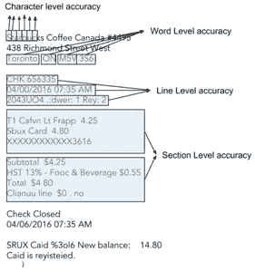

# 为什么测量精度很难(也很重要！)第二部分

> 原文：<https://towardsdatascience.com/why-measuring-accuracy-is-hard-and-important-part-2-the-common-problems-in-measuring-accuracy-cc26a977823e?source=collection_archive---------25----------------------->

## 测量精度中的常见问题

# 介绍

本文是我撰写的关于测量精度挑战的 4 篇文章系列的第 2 篇。如果你还没有阅读第一篇文章，请点击这里查看:[https://www . electric brain . io/blog/why-measuring-accuracy-is-hard-and-very-important-part-1](https://www.electricbrain.io/blog/why-measuring-accuracy-is-hard-and-very-important-part-1)

在本文中，我们将讨论在测量精度方面出现的主要挑战。我们将尽可能用例子和图表来说明。

# 您的训练数据通常与真实世界的数据不同

使测量准确性变得困难的最常见的事情是，有时我们使用的训练集与算法预期处理的真实世界数据不同。出现这种情况可能有许多不同的原因:

*   您在合成或增强数据方面的培训
*   您的数据集是一个有偏见的小样本，不能代表算法需要操作的真实世界数据
*   您的数据集是使用与真实世界数据不同的流程收集的，例如，您通过搜索 google 为问题数据集收集潜在问题，但实际问题是通过您的网站输入的，可能会有所不同
*   您可能无法访问真实世界的数据，例如，这是一个发布前的新产品，或者该产品的部署方式使您无法将任何数据发送回总部
*   您的算法可能必须运行在客户数据集上，而不是您自己控制的数据集上
*   真实世界的数据可能是一个不断发展的移动目标，例如股票市场

我最近在几个不同的项目中遇到了这个问题，其中最突出的是一家聊天机器人公司。这是一个虚构的例子，但是来自我在公司工作的真实经历。

想象我们正在为呼叫中心开发一个聊天机器人产品。在我们获得第一笔销售之前，我们需要证明产品是有效的。为了让产品发挥作用，我们需要数据。我们需要的数据只是提问的不同方式，例如，你想检查订单状态的不同方式，或者在餐馆订购披萨的不同方式。我们用我们唯一知道的方法收集数据——关于机械土耳其人。然而，通过直接要求人们想出订购比萨饼的不同方法，我们确实得到了一些变化，但我们开始得到许多重复的内容，如:

*   能给我一份披萨吗
*   我能要一份披萨吗，先生
*   我能要份披萨吗先生先生
*   我能吃个披萨吗，兰斯洛特先生
*   我能要个披萨吗，兰斯洛特夫人
*   我能要一份披萨吗，兰斯洛特夫人
*   能给我一份披萨吗
*   我能要一份披萨吗
*   能给我一份披萨饼吗

他们确实想出了很多不同的例子，成百上千个。事实上，这些都是有效的句子，应该可以触发我们的聊天机器人去订披萨。但是这里没有太多的变化——不是我们想要的那种变化。这并不代表真实世界的数据。

最终，我们求助于制定规则，比如最小句子长度、句子在整个数据集中的唯一性要求、与他们输入的其他样本的最小差异等..这些东西确实有助于我们获得更多的多样性。然而，我们担心数据集仍然不能真正代表真实世界的数据:

*   你好，先生或女士，你能允许我在你的好地方吃披萨吗
*   你好很好先生，你能允许我在这个神奇的餐厅吃一个美味油腻的披萨吗
*   嘿，请允许我从你们漂亮的餐馆给我一个比萨饼

我们最终拼凑了一个我们喜欢的数据集，并取得了+90%的准确率。似乎是个不错的结果。

然后我们把这个带给客户，给他们看。但机器人最多只能在演示中工作 70%的时间，经常摔倒并误解看似简单的命令。算法运行的数据集，真实世界的数据，与算法训练的数据集完全不同。我们技术上勾选了所有方框的数据集:

1.  它很大——我们有数以千计的每个意图的例子
2.  它包含了多样性——这些例子在与概括相关的方面是不同的
3.  这是有效的，例如，这些句子确实是我们想要触发机器人订购比萨饼的句子
4.  它没有不正确或无效的条目

然而，关键问题在于第二点的细微差别。尽管数据集包含多样性，但它并不像真实世界的数据那样包含同样的多样性。尽管我们有许多不同的订购披萨的方式，但我们没有真人向我们的机器人订购披萨的具体方式。

你会非常惊讶，我们经常被期望在一种类型的数据上建立模型，并在不同类型的数据上执行它们。它之所以有效，是因为机器学习对今天的算法来说非常棒，非常强大。他们能够找到一般模式，然后将这些模式转移到新的环境中。但它提出了一个新问题，即在这些新环境中测量系统的准确性。

# 你比其他人更关心某些失败案例

通常情况下，你的机器学习算法可能在不同方面都是错误的。随着算法变得越来越复杂和强大，并被用于更多的事情，其行为的具体细节变得更加重要。

在某些情况下，有一整套算法协同工作来创建一个完整的系统——预处理、增强、多种机器学习算法、后处理、过滤、阈值处理、验证——人工智能系统有许多组件使其工作。每一步可接受的错误和正确答案的形式是不同的，这使得测量和改进整个系统成为一项复杂的任务。

在其他情况下，即使算法的最终输出也必须呈现特定的形状和形式，很难减少到一个数字。在自动驾驶汽车中，我们关心车辆在边缘情况下的性能——恶劣的天气、其他司机驾驶不当等..从许多 YouTube 视频中可以很清楚地看到，自动驾驶汽车在典型情况下可以很好地工作。

我可以找出你比其他人更关心某些失败案例的各种原因:

*   某些类型的错误检测可以通过处理管道的后续部分排除，但失败的检测无法恢复。因此，你更关心捕捉所有的真阳性，而不是减少假阳性。
*   也许你更关心边缘情况下的算法性能，例如恶劣天气条件下的自动驾驶汽车
*   当算法对其预测没有信心时，也许有可能进行人工干预
*   也许如果这个算法被用于一个警告系统，当有真正的危险时，发出警告并有一些误报比不发出警告要好
*   也许你的算法在某些重要的数据子集上表现极差
*   也许某些类型的故障会让你的用户非常恼火，而其他类型的故障很容易被掩盖

这些类型的问题通常通过提出替代的度量标准来解决。有时我们会使用混淆矩阵，比如这个，来帮助我们理解正在发生的事情:

其他时候，我们可能会使用替代指标，如精确度和召回率、[https://en.wikipedia.org/wiki/Precision_and_recall](https://en.wikipedia.org/wiki/Precision_and_recall)，它们分别忽略了假阴性和假阳性，而原始精确度则考虑了所有类型的错误。

我认为这种现象的另一个有趣的表现是机器学习算法中的歧视性偏见问题。例如，这包括面部识别算法对白人和亚洲人比对其他种族的人更有效的问题。这里的问题是，在数据集的未标记子集上，您的算法表现不佳。当一个人在制作面部识别算法时，你可能只会收到一个巨大的图像数据集，而没有任何关于谁是哪个种族和性别的数据。比方说，如果你是一名收到匿名数据集的脸书研究人员，这种情况就可能发生。如果这个数据集来自脸书的美国数据集，那么发现它主要包含白种人的图像就不足为奇了。你训练算法，并声称其 95%准确。但是算法 5%的失败都是谁呢？对于您的匿名数据集，您无法真正知道-唯一的解决方案是手工检查。你对准确性的简单衡量没有抓住算法的重要社会政治属性。

# 模型、数据集或测量值有噪声

另一个妨碍测量精度的大问题是存在噪声，包括模型固有的噪声、数据集中的噪声和我们测量精度的噪声。

# 拆分数据

基本的困难可能出现在任何模型中。请考虑以下情况。您有一个数据集，并且您希望衡量您训练的算法的准确性，以了解它概括数据集属性的能力。你做一个明智的数据科学家做的事情，将你的数据分成三部分——培训、测试和验证:

但是现在你面临着这个问题——你应该把哪些项目归入哪个组？如果我使用这种分割方式会怎么样:

最简单的方法可能是随机打乱你的数据集，然后分成三份。但是当您训练您的模型时，您会发现每次这样做，您都会得到不同的结果，即使您的模型没有变化:

沮丧的是，你可能会认为这是因为数据集从一次运行到下一次运行非常不平衡。也许您可以决定使用数据集中的标签来构建训练集、测试集和验证集，其中每个目标标签的数量都是偶数。通过每个标签有效地将数据集划分为一系列子数据集，随机地将这些数据集分成 3 份，然后将它们重新组合在一起。现在你的数据集是类平衡的，但仍然是随机的。现在您已经降低了噪音，但是仍然存在问题:

您已经减小了扩散，但是在您的测量中仍然有噪声。您发现，对于每个标签，数据集中实际上有更难和更容易的样本，这些样本仍在不断变化。但是你能做什么呢？

您可能会决定使用交叉折叠方法，也就是说，取数据集内所有 5 个可能的 80/20 分割的平均值。这确保了每个样本在测试集中至少出现一次。但这种方法对于许多深度学习模型来说可能是昂贵的，在这些模型中，GPU 能力匮乏，并且您渴望运行尽可能多的实验。也许您只是锁定了一个固定的测试和培训集，并且只针对它进行度量。但是在动态的真实世界环境中，这可能很困难，因为我们的数据集在不断发展，变得越来越大，实际上要求我们维护一个将条目标记为训练、测试或验证的数据库。

维持良好、稳定、一致、无噪声的模型精度测量所需的额外基础设施可能会快速增长，具体取决于您希望降低噪声的程度。

# 数据集中的噪音

我见过的另一个大问题来源是嘈杂的数据集。嘈杂和充满错误的数据集是我生存的祸根。与第三方数据外包公司打过交道后，我亲眼目睹了获得高质量、干净标签的数据有多么困难。

这个问题是这项任务固有的——标记数据很糟糕。无论我们开发了多少花哨的工具来帮助贴标签，它仍然是一个平凡的数据输入任务。它天生容易出错。

人们采取了许多措施试图解决这个问题:

*   也许我们把这个过程游戏化，试图鼓励用户“玩得开心”，同时提供标签化的数据。
*   当人工智能提出“建议”时，我们也许能够让我们的用户为我们提供标记数据，作为他们工作的一部分，然后他们可以纠正和修改这些“建议”。由于工作对用户的价值，用户已经被鼓励要小心谨慎
*   我们可能会使用双重验证(将相同的项目发送给多人以达成共识)，或者由经理进行随机抽样和验证等技术
*   一些人甚至使用人工智能分析技术，试图识别数据集中的异常值

然而，无论我们如何做，我们正在处理的数据集通常是有噪声的。

在机器学习方面，只要数据集不是太嘈杂，我们仍然可以经常教会算法学习模式。尽管有很多噪音，深度学习仍然特别擅长概括。但是在测量和验证方面，数据集中的噪声给我们带来了一些固有的问题

*   我们不知道我们的准确性度量是否提高了，因为我们对一些标签不好的样本进行了过度拟合，或者模型是否成功地进行了推广。这意味着需要更大幅度地提高精确度来确认改进
*   即使我们的模型已经完美地概括了数据，也没有办法达到完美的准确性。最好的可能精度是一些不可知的，不可测量的数字。如果你的数据集真的很吵(+10%)，当你坐在 89.7%时，这可能会让你真的旋转你的轮胎，试图找出更多的方法来改善你的模型。你的模型实际上可能对真实世界的数据是 100%准确的，你没有办法知道它。

# 数据集中的一致错误

可能比数据集中的噪声或随机错误更糟糕的是注记团队所犯的一致性错误。如果以一致的方式出现错误，那么机器学习算法可以尝试学习这些错误模式，作为其整体学习的一部分。

在几个现实世界的项目中，我都被这种情况困扰过。在我们最近与一家大型加拿大银行执行的一个项目中，我们得到了由第三方注释的提供的数据。我们没有进行足够的监督和测试。我们收到的样本很好，但我们未能检查完整的数据集。我们继续训练我们的模型，最终达到了非常高的精确度。但当向客户展示算法时，他们很快指出最终结果似乎充满了错误。当深入研究时，我们意识到，不仅数据集的大部分被错误地注释了，它还一直以同样的方式被错误地注释。

因此，我们仍然有可能通过我们可用的每一个测量来实现高度的准确性，并且模型仍然是错误的。这个模型确实学习了模式，它精确地学习了注释数据集的人所犯的错误模式。很明显，我们不能只检查过程中通过电子邮件发送给我们的“提供的样品”，因为这些样品可能已经由正确理解要求的经理准备和审查过了。我们需要分析和验证最终的样本，这些样本是由该公司的各种低收入数据输入人员汇总而成的，这些人可能会也可能不会收到足够的指示来正确地注释数据。

在我看来，这是做真实世界 AI 项目最难和最令人沮丧的方面之一。使用经过验证的测量准确度的技术，你可以有很高的准确度，但最终仍然是错误的。

# 您的管道中有多个指标

测量精度时有时会出现的另一个问题是*变得太多*而无法测量。您可能有十几个不同的度量标准来代表您系统的不同阶段。

这个问题是我最近在构建文本提取引擎时遇到的。该模型将一个单词及其周围的上下文作为输入，并为该单词生成一个分类。

然而，我们的管道包括两个阶段。第一个机器学习算法只是在 null 或 extract 之间做决定，第二个阶段做最后的分类。在实践中，我们降落在一个四层系统，但 2 层系统将足以解释。设置如下所示:

所以现在我们有两种不同的机器学习算法，有两种独立的精度测量。我们还有几种不同的失败案例:

*   #1 处的误报(在应为空时提取)
*   #1 处的假阴性(当它应该被提取时为空)
*   #2 处的误报(一个应该为空的类别)
*   第二个错误的否定(当它应该是一个类别时为空)

此外，我们有额外的复杂性，我们的第二阶段算法能够部分补偿第一阶段的误差。例如，在第一阶段的假阳性可能在第二阶段仍然被正确预测为空，并且仍然导致正确的最终输出。因此，这两个阶段的精度测量可能会以复杂的非线性方式相互影响。层#1 中的假阳性的更差的准确性不一定导致最终输出中的更低的准确性。

事实上，层#1 上更差的精度可能意味着正好相反。为了让这种方法有效并产生更好的最终准确性，我们不得不将第 1 层向更多的假阳性倾斜。默认情况下，它会产生更多的假阴性，然后假阳性，与单层系统相比，降低了准确性。但是将层#1 向更多的假阳性倾斜(降低其准确性)，意味着它只过滤掉它高度确信实际上是空值(真阴性)的条目，而其他一切都可以传递到层#2 进行最终分类。这提高了模型的最终精度。因此，以那种特定的方式伤害第 1 层会使整个模型更加精确。过滤层(层#1)帮助模型处理输出中不平衡的类和高度的空值，但只有在以正确的方式测量和使用时。

就其本身而言，拥有多个处理阶段，甚至在这些不同的处理阶段进行多次精度测量并没有什么错。然而，太多的好事会产生新的问题:

*   当你的一些指标提高了，而另一些变得更差时，这就造成了混乱。实际发生了什么？
*   很难向涉众传达他们对模型的期望
*   很难理解模型的最终行为是什么

根据我们的经验，当你处于这种情况时，只有一个解决方案:*将所有的研发&集中在提高你的端到端或最终结果指标上，也就是说，从系统处理的最后阶段退出的准确性。*我们并不是说您不应该测量中间精度——它们对于理解各种处理阶段如何相互作用以及想出可行的方法非常有用。但是当谈到衡量一个改进是否真的是一个改进时，只有最终结果的准确性才是重要的。

# 您有多个具有多种粒度级别的指标

这个问题类似于您的管道中的多个度量的问题，但是它由于不同的原因而表现出来。让我们考虑一下从收据中提取数据的问题，我在这里最突出地看到了这个问题。基本问题是获取收据的图像并将其转换为完全结构化的数据:

所涉及的过程是:

如果您注意的话，您会注意到这个设置在整个管道中也有多个指标。OCR 引擎、逐字母分类和后处理都可能出错，并可能在每个阶段产生不同的准确度测量值。根据他们之前的输入是否被认为是准确的，他们也有不同的测量，例如，我们可以在假设 OCR 准确性是完美的情况下逐个字母地测量准确性(通过输入真实的 OCR 数据)，并且我们可以在原始 OCR 输出上逐个字母地测量准确性，包括错误。

然而，我想集中讨论另一个扳手，它被扔在系统的中间部分，即逐字母分类的准确度测量中。

测量准确度最明显的方法似乎是从字面上测量正确的字母分类的数量:

但这种方法的问题是，大部分字符都要被归类为“空”，或者不提取。在这个标准下，我们相对容易达到 97%和 98%的准确率。但是我们很快发现，那些被认为是 2%或 3%的错误非常重要。

我们分析的许多收据不是星巴克的空头收据，而是像这样的庞然大物:

在这些收据中，几乎 95%的字符被归类为空。然而，剩下的 5%的角色是我们关心的。根据我们的传统度量，即使我们的模型除了预测空值之外什么也不做，这些收据也能获得 95%的准确率。从一个收据到下一个收据，测量自然是不稳定的，并且没有给我们足够的洞察力来了解实际发生了什么。

因此，这个问题催生了各种替代的精度测量方法，旨在让我们更深入地了解系统的行为以及它所犯的错误类型:

*   单词级别的准确性—没有错误的单词的百分比
*   线级准确性—无错误线的百分比
*   章节级准确性——无错误的章节百分比(收据分为标题、项目、税收、总计、页脚)
*   收款级别准确性—无错误的全部收款的百分比

发现我们的模型的字符级准确率为 98%,收据级准确率为 67%,这是非常深刻的。收据至少有 200 个字符，所以我们预计在字符级别上每张收据平均有 4 个错误。您可能会认为，收据级别的准确性应该是 0%，因为平均而言，收据应该至少有 4 个字符级别的错误，根据收据级别指标，这是一个错误。但是我们的大部分收据都很顺利，完美地分类了每个角色。其他收据完全是乱七八糟的，有多达 20%到 30%的错误分类。

如果可能的话，拥有不同粒度级别的度量标准有助于理解您的模型是如何失败的。但是它们也会给你的测量增加混乱和噪音，当一些指标改善而另一些变得更差时，你会原地打转。更多关于在这种情况下该怎么做的内容将在第 4 篇文章中介绍。

# 你只有系统中间步骤的基础数据

这个问题出人意料地经常出现，事实上它也在上面的收据示例中出现过。你有一个机器学习系统，你已经标注了需要进行的学习中最重要和最困难的部分。但是你的算法在得到最终结果之前需要进行某种后处理。这种后处理是基于一些简单的试探法和假设，这些试探法和假设是针对您所遇到的问题的。

这种启发的一个突出而简单的例子是当我在电子表格上提取数据时。电子表格中的每个单元格都必须归入几个类别中的一个。然后，这些单元将被组合成一组输出。设置大致如下:

该系统需要能够处理各种不同格式的电子表格，这些表格是由不同的人手工准备的，可以任意决定格式和结构。

构建这个系统的一个合理的方法是对所有的细胞进行分类，就像这样:

然后创建一些预测特征，并训练一个算法来预测每个单元的分类。但是为了得到最终的结果，你必须做一个更重要的处理步骤——你必须将细胞组合在一起。在我们的例子中，方法看起来很明显:同一行上的任何单元格都应该被分组到同一个输出中。99%的电子表格的本质是人们每行有一个条目。

然后，您可能会认为只有分类像元作为基本事实数据是安全的，并且您的算法的最终输出实际上没有基本事实数据。你优化你的模型，测量你的准确度，得到 99%。万岁！但是等等，有个问题。在您的数据集中，有一些看起来像这样的电子表格(是的，这确实发生在我身上):

现在很明显，只在细胞水平上拥有基本事实数据是一种责任。我们的后处理中的一个关键假设，即每行只有一个输出，已经被违反。我们从我们的系统测量的准确度是极好的。我们的代码按照设计完美运行，并且我们所有的单元测试都通过了。但是系统作为一个整体仍然在产生无效的结果，我们最初并不知道，因为我们只有系统中间步骤的基础数据，而不是最终结果。

这个问题可以在任何情况下表现出来，在你的机器学习算法完成后，你有额外的后处理步骤，但没有任何方法来衡量最终输出的准确性。虽然这个例子简单易懂，但在机器学习算法输出和最终结果之间的阶段，可能会出现更加复杂和微妙的情况。永远不要浪费时间和金钱去获取真实的数据来衡量准确性，否则你会被烧伤。

# 结论

测量精度很难。机器学习系统的许多最好的方面，比如它们归纳出新的、从未见过的例子的能力，也给我们带来了巨大的头痛。测量精度的许多问题源于机器学习的有益特性:

*   训练数据不同于真实世界数据的问题，直接来自于好的机器学习模型能够进行概括的能力，所以我们一直在推动我们希望它们能够做到的极限
*   关心不同故障案例的问题直接来自于这样一个事实，即我们的模型能够在复杂的环境中以智能行为运行，因此我们对它们的期望变得越来越细微和具体
*   测量中的噪声问题直接来自于我们的模型是不精确的和近似的，但这也是允许它们一般化的原因
*   多管道度量的问题来自机器学习算法的可预测的成功行为，允许我们将它们连接到日益复杂的序列和管道中
*   粒度的多种度量的问题来自于我们的模型对复杂的、高度多维的问题进行操作的能力
*   只有中间步骤的基础事实的问题，来自于机器学习应用于特定的、孤立的问题，然后被拼凑成更大的、更传统的计算系统的灵活性。

衡量准确性很难，很大程度上是因为机器学习算法非常擅长它们的工作——智能。我们很少谈论衡量人们的准确性，因为我们承认很难预先定义什么是正确的行为。机器学习模型将越来越多地受到同样的限制——准确性将变得更加模糊，更加难以衡量。我们越来越多地将机器学习应用于精确度难以定义的环境，更不用说测量了——想想为创作音乐而设计的算法。你如何衡量这方面的准确性？但是，我们现在已经创造出了能够很好地产生令人愉快的音乐的算法。

在这一系列博客文章的第 3 部分中，我将讨论一些更有趣、更微妙的测量准确性的问题。如果没有现成的标准来衡量您的问题的准确性，您会怎么做？当你无法衡量自己真正在乎的结果时，你会怎么做？如果你没有任何地面真实数据怎么办？如果你甚至不能在你的问题的上下文中定义什么是准确性呢？

在这一系列博客文章的第 4 部分中，我将尝试提出一个更好地度量准确性的框架——如何度量、何时度量以及度量什么。最重要的是，我将说明如何测量精度取决于你想用这个精度值做什么。无论是为了提前停止还是阈值校准，为了模型参数的贝叶斯优化，为了对模型进行迭代改进，为了了解模型的故障情况，为了向经理传达绩效，或者为了向客户传达绩效，对于不同的情况有不同的测量方法。没有放之四海而皆准的解决方案。

*原载于*[*www . electric brain . io*](https://www.electricbrain.io/blog/why-measuring-accuracy-is-hard-and-important-part-2)*。*