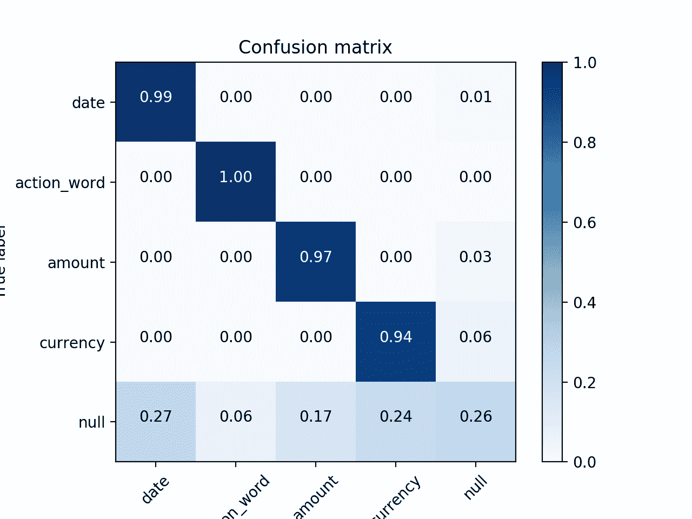
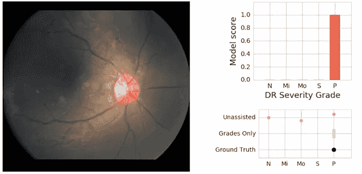
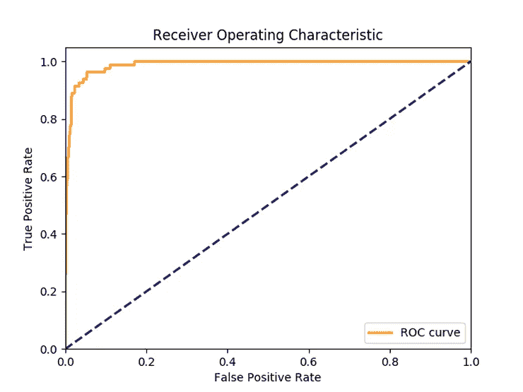
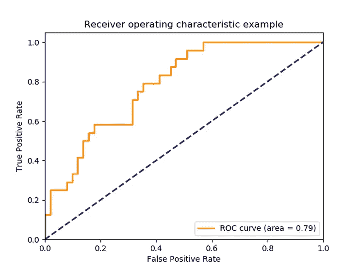
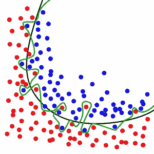

# 为什么测量精度很难(而且非常重要)！

> 原文：<https://towardsdatascience.com/why-measuring-accuracy-is-hard-and-very-important-part-1-why-measuring-right-is-important-a279e8a6fcd?source=collection_archive---------18----------------------->

## 第一部分。为什么正确衡量很重要。

我们正在开始一系列关于测量准确性的新博客文章。有很多内容要涵盖——当我第一次开始写这篇文章时，它很快变成了 12 个小时的键盘敲击和 20 页的想法和笔记。因此，我们将把它分成 4 篇独立的文章:

1.  测量准确度问题的概述，为什么它很重要，为什么它很难
2.  测量精度中出现的大多数主要问题的详细描述
3.  详细描述了我们在测量准确度时遇到的一些更不寻常和有趣的情况
4.  我们能做什么——如何更好地测量准确性

# 测量精度的问题

为什么衡量机器学习模型的准确性很难？如此多的机器学习模型似乎有一个非常简单的精确度定义。

让我们看一个简单的例子——检测糖尿病的算法。该算法报告个人实际上患有糖尿病。该预测要么是正确的(该个体实际上患有糖尿病)，要么是错误的(该个体没有糖尿病)。看起来准确性是由一个非常简单的问题定义的:有多少预测实际上是正确的。看起来衡量一个模型的准确性应该是简单明了的。

稍微仔细研究一下这个问题，以及该算法在生产中是如何使用的，将会给我们一个更加细致入微的答案。典型的疾病预测算法没有给出疾病的对与错的预测，没有其他信息。即使是最基本的实现也至少会提供一个介于 0%和 100%之间的置信度得分。该算法可以预测 73%的糖尿病置信度，以及 27%的非糖尿病置信度。然后，医生可以利用这种信心，结合自己的知识和分析，做出决定。但是什么是准确性呢？当算法报告 73%的置信度时，它的准确率是 73%吗？

在这种情况下，准确性意味着什么？准确性是指置信度超过 50%的正确答案的数量吗？50%是合适的门槛吗？我们如何计算空答案？如果“是”和“否”都没有达到要求的可信度，那该怎么办？那是怎么算的？一个稍微细致和有经验的数据科学家将得到受试者操作特征曲线，或 ROC 曲线。ROC 不再是一个单一的数字，而是一条曲线，代表在不同点设置阈值时出现的假阳性和真阳性之间的权衡。它表明，在一个特定的置信水平下，将会有多少错误对真理。这是一个聊天机器人的 ROC 曲线的例子。这个很不错:

这是另一个来自 Scikit-learn 网站的例子，对于医学分类器来说可能更真实:

所以现在我们不仅仅有一个精确的数字。我们有..我们对不同精度的选择。现在我应该提到，ROC 曲线有一个相关的单一数字指标，AUC 或曲线下面积，字面意思是 ROC 曲线下的面积。AUC 是一个稳健且非常有用的指标。但是 AUC 不是一个容易向利益相关者解释的指标，也没有任何容易的解释让我们理解。也许我们会求助于精确和回忆？我们在 ROC 曲线上找到一些可接受的点，将阈值设置为该点，并使用这两个新数字来描述其输出。但是，当你的输出中有多个类时，这很快就变得复杂了——我们现在有一系列的精度和召回——试图解释一个模型如何表现和执行很快就变得令人困惑。

精确度的测量甚至会受到原始数学的影响，这会使改进看起来更糟。这个例子是我在阅读谷歌人工智能博客文章糖尿病检测算法时想到的:[http://AI . Google blog . com/2018/12/improving-efficiency-of-diabetic . html](http://ai.googleblog.com/2018/12/improving-effectiveness-of-diabetic.html)

他们提到，他们已经将他们的算法从二元分类(糖尿病/非糖尿病)转换为 5 分严重性等级。正在分析的数据是相同的，只是输出发生了变化。但是现在想想这个:在二进制分类中，系统可以完全随机地猜测，并且有 50–50 的机会得到正确的答案。在 5 分制的评分系统中，当系统随机猜测时，只有 20%的机会得到正确答案。

现在想象一下，为了给你的模型提供更丰富的学习信息，你从 2 分制转换到 5 分制。然而，如果你测量原始精度，你可能会注意到你的开关降低了精度。在 5 分分级系统中，该系统独自偶然得到正确答案的机会低得多。这篇文章的作者通过使用 Kappa 评分而不是普通的准确性(根据随机正确答案的机会进行调整)来解决这个问题。但是这个基本问题是我这篇文章主题的核心。

衡量你的准确性并不像看起来那么简单。我们如何衡量准确性将改变我们对模型所做的改进，我们对模型的信任程度，以及最重要的是，商业人士、工程师、政府、医疗保健或社会服务组织等利益相关者如何采用、整合和使用这些算法。

# 为什么正确测量准确度很重要

为什么要测量准确度？这似乎是一个容易回答的问题。没有测量的准确性，就没有办法知道你的模型是否有效。与常规代码不同，常规代码可以在事先假设其完美运行的情况下进行测试，100%的时间都符合设计，机器学习代码预计会在一定数量的样本上失败。因此，测量失败的准确数量是测试机器学习系统的关键。

但我想花点时间谈谈我们衡量准确性的一些原因，以及为什么正确地做这件事变得如此重要。

## 改进您的模型

衡量模型准确性的第一个也是最容易理解的原因是为了提高其准确性。当您试图提高准确性时，几乎任何准确性度量标准都可以使用。只要这个指标有一个清晰的定义，那么这个指标的确切值并不重要。您关心的是指标是在改善还是在恶化。那么什么会出错呢？

好吧，如果你不正确地测量你的模型的准确性，你实际上可能以伤害你的真实世界性能的方式修改你的模型，而他们看起来正在改进你的度量。举个例子，泛化和过度拟合的问题。

如果你不正确地测量你的准确性，你可以做一些看似改进你的度量的改变，但是相反，他们只是让你的模型过度适应你的度量所测量的数据。

解决这个问题的标准方法是将您的数据 80/20 分成训练/测试。但这也充满了困难，因为我们有时使用准确性的测量来做一些事情，如提前停止或设置信心阈值，这样测试数据本身就成为你训练过程的一部分。你可能高估了自己的信心阈值。所以你决定把数据分成三份，70/20/10，最后用一个额外的验证集来测量你的准确性。但是现在，如果数据集相对较小，或者不能完美地代表它必须操作的真实世界的数据，该怎么办呢？

你现在不得不担心另一种类型的过度拟合，我称之为架构过度拟合，在这种情况下，你的模型的设计和参数对于数据集来说变得过于完美，当它们被添加到数据集时，不能推广到新的样本或很好地学习它们。例如，如果您准备了大量基于数据集的自定义要素，却发现当数据集随着时间的推移而增长、发生重大修改或与其他数据集合并时，这些要素不再适用，就会出现这种情况。你得到了极好的训练、测试和验证准确性。但是你仍然过拟合数据集。

如果你的数据集有噪音怎么办？数据有一致错误怎么办？你可能认为你的模型很神奇——事实也确实如此，它已经完美地学习了数据集中错误的一致模式。你兴高采烈地把模型放到下一个产品中，结果在产品发布时，你的屁股被人给踢了。看来你的模型在现实世界中并不奏效。你可能会想，“它在测试中非常准确”。“哪里出了问题？”

你的精度测量本身有噪音怎么办？假设您在多次运行中有 1–3%的准确度差异。现在，这使得进行渐进式改进变得更加困难。每个改进都需要大于 2–3 %,以便您能够通过一次运行可靠地确认它。要么你花费更多的 CPU 能力来使用平均值得到清晰的答案，要么你冒险在原地打转，只寻找大胜利，放弃增量改进。

更好地测量您的准确性意味着当您对您的模型进行更改时，您可以确信这些更改是否会以您所关心的方式带来更好的模型。当您错误地度量了您的准确性时，您可能最终会撕毁更改或回到绘图板，因为您“认为”99.9%准确的模型实际上与生产中的模型相差甚远。更精确的测量意味着更快的研究、更好的产品和更多的荣誉。它甚至可以拯救生命。

## 与使用我们模型的利益相关者沟通

我们衡量模型准确性的另一个原因是，我们可以与利益相关者交流，他们可以使用我们的模型。模型绝不仅仅是数学和代码的碎片——它们必须在真实世界中运行，对真实的人的生活产生真实的影响。

如果医生要使用算法来做出医疗决策，那么让他们知道算法可能是错误的，以及这种情况发生的频率是很重要的。如果一家公司打算用电脑取代一组数据录入人员，了解电脑出错的频率很重要，因为这会影响公司的流程。如果我们声称一个模型只会犯 3%的错误，但它实际上犯了 5%的错误，我们可能会认为这是一个很小的差异。但这可能意味着所有受算法错误影响的人打给支持部门的电话增加了 60%。成本的大幅增加可能会完全抵消实现该算法的任何好处。

利益相关者需要理解算法的准确性及其典型的失败案例，因为准确性具有现实世界的含义。准确性可能会影响预算和资产负债表、真实人群的生活和健康，甚至我们民主的结果(当谈到记者现在使用的事实核查算法时)。它可以创造或破坏新的人工智能产品，并在创造技术的工程师和使用技术的消费者之间造成真正的脱节。在测量准确性方面犯错误很可能意味着生命的丧失和新产品的失败。

# 为什么测量精确度很难

那么，是什么让测量精度变得如此困难呢？为什么一个看似容易回答的问题变得如此困难？

在本系列的第 2 部分中，我们将回顾在测量精度中出现的一些常见问题:

*   您用来训练算法的数据与预期在生产中使用的数据不同
*   比起其他类型的失败，你更关心某些类型的失败
*   您的模型、数据集或测量值可能存在固有的噪声或随机性
*   您的管道可能有多个不同的测量精度的点
*   您的模型可能有几个不同粒度级别的不同指标
*   您可能只有系统中某个中间步骤的基本数据，但没有最终结果
*   您的数据集可能被分成不同的类别，它们之间的性能有很大的不同

在本系列的第 3 部分中，我们将解决在测量精度时面临的一些更困难也更有趣的问题:

*   您的模型可能没有任何实际数据
*   可能没有现成的度量标准来衡量您的模型的准确性
*   可能没有明确的方法来定义模型的准确性
*   你真正关心的结果是不容易衡量的
*   有效地测量精确度在计算上太昂贵了
*   你的算法可能与人类协同工作
*   您的数据集可能会不断变化和发展，例如，如果它正在由数据标注团队积极扩展
*   你的问题空间可能会随着时间不断演变

鉴于所有这些衡量准确性的潜在问题，我开始欣赏一个基本的智慧: ***无论你如何衡量它或你使用什么度量，我们通常可以就完全正确和完全错误的样子达成一致。重要的是这两者之间的一切。***

期待即将推出的本系列的第 2 部分！

*原载于*[*www . electric brain . io*](https://www.electricbrain.io/blog/why-measuring-accuracy-is-hard-and-very-important-part-1)*。*