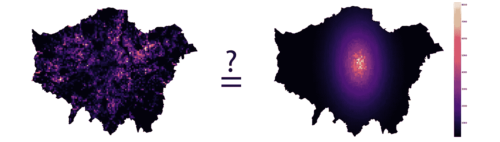
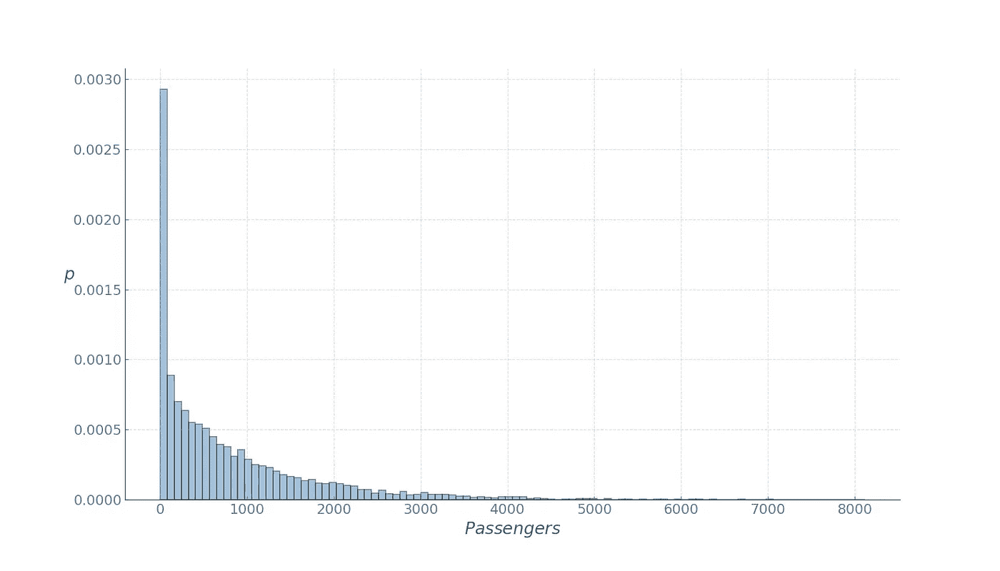
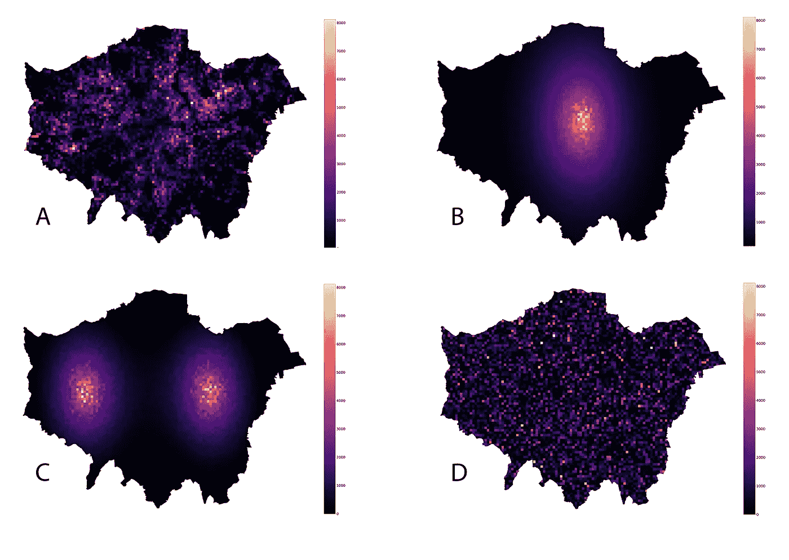
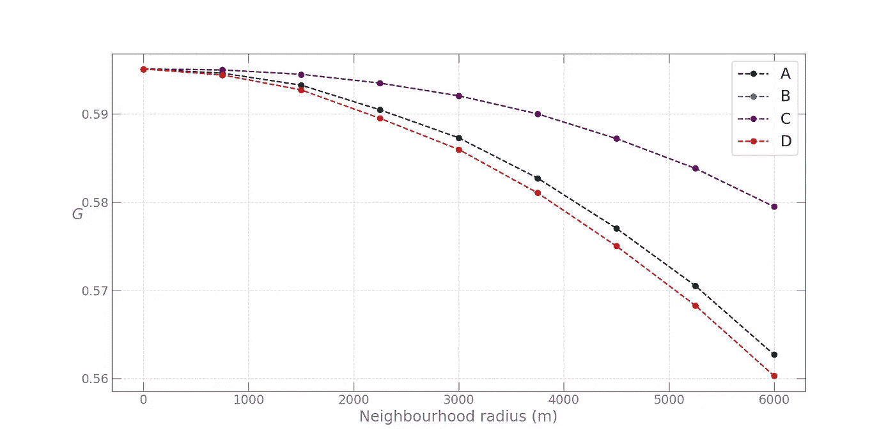
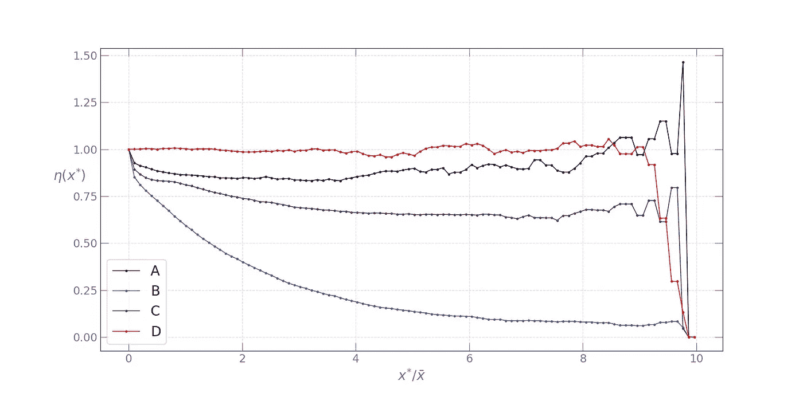

# 为什么用基尼指数衡量城市不平等是个坏主意

> 原文：<https://towardsdatascience.com/why-measuring-urban-inequality-with-the-gini-index-is-a-bad-idea-3d67b555dded?source=collection_archive---------17----------------------->

## 基尼系数

# 基尼系数

在制定城市政策时，我们经常需要评估城市人口的收入不平等情况，以便为针对某些收入群体的企业提供减税，或者确定低收入家庭，以低息贷款的形式提供住房补贴。然而，城市规划者感兴趣的不仅仅是财富和收入的不平等或异质性。例如，城市交通流量通常集中在几个区域，在整个城市交通流量中占据不成比例的大部分，了解这种异质性有多严重，并监测其长期趋势，将是制定有意义的交通政策、服务分配和停车等基础设施以及总体规划的第一步。

也就是说，衡量不平等最常用的方法是经济学家已经使用了一百多年的基尼系数(T2)。

对于一个城市中利益值 ***X*** 的任意分布，基尼系数可以定义为:

用 *xi* 位置 *i =* [ *1，2，…，n* ]的 ***X*** 值和分母中 ***X*** 的平均值。

如前所述，最初用于衡量财富和收入不平等的基尼系数也可以用来量化其他变量的异质性。在表征城市中不同位置的值的异质性的情况下，从上面的等式可以看出，如果感兴趣的变量在城市位置上均匀分布，则基尼系数将呈现零值。相反，当所有感兴趣的变量都集中在一个位置时，基尼系数达到最大值，导致基尼系数*GI = 11/n*，对于大的 *n* 非常接近 1。

# 计算基尼系数

我们举个例子把事情说清楚。假设我们想了解不平等的停车需求在伦敦是如何分布的，并使用基尼系数作为这种不平等的衡量标准。下图显示了分辨率为 500 x 500 米网格的可用数据。

正如人们所料，我们看到了高停车需求的热点。事实上，如果我们观察一周内在给定位置结束的出行数量的分布(基本上是每周的总停车需求)，

我们看到一个不对称的帕累托分布，少数位置显示非常高的需求，而大多数位置非常低的需求。如果我们用上面的表达式计算基尼系数，我们得到的值大约为 0.6。尽管跟踪这一指标的时间演变更有意义，但如果从经济角度考虑，这一数值表明存在中高不平等。

# 那么这有什么问题呢？

在基尼系数的定义中，我们提到了一个关键词:**地点**。城市规划首先是关于*空间*。无论是设计、管理、物流，还是规划，从业者都在与*空间*合作。但是仔细看看广泛使用的基尼系数的定义:空间——在这种情况下是地理——不在其中。基尼系数与感兴趣的值的位置的空间排列完全无关。以下四种安排——真实停车需求及其空间重组配置都具有**完全相同的基尼系数**:

换句话说，基尼系数没有捕捉到我们感兴趣的变量的任何空间信息。

# 我们做什么呢

在[空间统计](https://en.wikipedia.org/wiki/Spatial_analysis)领域，已经提出了许多指示所研究变量的空间分量的度量。在研究城市环境时，我们将讨论其中两个我认为与基尼系数结合起来特别有用的因素。

**空间基尼系数**

为了获得携带有意义的空间信息的基尼系数，我们进一步使用[空间基尼指数](https://www.researchgate.net/publication/233650148_A_spatial_decomposition_of_the_Gini_coefficient)。本质上，它是对经典基尼系数的分解，目的是考虑不平等和空间自相关的共同影响。更具体地说，它利用了这样一个事实，即所有成对差异的和可以分解成地理上的邻居和非邻居的和:

其中 *w* 是二元空间邻接矩阵的元素。

空间基尼指数可以解释如下:随着正的空间自相关增加，上述等式中的第二项相对于第一项增加，因为地理上相邻的值将趋向于呈现相似的值。相反，负的空间自相关将导致相反的分解，因为非邻居之间的差异将小于地理邻居之间的差异。在任一情况下，这提供了量化这两个术语的相对贡献的可能性。从这种方法获得的结果可以通过使用随机空间排列来进一步测试统计显著性，以在零假设下获得采样分布，该零假设是感兴趣的变量在空间中随机分布。

本质上，我们感兴趣的是发现基尼系数有多少是由于非邻居的异质性。为此，我们使用上述基尼分解中的非相邻项作为统计数据来测试空间自相关性:

这个表达式可以解释为与非相邻网格单元对相关的整体异质性的一部分。通过将从观测数据获得的 *GI2* 与从随机空间排列获得的 *GI2* 值的分布进行比较来计算伪 p 值，从而对该统计进行推断。应当指出，这种基于随机空间排列的推断是基于上述表达式给出的基尼系数的空间分解，而不是基尼系数本身的值。

按照所述方法，我们继续计算基尼系数的空间分解，将邻接矩阵中的邻域半径从 0(原始基尼系数)变化到 6 千米:

随机空间排列方法产生了统计上显著的空间分解(p = 0.01)。从图中我们可以看到，随着邻域半径的增加，由于非邻域停车需求值导致的不平等减少，因为不断增长的邻域捕获了越来越多的不平等。然而，有趣的是，观察值分布和随机化分布具有相似的空间基尼曲线(图中的 **A** 和 **D** )，而停车值具有高斯分布的两次重排( **B** 和 **C** )显示完全相同的曲线，其下降速度比 **A** 和 **D** 慢。这是完全预期的，因为在高斯衰减中，下降是“平滑的”,因此增加半径不会使邻域捕获同样多的多样性，因此与非相邻分量相关联的不平等保持相对较高。

# 扩散指数

尽管基尼系数及其空间变量具有信息相关性，但它们利用的是 ***X*** 的平均值，在厚尾分布下，许多社会经济变量可能是不确定的。在这种情况下，基尼系数[无法用非参数方法可靠地估计](https://papers.ssrn.com/sol3/papers.cfm?abstract_id=3005184)，并将导致厚尾下出现向下偏差。

用基尼系数法测量停车需求异质性的另一个不利之处是，它无法研究“热点”的**空间布局**——需求非常大的位置。热点被定义为停车需求高于某个阈值 *x** 的网格单元。阈值的直观首选是全市平均需求。然而，这通常是一个太低的阈值，已经提出了一个更好的方法。一旦选择了阈值，并且热点被识别为停车需求值大于所选阈值 *x** 的像元，我们就可以使用[最近提出的](https://arxiv.org/abs/1804.00855)扩散指数来测量热点之间的平均距离与作为城市规模度量的平均城市距离之间的比率:

其中 *N(x*)* 是停车需求大于 *x** 的网格单元的成对距离数， *N* 是覆盖城市的所有网格单元之间的成对距离数， *d(i，j)* 是单元 *i* 和单元 *j* 之间的距离，在命名器中接下来是用于识别停车需求较大的单元的指示函数扩散指数本质上是用 *x >* *x** 的单元间的平均距离除以所有城市单元间的平均距离。如果停车需求大的小区遍布全市，这个比例会很大。相反，如果高需求单元集中在彼此靠近的地方，如在单中心城市，这个比率将会很小。

代替选择一个特定的阈值，我们将它设置为一个参数，并观察对于四种类型的空间排列，*扩展指数*如何表现为阈值 *x** 的函数。

从图中可以看出，完全随机重排( **D** )显示最高的*扩散指数*剖面，其次是观测数据( **A** )。接下来是双峰高斯重排( **C** )，随着阈值的增加，单中心高斯重排轮廓迅速下降。
这四种类型的*扩散指数*分布图对城市社会经济总量的空间布局中广泛的单中心与多中心结构进行了或多或少的完整分类。单中心空间配置将导致轮廓的快速下降和总体低的*扩散指数*，而多中心配置将具有总体高的*扩散指数*。

在处理伦敦停车需求空间分布的用例中，我们看到热点遍布整个城市，形成了多中心的空间结构。

# 结论

在即将到来的来自城市各种来源的丰富数据流时代，设计和应用简单的指标来捕捉并向城市规划者和决策者提供有意义的信息变得越来越重要。在本文中，我们讨论了基尼系数作为值分布异质性的度量，用一个简单的技巧展示了它的缺点，并提出了用其他能够捕捉空间信息的度量来补充它的方法。

更多信息请点击查看[。有这篇文章代码的 jupyter 笔记本可以在这里找到](https://lexparsimon.github.io/)。