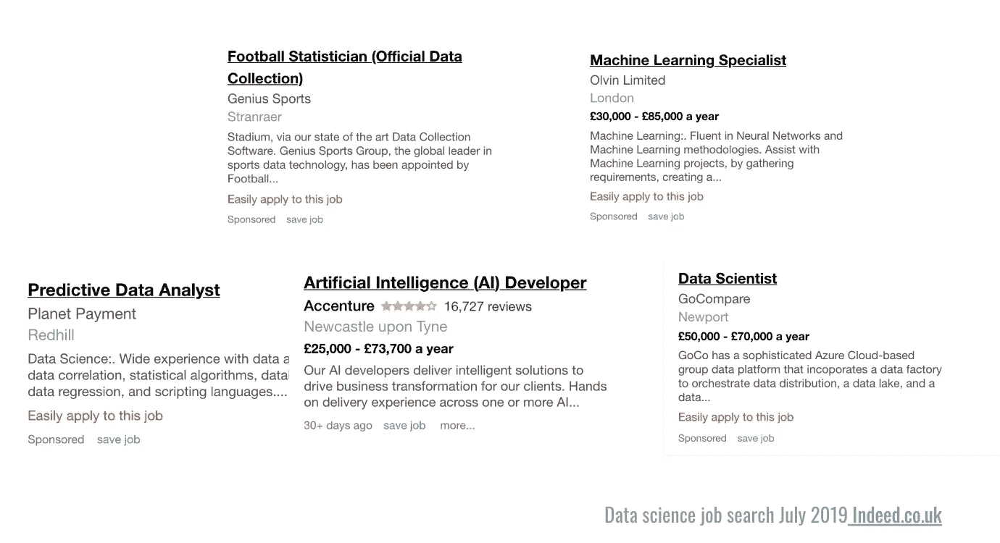

# 为什么动机是学习数据科学的关键

> 原文：<https://towardsdatascience.com/why-motivation-is-the-key-to-learning-data-science-af6a1c47102b?source=collection_archive---------14----------------------->

## 设定正确的目标，创建自己的课程，制定学习路线图

Photo by [Fab Lentz](https://unsplash.com/@fossy?utm_source=unsplash&utm_medium=referral&utm_content=creditCopyText) on [Unsplash](https://unsplash.com/search/photos/motivation?utm_source=unsplash&utm_medium=referral&utm_content=creditCopyText)

在我在正规教育之外学习数据科学的过程中，我发现动机是驾驭这门学科复杂性的关键，并且不会因构成广为人知的数据科学家技能集的大量信息而气馁。在下面的文章中，我将谈论为什么学习数据科学时动机如此重要，解释如何获得并保持动机，并与您分享一份我个人学习数据科学的学习课程和评分系统。

*为什么学习数据科学时动机如此重要？*如果你在谷歌上搜索“从事数据科学职业需要哪些技能”，你会看到一个广泛的技能列表。

这些将包括以下内容:

*   软件开发
*   计算机科学
*   统计数字
*   数学
*   数据工程
*   领域知识
*   机器学习
*   深度学习
*   沟通
*   还有更多

数据科学被认为是一门独立的学科，但这些领域本身就是一门学科。那么，你如何在合理的时间内学会看似不可逾越的技能呢？怎么知道先学哪些技能？刚开始的时候，面对看起来几乎不可能完成的任务，很容易变得没有动力，放弃学习。

> “没有人谈论学习的动机。数据科学是一个广泛而模糊的领域，这使得它很难学习。真的很难。如果没有动力，你会半途而废，认为自己做不到，这不是你的错，而是教学的问题，” **Vik Paruchuri**

*那么，为什么数据科学学科似乎需要这么多技能呢？*包含“数据”和“科学”两个词的快速求职会让你有所领悟。下面是我在 7 月份最近的一次求职中找到的一些工作的快照。这些工作都属于数据科学范畴，但每一项都需要不同的技能。

## 如何获得动力

在你旅程的开始，有一个计划真的很重要。要制定计划，你首先需要一个目标。面对数据科学中快速变化的技术，以及定期变化的工作角色和要求，我认为最好不要将目标与特定的职位联系起来。等你到了那里，那份工作可能已经不存在了。

相反，你的目标应该是一个目的，换句话说，想想你想做什么。例如，当我学习数据科学时，我的目标是“用数据产生积极影响”。为了在尽可能短的时间内产生最大的影响，我的学习集中在数据科学的应用方面。

> 你的目标应该是一个目的，换句话说，想想你想做什么

在我的清单上，最重要的技能是软件开发、数据工程、使用现有的数据科学库以及了解足够的数学和统计学知识，以理解正在发生的事情以及如何解释结果。如果我更专注于创建新的数据建模方法，那么我的技能可能会更专注于研究数据科学的角色，因此我需要更深入知识的领域会有很大不同。

## 关注哪里

好了，你有了自己的目标，也知道应该把大部分时间集中在哪一组技能上。为了最有效地实现你的目标，你需要确保你只学习与你的目标直接相关的技能。此外，你很可能会有一个过渡到数据科学的背景。例如，你可能以前从事过软件工程或者有高等数学学位。在这种情况下，有些领域你已经有了广泛的知识。

我建议你不要依赖在线课程或教育机构给你提供课程，而是创建自己的课程。有许多学习数据科学的极好资源，其中许多完全免费(我之前写过一篇关于我的[前 5 名](https://medium.com/vickdata/top-5-free-resources-for-learning-data-science-4c2108ff97c0))的文章)。你可以根据适合你的目标、背景和学习风格的材料来组织你自己的课程。

> 创建自己的课程

我不会拒绝在线课程，但我的建议是，与其完成一两个流行的 MOOC(大规模开放在线课程)来获得证书。相反，你从许多不同的课程中挑选相关的部分。如今，越来越多的课程平台，如 [Coursera](https://blog.coursera.org/introducing-subscriptions-for-specializations/) 正转向[的订阅模式](https://en.wikipedia.org/wiki/Subscription_business_model)，这样你就可以按月付费，而不必支付一次性课程费用。除了能够为您的个人学习路径选择最相关的课程部分，您还可以以更具成本效益的方式学习。

## 如何保持动力

一旦你设定了目标，确定了课程，你需要一些方法来保持动力。我建议做三件事:

1.  写下你的目标，并经常参考。为了确保你正在学习的技能能够帮助你尽快实现目标，定期回顾你的长期目标非常重要。每当你开始学习新的东西时，带着你的目标检查并问自己*‘这相关吗？’。*这将确保你一直在学习与你的长期目标密切相关的技能。
2.  *创建路线图。*在设计你的课程时，把它记录下来是个好主意。我自己的路线图，我将在本文底部分享一个链接，由一个带有评分系统的 google 表单上的一长串技能组成。每月一次，我会对照这个技能和熟练程度列表给自己打分，并与前几个月进行比较。当你在学习一门课程的时候，你经常会从完成一些事情和获得徽章和等级中获得一种满足感。在路线图上给自己打分给了我类似的满足感和庆祝成功的方式。学习的巨大动力！
3.  采取实用的第一种学习方法。一旦你觉得有能力，我建议你将正在学习的技能付诸实践。你可以通过多种方式做到这一点，包括参加机器学习竞赛，如 [Kaggle](https://www.kaggle.com/) ，从公共数据集创建自己的数据项目或为开源项目做出贡献。能够建造有用的东西会给你巨大的满足感，并且比任何打勾的人都更有动力。

## 我的路线图

这是我在[学习数据科学](https://docs.google.com/spreadsheets/u/1/d/1fOO_g20Jf46_V1Z-YYXeI7W9B-MVYojuIbBLJ51VMio/copy)时使用的路线图的链接。当你打开它时，会要求你复制一份，这将在你自己的 Google drive 上创建一个可编辑的版本。如果你喜欢，我也写了一个版本的博客，你可以在这里找到。

感谢阅读！