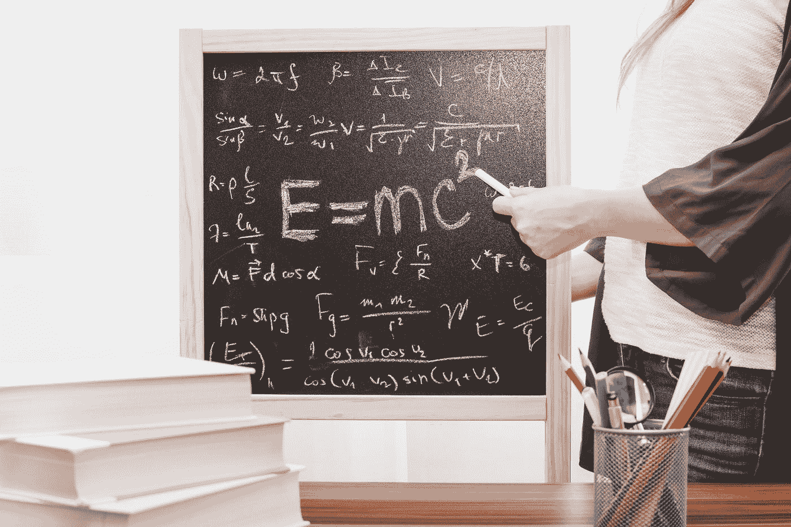
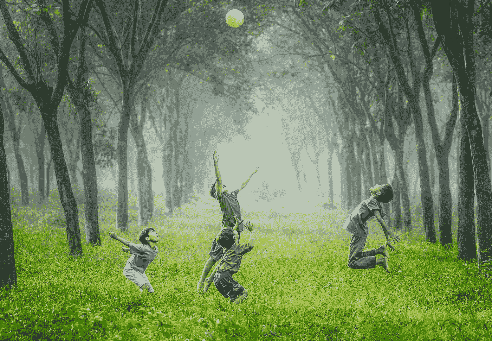

# 为什么神经网络让我想要孩子

> 原文：<https://towardsdatascience.com/why-neural-networks-make-me-want-to-have-children-b6b0b7e9a1cd?source=collection_archive---------30----------------------->

## …或者是一首花的颂歌

Photo by [Su San Lee](https://unsplash.com/@blackodc?utm_source=medium&utm_medium=referral) on [Unsplash](https://unsplash.com?utm_source=medium&utm_medium=referral)

人工神经网络是目前计算机科学和人工智能研究中最重要的事情之一，你很有可能已经听说过它们，或者至少知道它们有一些东西:否则你可能不会点击这篇文章。

大肆宣传自然让我好奇:在反复听说他们似乎如何将人工智能研究的边界越推越远后，我知道我必须仔细阅读他们。

这不会是对神经网络的技术介绍(查看[这个](https://skymind.ai/wiki/neural-network)，或者，为了更详细的了解，或者阅读伟大的[统计学习理论介绍](https://www.wiley.com/en-us/An+Elementary+Introduction+to+Statistical+Learning+Theory-p-9780470641835))。相反，我将专注于神经网络做什么样的事情，以及这如何改变我在日常生活中的一些看法，以一种奇怪的方式激励我要孩子。

## 科学家的困境。

让我们面对现实吧:许多科学家都是过度思考者。

为了解决这个问题，我们把过度思考作为我们的职业。为你的弱点买单永远是生活中的好建议。

我们一天中的大部分时间都埋头于抽象思维的领域。我们对主纤维丛上的全息论、弯曲流形上的度量张量(我对这些东西感到兴奋，所以闭嘴)、神经元信号速率、蛋白质折叠的细节、在量子计算机上分解素数的数学复杂性，或者在神经网络中使用激活函数感到兴奋。

A typical scene in a physics lab. If we don’t know what to do, we write down couple of random formulas on a blackboard and finish it up with E equals m c squared. Works everytime. Photo by [JESHOOTS.COM](https://unsplash.com/@jeshoots?utm_source=medium&utm_medium=referral) on [Unsplash](https://unsplash.com?utm_source=medium&utm_medium=referral)

作为专业的过度思考者，我们对一切世俗和普通的事物都有一种微妙的厌恶，这些事物既不密集也不复杂，或者与我们整天思考的极其具体的事情无关。

因此，很自然地，我们中的一些人会发现孩子有点迟钝。

你真的无法与他们就知识结构或改变基因的道德含义进行任何有意义的对话。

相反，孩子们主要关心的话题是他们的新消防车，或者他们的一个朋友如何告诉另一个朋友他很愚蠢。

***但看哪，还有补救办法！***

## 学习统计学习理论

神经网络提供了一个非常简单的数学学习模型。

比方说，你试图找出某样东西是哪种颜色。你要分类的物体的颜色由一个 ***特征向量*** 来表征。这个 ***特征向量*** 可以例如在三维 RGB 空间中表示，但是原则上可以被许多其他事物跨越(你的个人特征向量可以例如包括你的身高和体重)。

RGB 空间中的示例如下所示:

1.  黑色= [0，0，0]
2.  一种“完美”的蓝色= [0，0，255]
3.  一种“完美的”红色= [255，0，0]

## 神经网络如何学习分类数据？

然后，使用一组示例数据开始学习过程。这些只是很多元组[x，x，x]，附加到这些元组上的标签告诉你这些元组属于哪种颜色。上面的三个例子是带有三个标签黑色、蓝色和红色的三元组。

然后你可以将数据集输入你的神经网络。网络将通过以下方式“学习”如何正确分类数据

1.  ***尝试分类:*** 网络从分类的任意分布开始。然后，它会尝试对这些例子进行随机分类，可能不会成功。
2.  ***寻找错误函数:*** 这告诉网络它做出的选择离正确的选择有多远。
3.  ***调整其权重:*** 网络根据查看误差函数获得的洞察力，通过调整其内在结构来从其错误中学习。这改进了将来的分类。
4.  ***涂肥皂，冲洗，重复:*** 运行训练程序足够长的时间，以便你的网络学会正确地对训练数据进行分类。测试未用于训练的数据的分类质量。

小时候，我们都学过对颜色进行分类，尽管我们可能不记得了。

有趣的是，颜色如何分类并没有统一的标准。虽然我们都认为我们可以做到，但我们无法真正解释我们是如何做到的。

关于正确的颜色分类的困难，有一些公认的见解。文化依赖和语言依赖(很多语言甚至没有蓝绿之分)已经被证明是存在的。甚至还有语境依赖:你可以欺骗人们根据周围圆点的颜色，一次称同一个圆点为绿色，一次称之为蓝色。

这表明大脑中可能没有一个完整的预定结构来对颜色进行分类(尽管看起来这至少是交易的一部分)，我们都在某种程度上学习它，基于我们环境的输入。

## 让你的孩子更有趣

Photo by [Robert Collins](https://unsplash.com/@robbie36?utm_source=medium&utm_medium=referral) on [Unsplash](https://unsplash.com?utm_source=medium&utm_medium=referral)

我最近想到，当孩子们学习对颜色、动物或车辆等事物进行分类时，你可以想象他们在做这件事，就像一个神经网络，用一组带标签的训练数据。他们是

1.  ***尝试分类:*** 孩子们不断地说出他们看到的周围物体的名称。
2.  ***使用错别字功能:*** 当他们用错一个字时，他们的父母会告诉他们。
3.  ***调整权重:*** 大脑以一种有意义的方式变化，提高自己在未来分类中的成功率。
4.  ***起泡沫，冲洗，重复:*** 他们重复这样做，直到有一天他们能够与周围的世界正常交流。

我最好的朋友之一有一个两岁的儿子，我最近经常和他在一起。学习了统计学习理论后，我体会到了孩子们是如何在很短的时间内同时学习非常多不同的东西的。

有一次，我们翻阅一本杂志，里面有汽车、卡车和各种其他车辆的图片。当他看到一辆他以前没见过的卡车时，我们告诉他这是一辆卡车(我们后来被他妈妈批评，因为我们非法教他说脏话，但那是另一回事了)。

当一张公交车的图片在他面前时，他也称之为卡车，但我们纠正了他。

我突然意识到我在充当这孩子的错误函数。瞧，又过了两页，他正确地将一辆卡车和一辆公共汽车归类到了一起。

## ***拥抱过度思考。***

下次你告诉一个孩子某样东西是绿色的而不是蓝色的，要意识到你面对的是一个试图学习新分类程序的神经网络。

记住，信息会直接流入他的大脑，根据你的反馈调整他大脑的权重。

拥抱过度思考，让身边的孩子更有趣。

## 一朵花的颂歌

虽然这有点开玩笑，我希望你现在不要认为我是一个可怕的人，但实际上我想表达一个更深层次的观点。

我非常支持这样一种观点，即科学地理解事物会增加它们的惊奇，而不是减少它。

理查德·费曼的一个比喻(他在这个视频中谈到了这个比喻)一直萦绕在我的脑海中:

> 我能欣赏花的美丽。同时，我对这朵花的了解比他多得多。我可以想象那里的细胞，里面复杂的动作，也有一种美。我的意思是，它不仅仅是这个维度，一厘米的美丽；在更小的维度上也有美，内部结构，还有过程。花朵颜色的进化是为了吸引昆虫来授粉，这个事实很有趣；这意味着昆虫可以看到颜色。这就增加了一个问题:这种美感是否也存在于低级形式中？为什么是审美？各种有趣的问题，科学知识只是增加了一朵花的兴奋、神秘和敬畏。只会增加。我不明白它是怎么减法的。
> —理查德·费曼

理解我们如何用数学方法建立一个学习程序只会让我更着迷于看到人类学习的速度和效率，以及他们需要多么少的数据来找到好的分类。

不仅孩子们会这样做，我也开始意识到我自己的大脑是如何对周围的世界进行分类和再分类的，以及我一直在潜意识和有意识地学习多少东西。

神经网络的伟大之处在于，它们的基本设置非常简单，但在我们看来，它们做的事情就像是智能行为(例如，图片分类、语音、文本生成等)。).

理解学习背后的一些形式结构帮助我再次认识到简单的数学结构不仅可以帮助我们思考自然世界，还可以帮助我们思考我们自己的感知和行为(正如我在我关于[自由意志的热力学](https://medium.com/@haxelschnurtz/the-thermodynamics-of-free-will-940cacd02401)的文章中所述)，扩展了我们在思考我们自己和我们在世界中的角色时可以使用的概念框架。

***对我来说，这真的增加了这一切的兴奋和神秘……最后，更严肃地说，这真的让我想有孩子来分享这一切。***