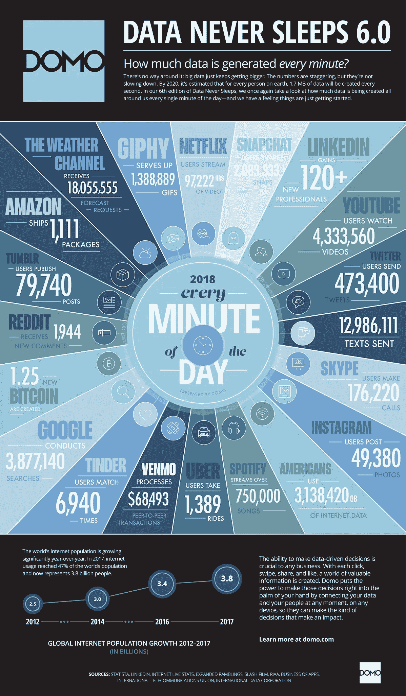

# 为什么 NLP 很重要，它将是我们的未来

> 原文：<https://towardsdatascience.com/why-nlp-is-important-and-itll-be-the-future-our-future-59d7b1600dda?source=collection_archive---------4----------------------->

## 由数据科学家解释

> 两年前，当我还在 CERN 进行我的 [**海外实习时，我与**](/my-journey-from-physics-into-data-science-5d578d0f9aa6) **[**乐天 Viki**](https://www.viki.com/) (你可以把它想象成另一个网飞)进行了一次电话面试，应聘数据科学实习生职位。**
> 
> 所以我打电话给一个人，他问我是否有 NLP 的经验。
> 
> 嗯…你猜怎么着？
> 
> 我问他，“你是说神经语言程序？”当我还在谷歌搜索 NLP 术语的时候——我想这是多任务处理的最佳状态。
> 
> 长话短说，我知道我没有通过电话面试，尽管他在最后说了一句安慰的话，“谢谢你的时间。如果你被列入候选名单，我会尽快与你联系。”

经过一番谷歌搜索，当我知道 NLP 指的是[自然语言处理](https://en.wikipedia.org/wiki/Natural_language_processing)时，那是一个“啊哈”的时刻(在面试电话之后)。

[NLP](https://www.forbes.com/sites/forbestechcouncil/2018/11/06/the-evolution-of-natural-language-processing-and-its-impact-on-ai/#3ecbfe1c1119)——也被称为计算语言学——是人工智能和语言学的结合，它让我们能够像人类一样与机器对话。

> 换句话说，自然语言处理是一种处理、分析和理解大量文本数据的方法。

事实上，自然语言处理并不是什么新东西，它可以追溯到 20 世纪 50 年代，当时它是作为机器翻译(MT)开始的。

在数据科学领域工作了一段时间后，我开始意识到 NLP 及其广泛应用在我们日常生活中日益增长的重要性——无论是现在还是将来。

在这篇文章结束时，我希望你能理解自然语言处理的重要性，以及为什么它会成为未来——我们的未来。

我们开始吧！

# **为什么 NLP 很重要？**

[(Source)](https://www.socialmediatoday.com/news/how-much-data-is-generated-every-minute-infographic-1/525692/)

让我们面对现实吧。每天都有数十亿的文本数据生成。

看看我们周围。

应用内消息(Whatsapp、微信、Telegram 等。)、社交媒体(脸书、Instagram、Twitter、YouTube 等。)、论坛(Quora、Reddit 等。)、博客、新闻发布平台、谷歌搜索等诸多渠道。

所有这些频道每秒钟都在不断地产生大量的文本数据。

由于大量的文本数据以及高度非结构化的数据源，我们不能再使用普通的方法来理解文本，这就是 NLP 的用武之地。

## 1.处理大量文本数据

随着大数据技术的发展，NLP 已经成为主流，因为这种方法现在可以通过云/分布式计算以前所未有的速度处理大量的文本数据。

想象一下，给你一个句子，任务是手动识别这个句子是否有[积极/消极/中性情绪](/sentiment-analysis-concept-analysis-and-applications-6c94d6f58c17)。

太好了。这太容易了，你在几秒钟内就完成了。

想象一下，现在给你几百万个句子，再次进行情感分析。那要花你多长时间？嗯……你明白了。

今天的机器可以分析比人类更多的基于语言的数据，**没有疲劳，并以一致、公正的方式**。

考虑到每天生成的非结构化数据数量惊人，从医疗记录到社交媒体， [**自动化对于高效地全面分析文本和语音数据至关重要**](https://www.sas.com/en_sg/insights/analytics/what-is-natural-language-processing-nlp.html#world) 。句号。

## 2.结构化高度非结构化的数据源

将文本数据描述为非结构化数据是一种保守的说法。

> 文本数据一塌糊涂。
> 
> — [阿德蒙德·李](https://medium.com/@admond1994)

想象一下你通常给朋友发信息的方式，“你在哪里啊😫”

仅仅一条短信我们就看到有缩写词(“r”和“u”)、俚语(“ah”)、省略的标点和表情符号。最棒的是，我们在这里只谈论英语。

总之，人类语言极其复杂多样。

不仅有数百种语言和方言，而且每种语言中都有一套独特的语法和句法规则、术语和俚语。

[NLP 很重要，因为它有助于解决语言中的歧义，并为许多下游应用程序(如语音识别或文本分析)的数据添加有用的数字结构](https://www.sas.com/en_sg/insights/analytics/what-is-natural-language-processing-nlp.html#world)。

# 为什么 NLP 将成为未来——我们的未来？

随着每天产生越来越多的文本数据，自然语言处理对于理解数据和在许多其他应用中的使用将变得越来越重要。

Google Translate from Chinese to English

您可能已经使用过一些最强大的 NLP 应用程序，但还没有意识到这一点。

看一下**谷歌翻译就知道了。**它是由谷歌开发的免费多语言**机器翻译**服务，由幕后的 NLP 提供支持。

或者也许你已经尝试过[亚马逊 Alexa](https://www.webopedia.com/TERM/A/alexa.html) 或[谷歌助手](https://assistant.google.com/)通过**语音识别**准确理解并回答你的问题——同样，通过 NLP。

更有意思的是，连数字营销行业都在向**数据驱动的数字营销**迈进。通过分析海量的文本数据和大规模，数字营销人员和品牌现在能够通过社交倾听了解客户的兴趣、痛点和品牌感知是什么。

在金融行业，**聊天机器人已经[为保诚](https://www.prudential.com.sg/innovation/askpru-chatbot)的金融顾问提供了更好的服务体验，更加及时、准确，最重要的是，以人性化的方式回应了客户的查询。**

**NLP 已经改变了我们与计算机交互的方式，并且在未来还会继续下去。这些人工智能技术将成为从数据驱动向智能驱动转变的潜在力量，因为它们将在未来几年塑造和改善通信技术。**

# **最后的想法**

****

**[(Source)](https://unsplash.com/photos/alANOC4E8iM)**

**感谢您的阅读。**

**我希望现在你已经更好地理解了为什么 NLP 变得越来越重要，以及它将如何影响我们的未来。**

**也许你是一名数据科学家，正在考虑专攻哪个领域。**

**也许你在数字营销领域工作，想知道如何在你的营销策略中利用 NLP 的力量。**

**没关系。**

> **NLP 不再仅仅是未来。已经到了。**

**了解 NLP 如何应用于各种行业以及它如何塑造我们的未来非常重要。**

**一如既往，如果您有任何问题或意见，请随时在下面留下您的反馈，或者您可以随时通过 LinkedIn 联系我。在那之前，下一篇文章再见！😄**

# **关于作者**

**[**Admond Lee**](https://www.linkedin.com/in/admond1994/) 目前是东南亚排名第一的商业银行 API 平台 [**Staq**](https://www.trystaq.com) **—** 的联合创始人/首席技术官。**

**想要获得免费的每周数据科学和创业见解吗？**

**你可以在 [LinkedIn](https://www.linkedin.com/in/admond1994/) 、 [Medium](https://medium.com/@admond1994) 、 [Twitter](https://twitter.com/admond1994) 、[脸书](https://www.facebook.com/admond1994)上和他联系。**

** [## 阿德蒙德·李

### 让每个人都能接触到数据科学。Admond 正在通过先进的社交分析和机器学习，利用可操作的见解帮助公司和数字营销机构实现营销投资回报。

www.admondlee.com](https://www.admondlee.com/)**