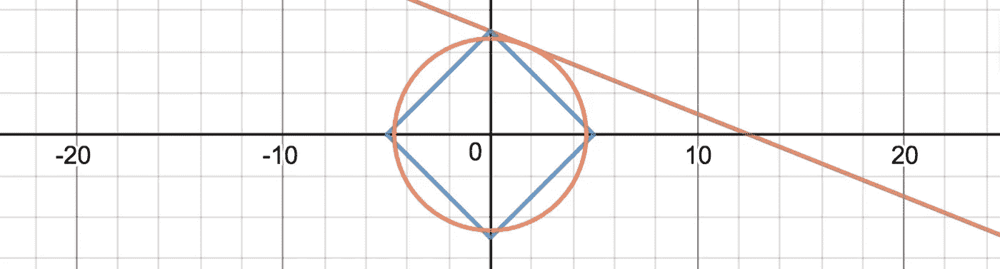
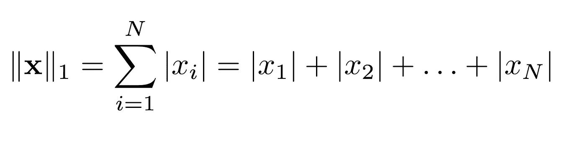
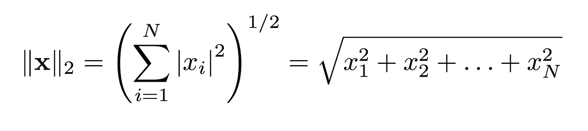
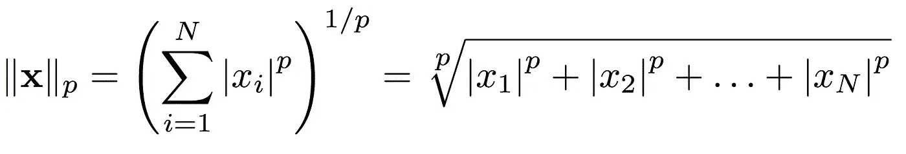
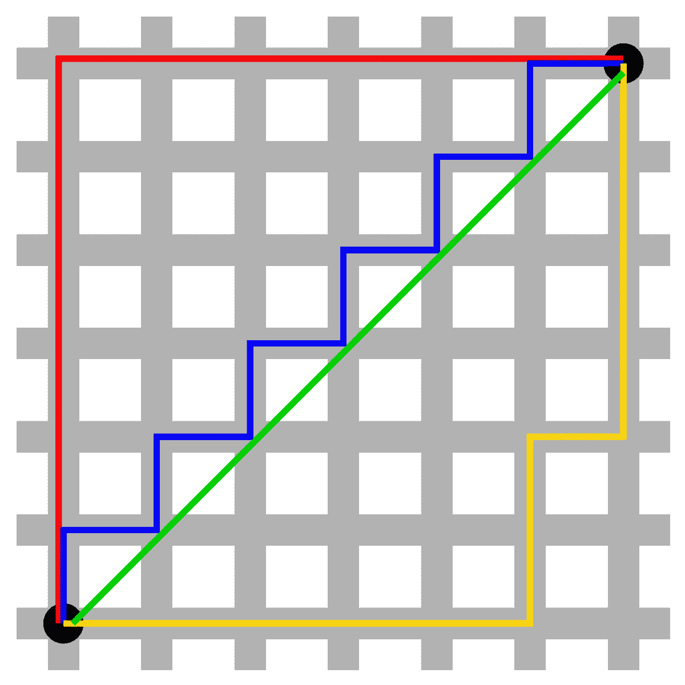
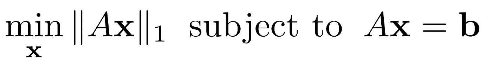
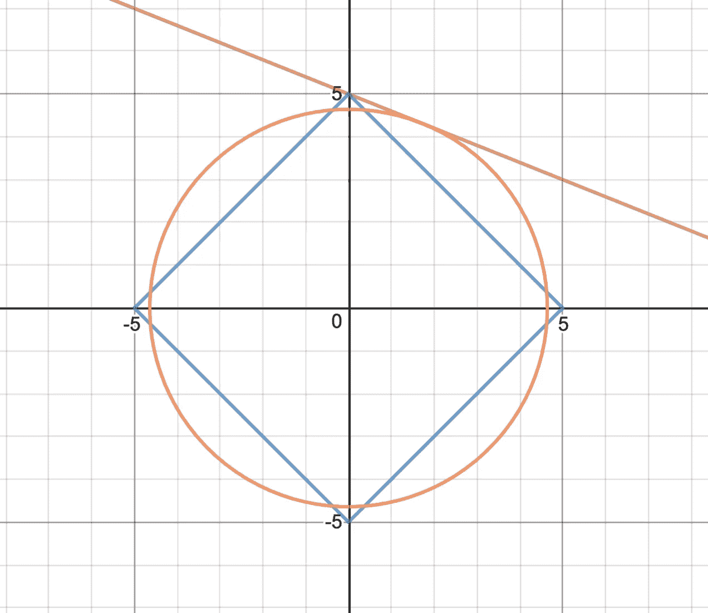

# 为什么规范很重要——机器学习

> 原文：<https://towardsdatascience.com/why-norms-matters-machine-learning-3f08120af429?source=collection_archive---------19----------------------->

Play with norms: [https://www.desmos.com/calculator/wznruz7mxs](https://www.desmos.com/calculator/wznruz7mxs)

评估是所有建模和机器学习问题的关键步骤。因为我们经常对整个数据集进行预测，所以提供一个简单有效的数字来概括我们模型的性能。

在很多情况下，我们需要将关于一个**数据集**的信息压缩成一个单独的**数**。例如:

*   确定多维数据点的**大小**
*   计算机器学习模型的**损失**
*   计算预测模型的**误差**

在本文中，我将回顾在这些情况下最常用的规范，即 L 和 L 规范。我将描述它们的异同，以及何时使用哪个规范。此外，我将展示如何可视化这些规范以及它们在优化问题中的使用。

# 术语

有几个名字*描述了相同的数量*，所以让我们先把它清除掉。你可能在不同的上下文中听说过这些短语，但它们可能描述的是同一个东西！如上所述，这些规范用于量值和距离、误差近似值和回归的上下文中。

## l 范数

L 范数通常被称为*曼哈顿/出租车距离*、*平均绝对误差(MAE)* 或*最小绝对收缩和选择算子* ( *LASSO)。*

## **L 定额**

L 范数通常被称为*欧几里德距离*、*均方误差(MSE) /最小二乘误差*或*脊算子。*

# 定义 L & L 规范(以及更多！)

L 和 L 范数通常用于给向量指定一个量级。对于一个向量 **x** 有 *N* 个分量，L 只是把这些分量相加。因为我们希望我们的幅度总是正的，所以我们取分量的绝对值。

L 范数取平方值之和，最后取平方根。L 范数和 a *标准距离公式*一样，求 A 到 b 的最短路径。

如果你开始看到一个模式，那么你可能会问:为什么停在 2？我们也可以用这种方法为所有 1 ≤ *p* < ∞创建一个范数！

# 可视化 L & L 规范

从定义中我们可以看出，L 范数只关心单个的分量，而 L 范数寻找的是最短的距离。

L¹ and L² norms on a city block grid.

红色、蓝色和黄色距离都计算 L 距离，而绿色距离计算 L 距离。L 范数被描述为出租车距离的一个原因是因为它描述了你到达目的地必须经过的街区数。

# 可视化差异—优化

假设我们试图解决一个最优化问题。这意味着我们试图找到最佳的输入，使输出损失最小化。

范数是惩罚的最佳选择，因为它们为每个输出分配了一个合理的大小。

考虑最简单的优化问题——解决一个线性问题。这涉及到矩阵 *A* 和向量 *b* 。这些问题往往没有单一的解决方案，可能有一系列或一个平面的解决方案。

在这种情况下，我们需要从这一整套解决方案中找到最佳解决方案。引入范数惩罚，如 L 或 L 范数，是一种常见的方法。

Play around with this graph: [https://www.desmos.com/calculator/wznruz7mxs](https://www.desmos.com/calculator/wznruz7mxs)

上图中，红线代表了方程 *x + 3y = 5* 的所有可能解。蓝色菱形代表固定 L 范数为 5 的所有解，橙色圆圈代表 L 范数相同为 5 的所有解。

如你所见，解决方案是**不同的**，这取决于我们决定使用哪个规范。由于 L 范数具有菱形形状，因此通常使用 L 范数可以找到稀疏的**解。此外，由于 L 范数最小化了欧几里德距离，所以使用 L 范数经常可以找到消除异常值的解决方案。**

# 谢谢！

如果您想玩玩上面的图表，看看 L 和 L 规范之间的差异，请查看 Desmos 上的这张[交互式图表！](https://www.desmos.com/calculator/wznruz7mxs)