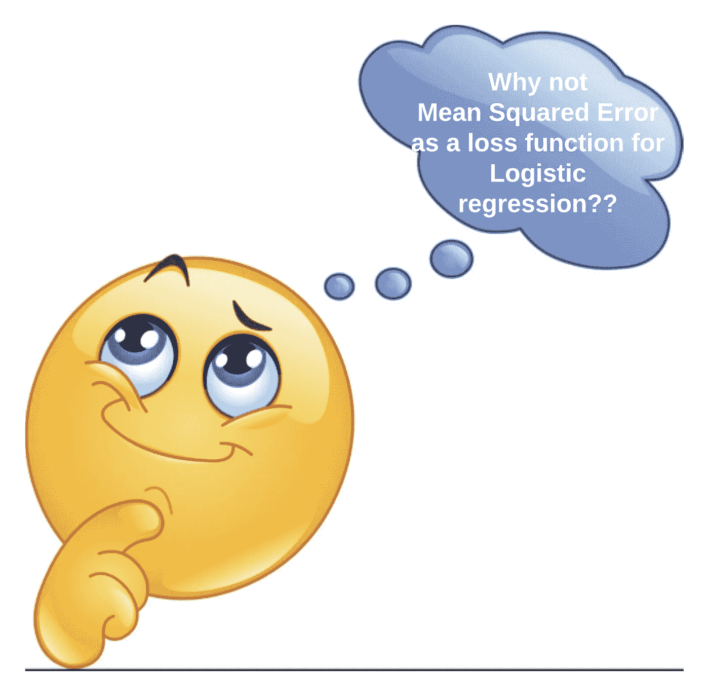
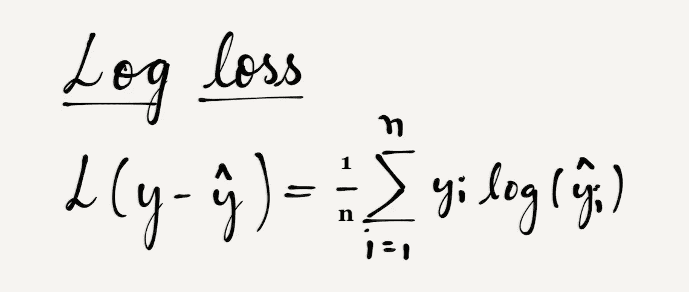
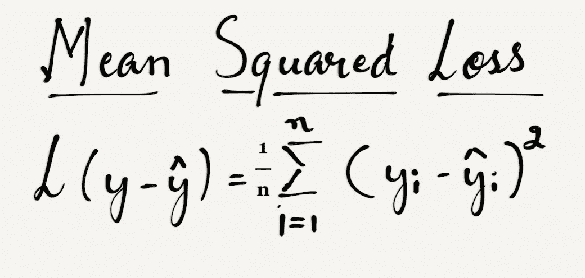
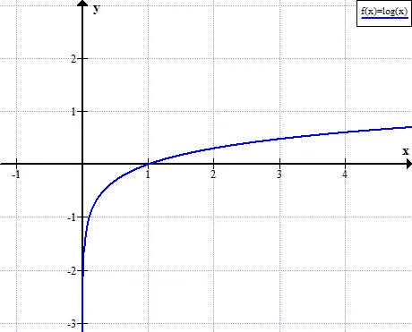
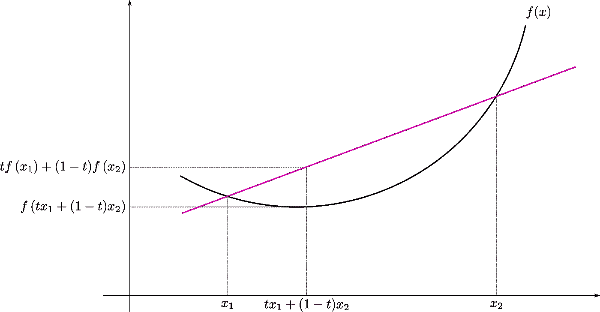
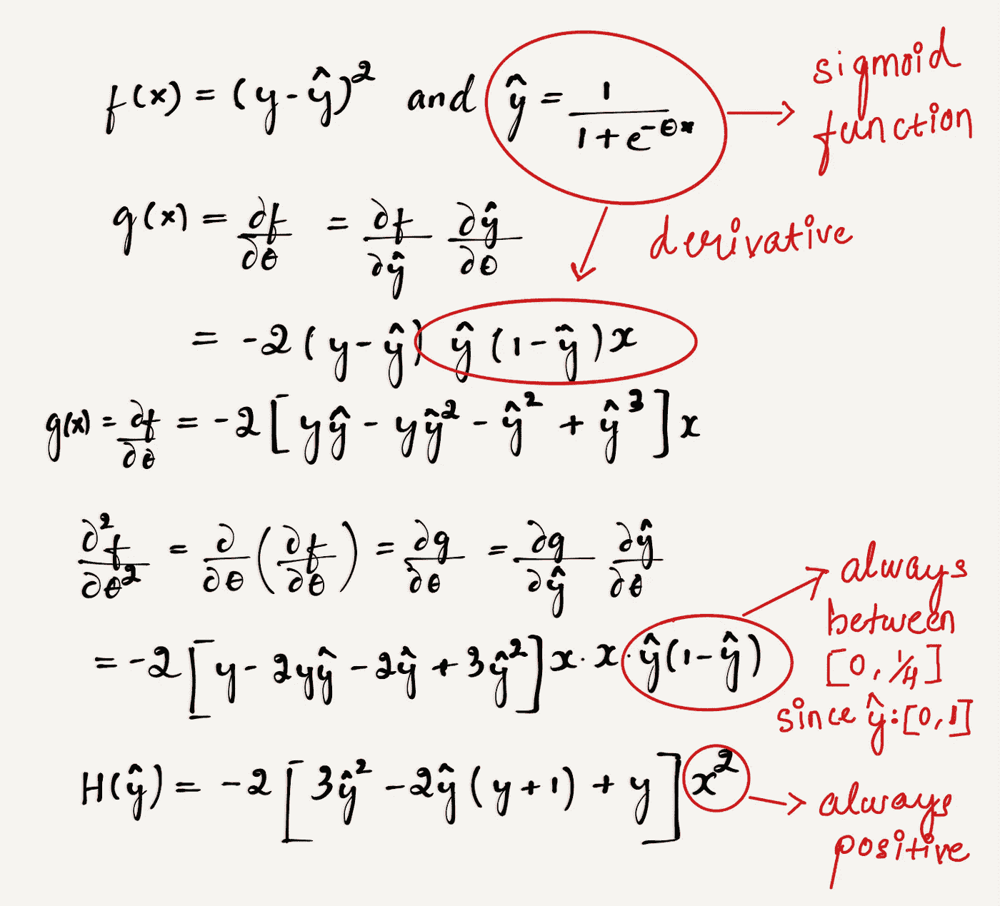
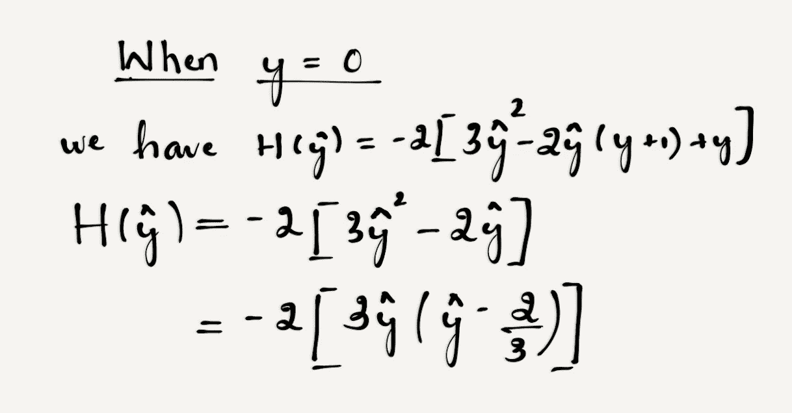
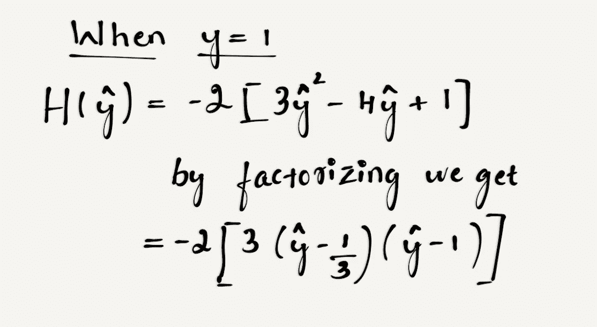
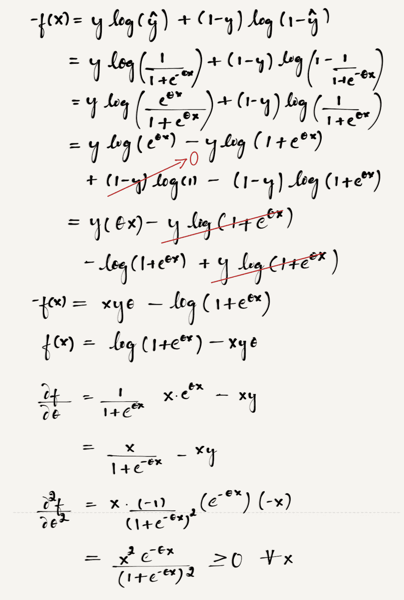

# 为什么不把均方差(MSE)作为 Logistic 回归的损失函数？🤔

> 原文：<https://towardsdatascience.com/why-not-mse-as-a-loss-function-for-logistic-regression-589816b5e03c?source=collection_archive---------3----------------------->

**作者:***， [Souradip Chakraborty](https://medium.com/u/629a094c91b8?source=post_page-----589816b5e03c--------------------------------) * (*表示同等贡献)。

> 在这篇博文中，我们主要比较了逻辑回归的“**对数损失**与**“均方误差”**，并基于经验和数学分析，说明了为什么同样推荐使用**对数损失**。

两个损失函数的等式如下:

**日志丢失:**

**均方损失:**

在上面的两个等式中

y:实际标签

ŷ:预测值

n:类别数

假设我们有一个包含 2 个类(n = 2)的数据集，标签分别表示为**“0”**和**“1”。**

现在，我们计算预测值和实际标签完全不匹配时的损失值，并了解 log-loss 如何优于 MSE。

**比如:**

比方说

*   数据集中给定样本的实际标签是“1”
*   应用 sigmoid 函数= 0 后模型的预测

**使用 MSE 时的损失值:**

(1- 0)² = 1

**使用测井损耗时的损耗值:**

在插入损耗方程的值之前，我们可以看看 ***log(x)*** 的图形是什么样的。

**Figure 3: f(x) = log(x)**

从上图可以看出随着 **x 趋于 0，** ***log(x)趋于-无穷大。***

因此，损失值为:

***-(1 * log(0) + 0 * log(1) ) =趋于无穷大！！***

***如上所述，与使用对数损失函数计算的损失值相比，使用 MSE 的损失值要小得多。因此，对我们来说非常清楚的是，MSE 不会强烈地惩罚错误分类，即使是完美的不匹配！***

但是，如果预测值和实际标签完全匹配，则两个损失值都将为“0”，如下所示。

实际标签:**“1”**

预测:**“1”**

***MSE: (1 - 1) = 0***

***日志损失:-(1 * Log(1)+0 * Log(0))= 0***

***这里我们已经说明了 MSE 对于二元分类问题并不是一个很好的选择。但是如果目标值是一次性编码的，这同样可以扩展到多类分类问题。***

# Logistic 回归中的均方误差和非凸性问题。

在分类场景中，我们经常使用基于梯度的技术(牛顿拉夫森，梯度下降等..)通过最小化损失函数来找到系数的最佳值。因此，如果损失函数不是凸的，就不能保证我们总是达到全局最小值，而是我们可能会陷入局部最小值。

Figure 4: Convex and non-Convex functions

在深入探讨为什么 MSE 在逻辑回归中使用时不是凸函数之前，首先，我们来看看函数是凸的条件是什么。

定义在一个[n 维区间](https://en.wikipedia.org/wiki/Interval_(mathematics)#Multi-dimensional_intervals)上的一个[实值函数](https://en.wikipedia.org/wiki/Real-valued_function)，如果函数的[图上任意两点之间的](https://en.wikipedia.org/wiki/Graph_of_a_function)[线段](https://en.wikipedia.org/wiki/Line_segment)位于图的上方或图上，则称该函数为**凸**。

Figure 5: Convexity of a function

如果 **f** 是两次可微的，并且定义域是实直线，那么我们可以将它刻画如下:

**f** 为凸当且仅当**f”(x)≥0**对于所有 ***x*** *。因此，如果我们能证明损失函数的二重导数≥ 0，那么我们就可以说它是凸的。* *更多详情，可以参考* [*这段视频。*](https://www.youtube.com/watch?v=u8JrE9JlZPM)

现在我们从数学上证明了逻辑回归的 MSE 损失函数是非凸的。

为了简单起见，我们假设对于给定的数据集，我们有一个特征**【x】**和**【二进制标签】**。在下图**中，f(x) = MSE** ，ŷ是应用 sigmoid 函数后获得的预测值。

Figure 6: MSE double derivative

从上面的等式中， **ŷ * (1 - ŷ)** 位于[0，1]之间。因此，我们必须检查 **H(ŷ)** 对于**“x”**的所有值是否为正，是否为凸函数。

我们知道 **y** 可以取两个值 **0** 或 **1。让我们检查两种情况下的凸性条件。**

Figure 7: Double derivate of MSE when y=0

所以在上述情况下，当 y = 0 时，从方程中可以清楚地看出，当 ŷ位于区间**【0，2/3】**时，函数**【h(ŷ】****≥0，当 ŷ位于区间**【2/3，1】**时，函数**【h(ŷ)≤0。**这说明函数不是凸的。**

Figure 8: Double derivative of MSE when y=1

现在，当 **y = 1** 时，从等式中可以清楚地看出，当 ŷ位于区间**【0，1/3】**时，函数 **H(ŷ)** ≤ **0，当 ŷ位于区间**【1/3，1】**时，函数 **H(ŷ) ≥ 0。**这也说明函数是不凸的。**

因此，基于凸性定义，我们从数学上证明了逻辑回归的 MSE 损失函数是非凸的，不推荐使用。

现在是“对数损失”函数的**凸性问题！！我们将从数学上证明对数损失函数对于逻辑回归是凸的。**

Figure 9: Double derivative of log loss

θ:自变量“x”的系数。

如最终表达式(对数损失函数的双导数)所示，平方项总是≥0，而且，一般来说，我们知道 **e^x** 的范围是 **(0，无穷大)。因此，最终项总是≥0，这意味着在这种情况下对数损失函数是凸的！！**

**最终想法:**

我们希望这篇文章能够让你理解在逻辑回归中使用 MSE 作为损失函数的缺点。如果您有任何想法、意见或问题，请在下面留下评论或在 LinkedIn 上联系我们，别忘了点击👏如果你喜欢邮报。

 [## Rajesh Shreedhar Bhat -数据科学家-印度沃尔玛实验室| LinkedIn

### 查看 Rajesh Shreedhar Bhat 在世界上最大的职业社区 LinkedIn 上的个人资料。

www.linkedin.com](https://www.linkedin.com/in/rajeshshreedhar/)  [## Souradip Chakraborty -统计分析师-沃尔玛印度实验室| LinkedIn

### 查看 Souradip Chakraborty 在全球最大的职业社区 LinkedIn 上的个人资料。

www.linkedin.com](https://www.linkedin.com/in/souradip-chakraborty/) 

参考资料:

 [## 凸函数

### 在数学中，定义在 n 维区间上的实值函数称为凸(或下凸或…

en.wikipedia.org](https://en.wikipedia.org/wiki/Convex_function)