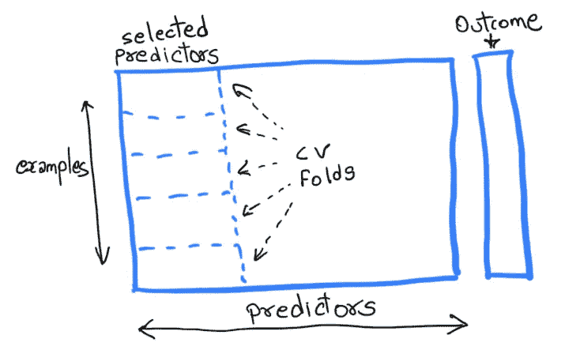
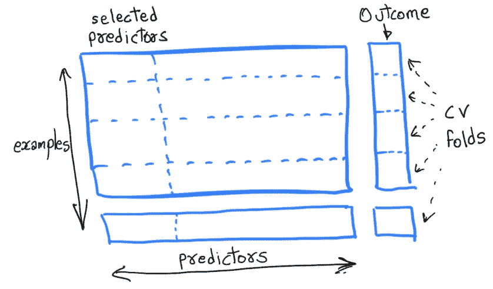

# 为什么不在分割数据之前选择要素

> 原文：<https://towardsdatascience.com/why-not-to-select-features-before-splitting-your-data-2d6aba2e9fb?source=collection_archive---------10----------------------->

## 使用编码示例解释交叉验证的正确和错误方式

想象一下:一名斯坦福大学的博士生试图利用基因数据预测一种罕见心脏病的发生。该学生为 50 名患者收集了超过 10 万个基因表达数据(预测值)。然后，该学生从 10 万个预测者中挑选出最好的 100 个作为“初步筛选”的一部分，使用交叉验证将统计模型仅拟合到 100 个筛选的预测者，并报告准确率超过 65%(这对罕见的心脏病来说是一件大事)。听起来不错？

**不！**

这位学生对最近应用统计学中的一个危险趋势做出了贡献，即使用交叉验证来呈现他们的研究中高度偏颇的精选结果。重要的是不仅要了解学生错在哪里，还要了解他们为什么也会掉进这个陷阱。事实上，他们已经“窥视”了他们的验证集，甚至没有意识到这一点。

Don’t peek into your validation/test data

在本文中，您将学习-

1.  快速识别可疑的统计研究，这些研究声称在初步筛选特征后进行了“独立验证”
2.  以正确的方式进行交叉验证
3.  在 R 笔记本上练习实现它

随着机器学习在收集数据的几乎每个领域的爆炸式增长，人们越来越多地找到了快速训练和部署现成模型的方法，而无需完全理解它们背后的算法。仅用一行代码就能让机器学习库“容易”实现的最新趋势只会增加问题。因为这些捷径，我们不时会遇到可能出错的例子，比如斯坦福学生的例子。

那个学生并不孤单——错误估计的交叉验证错误偶尔也会出现在一些高知名度的学术期刊上。事实上，一整篇文章都致力于在美国国家科学院学报上记录这种选择偏差的例子。所以，让我们来看看上面的例子中到底哪里出错了。

## 交叉验证:错误的方式

在上面的例子中，学生**使用所有的例子(患者)来筛选预测因子**，而不是将他们自己仅仅限制在训练折叠中。由于他们正在处理一个广泛的数据集——特征数量(基因)> >样本数量(患者)——执行特征选择以缩小到基因子集是一个自然的选择。这实际上也是防止模型过度拟合的有价值的步骤。但是通常情况下，筛选是在项目的早期阶段进行的，导致人们在使用交叉验证建模时忘记了它。如果我们使用所有的例子来选择我们的预测器(图 1)，模型甚至在预测之前就已经“窥视”到验证集了。因此，交叉验证的准确性必然比真正的模型准确性高得多。

Fig. 1\. | The wrong way to perform cross-validation. Notice how the folds are restricted only to the selected predictors.

下面是一个交叉验证陷阱的工作示例，我们在预测像掷硬币这样真正随机的事情时获得了 99%的准确率！完整的 R 笔记本也可以在[这里](https://gist.github.com/kkraoj/94ec4653a96bad5127affedbf61658e4)买到。

## 交叉验证:正确的方法

另一方面，如果我们运行与上面相同的模型，但是**只使用训练折叠来筛选预测器，**我们将有一个更好的模型真实误差的表示。分割数据的正确方式如图 2 所示。在这种情况下，同一个模型的交叉验证准确率为 46%，或者换句话说，该模型在预测抛硬币时的正确率不到一半。

Fig. 2 | The right way to cross-validated. Notice how the validation fold is separated before selecting the features

## 经验教训

在本文中，我们学会了以正确的方式进行特征筛选，而不是落入交叉验证陷阱。要复习，记得-

1.  仅将训练数据(或训练折叠)用于特征筛选或任何其他数据操作
2.  在对同一验证集进行预测时，不要使用模型可以从中受益的验证集中的任何信息。验证应该总是独立的。

至于那个严重高估了他们模型预测心脏病准确性的斯坦福学生呢？幸运的是，在将他们的错误公之于众并误导医学协会之前，这位学生遇到了罗布·提布拉尼(我的教授)。如果你想听听 Rob 自己是怎么说的，这里有他的[视频](https://www.youtube.com/watch?v=S06JpVoNaA0)。