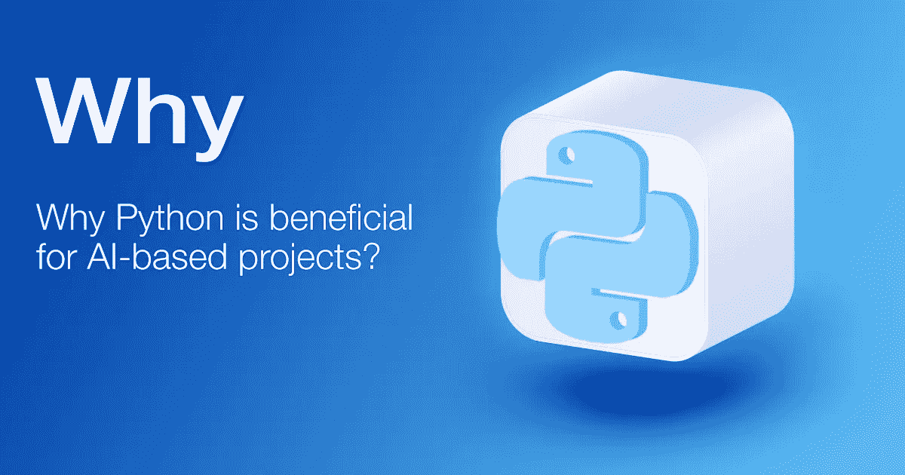

# 为什么 Python 对基于人工智能的项目有益

> 原文：<https://towardsdatascience.com/why-python-is-beneficial-for-ai-based-projects-15b28ba19982?source=collection_archive---------16----------------------->

## 你是否困惑于为你的下一个大的人工智能项目选择哪种语言？了解有关 Python 核心功能的更多信息。

今天，很难想象没有不同程度的人工智能技术的现代商业。聊天机器人、虚拟助手、语音搜索和其他融入市场的创新正在增加企业的收入，同时改善客户的体验。如果你想开始自己的基于人工智能的项目，那么你会事先制定出一个策略，用于编码和所有其他过程的编程语言(进一步 PL)。

# 为什么选择 Python 做 AI 驱动的项目？

毫无疑问，人工智能技术是未来。考虑到这一趋势越来越受欢迎，以及准备投资于此的人数，到 2025 年，全球人工智能市场将达到[898 亿美元。](https://www.statista.com/statistics/607716/worldwide-artificial-intelligence-market-revenues/)

PL 是你首先应该考虑的。编码的复杂性以及有经验的合格开发人员的可用性也是需要考虑的关键因素。当涉及到人工智能行业时，你需要有效地处理和处理大量数据，在这里我们为你提供了至少 8 个理由*为什么你会选择 Python 来开发你的人工智能项目*。

## 陡峭的学习曲线

由于是基于 OOP 的，Python 提供了来自所用 PL 的 API，简化了学习过程，减少了新开发人员学习基础知识和开始编写 AI 应用程序所需的时间。此外，它具有简单的语法，类似于真正的英语，即使是初级或无经验的 Python 开发人员也可以使用复杂的系统。

## 伟大的图书馆生态系统

满足各种需求的巨大预建库是 Python 如此适合人工智能项目的下一个原因。选择任何符合您需求的。因此，如果你的项目需要高级计算，那么 SciPy 就是你需要的，对于科学计算——NumPy 和 ML，你最好使用 Pybrain。领导者是 **AIMA** 或*“人工智能:现代方法”*，它将通过缩短开发人员编码所需的时间来节省您的预算。这只是用于基于人工智能的项目的内置库的一部分。而这就是 Python 的亮点。

## 灵活性

Python 基于面向对象编程，专注于 RAD，DRY，对变化有很好的适应性，没有逻辑重复的风险。您的选择是:编写脚本或使用 OOPs。开发人员修改几行代码，很快就能得到结果。不需要重新编译源代码。除此之外，由于在 IDE 本身中检查代码的能力，还有机会利用不同的算法和语言以及 Python。

## 平台独立性

Python 的下一个亮点是平台独立性。可以对代码和人工智能应用程序在新操作系统中运行的方式进行一些修改。在不同的平台上，如 Windows、Linux、MacOS、Unix 或任何其他平台上，迁移代码和测试应用程序肯定会节省时间。该过程变得更容易和更明显，并且因此降低了成本。

## 和睦相处

下一个强大的特性为 Python 增加了更多的灵活性，因为 AI 项目与其他语言和各种平台高度兼容。多亏了 *Python 包索引(PyPI)* 包含了许多第三方模块，允许 Python 与其他语言交互。它简化了开发人员的工作，并节省了您的资金。

## 社区支持

独一无二的是 Python 有一个强大的开发者社区支持。这是一个开源平台，让您可以访问免费的 Python 在线文档和面向新手和专家的论坛。在那里，您可以获得许多有用的信息、库和工具，还可以参与讨论、解决问题、找到修复错误的程序，以及在开发的每个阶段的各种问题上获得帮助。

## 良好的可视化选项

正如我们上面所写的，Python 有各种各样的内置库。另一件很棒的事情是，它们中的一部分只是可视化工具。它为开发人员提供了一个机会，例如通过直方图来表示非程序员可以访问的数据。通过这种方式，您可以有效地呈现数据和可理解的报告，以可视化流程，从而在每个层面上减轻您的控制。

## 越来越流行

没有人能忽视上面列出的 Python 的好处。所有这些都激起了 PL 越来越受欢迎的趋势，这种趋势将持续到 2020 年，这取决于 [StackOverflow](https://stackoverflow.blog/2017/09/06/incredible-growth-python/) 提供的数据。例如，今天找到和/或替换一个经验丰富的 Python 程序员比找到一个熟练的 LISP 或 Prolog 专家要容易得多。更重要的是，这种情况下成本会更低。

# 哪些行业会受益于 AI？

如果你准备开始自己的人工智能项目，剩下要做的就是选择行业来实现你未来的应用。在那里你有很多选择。在这里，我们将帮助您拉近距离并简化您的决定。下面你会发现在不久的将来，7 个行业将从人工智能中获益最多。

## 卫生保健

实施人工智能技术最有前景的行业之一是医疗保健。据报道，到 2026 年，通过采用人工智能医疗应用，美国每年可以节省高达 1500 亿美元。即时手术、虚拟护理助理、放射工具的改进、诊断测试和管理任务的自动化、治疗的准确性、疾病的预测，是该技术可以应用的几个领域。

## 银行业务

据预测，到 2030 年，通过实施人工智能技术，银行业将节省约[1 万亿美元](https://next.autonomous.com/augmented-finance-machine-intelligence)，传统成本将降低约 22%。改进和个性化的客户服务、管理投资、收集财务数据、使用预测分析、风险评估等。T4 人工智能可以应用于金融公司和银行。

## 教育

电子学校新闻报道称，到 2021 年，人工智能技术在教育领域的应用将增长 47.5%。使用人工智能应用进行教学有望实现更个性化的学习、更高的学习效率和速度、对增强内容的访问、准确的规划以及新水平的指导等。很明显，人工智能将在未来几年重塑电子学习。

## 农业

由于劳动力短缺，采用人工智能是世界农业的一个生存问题。因此，在许多过程中实施自动化技术将会给农业带来巨大的好处。这样可以降低成本，增加公司的收入。

## 营销

营销可以通过技术栈的方式利用人工智能，员工手动制作的流程可以自动化，例如，它可以带来更高的效率和快速分析大型数据集。Gartner 表示，到 2020 年，全球 30%的公司将在至少一个销售流程中使用人工智能技术。此外，根据埃森哲的报告，到 2035 年，盈利能力将增长 **38%，人工智能将创造[14 万亿美元的额外收入](https://www.accenture.com/us-en/insight-ai-industry-growth#search)。**

## 汽车的

你肯定听说过自动驾驶汽车，所以这是关于人工智能技术的。然而，这并不是在汽车行业使用人工智能技术的所有方式:

*   AI 驾驶特性(驾驶员辅助和自动驾驶驾驶)；
*   AI 云服务(预测性维护、个性化营销)；
*   汽车保险和风险评估；
*   汽车制造中的人工智能。

根据最近的研究，专家预计汽车人工智能市场到 2025 年将达到[105.733 亿美元](https://www.marketsandmarkets.com/Market-Reports/automotive-artificial-intelligence-market-248804391.html)，2017 年至 2025 年间的 CAGR 为 38.46%。

## 电子商务

到 2021 年，电子商务销售额预计约为 4.5 万亿美元。这并不是没有使用人工智能技术。由于人工智能，这些网站通过聊天机器人为客户提供 24/7 服务和帮助，通过利用人工智能技术、物联网和其他在电子商务中使用人工智能的例子分析 CRM 数据来改善消费者体验。

# 结束语:Python 是人工智能项目的理想选择吗？

所以，我们来总结一下上面写的。内置库的高度多样性、简单的语法、可读性、兼容性、复杂算法的快速测试、非程序员的可访问性和其他特性使 Python 值得您关注。所有这些都简化了流程，节省了预算，增加了 Python 的受欢迎程度。考虑到使用 PL 的所有优势，结论是显而易见的——Python 是你在基于人工智能的项目中需要考虑的。

**_ _ _ _ _ _ _ _ _ _ _ _ _ _ _ _ _ _ _ _ _ _ _ _ _ _ _ _ _ _ _ _ _ _ _ _ _ _ _ _ _ _ _ _ _ _ _ _ _ _ _ _ _ _ _ _ _ _ _ _**

Roman Zhidkov 是 DDI 开发公司的首席技术官。Roman 负责 DDI 的技术战略，并在公司内部推动新技术计划方面发挥着关键作用。他了解技术在其他技术领域、客户需求、业务影响和公司战略方面的背景。