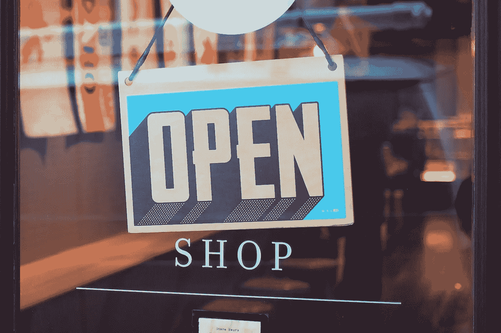

# 为什么零售商希望填补更多的数据科学家职位

> 原文：<https://towardsdatascience.com/why-retailers-want-to-fill-more-data-scientist-positions-b0c042cfadfe?source=collection_archive---------29----------------------->

总体而言，数据科学家的角色是最受欢迎的职位之一，但在零售部门，人们尤其努力利用数据科学家提供的技能。

无论你目前是一名数据科学家还是渴望成为一名数据科学家，零售商可能会有各种各样的理由雇佣你。这是其中的四个。

# 1.他们想效仿主要竞争对手的做法

一些零售商在注意到其他公司在这方面取得成功后，感到有必要专注于雇用数据科学家。Target 是第一批利用数据作为业务增长方式的公司之一，它是在众多零售商遭遇低迷的时候做到这一点的。

尽管 2012 年至 2013 年期间，塔吉特的整体销售额有所下降，但那一年的在线销售额增长了近 30%，同时也增加了该公司积累的数据量。

2013 年，该公司聘请 Paritosh Desai 担任商业智能、分析和测试副总裁。那个人开始建立一个数据科学家团队，并巩固了该公司更加关注其数据的愿望。

德赛进行了许多以数据为中心的变革，包括允许经理们访问汇编的数据。他们还被鼓励提出与数据相关的问题，并依靠数据科学家找到答案。

Target 还精心制定了其数据战略，深知需要投入时间和人力资源来实现其目标。该公司对数据科学的关注仍有回报，同行零售商可能会意识到，他们不能忽视数据，以跟上 Target 或其他以类似方式看待信息价值的零售商的步伐。

# 2.数据相关的见解有助于零售商吸引顾客

在他们有机会通过现在如此容易获得的方法来挖掘数据之前，零售商经常使用猜测和经验来评估如何让客户满意和忠诚。雇佣数据科学家可以让零售商[决定如何利用实时数据吸引](https://www.datasciencecentral.com/profiles/blogs/customer-data-analytics-to-uberize-retail-landscape)顾客，而不是基于历史信息进行预测。

数据科学允许采取更个性化的方法，并总结如何向更小部分的客户甚至个人购物者提供令人兴奋的优惠，而不是找出哪个大客户群体最有可能对特定优惠做出有利的反应。然后，零售商更有能力提供人们最想要的东西。

如果没有数据的帮助，他们可能会给出吸引力较小的激励措施，因为目标群体更广泛。

未能清楚了解顾客的需求可能会让零售商浪费金钱和时间，因为他们的活动失败了。相反，当商店就新产品、营销方法、价格和限时优惠做出重要决策时，利用数据加深品牌对顾客的了解应该会带来更多信心。

商店还可以要求他们的数据科学家查看与产品相关的细节，例如人们有多大可能会退回某件商品或需要对其提出保修申请。了解这些事情可以促使商店决定停止销售特别有问题的商品。

# 3.技术让数据收集变得更加简单

当今零售商使用的服务点(POS)系统有各种[有用的组件来协助](https://nrsplus.com/blog/understand-pos-equipment/)商店的运营。除了现金抽屉和收据打印机等基本设备，许多商店还为收银员配备了触摸屏面板，以及用于跟踪销售和库存的分析软件。人们可以直接在 POS 系统中查看统计数据，也可以将数据导出到专业分析软件中。

数据收集的便利性使得许多零售商渴望利用唾手可得的信息。他们通常通过雇佣能够彻底检查信息并发现有意义趋势的数据科学家来做到这一点。他们也可能通过外部数据进行挖掘。

Lowe’s 利用 Pinterest 数据来了解用户意图。更具体地说，它将内部交易数据添加到客户的 Pinterest 档案中，并依靠这些数据来改进广告。

例如，如果 Lowe's 的数据表明一个人经常购买园艺用品，它可以提供相关的 Pinterest pins 作为广告策略。Lowe's 表示，使用 Pinterest 并与可购物胸针互动的客户的 T2 点击率比平均点击率高出 20%。

这家家装零售商还希望与一家位置数据提供商合作，衡量 Pinterest 互动是否会带来更多实体店流量。

无论零售商是单独使用内部数据，还是将内部数据与社交媒体网站等外部数据相结合，都有更多的机会来收集数据并根据数据采取行动。

作为采用这种方法的公司的数据科学家，您可以帮助零售商从现有数据源中提取有价值的见解，或者推荐其他与指标相关的投资。

# 4.数据有助于零售商决定进行哪些改进

零售专家经常谈论正在影响实体店的“零售末日”，以及品牌可以做些什么来保持业务。

截至 2018 年 8 月，数据已经显示，按平方英尺计算，2018 年[是零售商店关门的 10 年高点](https://www.citylab.com/life/2018/12/2018-retail-apocalypse-online-shopping-charts-maps/579112/)。在最近的一次全国零售联盟会议上，热门话题之一是科技可以[帮助实体零售商恢复](https://www.ft.com/content/69c25116-1ac1-11e9-9e64-d150b3105d21)。

一些品牌使用增强现实(AR)、机器人和应用程序来补充购物者的店内体验。FAO Schwartz [用 iPad 技术更新了其 Rockefeller Plaza 商店](https://www.teamworkretail.com/blog/teamwork-retail-works-with-fao-schwarz-to-return-to-wonder-in-nyc-with-apple-devices/),包括让孩子们在 iPad 应用程序中组装赛车，然后让“机械师”在现场组装玩具。

当零售商让数据科学家加入他们的团队时，他们可以通过数据挖掘，发现哪些改进最能引起客户的共鸣。这样做可以帮助实体零售商和网上零售商。

例如，数据科学家可能会注意到，网站上超过一半的首次购物者在到达注册表单后没有完成购买就离开了。

在这种情况下，该品牌可能会简化其注册表格，使其不那么吓人，或者让购物者导入脸书或谷歌等其他公司存储的数据，以简化注册过程。然后，顾客感到更受鼓励去买东西，这增加了零售商的利润。

作为一名受雇于零售商的数据科学家，你可以建议应用数据来解决该品牌存在的特定已知问题。有了这种以目标为导向的方法，商店就可以从他们的数据中获得最大价值，这样数据就不会被浪费掉。

# 数据科学家拥有零售业急需的技能

作为一名数据科学家，你拥有零售商想要和需要的能力。本概述详细介绍了商店使用数据的一些最常见的原因，但并不全面。

如果你要把你的技能带到零售业，它们会让公司在充满挑战的环境中保持稳定和增长。

*照片由* [*迈克·彼得鲁奇*](https://unsplash.com/photos/c9FQyqIECds?utm_source=unsplash&utm_medium=referral&utm_content=creditCopyText) 拍摄