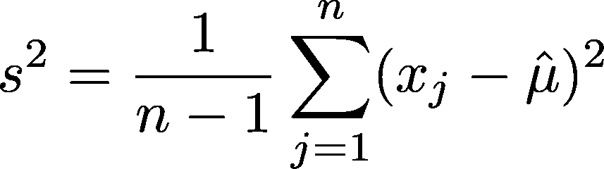
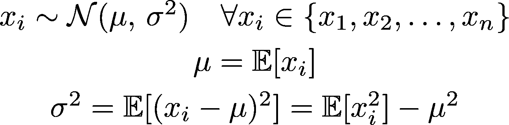
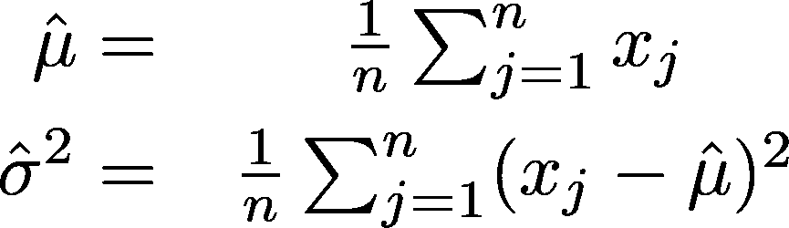
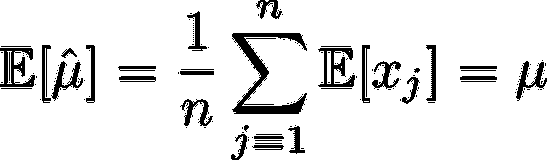
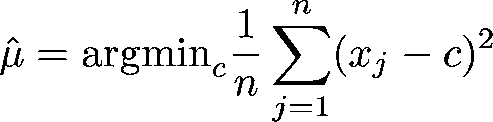
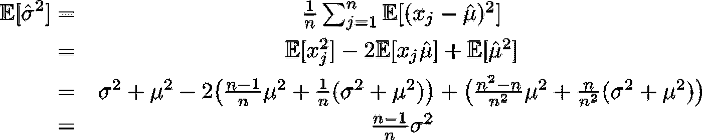
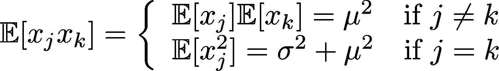
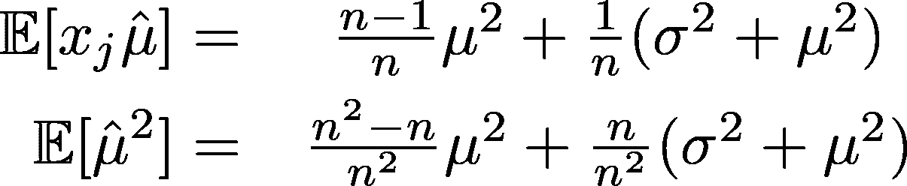
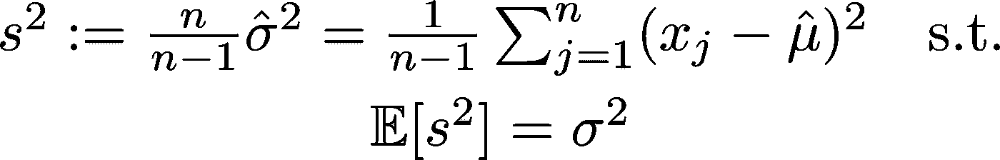

# 为什么样本方差除以 n-1

> 原文：<https://towardsdatascience.com/why-sample-variance-is-divided-by-n-1-89821b83ef6d?source=collection_archive---------3----------------------->

## 解释你的老师没有教过的高中统计学

Photo by [Tim Bennett](https://unsplash.com/@timbennettcreative?utm_source=medium&utm_medium=referral) on [Unsplash](https://unsplash.com?utm_source=medium&utm_medium=referral)

如果你正在阅读这篇文章，我假设你已经遇到了样本方差的公式，并且知道它代表什么。但为什么分母是 ***(n-1)*** ，而不是 ***n*** 仍然是个谜。原因如下。

## 目录

*   [设置](https://medium.com/p/89821b83ef6d#b571)
*   [1。自由度](https://medium.com/p/89821b83ef6d#6164)
*   [2。偏置源](https://medium.com/p/89821b83ef6d#791a)
*   [3。贝塞尔校正](https://medium.com/p/89821b83ef6d#25da)

*最初发表于*[*edenau . github . io*](https://edenau.github.io)*。*

## 术语

*群体*:包含群体
*所有**成员的集合***:包含群体**部分**成员的集合(技术上讲是群体的多子集)

*独立同分布(i.i.d .)随机变量* :
假设所有样本(a)都**相互独立**，且(b)具有相同的概率分布。

*中心极限定理* :
当样本量足够大时，独立同分布随机变量的抽样分布趋于一个**正态(高斯)分布**。

*预期值* :
**同一实验重复次数的长期平均值** **值**。

*无偏估计量* :
无偏估计量的**期望值**等于被估计参数的真值。换句话说，无偏估计量的分布集中在正确的值上。

Photo by [Austin Neill](https://unsplash.com/@arstyy?utm_source=medium&utm_medium=referral) on [Unsplash](https://unsplash.com?utm_source=medium&utm_medium=referral)

# 设置

给定一个具有未知**总体均值*和总体方差 ***σ*** 的大型高斯总体分布，我们从总体中抽取*个独立同分布样本，使得对于来自集合**的每个样本 ***x_i*********

****

**而 ***x_i*** 的期望值是 ***μ*** ，而 ***x_i*** 的期望值是*大于* ***μ*** 。是因为平方函数的非线性映射，其中较大数字的增量大于较小数字的增量。例如，set (1，2，3，4，5)的均值为 3，方差为 2。通过平方每个元素，我们得到平均值为 11=3 +2 的(1，4，9，16，25)。我们在以后的阶段需要这个属性。**

## **评估者**

**由于我们不知道真实的总体属性，我们可以尽力使用类似的结构从样本集中定义这些属性*的*估计量*。***

*让我们给****【σ***戴上一顶帽子(**^**)称它们为‘伪均值和方差’，我们以如下方式定义:**

****

**这些定义有点武断。理论上，你可以用更好的方式定义它们并测试它们，但是让我们尝试最简单的方法。我们定义伪均值 ***^μ*** 为所有样本 ***X*** 的平均值。感觉这是我们能做的最好的了。对伪均值的快速检查表明，它是一个**无偏总体均值估计量**:**

****

**简单。然而，真正的样本方差取决于总体均值*，这是未知的。因此，我们用如上所示的伪均值 ***^μ*** 来代替它，这样伪方差反而依赖于伪均值。***

# **1.自由度**

**假设我们有一个公平的骰子，但没有人知道它是公平的，除了杰森。他知道人口平均数 ***μ*** (3.5 分)。可怜的威廉乞求得到统计属性，但杰森不会让步。威廉不得不通过抽样进行估计，即尽可能多地掷骰子。他滚了三次就累了，前两次试得了 1 分和 3 分。**

****

**Photo by [Mike Szczepanski](https://unsplash.com/@youngprodigy3?utm_source=medium&utm_medium=referral) on [Unsplash](https://unsplash.com?utm_source=medium&utm_medium=referral)**

**给出真实的总体均值*(3.5 分)，你还是不知道第三卷是什么。然而，如果你知道样本均值 ***^μ*** 是 3.33 分，你就肯定第三次掷出的是 6，因为(1+3+6)/3 = 3.33——快速数学。***

**换句话说，样本平均值正好包含样本集中的一位信息，而总体平均值不包含。因此，样本均值给样本集 ***少了一个自由度*** 。**

**这是我们通常被告知的原因，但这并不是一个强大而完整的证明，说明为什么我们必须用 ***(n-1)*** 来代替分母。**

# **2.偏差来源**

**使用相同的骰子示例。Jason 知道真实平均值*，因此他可以使用*真实*总体平均值(3.5 分)计算总体方差，并得到 4.25 分的*真实*方差。威廉在计算伪方差(我们定义的方差估计量)时必须采用伪均值 ***、^μ*** (本例中为 3.33 分)，伪方差为 4.22 分。***

**事实上，伪方差总是 ***低估*** 真实样本方差(除非样本均值与总体均值重合)，因为伪均值是伪方差函数的 ***极小值*** ，如下图所示。**

****

**你可以通过一阶导数测试，或者通过基于函数凸性的检验来检验这种说法。**

**这表明使用伪均值会产生偏差。然而，这并不能给我们偏见的价值。**

****

**Photo by [Tudose Alexandru](https://unsplash.com/@pandatudii?utm_source=medium&utm_medium=referral) on [Unsplash](https://unsplash.com?utm_source=medium&utm_medium=referral)**

# **3.贝塞尔校正**

**我们唯一的目标是调查这个方差估计量 ***^μ*** 有多大的偏差。我们期望伪方差是一个有偏估计量，因为如前所述，它**总是低估**真实方差。通过检查我们的伪方差的期望值，我们发现:**

****

**一步一步来。 ***x_j x_k*** (如下图)的期望值取决于你是采样不同的(独立的)样本其中 ***j≠k*** ，还是相同的(在这种情况下肯定是依赖的！)样其中**j = k*。既然我们有了 ***n 个*** 样本，那么得到相同样本的可能性就是 ***1/n*** 。因此，*****

****

**还记得开头提到的 ***x_i*** 的期望值吗？通过扩展 ***^μ*** ，我们有了**

****

**将这些公式代入，我们发现伪方差的*期望值*不是总体方差，而是总体方差的 ***(n-1)/n*** 。由于对于所有有限正的 ***n*** ，比例因子都小于 ***1*** ，这再次证明我们的伪方差低估了真实的总体方差。**

**为了调整无偏方差估计量，我们简单地应用*贝塞尔修正*，使估计量的期望值与真实总体方差一致。**

****

**这就是了。我们定义 **s** 为 ***无偏样本方差*** 。 ***(n-1)*** 分母来自贝塞尔修正，贝塞尔修正是由在两个连续试验中采样相同样本(替换)的 ***1/n*** 概率产生的。**

****

**Photo by [freddie marriage](https://unsplash.com/@fredmarriage?utm_source=medium&utm_medium=referral) on [Unsplash](https://unsplash.com?utm_source=medium&utm_medium=referral)**

**随着样本数量增加到无穷大 ***n→∞*** ，偏倚消失( ***n-1)/n→1*** ，因为两次试验中抽样同一样本的概率趋于 ***0*** 。**

## **相关文章**

**感谢您的阅读。如果您对 Python 或数据可视化感兴趣，以下文章可能会有用:**

** [## 我希望我能早点知道的 5 个 Python 特性

### 超越 lambda、map 和 filter 的 Python 技巧

towardsdatascience.com](/5-python-features-i-wish-i-had-known-earlier-bc16e4a13bf4)  [## 使用交互式地图和动画可视化伦敦的自行车移动性

### 探索 Python 中的数据可视化工具

towardsdatascience.com](/visualizing-bike-mobility-in-london-using-interactive-maps-for-absolute-beginners-3b9f55ccb59) 

*最初发布于*[*edenau . github . io*](https://edenau.github.io)*。***