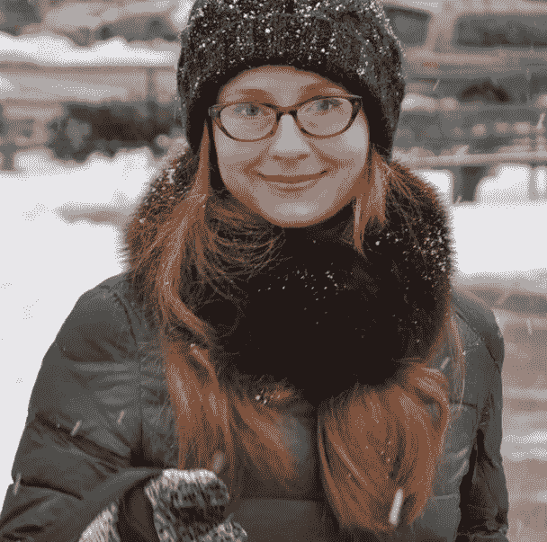
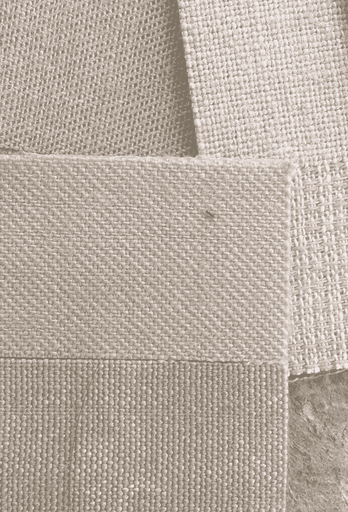
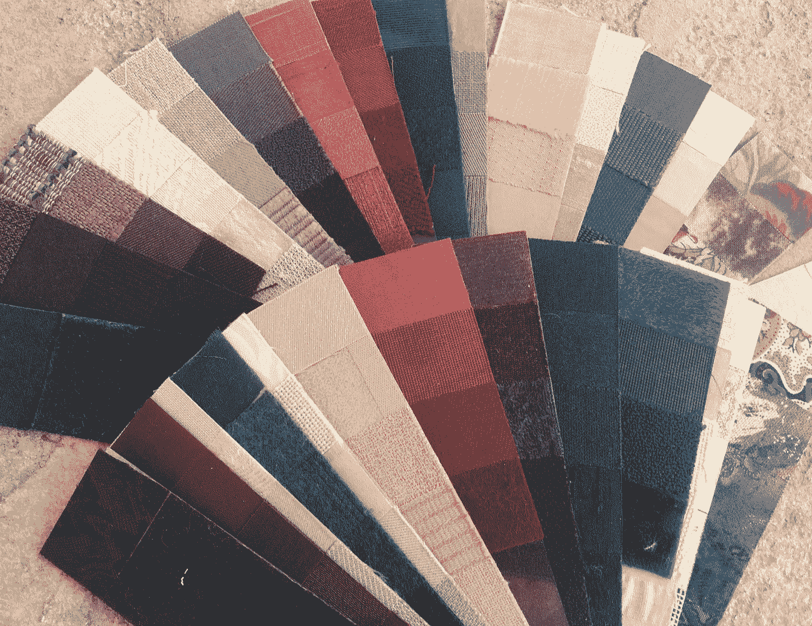

# 为个人色彩分析设定基准

> 原文：<https://towardsdatascience.com/why-seasons-do-not-show-up-in-the-data-27fff04c0976?source=collection_archive---------16----------------------->

## 色彩领域的数据科学家无法获得可量化的数据来确保可信的映射。

2 月 7 日，研究员 Peter Gaston 在[的《走向数据科学](https://towardsdatascience.com/)上发表了一篇[的文章](/fashion-science-takes-on-seasonal-color-analysis-b399ecc8f675)，名为《时尚科学进行季节性色彩分析》。他描述了建立一种算法的过程，这种算法复制了一种流行的方法，即寻找能够增强个体自然美的最佳颜色。这种方法被称为季节颜色分析(SCA ),它根据共有的特征将人类分为四类。彼得·加斯顿得出的结论是:数据中找不到季节。基本上，SCA 没有系统。

自 2008 年以来，我一直在使用 24 个样本调色板为客户构建高度个性化的动态调色板。这些调色板整齐地组织在四个集群系统中。聚类与季节颜色分析(SCA)方法中的季节相对应，但是我使用的实际方法与 SCA 的普及版本不同。更科学，留给主观感知的空间更少。我看到了为什么季节没有出现在彼得的数据中的两个主要原因。

1.  研究人员无法获得可量化的数据来设定适当的基准。
2.  数据收集过程比一张随意的智能手机自拍要复杂一些。

SCA 的流行版本提供了四个集群:春、夏、秋、冬。他们根据两个因素来划分季节:色温(暖、冷)和颜色强度(暗、亮)。这是 SCA 的一个普通版本，由 Carole Jackson 在她的书 *Color Me Beautiful* (1980)中推广。这个概念被简化，以适应 9.99 美元的平装本，并摆脱可怕的科学语言。布局如下:

*   春天:温暖的光
*   夏天:冷光
*   秋天:温暖-黑暗
*   冬天:凉爽-黑暗

我使用的 Caygill SCA 方法设置了不同的基准来组织四个季节性集群，使其更加可量化。切换到不同的基准测试使得大多数 SCA 实践者几乎认不出这个方法，但是我们仍然称它为 SCA，并且使用标签春天、夏天、秋天和冬天。更多的时候，我们发现自己在用枯燥的数字语言交流，说一些类似于“他是数字 7”或“她是数字 21”的话 Caygill 方法与流行的 SCA 版本的两个主要区别是:

1.  光和暗在季节内是可变的。为了设定季节之间的基准，我们使用主要皮肤色素褪黑激素、胡萝卜素和血红蛋白的比例。这些比率形成了一个范围，在从亮到暗的过程中保持一致。这允许创建更加动态和灵活的个性化调色板。这个比例是可以算出来的。分析皮肤成分是一项艰巨的任务；我们看着重型医学研究与它斗争，但它是可以做到的。
2.  温暖和凉爽在季节内是可变的。为了设定季节之间的基准，我们再次使用主要皮肤色素褪黑激素、胡萝卜素、血红蛋白的比率。

当谈到温度时，我避免使用“冷”和“暖”这两个词，而改用更专业的“蓝色”和“黄色”这确保了我们更接近可以量化的东西，比如波长，而不是某人的个人观点。这里有一个例子。

在凯吉尔 SCA 方法中，这个女人属于夏天，一个基于蓝色的星团。你看她的时候会想到酷炫还是蓝基？不，我也没有。

Blue-Based, Summer Cluster. SCA Caygill Method.

被她文艺复兴时期的金色鬃毛和皮肤的金色光芒所引导(或者说是误导)，我开始给这个女人穿上同样充满活力的暖色调，却看到她的脸变得毫无生气，黑眼圈出现在她的眼睛下面。这就是我如何得知在她金色的光芒下有一种强烈的紫灰色底色。当我给她穿上暖色调的衣服时，淡紫色的底色就显现出来了，从起泡的黄色到朴实的土色。我与一位更有经验的同事分享了我的沮丧，她提醒我夏季系列中的特殊调色板#27 适合这种肤色:看起来很温暖，底色中有很多灰色和淡紫色。这是一个结合了暖色(以黄色为基础)和冷色(以蓝色为基础)的夏季边缘案例。)由于我的客户对所有优雅的、布鲁内罗·库奇内利式的灰色反应如此之差，我甚至懒得为这样一个看起来“温暖”的人尝试夏季色调。我没有想到 27 号边缘调色板，因为我把它的深宝石色和浅黑色联系起来了。但是当我开始小心翼翼地挑选那些不是明显的紫灰色，只含有一点点紫灰色的深色色板时，她波提切利式的美出现了。适合她的颜色都来自我们称之为“夏天”的蓝色系。它们比典型的夏季调色板更温暖(心理上)，但它们仍然是以蓝色为基础的(可量化)。准确地说，它们是紫红色的。

顺便说一句，在他的文章中，彼得·加斯顿提到所有肤色看起来都是暖色，这听起来让他很困惑。所有肤色看起来温暖是完全自然的。胡萝卜素是主要的皮肤色素之一，它能确保我们的皮肤看起来温暖。根据 T2 的这项研究，富含胡萝卜素的皮肤被认为是最有魅力的。胡萝卜素给了我们这种阳光般的金色光芒，人眼本能地寻找这些温暖的迹象。作为一名个人色彩顾问，我的任务是确定皮肤成分中还有哪些色素，哪些占主导地位，它们构成了什么比例，并希望有助于像[彼得·加斯顿](/fashion-science-takes-on-seasonal-color-analysis-b399ecc8f675)这样的研究人员将这一点量化。

以下是与夏秋两季 edge case 肤色相对应的样本。左下角的两个样本是夏天。右边的样本是边缘案例秋季。差别是微妙的。但是，一旦我们意识到了这些成分，我们就可以用公式表示出微妙之处:左下方的样本包含灰色；右边的没有。这将决定适合每种肤色的衣服色调。灰色(以蓝色为基础的淡紫色)是夏天区别于其他三个季节的地方。这种灰色的存在是我们的基准，而不是某种逃避的“温暖”，一种因人而异的心理感知。

The Benchmark between the Summer and Autumn Clusters is the presence of mauve grey, not some evasive “warmness.”

现在，让我们看看为这两种肤色推荐的样本调色板。秋天(黄色为主)在上面。夏天(蓝色为主)在最下面。

两者，夏秋边缘案例看起来都一样黑暗温暖(心理上)。但在夏天，我们看到紫色和淡紫色(蓝色:可量化的数据)。秋天，我们不再看到紫色和淡紫色。秋天的蓝色变成了茶色，更多的是绿色，而不是蓝色。(可量化的数据)。秋天的调色板里没有灰色(可量化的数据)。

Sample Palettes for Edge Cases Summer and Autumn Clusters

现在，让我们看看为这两种肤色推荐的样本调色板。秋天(黄色为主)在上面。夏天(蓝色为主)在最下面。

夏秋边缘案例看起来都是同样的黑暗和温暖(心理)。但是在夏天，我们看到紫色和淡紫色(基于蓝色的可量化数据)。在秋天，我们不再看到紫色和淡紫色，取而代之的是秋天的蓝色变成了茶色，茶色以绿色为主，而不是蓝色。(可量化的数据)。秋天的调色板里没有灰色(可量化的数据)。

2019 年 3 月 14 日，时尚业巨头斯科特·楚门在他的 Instagram 账户上发布了一张照片，照片上的男孩与我的客户非常相似:皮肤成分富含胡萝卜素，带有强烈的淡紫色。他穿着与夏季集群相似的颜色:深，有希思罗机场，蓝色为基础。具有讽刺意味的是，在他的评论中俯视色彩理论时，这位著名的品位创造者挑出了一个(很可能是直觉上)遵循非常严格规则的人。肤色的原始法则——底色，这是季节性色彩分析的基础。

比起名人，我更喜欢斯科特·楚门(服装设计师)作为我的标准。我们要么看到名人完全解体，在他们的休息时间被八卦的狗仔队抓住，要么我们看到他们在高压事件和电影剪辑的严密策划格式中，当大量世界级的人才涌入他们的外表。这在普通人的日常生活中是无法复制的。这位服装设计师因其对时装周常客以及纽约、巴黎、伦敦、米兰和全球各地街道上各个年龄段的普通人的坦率、自发的拍摄，吸引了时尚巨头和普通人的注意。这是我们造型师所推崇的。

上图是我客户的肖像，四年后由世界上最有影响力的时尚大师复制，这完全归功于季节色彩分析。它由好莱坞造型师苏珊娜·凯吉尔(Suzanne Caygill)的黄金时代开发，延续了欧洲绘画的悠久传统。

大多数 SCA 从业者没有 Caygill 方法的肤色织物样本和复杂的工具集，因为它昂贵且复杂。在 20 世纪 80 年代，它被更“全面”(可销售)的格式所取代。但对于任何有志于在颜色方面训练人工智能的人来说，凯吉尔 SCA 是可靠、可量化数据的来源。