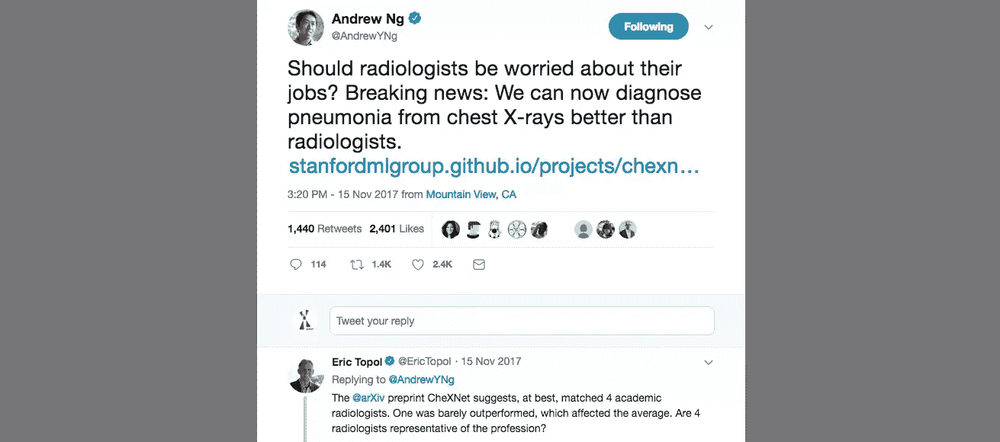

# 医生为什么要懂机器学习？

> 原文：<https://towardsdatascience.com/why-should-doctors-understand-machine-learning-e2433bd5ac76?source=collection_archive---------28----------------------->

## [现实世界中的数据科学](https://towardsdatascience.com/data-science-in-the-real-world/home)

## 以及为什么医疗保健人工智能领域需要更多医生

我们看到，在所有领域，人工智能(AI)和机器学习(ML)的使用和讨论越来越多；包括医疗保健。更大的数据量、更高的计算能力和机器学习技术的突破为创新提供了肥沃的土壤。在医疗保健领域，涉及人工智能的研究呈指数增长，出版物和学术资助也相应激增，反映了这一点。

但是医生真的需要懂机器学习吗？我们认为是这样的，以下是我们的主要原因。

## 与患者的交流

我们开始看到机器学习工具用于临床环境，随着我们当前的新研究浪潮，我们看到更广泛的使用只是时间问题。这意味着，在不久的将来，你的“普通”医生将使用基于机器学习的决策支持工具，并推荐基于机器学习的治疗作为他们日常实践的一部分。

在解释测试时，理解特异性、敏感性、阳性和阴性预测值等术语对我们来说很重要。我们知道 PSA 升高的患者不一定患有前列腺癌，或者 D-二聚体升高不一定意味着 DVT/PE，因为这些测试具有高灵敏度但低特异性。这通常是我们与病人讨论的一部分。

然而，我们现在需要扩展这一点，以包括 AUC 和 F1 分数的讨论，以及基于机器学习的预测的其他细微差别。

此外，许多患者希望了解新的解释和预测是如何工作的。他们会发现“然后一个非常复杂的算法得出一个预测”的解释远不如“该算法在 1000 名患者身上进行训练，以学习发现可以预测 X 与 Y 的模式，以便我们可以考虑你的年龄、基因特征、合并症等，以给出个性化的预测”令人满意。

## 为研究和创新做出贡献

医疗保健中的人工智能是最具活力和最令人兴奋的研究领域之一，具有巨大的潜力和太多有待探索的地方。作为一名了解多发性硬化症的医生，你可以通过很多方式为这一领域做出贡献。

许多医院存储了大量数据，这些数据是令人兴奋的医疗保健人工智能研究的沃土。然而，如果部门中没有人了解如何使用这些数据，这些数据通常会被闲置。作为一个了解人工智能的人，你可以帮助建立一个从事前沿人工智能研究的部门。(我们将在未来上传这样做的指南:[观看这个空间](https://chrislovejoy.me/hub/)。)

与在医疗保健人工智能领域工作的许多[公司](https://chrislovejoy.me/companies)合作也有巨大的潜力。他们的团队通常包括机器学习工程师、研究人员，当然还有医疗保健专业人员。虽然 ML 工程师将构建工具，但他们需要医疗保健专业人员的投入来指导他们的工作。对能够“说自己的语言”的医务人员有很大的需求；能够将他们的医学见解转化为“数据”和“变量”的人。您还可以洞察哪些内容可以整合到医疗工作流程中，哪些内容用处不大。我们是否应该训练一种算法来识别绝对观察/生命体征，或个体基线的波动？对 AKI 具有高敏感度的算法提供弹出通知是有益的还是有害的？有许多见解只能从医疗保健系统中获得，所以我们不应该把医疗保健人工智能的发展留给那些没有的人。

## 参与讨论

理解 ML 也将使你能够透过炒作，并有助于将讨论转向对当前事态的更有分寸、更准确的评估。当一位领先的机器学习研究人员报告说，人工智能现在可以比放射科医生更好地诊断肺炎时，你将有洞察力解释为什么不是这样。

在整个社会和医疗保健领域实施 ML 将代表我们这一代人的关键转变之一。作为医生，我们希望对这是如何发生的有发言权。有许多道德问题需要考虑，这些问题并不总是与在该领域工作的公司的财务激励一致。了解 ML 可以使我们成为我们医疗社区中知情和负责任的成员，他们可以为讨论和政策决策做出贡献，从而促进以安全、有效和以患者为中心的方式引入 AI。

# 怎么会？

下一步是*如何*培养对机器学习的理解。查看我们推荐的资源，建立理解的[基础](https://chrislovejoy.me/foundation/)，然后保持[最新](https://chrislovejoy.me/resources/)。

*原帖*[*chrislovejoy . me*](http://chrislovejoy.me/why)

