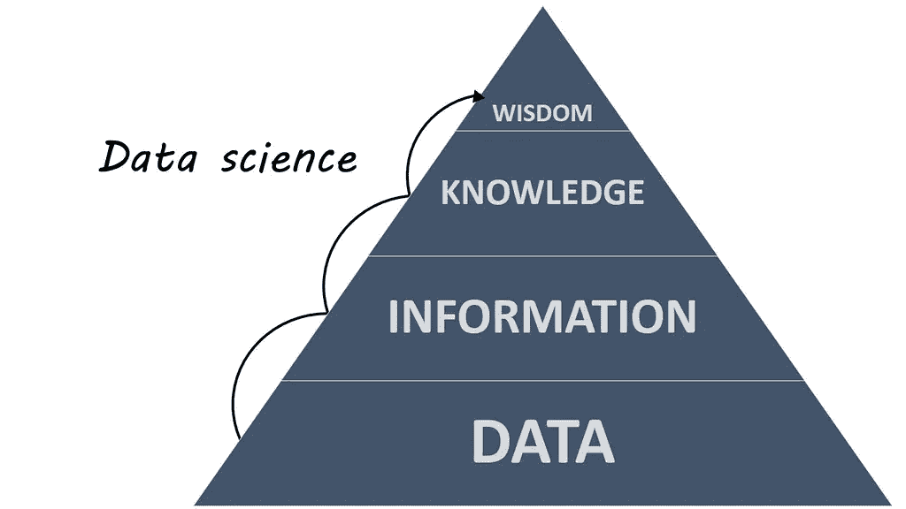

# 为什么每个工程师都应该开始考虑发展分析和编程技能？

> 原文：<https://towardsdatascience.com/why-should-every-engineer-consider-start-developing-analytical-and-programming-skills-d510eadb146c?source=collection_archive---------7----------------------->

## 面向非程序员的编程

## 一个非计算机科学工程师的视角

Image from Christopher Gower available at [Unsplash](https://unsplash.com/photos/m_HRfLhgABo)

数据科学家:21 世纪最性感的工作。*数据是新油*。*数据正在塑造我们看待世界的方式*。在一个人的头脑中隆隆作响的短语让你想知道你在选择学术专业或职业生涯时是否做出了最好的决定。*我的专业不需要编码技能*’。*不需要学习如何开发软件*’。如果我知道如何编码，我会学习计算机科学。在当今高度技术化和竞争激烈的世界中，持续教育和不断自学是保持更新和合格的关键，在这样一个时代，范式需要被打破。作为一名工业和系统工程师，我想邀请非计算机科学工程师和专业人士开始发展分析和编程技能，分享他们如何帮助我在年轻时提升职业生涯，以及他们也可以给他们带来的优势和好处。

*“连接人、技术和业务”*

作为一名工业和系统工程师，我的主要目标是充当工程和管理之间的桥梁，以**分析**并调整流程或创建新流程。我的职责包括确定人员、材料、**技术、**、**信息和能源，以确保流程高效，并确定这些资源如何相互作用才能有效。**

工程师喜欢数字，和他们一起工作感觉很舒服

或者至少他们应该这么做。数据和信息隐含和明确地存在于每个工程任务中。然而，从这些数据中获得的有用性、实用性和洞察力可能会被一个人捕获、理解和转换数据的能力所削弱。花点时间来分析下面显示的 DIKW 金字塔。越往上走，台阶的宽度越小；这代表了知识和能力的差距。由于数据本身并不说明任何问题，因此必须以某种方式将其转换为信息，以便更好地理解。但是真正的挑战在于向金字塔的上端跳去。

DIKW Pyramid

数据挖掘、机器学习和深度学习算法(例如线性回归、逻辑回归、k 均值聚类、支持向量机、人工神经网络)的使用主要涉及 DIKW 金字塔上端的步骤。然而，由于您将接触到大量的数据，手动实施它们将变得低效、耗时且无止境。 ***这就是编程技能发挥其主要作用的地方*** 。能够将这些算法编码到计算机程序中，将允许您以更快和更有效的方式处理大型和非结构化数据集。然而，开发、训练、测试和验证数学、预测、分类或分析模型(仅举几个例子)只是这些步骤中涉及的部分任务。得出结论、获得洞察力、获得知识和获得智慧是最终目标，也是数据分析师、数据科学家和数据工程师成为公司和组织宝贵资产的原因。这就是强大的分析能力发挥其主要作用的地方。

*“传达你的结果和发现与获得它们一样重要(甚至更重要)”*

太好了！你开发了一个伟大的算法。你们已经取得了成果和重大发现。下一步是什么？与你的团队交流和分享。乍一想，这可能听起来是整个过程中最简单的任务，但事实是，许多人发现这是最困难的。 ***少即是多*** 。你必须能够用一种即使没有很强的统计和编程背景的人也能理解的技术语言，尽可能清晰简洁地交流你的结果和发现。管理者很少会问你获得最终结果的过程，但他们会要求你解释、证明并捍卫你的最终结果。这就是为什么大多数职位招聘都要求候选人同时具备很强的分析和沟通能力。

在我作为一名非计算机科学工程师的整个学术和短暂的职业生涯中，我总结了以下七个个人理由，说明为什么不管你的年龄、大学专业或职业生涯的当前阶段，你都应该开始考虑发展分析和编程技能:

## **1。它将帮助你加强逻辑思维**

写代码需要你进行逻辑思考。你必须考虑从给定的输入到期望的结果的逻辑路径，考虑代码执行过程中的约束、限制和潜在错误。在循环和条件语句中使用逻辑运算符 while loops，可以增强你的逻辑思维和构建有效程序、分析情况和提出解决方案的能力。

## **2。它将帮助你强化你的系统思维**

你会形成一种系统的思维，你会意识到每件事都与每个人相关。团队、部门和部门都相互联系，朝着相同的目标工作，而不是独立工作。在分析问题和提出解决方案时，你必须分析和评估它对整个企业和组织的影响和意义，而不仅仅是对你所在的部门。*整体大于部分之和。*

## **3。这将帮助你增强解决问题的能力**

在编写代码或开发程序以执行特定任务或解决给定问题时，您必须将其分解成更小的组件*。通过更小的组件分析问题会比分析全局更有效；它将帮助你更快地找到问题的根源；这将帮助你看到别人可能看不到的小细节。*分而治之。**

## **4。它将在开发解决方案时激发你的创造力**

你会意识到，在大多数情况下，一个给定的问题会有不止一个解决方案。但是，在实施之前，您必须评估和比较每个解决方案的有效性以及可行性程度。有些解决方案需要更多的编码工作，有些则需要更少，有些则需要你扩展现有的知识来编码。在开发解决方案的过程中，你可能会多次改变主意，重新思考所用的方法是否真的解决了问题，寻求反馈并接受建议，这些建议将激发你的创造力，以最有效和高效的方式实现你的目标。

## **5。这将帮助你更好地理解流程**

为了知道你想去哪里，首先你必须明白你的立场。了解被分析流程的当前状态将成为*必须*做的事情。哪些是当前流程的输入、流程、决策、转换、交流、延迟、错误和结果？谁是这个过程的主要参与者和利益相关者？谁是最终客户？我们想要实现什么？我们离我们想去的地方还有多远？您必须能够在代码开发之前和开发期间回答这些问题，以确保您对正在分析的过程及其要解决的问题有重大的贡献和影响。

## 6.这会让你在做决定时更有信心

拥有扎实的分析技能，以及强大的统计背景，将有助于您建立更好的决策支持系统，能够评估多种情况，引导您根据给定的约束做出最佳决策。在陈述你的解决方案时，你会自信地用统计和数学支持来证明你的结果，而不仅仅是凭直觉或因为计算机告诉你这样做。

## 7.它会带你走出你的舒适区

和任何其他新任务一样，你需要克服一个学习曲线。毫无疑问，在旅程的某个时刻，你可能会发现自己陷入困境或挣扎，但是，嘿，有很多在线资源可以帮助你摆脱困境。一旦你越来越深入这个主题，你会发现你认为你知道的越多，你实际上不知道的就越多，这将驱使你的好奇心去扩展你的知识和学习新的东西。有大量的软件包、库、算法、函数、程序、语言和软件用于各种目的。虽然你不必为了成为下一个编程大师而学习所有这些，但是你需要确定哪一个最符合你的目标和你想要达到的结果。

# 总结想法

没有人会因为年龄太大、太晚或职业生涯太晚而有借口不开始培养分析和编程技能。世界和市场正以前所未有的速度飞速变化。乔布斯的大部分资格都在某种程度上转化为分析和编程技能(或者能够使用特定的计算机程序或软件)。我们应该为机会的到来做好准备。市场不会适应我们的需求，相反，我们才是需要适应市场需求的人。

试试看。运行自己编写的有效代码的感觉是惊人的。

# **鸣谢**

特别感谢 Andrés Hernández-Guitérrez 博士在我的学术生涯中提供的所有明智的建议，以及将我引入编程、数据科学和机器学习的世界。

*— —*

*如果你觉得这篇文章有用，欢迎在* [*GitHub*](https://github.com/rsalaza4/R-for-industrial-engineering) *上下载我的个人代码。你也可以直接在 rsalaza4@binghamton.edu 给我发邮件，在*[*LinkedIn*](https://www.linkedin.com/in/roberto-salazar-reyna/)*上找到我。有兴趣了解工程领域的数据分析、数据科学和机器学习应用的更多信息吗？通过访问我的媒体* [*个人资料*](https://robertosalazarr.medium.com/) *来浏览我以前的文章。感谢阅读。*

*——罗伯特*